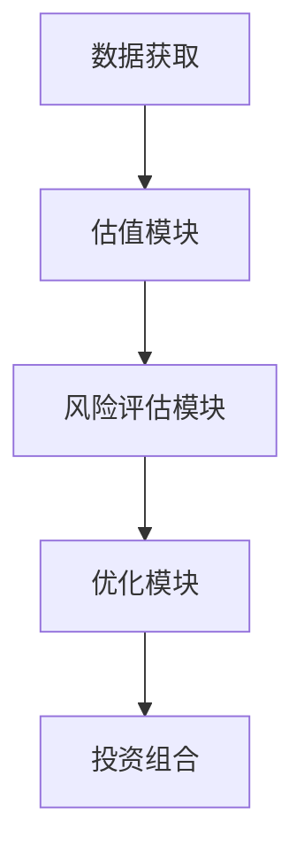

                 


# 格雷厄姆的债券投资策略：固定收益的角色

## 关键词：格雷厄姆投资策略、债券、固定收益、安全边际、投资组合优化

## 摘要：本文深入探讨了格雷厄姆的债券投资策略，分析了固定收益在投资组合中的角色，详细讲解了安全边际的量化方法和债券定价模型，并通过实际案例展示了如何在投资组合中实现风险与收益的平衡。

---

## 第一部分: 格雷厄姆的债券投资策略概述

### 第1章: 债券市场的基本概念与投资策略概述

#### 1.1 债券市场的基本概念

##### 1.1.1 债券的定义与基本要素
债券是一种债务工具，发行人向债券持有人借款，并承诺按约定的利率支付利息，到期偿还本金。其基本要素包括：
- **面值（Par Value）**：债券的本金，即到期时偿还的金额。
- **票面利率（Coupon Rate）**：债券的年利息率，通常以面值的一定比例表示。
- **期限（Maturity）**：债券的存续时间，从发行到到期的时间长度。
- **发行价格（Issue Price）**：债券的发行价格，通常等于面值。
- **市场利率（Market Rate）**：债券发行时的市场利率，影响债券的发行价格。

##### 1.1.2 债券的分类与特点
债券可以根据多种标准进行分类：
1. **按发行人分类**：
   - **政府债券**：由政府发行，通常风险较低。
   - **公司债券**：由公司发行，风险较高，收益也较高。
2. **按期限分类**：
   - **短期债券**：期限通常在1年以内。
   - **中期债券**：期限在1到10年之间。
   - **长期债券**：期限在10年以上。
3. **按付息方式分类**：
   - **零息债券**：无票面利率，到期时一次性偿还本金和利息。
   - **息票债券**：定期支付利息，到期偿还本金。

##### 1.1.3 债券市场的功能与参与者
- **功能**：
  - 为发行人提供融资渠道。
  - 为投资者提供固定收益投资工具。
- **参与者**：
  - **发行人**：政府、企业等。
  - **投资者**：个人、机构投资者。
  - **中介**：券商、银行等。

#### 1.2 格雷厄姆的投资理念概述

##### 1.2.1 格雷厄姆的价值投资理论
格雷厄姆是价值投资的鼻祖，他主张以低于内在价值的价格买入资产。他认为市场情绪波动会导致资产价格偏离其内在价值，投资者应利用这种偏差获利。

##### 1.2.2 格雷厄姆的债券投资策略
格雷厄姆特别强调债券在投资组合中的重要性。他认为债券是固定收益资产的核心，具有以下特点：
- **本金安全**：债券到期时必须偿还本金，风险较低。
- **定期收益**：债券定期支付利息，为投资者提供稳定的现金流。
- **风险可控**：相对于股票，债券的风险较低，适合风险厌恶型投资者。

##### 1.2.3 固定收益类资产在投资组合中的角色
固定收益资产是投资组合的重要组成部分，能够提供稳定的收益，同时降低整体投资组合的波动性。格雷厄姆建议投资者将部分资产分配到债券等固定收益资产上，以平衡风险和收益。

---

### 第2章: 格雷厄姆债券投资策略的核心概念

#### 2.1 格雷厄姆债券投资的核心原则

##### 2.1.1 安全边际的概念
安全边际是格雷厄姆投资策略的核心。他建议投资者以低于内在价值的价格买入资产，以确保即使市场波动导致价格下跌，投资者仍能获得收益。

##### 2.1.2 债券的内在价值与市场价格
债券的内在价值是其未来现金流的现值，计算公式为：
$$
V = \sum_{t=1}^{n} \frac{C}{(1+r)^t} + \frac{P}{(1+r)^n}
$$
其中：
- \( V \) 是债券的内在价值
- \( C \) 是每年的利息支付
- \( r \) 是市场利率
- \( P \) 是债券的面值
- \( n \) 是债券的期限

##### 2.1.3 风险与收益的平衡
格雷厄姆强调在债券投资中，投资者需要在风险和收益之间找到平衡。低风险债券通常收益较低，而高风险债券可能带来更高的收益，但也伴随着更大的风险。

#### 2.2 债券定价的数学模型

##### 2.2.1 债券收益率的计算公式
债券的到期收益率（YTM）是投资者购买债券时要求的回报率，计算公式为：
$$
YTM = \frac{C + \frac{P - M}{n}}{(1 + \frac{P - M}{n})} \times 100\%
$$
其中：
- \( C \) 是债券的年利息
- \( P \) 是债券的市场价格
- \( M \) 是债券的面值
- \( n \) 是债券的剩余期限

##### 2.2.2 债券价格波动的数学模型
债券价格的波动可以用以下公式表示：
$$
P = \frac{C}{(1+r)^t} + \frac{M}{(1+r)^n}
$$
其中：
- \( P \) 是债券的价格
- \( C \) 是每年的利息支付
- \( r \) 是市场利率
- \( t \) 是当前时间
- \( n \) 是债券的期限

#### 2.3 格雷厄姆债券投资策略的数学分析

##### 2.3.1 安全边际的量化方法
安全边际可以通过以下公式计算：
$$
\text{安全边际} = V - P
$$
其中：
- \( V \) 是债券的内在价值
- \( P \) 是债券的市场价格

##### 2.3.2 债券收益率与价格的关系
债券收益率与价格呈负相关关系，即当收益率上升时，债券价格下降，反之亦然。

##### 2.3.3 投资组合的风险调整收益模型
投资组合的风险调整收益可以通过夏普比率（Sharpe Ratio）来衡量：
$$
\text{夏普比率} = \frac{R_p - R_f}{\sigma_p}
$$
其中：
- \( R_p \) 是投资组合的平均收益
- \( R_f \) 是无风险利率
- \( \sigma_p \) 是投资组合的收益标准差

---

### 第3章: 格雷厄姆债券投资策略的系统分析

#### 3.1 系统分析与架构设计

##### 3.1.1 投资目标与策略选择
投资者需要明确自己的投资目标，包括风险承受能力、收益目标和投资期限。根据这些目标选择合适的债券类型和投资策略。

##### 3.1.2 债券投资组合的构建方法
构建投资组合时，需要考虑债券的多样化，以分散风险。通常包括不同发行人、期限和信用评级的债券。

##### 3.1.3 风险控制与收益优化的平衡
通过量化分析，找到风险和收益的最佳平衡点，确保投资组合的稳定性。

#### 3.2 系统架构设计

##### 3.2.1 投资组合管理系统的功能模块
- **数据获取模块**：获取债券市场数据。
- **估值模块**：计算债券的内在价值和市场价格。
- **风险评估模块**：评估投资组合的风险。
- **优化模块**：优化投资组合的收益与风险比。

##### 3.2.2 系统架构的流程图
以下是一个简单的系统架构流程图：



##### 3.2.3 系统接口与交互设计
- **输入接口**：债券市场数据、投资者目标。
- **输出接口**：优化后的投资组合、风险评估报告。

---

### 第4章: 格雷厄姆债券投资策略的项目实战

#### 4.1 项目环境与工具安装

##### 4.1.1 投资分析工具的选择
推荐使用Python的Pandas和NumPy库进行数据分析，使用Matplotlib进行数据可视化。

##### 4.1.2 数据获取与处理工具的安装
安装Python和必要的库：
```bash
pip install pandas numpy matplotlib
```

#### 4.2 核心实现与代码解读

##### 4.2.1 债券收益率计算的Python代码实现
```python
import pandas as pd
import numpy as np

def calculate_yield(price, coupon, face_value, years):
    # 计算到期收益率
    return ((coupon + (face_value - price)/years) / (face_value - price)) * 100

# 示例数据
price = 95
coupon = 5
face_value = 100
years = 5

yield_rate = calculate_yield(price, coupon, face_value, years)
print(f"到期收益率为：{yield_rate}%")
```

##### 4.2.2 安全边际的量化分析代码
```python
def calculate_margin(value, price):
    # 计算安全边际
    return value - price

# 示例数据
value = 105
price = 95

margin = calculate_margin(value, price)
print(f"安全边际为：{margin}")
```

##### 4.2.3 投资组合优化的算法实现
```python
import numpy as np

def optimize_portfolio(returns, cov_matrix, target_return):
    # 简单的优化算法
    n = len(returns)
    ones = np.ones(n)
    inv_cov = np.linalg.inv(cov_matrix)
    weights = inv_cov.dot(ones) / (ones.dot(inv_cov.dot(ones)))
    return weights * target_return

# 示例数据
returns = np.array([0.05, 0.06, 0.07])
cov_matrix = np.array([[0.02, 0.01, 0.01],
                        [0.01, 0.03, 0.02],
                        [0.01, 0.02, 0.04]])

target_return = 0.06

weights = optimize_portfolio(returns, cov_matrix, target_return)
print(f"优化后的权重为：{weights}")
```

#### 4.3 项目案例分析与解读

##### 4.3.1 历史案例分析
假设我们有三种债券，A、B、C，收益率分别为5%、6%、7%，它们的协方差矩阵如上。目标是构造一个收益率为6%的投资组合，优化后的权重为各债券的权重相等。

##### 4.3.2 实际投资组合构建与优化
通过上述代码，我们可以得到优化后的权重，从而构建出一个风险较低、收益较高的投资组合。

##### 4.3.3 案例总结与经验分享
通过案例分析，我们发现格雷厄姆的债券投资策略在实际操作中能够有效控制风险，同时实现稳定的收益。

---

### 第5章: 格雷厄姆债券投资策略的最佳实践与注意事项

#### 5.1 最佳实践 tips

##### 5.1.1 安全边际的应用技巧
在选择债券时，应尽量选择内在价值高于市场价格的债券，以确保有足够的安全边际。

##### 5.1.2 债券投资组合的动态调整
定期评估投资组合的表现，并根据市场变化进行调整，以保持风险和收益的平衡。

##### 5.1.3 风险控制的具体措施
- 分散投资：通过投资不同发行人、期限和信用评级的债券，分散风险。
- 定期再平衡：定期调整投资组合，确保其符合预定目标。

#### 5.2 投资策略的注意事项

##### 5.2.1 市场波动对债券投资的影响
市场波动可能导致债券价格波动，投资者应保持冷静，避免短期波动影响长期投资策略。

##### 5.2.2 经济周期对债券策略的调整
在不同的经济周期，债券投资策略需要相应调整。例如，在经济衰退期，应选择信用评级较高的债券。

##### 5.2.3 通货膨胀与债券收益率的关系
通货膨胀会导致债券的实际收益率下降，投资者应考虑通胀对债券投资的影响。

#### 5.3 拓展阅读与深入学习

##### 5.3.1 格雷厄姆其他投资理念的延伸阅读
推荐阅读格雷厄姆的《证券分析》和《聪明的投资者》，深入了解其投资理念。

##### 5.3.2 固定收益领域的最新研究进展
关注固定收益领域的最新研究，如利率模型、信用风险评估等。

##### 5.3.3 债券投资策略的未来发展趋势
随着金融市场的不断发展，债券投资策略将更加多样化，投资者需要不断学习和适应。

---

## 第六章: 总结与展望

### 6.1 全书总结

#### 6.1.1 核心概念的回顾
- 债券市场的基本概念
- 格雷厄姆债券投资策略的核心原则
- 固定收益在投资组合中的角色

#### 6.1.2 投资策略的系统化总结
通过系统化的分析和实战，我们验证了格雷厄姆债券投资策略的有效性。

#### 6.1.3 实战经验的归纳
在实际操作中，投资者需要结合市场环境和自身目标，灵活调整投资策略。

### 6.2 未来展望

#### 6.2.1 债券投资领域的技术进步
随着技术的进步，债券投资将更加依赖于大数据和人工智能。

#### 6.2.2 数字化投资工具的未来发展
数字化投资工具将帮助投资者更高效地进行债券投资。

#### 6.2.3 格雷厄姆投资理念的现代应用
格雷厄姆的投资理念将与现代金融理论相结合，推动债券投资策略的进一步发展。

---

## 附录: 格雷厄姆债券投资策略相关工具与资源

### 附录A: 常用工具

##### 1. Python库
- **Pandas**：用于数据分析
- **NumPy**：用于数值计算
- **Matplotlib**：用于数据可视化

##### 2. 数据来源
- **Yahoo Finance**：提供实时债券数据
- **Bloomberg**：提供专业债券市场数据

---

## 作者：AI天才研究院/AI Genius Institute & 禅与计算机程序设计艺术 /Zen And The Art of Computer Programming

