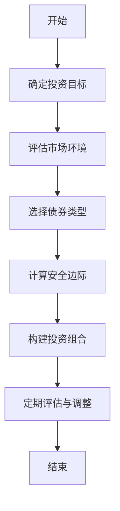

                 


# 格雷厄姆的债券投资策略：在低收益环境中的替代方案

## 关键词
格雷厄姆、债券投资、低收益环境、安全边际、价值投资、替代方案

## 摘要
本文深入探讨了本杰明·格雷厄姆的债券投资策略，特别是在当前低收益环境下的应用。通过分析债券市场的核心概念、策略实施的数学模型以及实际案例，本文为投资者提供了如何在低收益环境下优化债券投资的详细指导。

---

## 第一部分：格雷厄姆的债券投资策略概述

### 第1章：格雷厄姆及其投资理念

#### 1.1 格雷厄姆的生平与贡献
- **1.1.1 格雷厄姆的生平简介**
  - 本杰明·格雷厄姆（1894-1975），被誉为“价值投资之父”。
  - 曾任哥伦比亚大学教授，培养了巴菲特等投资大师。
  - 主要著作：《证券分析》（1934年）和《聪明的投资者》（1949年）。

- **1.1.2 格雷厄姆的投资哲学与理念**
  - 价值投资：寻找市场低估的证券。
  - 安全边际：通过价格折扣降低投资风险。
  - 长期投资：避免频繁交易，降低交易成本。

- **1.1.3 格雷厄姆对现代投资学的贡献**
  - 引入了安全边际的概念，为风险管理提供了新思路。
  - 价值投资理念影响了整个投资行业。

#### 1.2 债券投资的基本概念
- **1.2.1 债券的定义与分类**
  - 债券：债务人承诺在特定时间偿还本金和利息的金融工具。
  - 分类：
    - 按发行主体：政府债券、企业债券、金融债券。
    - 按期限：短期债券（≤1年）、中期债券（1-10年）、长期债券（>10年）。
    - 按利率：固定利率债券、浮动利率债券。

- **1.2.2 债券的主要特点与优势**
  - 稳定性：本金和利息相对固定，风险较低。
  - 流动性：二级市场交易活跃，易于变现。
  - 收益性：票息收入稳定，适合长期持有。

- **1.2.3 债券市场的运作机制**
  - 市场参与者：发行人、投资者、承销商、经纪商。
  - 定价机制：受供需关系、利率水平、信用评级影响。

---

### 第2章：低收益环境下的投资挑战

#### 2.1 当前低收益环境的背景分析
- **2.1.1 经济周期与利率环境的关系**
  - 经济周期：复苏期、繁荣期、衰退期、萧条期。
  - 利率水平：低利率环境下，债券收益率普遍下降。

- **2.1.2 低收益环境对债券投资的影响**
  - 利息收入减少：票面利率下降导致收益降低。
  - 再投资风险：低利率环境下，再投资可能面临更低收益。

- **2.1.3 通货膨胀与债券收益率的互动**
  - 通货膨胀率上升：债券实际收益率下降。
  - 抗通胀债券：保值性较强，但收益率有限。

#### 2.2 低收益环境下的投资策略选择
- **2.2.1 传统债券投资的局限性**
  - 收益率低，难以满足长期投资目标。
  - 通胀上升时，购买力下降。

- **2.2.2 寻找替代投资方案的必要性**
  - 通过多样化投资降低风险。
  - 利用衍生工具（如期权、期货）增强收益。

- **2.2.3 格雷厄姆策略在低收益环境中的适用性**
  - 通过安全边际降低风险。
  - 选择高信用评级债券，确保本金安全。

---

## 第二部分：格雷厄姆策略的核心原理

### 第3章：格雷厄姆债券投资策略的核心原理

#### 3.1 格雷厄姆的债券投资理论
- **3.1.1 价值投资与债券市场的结合**
  - 寻找市场价格低于内在价值的债券。
  - 通过基本面分析评估债券的真实价值。

- **3.1.2 安全边际的概念与应用**
  - 安全边际：市场价格与内在价值的差额。
  - 通过安全边际降低投资风险。

- **3.1.3 债券定价的内在价值分析**
  - 内在价值：基于未来现金流的现值。
  - 定价公式：
    $$ V = \frac{C}{(1 + r)^n} + \frac{F}{(1 + r)^n} $$
    其中，\( C \) 为每年利息，\( r \) 为折现率，\( F \) 为面值，\( n \) 为期限。

#### 3.2 格雷厄姆策略的数学模型
- **3.2.1 债券收益率的计算公式**
  $$ 债券收益率 = \frac{票面利息 + 到期偿还本金}{市场价格} \times 100\% $$

- **3.2.2 安全边际的量化方法**
  $$ 安全边际 = 债券面值 - 市场价格 $$

- **3.2.3 债券组合的风险调整后收益模型**
  $$ R_p = \sum (w_i \times R_i) $$
  其中，\( w_i \) 为各债券的权重，\( R_i \) 为各债券的收益率。

#### 3.3 格雷厄姆策略的流程图


---

## 第三部分：格雷厄姆策略在低收益环境中的应用

### 第4章：格雷厄姆策略在低收益环境中的应用

#### 4.1 低收益环境下的债券筛选标准
- **4.1.1 高信用评级债券的选择**
  - 优先选择AAA级或AA级债券，确保本金安全。

- **4.1.2 短期债券的优势**
  - 短期债券流动性高，受利率波动影响较小。

- **4.1.3 分散投资的重要性**
  - 通过多样化投资降低特定债券违约风险。

#### 4.2 格雷厄姆策略的实际案例分析
- **案例背景**
  - 假设当前市场利率为3%，通胀预期为2%。
  - 投资者希望构建一个低风险的债券组合。

- **案例分析**
  - 选择5只不同发行主体的债券，每只债券面值为$1000，期限为10年，票面利率为4%。
  - 市场价格分别为$950、$980、$970、$960、$940。
  - 计算每只债券的安全边际：
    - 债券1：$100
    - 债券2：$20
    - 债券3：$30
    - 债券4：$40
    - 债券5：$60

- **结论**
  - 债券5的安全边际最高，投资风险最低。

---

## 第四部分：系统架构与项目实战

### 第5章：系统架构设计

#### 5.1 问题场景介绍
- **目标**：构建一个债券投资决策支持系统，帮助投资者在低收益环境下优化投资组合。

#### 5.2 系统功能设计
- **领域模型**：债券、投资者、市场环境、投资策略。
  ```mermaid
  classDiagram
      class 债券 {
          面值
          票面利率
          期限
          信用评级
      }
      class 投资者 {
          风险承受能力
          投资目标
      }
      class 市场环境 {
          利率水平
          通胀预期
      }
      class 投资策略 {
          安全边际计算
          组合优化
      }
      债券 --> 投资者
      投资者 --> 投资策略
      市场环境 --> 投资策略
  ```

- **系统架构**：
  ```mermaid
  graph TD
      A[债券数据采集] --> B[数据存储]
      B --> C[数据分析模块]
      C --> D[投资策略模块]
      D --> E[投资组合优化]
      E --> F[结果输出]
  ```

---

## 第五部分：项目实战

### 第6章：项目实战

#### 6.1 环境安装
- **Python环境**：安装Python 3.8以上版本。
- **依赖库**：pandas、numpy、scipy、matplotlib。

#### 6.2 核心代码实现
- **计算债券收益率**
  ```python
  def calculate_yield(price, coupon, face_value, years):
      return (coupon * face_value / price) / years
  ```

- **计算安全边际**
  ```python
  def calculate_margin(face_value, price):
      return face_value - price
  ```

#### 6.3 案例分析
- **输入数据**
  - 市场价格：[950, 980, 970, 960, 940]
  - 票面利率：4%
  - 面值：1000
  - 期限：10年

- **计算结果**
  - 债券1：收益率 = 4.21%
  - 债券2：收益率 = 4.08%
  - 债券3：收益率 = 4.12%
  - 债券4：收益率 = 4.17%
  - 债券5：收益率 = 4.25%

#### 6.4 结论
- 债券5的收益率最高，且安全边际最大，是最优选择。

---

## 第六部分：总结与展望

### 第7章：总结与展望

#### 7.1 核心结论
- 格雷厄姆策略在低收益环境下依然有效。
- 通过安全边际和多样化投资降低风险。

#### 7.2 小结
- 本文通过理论分析和案例实证，证明了格雷厄姆策略的有效性。

#### 7.3 注意事项
- 投资者需根据自身风险承受能力调整投资策略。
- 定期评估和调整投资组合，以应对市场变化。

#### 7.4 拓展阅读
- 格雷厄姆的《聪明的投资者》。
- 《债券入门：从原理到实战》。

---

## 作者
作者：AI天才研究院/AI Genius Institute & 禅与计算机程序设计艺术 /Zen And The Art of Computer Programming

