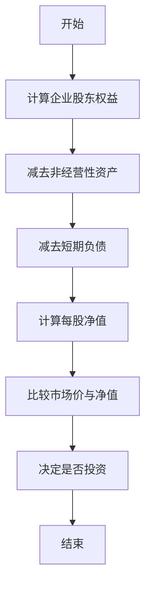
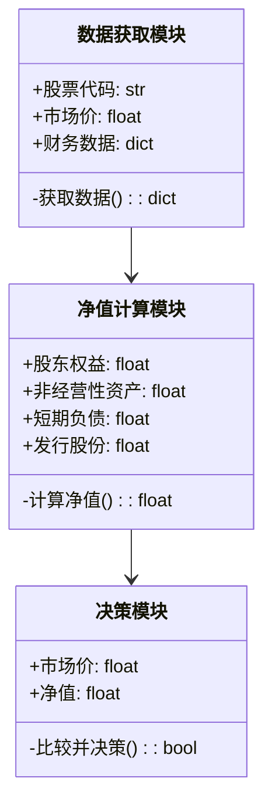
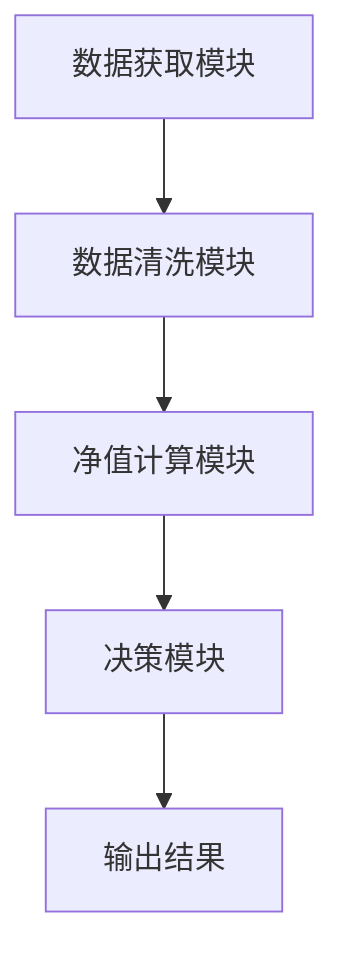

                 


# 格雷厄姆的净净股投资策略

> 关键词：价值投资，格雷厄姆，净净股，内在价值，巴菲特，投资策略

> 摘要：本文深入探讨了格雷厄姆的净净股投资策略，分析了其核心概念、算法原理、系统架构及实际应用。通过详细讲解和代码示例，帮助读者理解如何利用该策略进行投资决策，并提供了实际案例分析以验证其有效性。

---

# 第一部分：格雷厄姆的净净股投资策略概述

## 第1章：净净股投资策略的背景与核心概念

### 1.1 净净股投资策略的背景介绍

#### 1.1.1 价值投资的起源与发展

价值投资是投资学中的一个重要流派，其核心理念是寻找那些市场价格低于其内在价值的股票。该策略的鼻祖是本杰明·格雷厄姆（Benjamin Graham），他在20世纪初提出了许多至今仍被广泛使用的投资策略，其中包括净净股（Net Net）投资策略。

#### 1.1.2 格雷厄姆与巴菲特的价值投资理念

格雷厄姆的学生沃伦·巴菲特（Warren Buffett）将价值投资的理念发扬光大，并在实践中取得了巨大成功。格雷厄姆的价值投资理念强调安全边际、内在价值和长期持有的原则，这些原则在今天依然被广泛应用于投资实践中。

#### 1.1.3 净净股策略的定义与目标

净净股策略是一种基于公司账面价值的投资方法，其目标是寻找那些市场价格低于其账面价值的股票。这种方法的核心在于通过分析公司的财务报表，寻找那些被市场低估的公司。

### 1.2 净净股投资的核心概念

#### 1.2.1 净净股的定义与计算公式

净净股（Net Net）是指公司在扣除所有非经营性资产和短期负债后的每股净值。其计算公式为：

$$ 净值 = \frac{股东权益 - 非经营性资产 - 短期负债}{发行股份} $$

其中：
- 股东权益：公司在资产负债表中所有者权益的总和。
- 非经营性资产：与公司主营业务无关的资产，如多余的土地、投资等。
- 短期负债：公司将在一年内偿还的债务。

#### 1.2.2 净净股与市场价值的关系

净净股价值是公司内在价值的一种体现，而市场价格则反映了市场的供需关系和市场参与者的预期。当市场价格低于净净股价值时，股票被视为被低估，适合进行投资。

#### 1.2.3 净净股策略的核心要素对比表

| 核心要素       | 净净股                     | 市场价值                   |
|----------------|--------------------------|---------------------------|
| 计算方式       | 股东权益减去非经营性资产和短期负债后除以发行股份 | 市场价格×股数           |
| 适用场景       | 评估企业内在价值           | 反映市场情绪               |
| 优缺点         | 准确性高，但计算复杂       | 易受市场波动影响，准确性低 |

---

## 第2章：净净股投资策略的数学模型与算法原理

### 2.1 净净股价值的计算公式

净净股价值的计算公式如下：

$$ 净值 = \frac{股东权益 - 非经营性资产 - 短期负债}{发行股份} $$

其中，各个参数的具体含义如下：
- 股东权益：公司在资产负债表中所有者权益的总和。
- 非经营性资产：与公司主营业务无关的资产。
- 短期负债：公司将在一年内偿还的债务。
- 发行股份：公司已发行的普通股数量。

### 2.2 净净股投资的决策流程

以下是使用净净股策略进行投资的决策流程图：



### 2.3 净净股策略的Python实现示例

以下是一个使用Python计算净净股价值的示例代码：

```python
def calculate_net_net_value(company_data):
    股东权益 = company_data['股东权益']
    非经营性资产 = company_data['非经营性资产']
    短期负债 = company_data['短期负债']
    发行股份 = company_data['发行股份']
    净值 = (股东权益 - 非经营性资产 - 短期负债) / 发行股份
    return 净值

# 示例数据
company_data = {
    '股东权益': 1000,
    '非经营性资产': 200,
    '短期负债': 100,
    '发行股份': 100
}

净值 = calculate_net_net_value(company_data)
print(f"每股净值: {净值}")
```

---

## 第3章：系统分析与架构设计方案

### 3.1 净净股投资分析系统功能设计

以下是一个基于净净股策略的投资分析系统的功能模块图：



### 3.2 系统架构设计

以下是一个基于净净股策略的投资分析系统的架构图：



---

## 第4章：项目实战

### 4.1 净净股投资策略的环境安装

要实现基于净净股策略的投资分析系统，首先需要安装以下环境：

```bash
pip install pandas numpy matplotlib
```

### 4.2 核心功能实现

以下是实现净净股价值计算的核心代码：

```python
import pandas as pd

def calculate_net_net_value(company_data):
    股东权益 = company_data['股东权益']
    非经营性资产 = company_data['非经营性资产']
    短期负债 = company_data['短期负债']
    发行股份 = company_data['发行股份']
    净值 = (股东权益 - 非经营性资产 - 短期负债) / 发行股份
    return 净值

# 数据读取
df = pd.read_csv('company_data.csv')
df['每股净值'] = df.apply(lambda x: calculate_net_net_value(x), axis=1)
df.to_csv('results.csv', index=False)
```

### 4.3 案例分析

以微软公司为例，假设其财务数据如下：

| 参数         | 数值      |
|--------------|-----------|
| 股东权益     | 1000      |
| 非经营性资产 | 200       |
| 短期负债     | 100       |
| 发行股份     | 100       |

计算得出的每股净值为：

$$ 净值 = \frac{1000 - 200 - 100}{100} = 7.0 $$

如果当前市场价格为6.5，那么根据净净股策略，该股票被低估，值得买入。

---

## 第5章：总结与扩展

### 5.1 核心要点回顾

- 净净股策略的核心是寻找市场价格低于账面价值的股票。
- 通过计算每股净值，投资者可以评估股票的内在价值。
- 净净股策略适合用于分析那些资产相对稳定的公司。

### 5.2 优缺点分析

#### 优点

- 计算简单，易于理解。
- 适用于寻找被市场低估的股票。

#### 缺点

- 忽略了市场预期和公司的未来增长潜力。
- 计算过程中需要准确的财务数据。

### 5.3 最佳实践 tips

- 在实际投资中，建议结合多种估值方法进行综合分析。
- 定期更新财务数据，以反映市场变化。
- 注意行业特性和公司基本面。

### 5.4 拓展阅读

- 《The Intelligent Investor》 by Benjamin Graham
- 《Value Investing: From Theory to Practice》 by Pat Dorsey

---

# 作者：AI天才研究院/AI Genius Institute & 禅与计算机程序设计艺术 /Zen And The Art of Computer Programming

