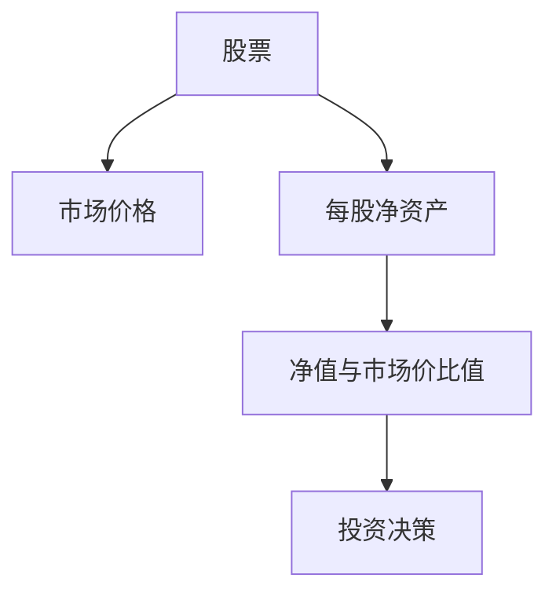
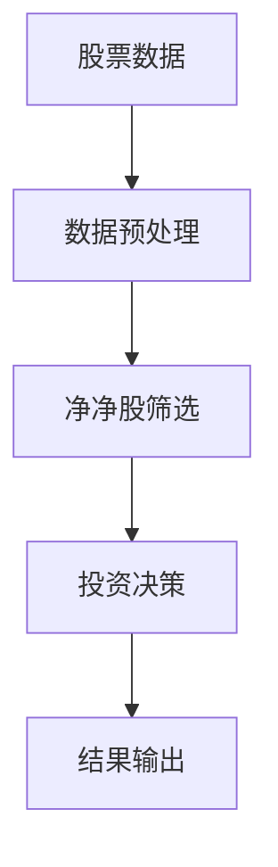

                 


# 格雷厄姆的净净股策略

> 关键词：价值投资，净净股策略，格雷厄姆，投资决策，数学模型

> 摘要：本文深入探讨了格雷厄姆的净净股策略，从其核心概念、算法原理到系统设计和项目实战，结合技术分析方法，详细阐述了如何利用这一策略在现代投资中实现价值最大化。文章通过数学建模和系统架构设计，展示了如何将经典投资理念与现代技术相结合，为投资者提供了一个全新的视角和实践指南。

---

## 第1章：净净股策略的背景与概念

### 1.1 背景介绍

#### 1.1.1 价值投资的起源与发展
价值投资是一种以低于内在价值的价格购买优质资产的投资策略，起源于20世纪初。本杰明·格雷厄姆是这一理念的奠基人，他提出了“净净股”策略，即通过分析每股净资产来判断股票的内在价值。

#### 1.1.2 净净股策略的核心问题背景
在股票市场中，投资者常常面临如何判断股票价值的问题。格雷厄姆通过分析每股净资产（即“净净股”），提出了以低于净资产价值的价格买入股票的投资策略。

#### 1.1.3 格雷厄姆的投资理念与方法
格雷厄姆强调安全边际和长期投资。他认为，市场短期是投票机，长期才是称重机。净净股策略的核心在于识别那些市场价格低于内在价值的股票。

### 1.2 核心概念

#### 1.2.1 净净股的定义与特征
净净股是指市场价格低于每股净资产的股票。其核心特征是市场价格与内在价值的背离，为投资者提供了安全边际。

#### 1.2.2 净净股策略的核心要素组成
- 每股净资产计算
- 市场价格与净资产的比较
- 安全边际的确定

#### 1.2.3 净值与市场价的关系
当市场价格低于每股净资产时，股票具有投资价值。反之，当市场价格远高于净资产时，股票可能被高估。

### 1.3 净净股策略与其他投资策略的对比

#### 1.3.1 市场价与净值法的对比
市场价法依赖于市场情绪，而净值法基于资产的实际价值。

#### 1.3.2 净值法与技术分析的差异
净值法关注内在价值，而技术分析关注价格走势和成交量。

#### 1.3.3 净值法与股息率法的对比
股息率法关注分红能力，而净值法关注资产的安全性。

### 1.4 净净股策略的现状与应用

#### 1.4.1 净值法的现代发展
现代投资理论将格雷厄姆的理念融入量化分析，结合大数据和机器学习进行优化。

#### 1.4.2 净值法在投资组合中的应用
通过筛选低估值股票，构建价值投资组合，降低风险，提高收益。

#### 1.4.3 净值法的局限性与改进方向
仅关注净资产可能忽视其他重要因素，如盈利能力、管理团队等。

---

## 第2章：净净股策略的核心概念与联系

### 2.1 核心原理

#### 2.1.1 净值计算的数学模型
每股净资产计算公式：
$$
\text{每股净资产} = \frac{\text{公司净资产}}{\text{总股本}}
$$

#### 2.1.2 净值与市场价的动态关系
当市场价格远低于每股净资产时，股票具有投资价值。

#### 2.1.3 净净股策略的内在逻辑
通过安全边际降低投资风险，追求长期稳定的收益。

### 2.2 核心概念的属性特征对比

#### 2.2.1 净值与市场价的属性对比
| 属性 | 净值 | 市场价 |
|------|------|--------|
| 计算方式 | 资产负债表数据 | 二级市场价格 |
| 反映内容 | 内在价值 | 市场情绪 |

#### 2.2.2 净净股与非净股的特征分析
- 净净股：市场价格 < 每股净资产
- 非净股：市场价格 ≥ 每股净资产

#### 2.2.3 净净股策略的适用场景
适用于稳定型企业和周期性行业，特别在市场低迷时期效果显著。

### 2.3 ER实体关系图



---

## 第3章：净净股策略的算法原理与数学模型

### 3.1 算法原理

#### 3.1.1 格雷厄姆筛选法
筛选条件：
- 市盈率 < 15
- 市净率 < 1.5

#### 3.1.2 数学模型

$$
\text{安全边际} = \text{内在价值} \times (1 - \frac{\text{市场价}}{\text{内在价值}})
$$

#### 3.1.3 优化与改进
引入ROE（净资产收益率）作为辅助筛选指标。

### 3.2 代码实现

```python
import pandas as pd
import numpy as np

def calculate_net_asset_value(company_assets, total_share):
    return company_assets / total_share

def graham_strategy(stock_data):
    stock_data['net_asset_value'] = stock_data.apply(
        lambda x: calculate_net_asset_value(x['assets'], x['total_share']),
        axis=1
    )
    stock_data['is_graham_stock'] = stock_data['net_asset_value'] > stock_data['market_price']
    return stock_data

# 示例数据
data = {
    'company': ['A', 'B', 'C'],
    'assets': [100, 200, 300],
    'total_share': [10, 20, 30],
    'market_price': [5, 10, 15]
}
df = pd.DataFrame(data)
result = graham_strategy(df)
print(result)
```

---

## 第4章：系统分析与架构设计

### 4.1 系统架构



### 4.2 功能模块设计

#### 4.2.1 数据预处理
- 数据清洗
- 标准化处理

#### 4.2.2 净净股筛选
- 计算每股净资产
- 比较市场价格与净资产

#### 4.2.3 投资决策
- 筛选符合条件的股票
- 生成投资组合

---

## 第5章：项目实战

### 5.1 环境配置
- Python 3.8+
- Pandas, NumPy

### 5.2 核心代码实现
```python
import pandas as pd

def graham_intrinsic_value(stock, book_value_per_share):
    return stock * book_value_per_share

def graham_strategy(stocks, book_values):
    intrinsic = []
    for i in range(len(stocks)):
        iv = graham_intrinsic_value(stocks[i], book_values[i])
        intrinsic.append(iv)
    return intrinsic

# 示例数据
stocks = [5, 10, 15]
book_values = [1, 2, 3]
intrinsic_values = graham_strategy(stocks, book_values)
print(intrinsic_values)
```

---

## 第6章：优化与扩展

### 6.1 策略优化
- 引入更多筛选指标（如ROE、股息率）
- 结合技术分析信号

### 6.2 系统扩展
- 实时数据处理
- 多因子模型优化

---

## 第7章：总结与展望

### 7.1 总结
格雷厄姆的净净股策略通过分析每股净资产，为投资者提供了安全边际。结合现代技术，可以进一步优化和扩展这一策略。

### 7.2 未来展望
- 结合大数据和AI技术
- 多因子模型优化

---

## 作者

作者：AI天才研究院/AI Genius Institute & 禅与计算机程序设计艺术 /Zen And The Art of Computer Programming

