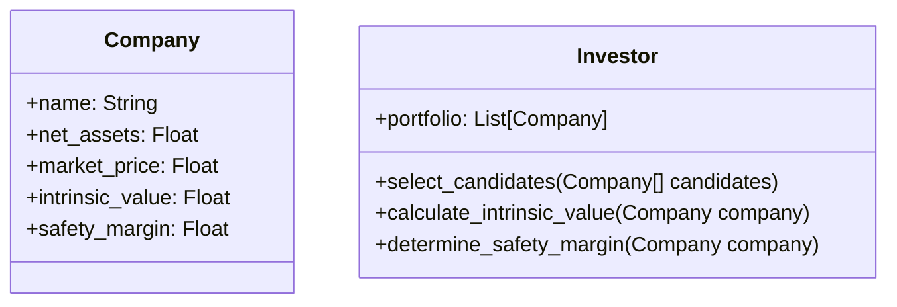
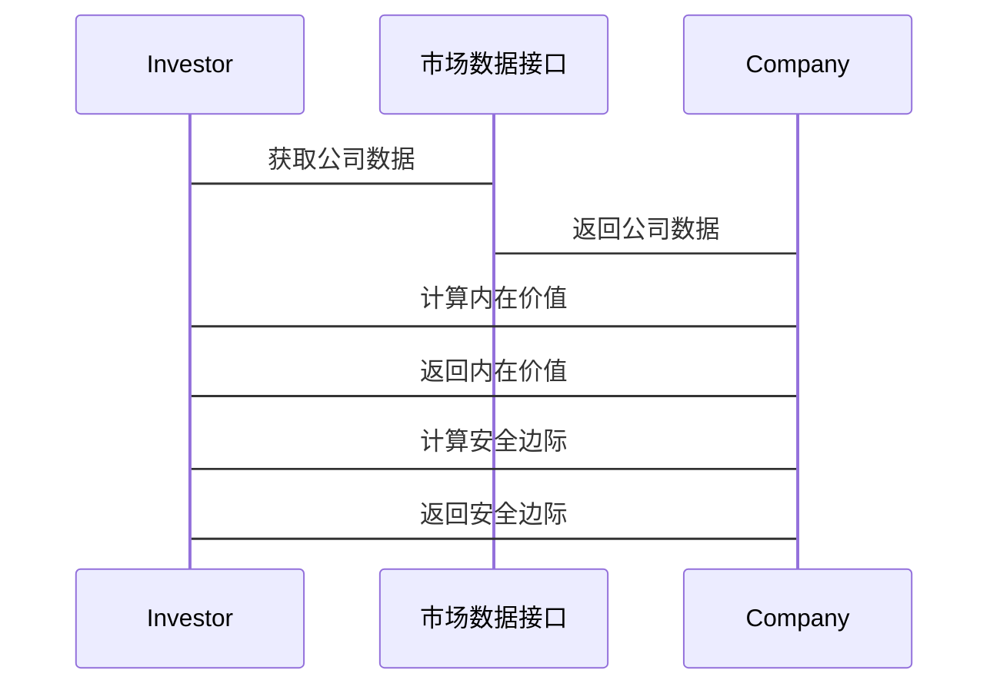

                 


# 格雷厄姆的净净股策略：寻找被低估的公司

## 关键词：格雷厄姆，净净股策略，价值投资，基本面分析，内在价值

## 摘要：本文深入探讨了格雷厄姆的净净股策略，从投资理念到具体实施步骤，再到数学模型和系统分析，全面解析如何通过基本面分析寻找被低估的公司。文章结合理论与实践，提供详细的操作指南和案例分析，帮助投资者掌握这一经典投资策略。

---

# 第一部分：引言

## 第1章：投资的基础与目标

### 1.1 投资的重要性与意义

#### 1.1.1 投资在个人财务中的作用
投资是实现财富增值的重要手段。通过合理配置资产，投资者可以实现财富的保值和增长，尤其在通货膨胀的环境下，投资是抵御货币贬值的有效方式。

#### 1.1.2 投资的目标与核心原则
投资的核心目标是实现资产的长期增值。为了实现这一目标，投资者需要遵循以下原则：
1. **分散投资**：避免将所有资金投入到单一资产中，降低风险。
2. **长期视角**：投资不是短期交易，而是长期价值的积累。
3. **基本面分析**：通过研究公司的财务状况、行业地位和盈利能力，选择具有潜力的公司。

#### 1.1.3 为什么选择价值投资
价值投资是一种基于公司内在价值的投资策略。通过寻找市场价格低于内在价值的公司，投资者可以在市场低估时买入，获得长期收益。格雷厄姆的净净股策略正是价值投资的重要组成部分。

---

## 第2章：格雷厄姆的投资理念

### 2.1 格雷厄姆的生平与贡献

#### 2.1.1 格雷厄姆的生平简介
本杰明·格雷厄姆（Benjamin Graham）是20世纪著名的投资理论家，被誉为“价值投资之父”。他的投资理念深刻影响了沃伦·巴菲特等一代投资者。

#### 2.1.2 格雷厄姆对投资理论的贡献
格雷厄姆提出了“安全边际”和“内在价值”等核心概念，为价值投资奠定了理论基础。他认为，投资者应关注公司的基本面，寻找市场价格低于内在价值的公司。

#### 2.1.3 格雷厄姆的价值投资哲学
格雷厄姆的价值投资哲学强调安全性和稳定性。他认为，投资的本质是寻找具有安全边际的公司，而不是追求市场的短期波动。

### 2.2 净净股的定义与核心要素

#### 2.2.1 净净股的定义
“净净股”是指市场价格低于公司净资产价值的股票。具体来说，当市场价格低于每股净资产时，股票具有投资价值。

#### 2.2.2 净净股的核心要素
- **每股净资产**：公司净资产除以总股本。
- **市场价格**：股票的当前市场价格。
- **安全边际**：市场价格与内在价值之间的差距。

#### 2.2.3 净净股与市场估值的关系
当市场价格远低于内在价值时，公司股票具有投资价值。这种低估通常出现在市场低迷或公司暂时困境时期。

### 2.3 格雷厄姆的选股标准

#### 2.3.1 低市盈率与低市净率的选股标准
- **低市盈率**：市盈率低于行业平均水平，表明公司股票价格被低估。
- **低市净率**：市净率低于行业平均水平，表明公司资产价值被低估。

#### 2.3.2 公司基本面的分析要点
- **盈利能力**：净利润率、ROE等指标。
- **财务状况**：资产负债表中的资产和负债情况。
- **行业地位**：公司在行业中的竞争地位。

#### 2.3.3 财务报表分析的核心指标
- **资产负债表**：评估公司资产和负债状况。
- **利润表**：评估公司盈利能力。
- **现金流量表**：评估公司现金流健康状况。

---

## 第3章：净净股策略的实施步骤

### 3.1 确定投资目标与筛选候选公司

#### 3.1.1 投资目标的设定
- **投资期限**：长期投资。
- **风险承受能力**：根据个人风险偏好选择投资标的。

#### 3.1.2 候选公司的筛选标准
- **低市盈率和低市净率**：筛选出潜在的低估公司。
- **财务健康**：评估公司的盈利能力、资产负债情况。

#### 3.1.3 如何选择财务健康的企业
- **ROE（净资产收益率）**：ROE越高，公司盈利能力越强。
- **债务水平**：公司负债率过高的企业应谨慎选择。

### 3.2 评估公司资产与负债

#### 3.2.1 资产评估的核心方法
- **资产总额**：公司所有资产的总和。
- **流动资产**：包括现金、应收账款等。

#### 3.2.2 负债分析的重要性
- **总负债**：公司所有负债的总和。
- **流动负债**：包括应付账款、短期借款等。

#### 3.2.3 资产负债表的详细解读
通过分析资产负债表，可以评估公司的资产质量、负债情况，进而判断公司的财务健康状况。

### 3.3 计算内在价值与安全边际

#### 3.3.1 内在价值的计算公式
$$ V = \frac{E}{P} $$
其中，\( V \) 为内在价值，\( E \) 为公司净利润，\( P \) 为资本成本。

#### 3.3.2 安全边际的定义与作用
安全边际是指市场价格与内在价值之间的差距，起到缓冲市场波动的作用。

#### 3.3.3 如何确定合理的买入价格
- **买入价格**：市场价格低于内在价值时，可以考虑买入。
- **安全边际**：买入价格应低于内在价值，并留有安全边际。

---

## 第4章：净净股策略的数学模型与公式

### 4.1 内在价值的计算公式

#### 4.1.1 内在价值的公式推导
$$ V = \frac{E}{P} $$
其中，\( E \) 是公司净利润，\( P \) 是资本成本。

#### 4.1.2 用latex表示的数学模型
$$ V = \frac{E}{P} $$

### 4.2 安全边际的计算方法

#### 4.2.1 安全边际的定义
安全边际是内在价值与市场价格的差值。

#### 4.2.2 安全边际的计算公式
$$ \text{安全边际} = V - P $$

---

## 第5章：系统分析与架构设计

### 5.1 系统功能设计

#### 5.1.1 领域模型（Mermaid 类图）


### 5.2 系统架构设计

#### 5.2.1 系统架构图（Mermaid 架构图）


### 5.3 系统接口设计

#### 5.3.1 系统接口
- **select_candidates**：筛选候选公司。
- **calculate_intrinsic_value**：计算内在价值。
- **determine_safety_margin**：确定安全边际。

### 5.4 系统交互设计

#### 5.4.1 系统交互图（Mermaid 序列图）


---

## 第6章：项目实战

### 6.1 环境安装

#### 6.1.1 Python 环境配置
安装Python和必要的库：
```bash
pip install pandas numpy matplotlib
```

### 6.2 核心实现

#### 6.2.1 计算内在价值的Python代码
```python
def calculate_intrinsic_value(company_profit, capital_cost):
    return company_profit / capital_cost
```

#### 6.2.2 筛选候选公司
```python
def select_candidates(companies, threshold):
    selected = []
    for company in companies:
        if company.market_price < company.net_assets:
            selected.append(company)
    return selected
```

### 6.3 案例分析

#### 6.3.1 实际案例分析
以某公司为例，计算其内在价值和安全边际，判断是否符合净净股策略。

### 6.4 代码应用解读与分析
解释代码的功能和实现逻辑，分析其在实际投资中的应用。

### 6.5 项目小结
总结项目实现的关键点和注意事项。

---

## 第7章：总结与展望

### 7.1 总结
格雷厄姆的净净股策略是一种有效的价值投资方法，通过基本面分析寻找被低估的公司，实现长期收益。

### 7.2 展望
随着市场环境的变化，投资者需要不断更新策略，结合新技术和新方法，优化投资决策。

---

## 附录：最佳实践 tips

### 1. 风险管理
- 分散投资，避免过度集中。
- 定期评估投资组合，及时调整。

### 2. 小结
- 净净股策略的核心是寻找市场价格低于内在价值的公司。
- 需要结合市场环境和公司基本面，灵活调整策略。

### 3. 注意事项
- 投资有风险，需谨慎决策。
- 长期持有优质股票，避免频繁交易。

### 4. 拓展阅读
- 格雷厄姆的《证券分析》。
- 巴菲特的《致股东的信》。

---

## 作者：AI天才研究院/AI Genius Institute & 禅与计算机程序设计艺术 /Zen And The Art of Computer Programming

