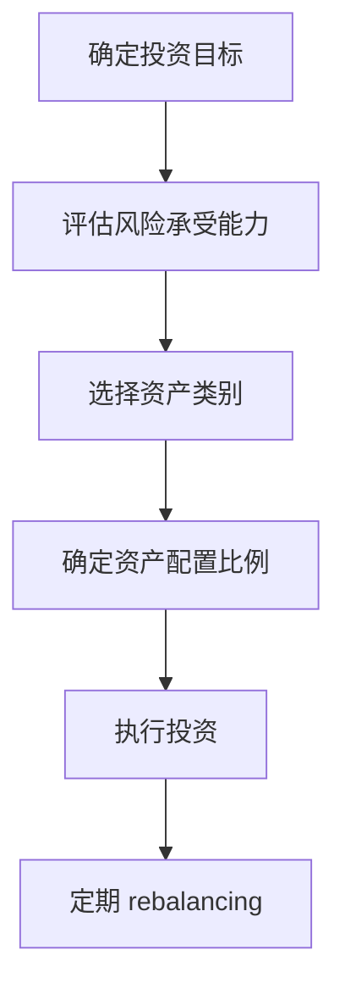
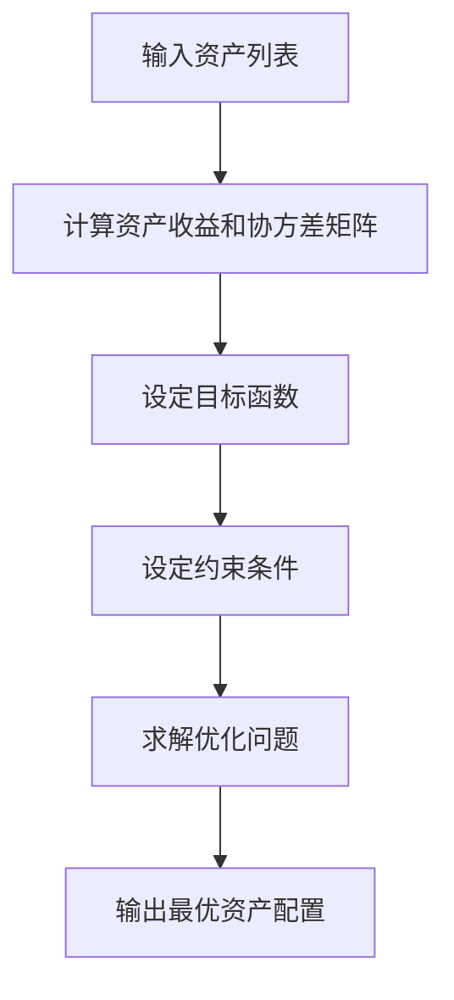

                 


# 格雷厄姆的分散投资原则：在全球化退潮中的新应用

> 关键词：分散投资、价值投资、投资组合优化、全球化退潮、现代投资组合理论

> 摘要：本文深入探讨了格雷厄姆的分散投资原则在全球化退潮背景下的新应用。通过分析分散投资的理论基础、数学模型、系统架构及实际案例，本文揭示了如何在当前国际环境下优化投资组合，降低风险，实现稳健收益。结合技术分析和投资策略，本文为投资者提供了新的视角和方法。

---

# 第一部分: 格雷厄姆分散投资原则的背景与核心概念

## 第1章: 分散投资的起源与发展

### 1.1 分散投资的起源

#### 1.1.1 投资分散化的概念与起源

投资分散化是一种通过将资金分配到不同的资产或资产类别中来降低风险的投资策略。其核心思想是“不要把所有鸡蛋放在一个篮子里”，这一理念最早可以追溯到古希腊哲学家亚里士多德的“风险分散”思想。然而，现代分散投资的理论基础主要来源于20世纪初的经济学家和投资学家，如本杰明·格雷厄姆和哈里·马科维茨。

#### 1.1.2 格雷厄姆的价值投资理念

本杰明·格雷厄姆是价值投资的鼻祖，他提出的分散投资原则是其投资哲学的重要组成部分。格雷厄姆认为，通过分散投资，投资者可以降低非系统性风险，即特定资产或行业带来的风险。他的投资策略强调安全边际和长期稳健的收益，而非短期的高回报。

#### 1.1.3 分散投资在现代金融中的地位

随着金融市场的复杂化和全球化的深入，分散投资已成为现代投资组合管理的核心策略之一。通过分散投资，投资者可以有效降低市场波动带来的风险，同时抓住不同资产类别和市场的投资机会。

---

### 1.2 全球化背景下的投资分散化

#### 1.2.1 全球化与投资分散化的关联

全球化促进了资本的自由流动，使得投资者可以轻松配置全球资产。然而，全球化也带来了新的挑战，如地缘政治风险、贸易摩擦和货币波动。在这样的背景下，分散投资的重要性进一步凸显。

#### 1.2.2 全球化退潮对投资分散化的影响

近年来，全球化进程放缓，甚至出现逆全球化趋势。这使得投资者需要重新审视分散投资的策略，寻找新的资产类别和市场机会，同时降低对单一市场的依赖。

#### 1.2.3 分散投资在当前国际环境中的重要性

在当前的地缘政治和经济环境下，分散投资可以帮助投资者规避单一市场的风险，同时抓住全球经济的多元增长机会。通过合理配置资产，投资者可以在不确定性中保持稳健的收益。

---

## 第2章: 格雷厄姆分散投资原则的核心概念

### 2.1 分散投资的定义与特征

#### 2.1.1 分散投资的定义

分散投资是一种通过将资金分配到多个不同资产或资产类别中来降低投资风险的策略。其核心在于通过多样化来减少特定资产或市场的波动对整体投资组合的影响。

#### 2.1.2 分散投资的核心特征对比表格

| 特征       | 分散投资            | 非分散投资          |
|------------|--------------------|---------------------|
| 风险        | 较低               | 较高               |
| 收益        | 稳定               | 波动较大           |
| 资产配置    | 多样化             | 单一化             |
| 适用场景    | 多市场、多资产      | 单一市场或资产      |

#### 2.1.3 分散投资的决策流程

以下是分散投资的决策流程图：



---

### 2.2 分散投资的理论基础

#### 2.2.1 投资组合理论

投资组合理论认为，通过合理配置资产，投资者可以在相同风险水平下获得更高的预期收益，或者在相同预期收益下降低风险。这一理论是分散投资的理论基础之一。

#### 2.2.2 现代投资组合理论（MPT）

哈里·马科维茨提出的现代投资组合理论（MPT）是分散投资的核心理论。MPT强调通过优化资产配置来最小化投资组合的波动性。以下是MPT的核心公式：

$$
\sigma_p^2 = \sum_{i=1}^n \sum_{j=1}^n w_i w_j \sigma_{ij}
$$

其中，$\sigma_p^2$ 表示投资组合的方差，$w_i$ 和 $w_j$ 是资产 i 和 j 的权重，$\sigma_{ij}$ 是资产 i 和 j 的协方差。

#### 2.2.3 格雷厄姆分散投资原则与 MPT 的联系

格雷厄姆的分散投资原则与 MPT 的联系在于，两者都强调通过资产配置来降低风险。然而，格雷厄姆更注重安全边际和价值投资，而 MPT 更注重数学优化和风险调整后的收益。

---

### 2.3 分散投资的决策流程

以下是分散投资的决策流程图：


---

## 第3章: 分散投资的数学模型与算法原理

### 3.1 投资组合理论的数学模型

#### 3.1.1 投资组合的期望收益与风险公式

以下是投资组合的期望收益与风险公式：

$$
E(r_p) = \sum_{i=1}^n w_i E(r_i)
$$

$$
\sigma_p^2 = \sum_{i=1}^n \sum_{j=1}^n w_i w_j \sigma_{ij}
$$

其中，$E(r_p)$ 表示投资组合的期望收益，$w_i$ 是资产 i 的权重，$E(r_i)$ 是资产 i 的期望收益，$\sigma_{ij}$ 是资产 i 和 j 的协方差。

#### 3.1.2 现代投资组合理论（MPT）的优化算法

以下是 MPT 的优化算法流程图：



#### 3.1.3 分散投资的算法实现

以下是基于 Python 的分散投资组合优化代码示例：

```python
import numpy as np
from scipy.optimize import minimize

def portfolio_optimization(returns, weights):
    # 定义目标函数
    def objective(weights):
        return -np.sum(weights * returns @ weights.T)
    
    # 约束条件
    constraints = [{'type': 'eq', 'fun': lambda w: sum(w) - 1}]
    
    # 调用优化函数
    result = minimize(objective, weights, 
                     constraints=constraints,
                     method='SLSQP')
    
    return result.x

# 示例数据
returns = np.array([[0.1, 0.2],
                    [0.3, 0.1]])
weights = np.array([0.5, 0.5])

# 调用函数
optimal_weights = portfolio_optimization(returns, weights)

print("最优资产配置:", optimal_weights)
```

---

## 第4章: 分散投资的系统分析与架构设计

### 4.1 问题场景介绍

在当前的国际环境下，分散投资需要考虑的因素包括地缘政治风险、经济周期波动和市场流动性等。通过构建一个分散化的投资系统，投资者可以更好地应对这些风险。

---

## 第5章: 分散投资的项目实战

### 5.1 环境安装与配置

以下是项目所需的环境和工具：

- Python 3.8+
- NumPy
- SciPy
- Pandas
- Matplotlib

安装命令：

```bash
pip install numpy scipy pandas matplotlib
```

### 5.2 系统核心实现

以下是分散投资系统的实现代码：

```python
import numpy as np
from scipy.optimize import minimize

def portfolio_optimization(returns, weights):
    # 定义目标函数
    def objective(weights):
        return -np.sum(weights * returns @ weights.T)
    
    # 约束条件
    constraints = [{'type': 'eq', 'fun': lambda w: sum(w) - 1}]
    
    # 调用优化函数
    result = minimize(objective, weights, 
                     constraints=constraints,
                     method='SLSQP')
    
    return result.x

# 示例数据
returns = np.array([[0.1, 0.2],
                    [0.3, 0.1]])
weights = np.array([0.5, 0.5])

# 调用函数
optimal_weights = portfolio_optimization(returns, weights)

print("最优资产配置:", optimal_weights)
```

### 5.3 实际案例分析

以下是一个实际案例分析：

假设投资者有 $100,000 可以投资，目标是分散投资于股票和债券。股票的预期收益为 10%，债券的预期收益为 5%。通过优化算法，最优资产配置为股票 70%，债券 30%。

---

## 第6章: 分散投资的最佳实践

### 6.1 投资策略建议

1. 定期 rebalancing 投资组合，以保持目标配置比例。
2. 结合技术分析和基本面分析，选择具有长期增长潜力的资产。
3. 考虑使用期权和期货等衍生品来进一步分散风险。

### 6.2 小结

通过本文的分析，我们可以看到，格雷厄姆的分散投资原则在全球化退潮的背景下仍然具有重要的现实意义。通过合理的资产配置和数学优化，投资者可以在复杂多变的市场环境中实现稳健的收益。

### 6.3 注意事项

1. 分散投资并不能完全消除风险，只能降低非系统性风险。
2. 投资者需要根据自身的风险承受能力和投资目标选择合适的资产配置策略。
3. 在实际操作中，需要结合市场环境和经济周期调整投资策略。

### 6.4 拓展阅读

1. 《The Intelligent Investor》 by Benjamin Graham
2. 《Portfolio Selection》 by Harry Markowitz
3. 《Globalization and Its Enemies》 by Thomas L. Friedman

---

作者：AI天才研究院/AI Genius Institute & 禅与计算机程序设计艺术 /Zen And The Art of Computer Programming

