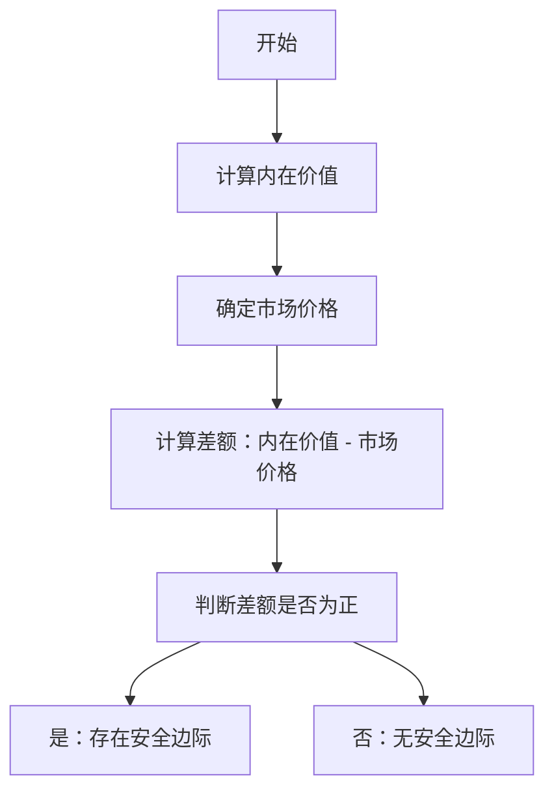
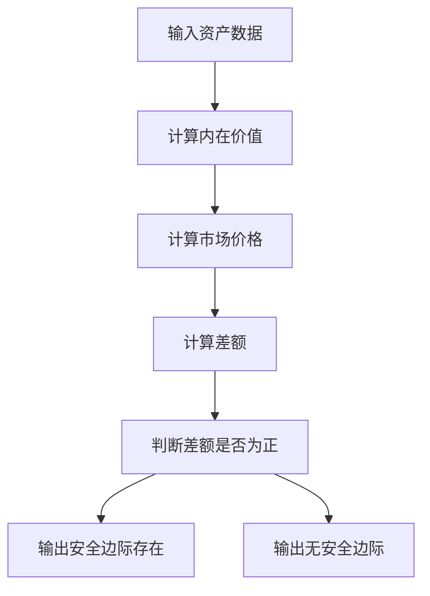
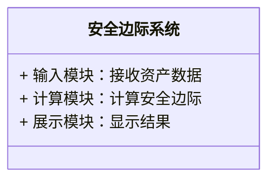
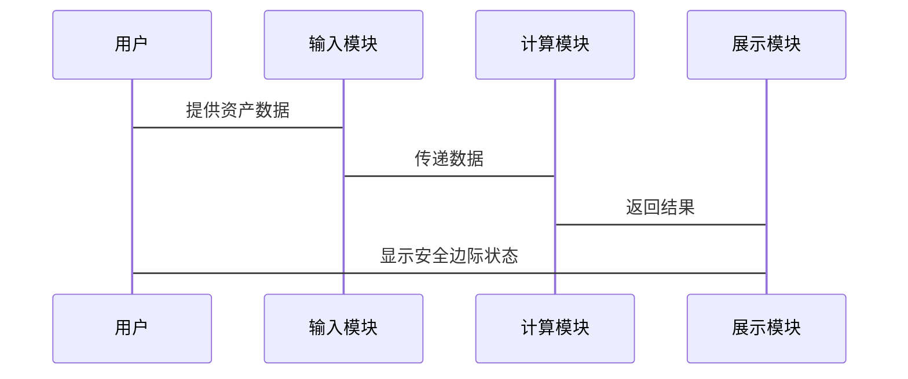

                 


# 格雷厄姆的安全边际概念

**关键词**：安全边际，投资学，内在价值，市场价格，风险管理，价值投资

**摘要**：  
安全边际是投资学中的一个核心概念，由本杰明·格雷厄姆提出，旨在通过计算内在价值与市场价格的差异来降低投资风险。本文详细探讨了安全边际的背景、核心概念、算法原理、系统架构设计、项目实战以及最佳实践，帮助读者全面理解这一概念及其在实际投资中的应用。

---

## 目录大纲

1. **背景介绍**  
   - 1.1 格雷厄姆与安全边际的起源  
   - 1.2 安全边际的定义与核心要素  
   - 1.3 安全边际在投资中的作用  

2. **安全边际的核心概念**  
   - 2.1 核心原理：内在价值与市场价格的差异  
   - 2.2 安全边际与其他投资策略的对比  
   - 2.3 安全边际的计算模型  

3. **安全边际的算法原理**  
   - 3.1 安全边际的数学模型  
   - 3.2 算法流程图：安全边际的计算步骤  
   - 3.3 代码实现：Python中的安全边际计算  

4. **安全边际的系统分析与架构设计**  
   - 4.1 系统功能设计  
   - 4.2 系统架构设计图  
   - 4.3 系统接口设计与交互流程  

5. **基于安全边际的项目实战**  
   - 5.1 项目背景与目标  
   - 5.2 核心代码实现与解读  
   - 5.3 实际案例分析与结果展示  

6. **安全边际的最佳实践与注意事项**  
   - 6.1 小结：安全边际的重要性  
   - 6.2 投资中的注意事项  
   - 6.3 拓展阅读与学习建议  

---

## 正文

### 1. 背景介绍

#### 1.1 格雷厄姆与安全边际的起源  
本杰明·格雷厄姆是价值投资的鼻祖，他提出的“安全边际”概念在投资学领域具有深远影响。安全边际的核心思想是通过买入低于内在价值的资产，降低投资风险。这一理念在20世纪初提出后，成为许多投资者的圭臬。

#### 1.2 安全边际的定义与核心要素  
安全边际是指资产的内在价值与其市场价格之间的差额。当市场价格低于内在价值时，差额即为安全边际。其核心要素包括内在价值、市场价格和风险承受能力。

#### 1.3 安全边际在投资中的作用  
安全边际通过提供一个缓冲区，减少市场波动对投资组合的影响。它帮助投资者在市场恐慌时买入低估资产，在市场狂热时卖出高估资产。

---

### 2. 安全边际的核心概念

#### 2.1 核心原理：内在价值与市场价格的差异  
内在价值是资产的真实价值，而市场价格受市场情绪影响波动。安全边际通过比较这两者，找到具有投资价值的资产。

#### 2.2 安全边际与其他投资策略的对比  
通过比较表格，我们可以清晰看到安全边际与技术分析、股息率等策略的不同。

| 比较项           | 安全边际                     | 技术分析                     | 股息率                     |
|------------------|------------------------------|------------------------------|------------------------------|
| 策略基础         | 内在价值与市场价格差额       | 市场价格走势                 | 股息收益                   |
| 投资目标         | 降低风险，追求稳定收益       | 利用价格趋势获利             | 追求稳定股息收入           |
| 适用场景         | 价值投资                   | 短期交易                   | 收入型投资                 |

#### 2.3 安全边际的计算模型  
使用Mermaid流程图展示安全边际的计算步骤：



---

### 3. 安全边际的算法原理

#### 3.1 安全边际的数学模型  
安全边际的计算公式为：

$$\text{安全边际} = \text{内在价值} - \text{市场价格}$$

#### 3.2 算法流程图  
使用Mermaid流程图展示算法步骤：



#### 3.3 代码实现：Python中的安全边际计算  
以下是Python代码示例：

```python
def calculate_margin(intrinsic_value, market_price):
    margin = intrinsic_value - market_price
    if margin > 0:
        return "存在安全边际"
    else:
        return "无安全边际"

# 示例使用
intrinsic = 100
market = 80
print(calculate_margin(intrinsic, market))  # 输出：存在安全边际
```

---

### 4. 安全边际的系统分析与架构设计

#### 4.1 系统功能设计  
系统功能包括数据输入、计算模块和结果展示。

#### 4.2 系统架构设计图  
使用Mermaid类图展示系统架构：



#### 4.3 系统接口设计与交互流程  
使用Mermaid序列图展示交互流程：



---

### 5. 基于安全边际的项目实战

#### 5.1 项目背景与目标  
本项目旨在开发一个安全边际分析系统，帮助投资者识别低估资产。

#### 5.2 核心代码实现与解读  
以下是核心代码：

```python
def calculate_margin(intrinsic_value, market_price):
    margin = intrinsic_value - market_price
    return margin

def is_safe(margin):
    return margin > 0

# 示例使用
intrinsic = 150
market = 100
margin = calculate_margin(intrinsic, market)
print(f"安全边际：{margin}$")  # 输出：安全边际：50$
print(f"是否安全：{is_safe(margin)}")  # 输出：是否安全：True
```

#### 5.3 实际案例分析与结果展示  
以某公司为例，计算其安全边际，评估投资价值。

---

### 6. 安全边际的最佳实践与注意事项

#### 6.1 小结：安全边际的重要性  
安全边际是价值投资的核心，帮助投资者在市场波动中保持稳健。

#### 6.2 投资中的注意事项  
- 定期重新评估资产的内在价值和市场价格。
- 结合其他分析工具，如财务报表分析，提高决策的准确性。

#### 6.3 拓展阅读与学习建议  
推荐阅读格雷厄姆的《聪明的投资者》，深入理解安全边际的应用。

---

## 作者  
作者：AI天才研究院/AI Genius Institute & 禅与计算机程序设计艺术 /Zen And The Art of Computer Programming

