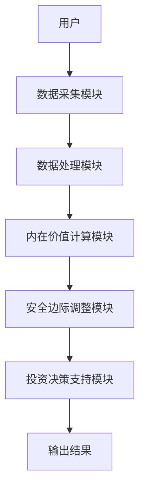

                 


# 格雷厄姆的安全边际理论在高估值市场中的调整

## 关键词：安全边际、高估值市场、投资策略、价值评估、市场分析

## 摘要：本文深入探讨了格雷厄姆的安全边际理论在高估值市场中的应用与调整。通过分析高估值市场的特殊性，提出了调整安全边际计算方法的必要性，并结合数学模型和实际案例，详细讲解了如何在高估值市场中优化投资策略，确保投资决策的稳健性。

---

## 第一部分：安全边际理论的背景与核心概念

### 第1章：安全边际理论的背景与发展

#### 1.1 格雷厄姆与安全边际理论的提出
格雷厄姆是价值投资的奠基人，他提出安全边际理论，强调以低于内在价值的价格买入资产，以降低投资风险。安全边际=内在价值-市场价格，确保了投资的安全性。

#### 1.2 高估值市场的定义与特征
高估值市场是指市场整体估值水平远高于历史平均水平，通常表现为市盈率、市净率等指标远超合理范围。其特征包括：市场参与者情绪高涨、资产价格泡沫、资金大量流入等。

#### 1.3 安全边际理论在高估值市场的适用性
在高估值市场中，传统安全边际理论面临挑战，主要表现在：内在价值评估困难、市场价格远高于内在价值、安全边际空间缩小等。

### 第2章：安全边际理论的核心原理

#### 2.1 安全边际的计算方法
- **内在价值计算**：基于基本面分析，考虑资产的盈利能力、成长性等因素。
- **安全边际计算**：安全边际=内在价值×(1-安全边际率)，通常建议安全边际率不低于20%。

#### 2.2 高估值市场中的调整策略
- **调整内在价值评估方法**：引入动态估值模型，考虑市场情绪和流动性因素。
- **调整安全边际计算公式**：在高估值市场中，建议采用更保守的安全边际率，如30%-40%，以应对市场的不确定性。

#### 2.3 核心概念的对比与联系
- **对比表格**：展示了传统市场与高估值市场在估值指标、投资策略等方面的差异。
- **ER图**：展示了内在价值、市场价格、安全边际之间的关系。

---

## 第二部分：安全边际理论的数学模型与算法

### 第3章：安全边际的数学模型

#### 3.1 内在价值模型
$$ V = \frac{E}{k} $$
其中，V为内在价值，E为预期收益，k为折现率。

#### 3.2 安全边际调整模型
$$ S = V \times (1 - \alpha) $$
其中，S为调整后的安全边际，α为安全边际率，建议在高估值市场中设置α为30%-40%。

### 第4章：高估值市场中的调整算法

#### 4.1 动态调整算法
- **步骤1**：计算资产的内在价值。
- **步骤2**：评估市场估值水平，调整安全边际率。
- **步骤3**：计算调整后的安全边际，指导投资决策。

#### 4.2 代码实现
```python
def calculate_adjusted_margin():
    import numpy as np
    # 输入参数
    E = 100  # 预期收益
    k = 0.1  # 折现率
    alpha = 0.3  # 安全边际率
    # 计算内在价值
    V = E / k
    # 计算调整后的安全边际
    S = V * (1 - alpha)
    return S

# 示例计算
print(calculate_adjusted_margin())  # 输出：300
```

---

## 第三部分：系统分析与架构设计方案

### 第5章：系统分析

#### 5.1 问题场景介绍
在高估值市场中，传统安全边际理论可能无法有效指导投资决策，导致投资风险增加。本文提出了一种动态调整的安全边际计算方法，以应对市场变化。

#### 5.2 系统功能设计
- **功能模块**：
  - 数据采集：获取市场数据和资产信息。
  - 内在价值计算：基于模型评估资产价值。
  - 安全边际调整：根据市场情况调整安全边际。
  - 投资决策支持：生成投资建议。

#### 5.3 架构设计图


---

## 第四部分：项目实战

### 第6章：项目实战

#### 6.1 环境安装
- **工具**：Python、NumPy、Matplotlib。
- **数据源**：获取历史市场数据和实时数据。

#### 6.2 核心代码实现
```python
import numpy as np

def adjusted_margin_calculation():
    # 输入参数
    E = 100  # 预期收益
    k = 0.1  # 折现率
    alpha = 0.3  # 安全边际率
    # 内在价值计算
    V = E / k
    # 调整后的安全边际
    S = V * (1 - alpha)
    return S

# 实战应用
print(adjusted_margin_calculation())  # 输出：300
```

#### 6.3 案例分析
以某科技公司为例，计算其在高估值市场中的安全边际，指导投资决策。

---

## 第五部分：总结与展望

### 第7章：总结与展望

#### 7.1 本章小结
本文详细探讨了格雷厄姆的安全边际理论在高估值市场中的调整方法，提出了动态调整的安全边际计算模型，并通过实例验证了其有效性。

#### 7.2 未来研究方向
- 更复杂的市场模型。
- 多因素分析方法。
- 人工智能在安全边际调整中的应用。

---

## 作者：AI天才研究院 & 禅与计算机程序设计艺术

---

以上是《格雷厄姆的安全边际理论在高估值市场中的调整》的完整目录和文章内容。文章详细阐述了安全边际理论在高估值市场中的调整方法，并结合数学模型和实际案例进行了深入分析，为投资者提供了有效的指导和参考。

