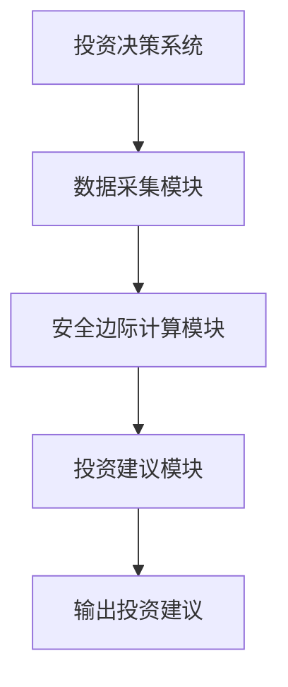

                 


# 格雷厄姆的安全边际理论实践

> 关键词：安全边际理论，格雷厄姆，价值投资，投资策略，风险管理

> 摘要：本文详细探讨了格雷厄姆提出的安全边际理论，从理论基础到实践应用，结合实例分析，深入阐述了安全边际理论在投资决策中的核心作用。通过分析安全边际的计算方法、系统架构设计以及项目实战案例，本文旨在为投资者提供一套科学、系统的投资决策框架，帮助投资者在复杂的市场环境中规避风险，实现稳健收益。

---

## 第一部分: 格雷厄姆的安全边际理论基础

### 第1章: 安全边际理论的起源与背景

#### 1.1 格雷厄姆的生平简介

本杰明·格雷厄姆（Benjamin Graham）是20世纪最伟大的投资思想家之一，被誉为“价值投资之父”。他出生于1894年，曾在哥伦比亚大学教授证券分析，培养了包括沃伦·巴菲特在内的众多投资大师。格雷厄姆的投资理念深刻影响了整个投资行业，尤其是其提出的“安全边际”理论，成为价值投资的核心原则之一。

#### 1.2 格雷厄姆对投资理论的贡献

格雷厄姆在投资领域的贡献主要体现在以下几个方面：

1. **价值投资理念**：他强调以企业的内在价值为基础进行投资，而非单纯关注市场价格的波动。
2. **安全边际理论**：提出了安全边际的概念，为投资者提供了评估投资风险和潜在收益的重要工具。
3. **证券分析方法**：他倡导通过基本面分析来评估企业的财务状况，从而做出更为稳健的投资决策。

#### 1.3 安全边际理论的提出背景

20世纪30年代，全球经济大萧条给投资者带来了沉重的打击，许多投资者在市场的剧烈波动中损失惨重。格雷厄姆在这一背景下提出了安全边际理论，旨在帮助投资者在不确定的市场中找到更为稳健的投资策略。

---

### 第2章: 安全边际理论的核心概念

#### 2.1 安全边际的定义

安全边际是指投资标的的市场价格与内在价值之间的差异。具体而言，内在价值是投资者基于对企业基本面分析得出的合理估值，而市场价格则是市场上投资者愿意为之支付的价格。安全边际 = 内在价值 - 市场价格。

#### 2.2 安全边际与安全边际率的关系

安全边际率是安全边际与市场价格的比率，计算公式为：

$$\text{安全边际率} = \frac{\text{安全边际}}{\text{市场价格}}$$

安全边际率越高，说明投资的风险越小，安全边际越大，投资的潜在回报也越高。

#### 2.3 安全边际在投资决策中的作用

安全边际的核心作用在于帮助投资者识别低估的投资标的，并在市场波动中提供缓冲，降低投资风险。具体表现在以下几个方面：

1. **规避市场波动风险**：通过关注安全边际，投资者可以避免在市场价格过高时盲目投资。
2. **发现低估机会**：当市场价格低于内在价值时，安全边际的存在意味着投资标的具有较高的潜在回报。
3. **制定稳健的投资策略**：安全边际为投资者提供了动态调整投资组合的依据，帮助其在不同市场环境下做出更为明智的投资决策。

---

### 第3章: 安全边际理论的核心原理

#### 3.1 安全边际的计算方法

安全边际的计算需要结合企业的基本面分析，包括对其盈利能力、财务状况、行业地位等多个维度的评估。以下是计算安全边际的主要步骤：

1. **评估企业的内在价值**：通过分析企业的财务报表，计算其合理的估值。
2. **确定市场价格**：获取投资标的当前市场价格。
3. **计算安全边际**：用内在价值减去市场价格，得出安全边际。

#### 3.2 安全边际与投资组合管理

投资组合的管理是安全边际理论的重要应用之一。以下是其在投资组合管理中的具体作用：

1. **风险控制**：通过关注安全边际，投资者可以避免过度集中于高风险资产。
2. **资产配置**：安全边际为投资者提供了优化资产配置的依据，帮助其在不同资产类别之间分配资金。
3. **动态调整**：随着市场环境的变化，投资者需要定期调整投资组合，确保其安全边际始终处于合理水平。

#### 3.3 安全边际与投资组合的再平衡

投资组合的再平衡是保持安全边际稳定的重要手段。通过定期审视投资组合的表现，投资者可以及时调整持仓结构，确保其安全边际始终处于合理水平。

---

### 第4章: 安全边际理论的系统分析与架构设计

#### 4.1 投资决策系统的场景介绍

为了更好地应用安全边际理论，我们可以构建一个投资决策系统，该系统能够帮助投资者实时评估投资标的的安全边际，并提供相应的投资建议。

#### 4.2 系统功能设计

1. **数据采集模块**：获取投资标的的市场价格和基本面数据。
2. **安全边际计算模块**：基于输入数据，计算投资标的的安全边际。
3. **投资建议模块**：根据安全边际的结果，提供相应的投资建议。

#### 4.3 系统架构设计

以下是系统的架构设计图：



---

### 第5章: 安全边际理论的项目实战

#### 5.1 环境安装

为了实现安全边际的计算，我们需要以下工具和环境：

1. **编程语言**：Python
2. **数据源**：股票的基本面数据和市场价格数据
3. **开发工具**：Jupyter Notebook 或 PyCharm

#### 5.2 核心代码实现

以下是计算安全边际的Python代码示例：

```python
# 安全边际计算函数
def calculate_margin(intrinsic_value, market_price):
    return intrinsic_value - market_price

# 示例数据
intrinsic_value = 50  # 内在价值（美元）
market_price = 40     # 市场价格（美元）
margin = calculate_margin(intrinsic_value, market_price)
print(f"安全边际为：${margin}")
```

#### 5.3 代码解读与分析

1. **函数定义**：`calculate_margin`函数接受内在价值和市场价格作为输入，返回安全边际。
2. **示例数据**：假设某股票的内在价值为50美元，市场价格为40美元。
3. **计算结果**：安全边际为10美元，说明该股票具有较高的投资价值。

#### 5.4 实际案例分析

以某公司为例，假设其内在价值为100美元，市场价格为80美元，则其安全边际为20美元。这意味着，如果市场价格下跌至80美元，投资者仍有一定的安全空间。

---

### 第6章: 总结与展望

#### 6.1 核心观点总结

安全边际理论为投资者提供了一种科学、系统的投资决策方法。通过评估投资标的的安全边际，投资者可以更好地规避市场风险，实现稳健的投资收益。

#### 6.2 最佳实践 tips

1. **持续学习**：关注市场动态，及时调整投资策略。
2. **分散投资**：通过分散投资降低风险。
3. **长期持有**：避免频繁交易，降低交易成本。

#### 6.3 小结

安全边际理论是价值投资的核心原则之一。通过本文的分析，我们深入探讨了安全边际的计算方法及其在投资决策中的应用。希望本文能够为投资者提供有益的参考，帮助其在复杂的市场环境中做出明智的投资决策。

---

作者：AI天才研究院/AI Genius Institute & 禅与计算机程序设计艺术 /Zen And The Art of Computer Programming

