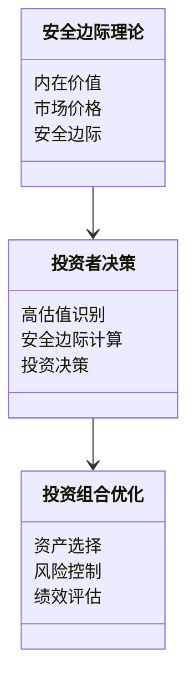
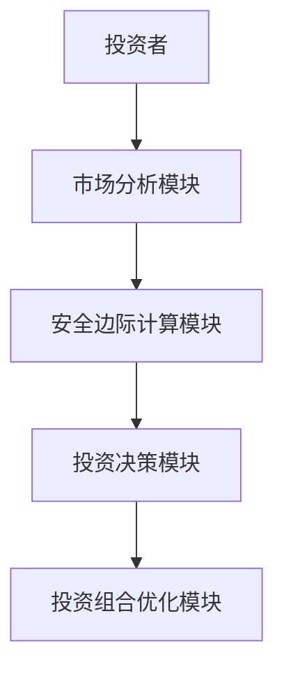
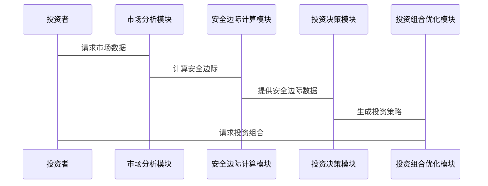

                 


# 格雷厄姆的安全边际理论：在高估值市场中的应用

### 关键词：
- 安全边际理论
- 价值投资
- 高估值市场
- 格雷厄姆
- 投资风险管理

### 摘要：
本文深入探讨格雷厄姆的安全边际理论，并分析其在当前高估值市场中的应用。通过理论与实践的结合，本文旨在为投资者提供在高估值市场中如何利用安全边际理论进行风险管理、投资策略制定及组合优化的指导。文章涵盖理论背景、数学模型、系统分析及实战案例，帮助投资者在复杂市场中做出明智决策。

---

## 第1章: 格雷厄姆安全边际理论的背景与核心概念

### 1.1 安全边际理论的起源与核心思想

#### 1.1.1 格雷厄姆与价值投资的起源
本杰明·格雷厄姆（Benjamin Graham）是价值投资的奠基人，他的安全边际理论深刻影响了投资领域。格雷厄姆强调以低于内在价值的价格购买资产，以降低投资风险。这一理念在20世纪30年代的大萧条时期得到了验证，成为价值投资的核心原则。

#### 1.1.2 安全边际理论的定义与核心要素
安全边际理论认为，投资者应以低于内在价值的价格购买资产，以确保在市场波动中能够获得稳定的收益。其核心要素包括：
1. **内在价值**：资产的公平价格，基于其基本面分析。
2. **市场价格**：资产在市场上的交易价格。
3. **安全边际**：内在价值与市场价格之间的差距，提供缓冲空间，降低投资风险。

#### 1.1.3 安全边际与投资风险管理的关系
安全边际是风险管理的重要工具，通过预留安全空间，投资者能够在市场下跌时减少损失，同时在市场上涨时获得超额收益。

### 1.2 高估值市场的定义与特征

#### 1.2.1 高估值市场的定义与分类
高估值市场是指市场整体估值远高于历史平均水平，通常表现为市盈率（P/E）和市净率（P/B）等指标显著高于行业平均水平。

#### 1.2.2 高估值市场的特征与表现
1. **高市盈率**：公司股价远高于其盈利水平。
2. **高市净率**：资产价值被高估。
3. **市场情绪乐观**：投资者情绪高涨，资金大量流入市场。

#### 1.2.3 高估值市场与安全边际理论的关联
在高估值市场中，安全边际理论尤为重要，因为高估值意味着市场风险增加，投资者需要更加谨慎地选择标的，以确保安全边际的存在。

### 1.3 安全边际理论在高估值市场的应用价值

#### 1.3.1 高估值市场中的投资风险
高估值市场中，资产价格可能被高估，一旦市场调整，价格可能大幅下跌，导致投资损失。

#### 1.3.2 安全边际理论的防御性特征
通过预留安全边际，投资者可以在高估值市场中降低风险，避免因市场价格波动而造成重大损失。

#### 1.3.3 理论在现代投资中的适用性
尽管市场环境变化，安全边际理论依然适用，其核心在于通过基本面分析，识别低估资产，构建稳健的投资组合。

---

## 第2章: 安全边际理论的核心概念与数学模型

### 2.1 安全边际的定义与计算方法

#### 2.1.1 安全边际的数学公式
安全边际（Margin of Safety）可以表示为：
$$ \text{安全边际} = \text{内在价值} - \text{市场价格} $$

#### 2.1.2 内在价值的计算公式
内在价值可以通过DCF模型计算：
$$ \text{内在价值} = \frac{\text{现金流}}{\text{贴现率}} $$

#### 2.1.3 安全边际的计算步骤与注意事项
1. **计算内在价值**：基于公司基本面分析。
2. **确定市场价格**：参考当前市场价。
3. **计算安全边际**：确保安全边际为正数。

### 2.2 安全边际与投资决策的关系

#### 2.2.1 投资决策中的安全边际作用
安全边际为投资者提供决策依据，确保投资决策的稳健性。

#### 2.2.2 安全边际与风险控制的数学模型
通过构建数学模型，投资者可以量化风险，优化投资组合。

#### 2.2.3 安全边际在组合投资中的应用
在组合投资中，安全边际可以帮助投资者分散风险，提高整体投资组合的稳健性。

### 2.3 核心概念的对比分析

#### 2.3.1 安全边际与市盈率的对比
市盈率衡量股价与盈利的关系，而安全边际关注股价与内在价值的差距。

#### 2.3.2 安全边际与市净率的对比
市净率衡量股价与资产价值的关系，而安全边际关注资产价格的合理性。

#### 2.3.3 安全边际与股息率的对比
股息率反映分红能力，而安全边际关注价格波动风险。

---

## 第3章: 高估值市场中的安全边际分析

### 3.1 高估值市场的识别与分类

#### 3.1.1 高估值市场的识别指标
1. **市盈率（P/E）**：高于行业平均水平。
2. **市净率（P/B）**：高于行业平均水平。
3. **市场情绪指标**：投资者情绪乐观，资金流入增加。

#### 3.1.2 市场估值的分类方法
1. **相对估值法**：比较市盈率、市净率等指标。
2. **绝对估值法**：基于DCF模型计算内在价值。

#### 3.1.3 不同市场阶段的安全边际策略
1. **牛市**：提高安全边际要求。
2. **熊市**：降低安全边际要求。

### 3.2 安全边际在高估值市场中的应用策略

#### 3.2.1 防御性投资者的安全边际策略
防御性投资者应选择安全边际较大的资产，减少市场波动的影响。

#### 3.2.2 进攻性投资者的安全边际策略
进攻性投资者可适当降低安全边际要求，追求超额收益。

#### 3.2.3 逆向投资中的安全边际应用
逆向投资者在市场低谷时买入，利用安全边际理论获得超额收益。

### 3.3 高估值市场中的案例分析

#### 3.3.1 历史案例分析
分析过去高估值市场中的投资案例，总结经验教训。

#### 3.3.2 当前市场案例分析
结合当前市场情况，分析高估值资产的安全边际。

#### 3.3.3 案例小结
通过案例分析，验证安全边际理论在高估值市场中的有效性。

---

## 第4章: 安全边际理论的系统分析与架构设计

### 4.1 问题场景介绍
在高估值市场中，投资者需要利用安全边际理论，构建稳健的投资组合，应对市场波动。

### 4.2 系统功能设计（领域模型）



### 4.3 系统架构设计



### 4.4 系统接口设计
1. **市场分析接口**：获取市场数据，计算估值指标。
2. **安全边际计算接口**：计算内在价值与市场价格差距。
3. **投资决策接口**：基于安全边际，生成投资建议。

### 4.5 系统交互设计



---

## 第5章: 高估值市场中的实战操作

### 5.1 环境安装与配置
1. **数据获取**：使用金融数据API获取市场数据。
2. **工具安装**：安装Python、Pandas、Matplotlib等工具。

### 5.2 核心实现源代码

```python
import pandas as pd
import numpy as np

# 计算内在价值
def calculate_intrinsic_value(eps, growth_rate, discount_rate):
    return eps * (1 + growth_rate) / discount_rate

# 计算安全边际
def calculate_margin_of_safety(current_price, intrinsic_value):
    return intrinsic_value - current_price

# 示例数据
eps = 10
growth_rate = 0.05
discount_rate = 0.08
current_price = 120

intrinsic_value = calculate_intrinsic_value(eps, growth_rate, discount_rate)
margin_of_safety = calculate_margin_of_safety(current_price, intrinsic_value)

print(f"内在价值: {intrinsic_value}")
print(f"安全边际: {margin_of_safety}")
```

### 5.3 代码解读与分析
1. **内在价值计算**：基于盈利能力和增长预期，评估资产的公平价值。
2. **安全边际计算**：比较市场价格与内在价值，确定安全空间。

### 5.4 案例分析与解读
分析实际市场中的高估值资产，计算其安全边际，制定投资策略。

### 5.5 项目小结
总结实战经验，强调安全边际理论在高估值市场中的应用价值。

---

## 第6章: 安全边际理论的最佳实践与风险管理

### 6.1 最佳实践 tips
1. **持续学习**：关注市场动态，更新分析模型。
2. **分散投资**：降低单一资产的风险。
3. **长期视角**：避免短期波动影响决策。

### 6.2 小结
回顾全文，总结安全边际理论的核心价值和应用策略。

### 6.3 注意事项
1. **数据质量**：确保输入数据的准确性和完整性。
2. **模型局限性**：认识到安全边际理论的局限性，结合其他方法进行分析。

### 6.4 拓展阅读
推荐相关书籍和文章，深入学习安全边际理论。

---

## 作者：AI天才研究院 & 禅与计算机程序设计艺术

---

感谢您的耐心阅读，希望本文能为您提供有价值的见解，帮助您在高估值市场中应用格雷厄姆的安全边际理论，做出明智的投资决策。

