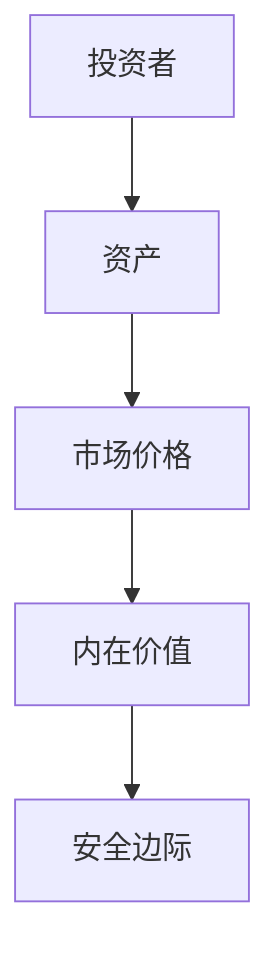
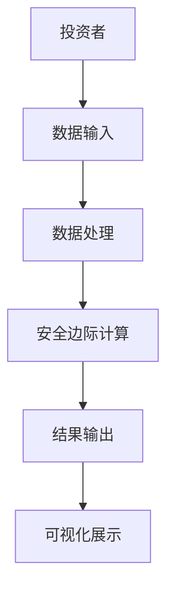

                 


# 格雷厄姆的安全边际：如何在投资中留有余地

> 关键词：格雷厄姆、安全边际、投资策略、风险管理、资产定价、价值投资

> 摘要：本篇文章将深入探讨本杰明·格雷厄姆提出的安全边际概念，分析其在投资决策中的重要性，并结合数学模型和系统设计，讲解如何通过安全边际降低投资风险。文章将从安全边际的定义、核心概念、数学模型、系统架构以及项目实战五个方面进行详细分析，帮助读者全面理解并掌握安全边际的投资策略。

---

## 第一部分：安全边际的背景与基础

### 第1章：安全边际的定义与背景

#### 1.1 本杰明·格雷厄姆与安全边际的提出
本杰明·格雷厄姆是价值投资的鼻祖，他提出的“安全边际”概念是投资理论中的里程碑。安全边际是指资产的市场价格低于其内在价值的部分，即：
$$ \text{安全边际} = \text{内在价值} - \text{市场价格} $$

这一概念的核心在于，通过留有余地的价格买入，以应对市场的不确定性。格雷厄姆认为，市场的波动性使得价格往往偏离其内在价值，而安全边际正是利用这一偏差，为投资者提供保护。

#### 1.2 投资中的不确定性与风险
投资的核心是应对不确定性，而安全边际为投资者提供了一种量化风险的方法。通过计算安全边际，投资者可以更好地理解市场价格与内在价值之间的差异，从而做出更为稳健的投资决策。

#### 1.3 安全边际的边界与外延
安全边际的应用并非无限制的，它主要适用于那些具有清晰内在价值的资产，如股票、债券等。对于那些难以估值的资产（如某些高科技公司），安全边际的计算可能变得复杂，甚至不可靠。

---

### 第2章：安全边际的核心概念与联系

#### 2.1 核心概念原理
安全边际的核心在于内在价值的计算。内在价值是资产在未来现金流的现值，其计算公式为：
$$ \text{内在价值} = \frac{\text{净利润}}{\text{资本成本} - \text{增长率}} $$

通过比较市场价格与内在价值，投资者可以确定是否存在安全边际。如果市场价格低于内在价值，且两者之间的差异足够大，那么该资产就具有较高的安全边际。

#### 2.2 核心概念属性对比
以下是安全边际与其他相关概念的对比：

| 概念          | 描述                                                                 |
|---------------|----------------------------------------------------------------------|
| 资产价格      | 市场交易价格，受供需关系和市场情绪影响。                                       |
| 内在价值      | 资产未来现金流的现值，基于基本面分析得出。                                       |
| 风险收益      | 投资者在承担风险时所要求的收益补偿。                                           |
| 安全边际      | 内在价值与市场价格的差额，反映了资产的“折扣”程度。                             |

#### 2.3 ER实体关系图
以下是安全边际的实体关系图：



---

### 第3章：安全边际的数学模型与公式

#### 3.1 数学模型
安全边际的计算公式为：
$$ \text{安全边际} = \text{内在价值} - \text{市场价格} $$

为了计算内在价值，我们可以使用格雷厄姆的公式：
$$ \text{内在价值} = \frac{\text{净利润}}{\text{资本成本} - \text{增长率}} $$

#### 3.2 公式推导
假设某公司净利润为 $100$ 万，资本成本为 $8\%$，增长率 $3\%$，则其内在价值为：
$$ \text{内在价值} = \frac{100}{0.08 - 0.03} = 2000 \text{万} $$

如果市场价格为 $1500$ 万，则安全边际为：
$$ \text{安全边际} = 2000 - 1500 = 500 \text{万} $$

#### 3.3 举例说明
假设某股票的市场价格为 $50$ 元，其内在价值为 $60$ 元，则安全边际为：
$$ \text{安全边际} = 60 - 50 = 10 \text{元} $$

这意味着，如果市场价格下跌至 $50$ 元，投资者仍能获得 $10$ 元的安全边际，从而避免损失。

---

### 第4章：系统分析与架构设计方案

#### 4.1 问题场景介绍
在实际投资中，投资者需要快速计算资产的安全边际，以便做出决策。为了实现这一目标，我们可以设计一个基于Python的系统，利用数据分析工具（如Pandas）和可视化工具（如Matplotlib）进行分析。

#### 4.2 系统架构设计
以下是系统的架构设计图：



#### 4.3 系统实现代码
以下是计算安全边际的Python代码示例：

```python
import pandas as pd

def calculate_intrinsic_value(net_profit, cost_of_capital, growth_rate):
    return net_profit / (cost_of_capital - growth_rate)

def calculate_margin_of_safety(intrinsic_value, market_price):
    return intrinsic_value - market_price

# 示例数据
net_profit = 100  # 单位：万元
cost_of_capital = 0.08
growth_rate = 0.03
market_price = 1500  # 单位：万元

# 计算内在价值
intrinsic_value = calculate_intrinsic_value(net_profit, cost_of_capital, growth_rate)
# 计算安全边际
margin_of_safety = calculate_margin_of_safety(intrinsic_value, market_price)

print(f"内在价值: {intrinsic_value} 万元")
print(f"市场价格: {market_price} 万元")
print(f"安全边际: {margin_of_safety} 万元")
```

---

## 第五部分：项目实战

### 第5章：项目实战

#### 5.1 项目介绍
本项目旨在通过Python代码实现安全边际的计算，并通过可视化工具展示结果。我们将在实际案例中，分析如何利用安全边际进行投资决策。

#### 5.2 核心实现代码
以下是完整的代码实现：

```python
import pandas as pd
import matplotlib.pyplot as plt

def calculate_intrinsic_value(net_profit, cost_of_capital, growth_rate):
    return net_profit / (cost_of_capital - growth_rate)

def calculate_margin_of_safety(intrinsic_value, market_price):
    return intrinsic_value - market_price

def visualize_results(intrinsic_value, market_price, margin_of_safety):
    plt.figure(figsize=(10, 6))
    plt.bar('市场价格', market_price, label='市场价格')
    plt.bar('内在价值', intrinsic_value, label='内在价值')
    plt.title('安全边际分析')
    plt.legend()
    plt.show()

# 示例数据
net_profit = 100  # 单位：万元
cost_of_capital = 0.08
growth_rate = 0.03
market_price = 1500  # 单位：万元

# 计算内在价值
intrinsic_value = calculate_intrinsic_value(net_profit, cost_of_capital, growth_rate)
# 计算安全边际
margin_of_safety = calculate_margin_of_safety(intrinsic_value, market_price)

# 可视化结果
visualize_results(intrinsic_value, market_price, margin_of_safety)
```

---

## 第六部分：总结与展望

### 6.1 总结
通过本文的分析，我们深入探讨了安全边际的概念、计算方法和实际应用。安全边际作为价值投资的重要工具，能够帮助投资者在不确定性中做出更为稳健的决策。

### 6.2 展望
未来，随着人工智能和大数据技术的发展，安全边际的计算将更加精准和高效。投资者可以利用这些技术手段，进一步提升投资决策的科学性和可靠性。

---

## 作者：AI天才研究院/AI Genius Institute & 禅与计算机程序设计艺术 /Zen And The Art of Computer Programming

