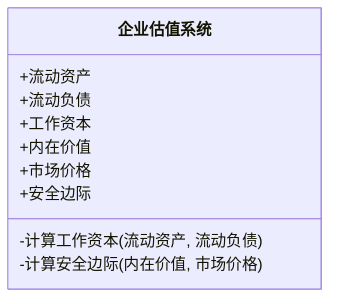

                 


# 格雷厄姆的工作资本分析在现代企业估值中的应用

## 关键词：
- 格雷厄姆工作资本分析
- 现代企业估值
- 财务分析
- 投资评估
- 价值投资

## 摘要：
格雷厄姆的工作资本分析是一种经典的财务评估方法，通过计算企业的流动资产与流动负债之差来评估其短期偿债能力。本文将详细探讨这种方法在现代企业估值中的应用，结合数学模型、系统架构和实际案例，展示如何在复杂多变的商业环境中有效运用工作资本分析，为企业估值提供可靠依据。

---

# 第一部分：工作资本分析的背景与核心概念

## 第1章：工作资本分析的背景与核心概念

### 1.1 工作资本分析的背景介绍

#### 1.1.1 问题背景
现代企业的复杂性使得传统估值方法面临挑战。格雷厄姆的工作资本分析作为一种经典方法，强调企业的财务健康状况，通过流动资产和流动负债的差异来评估企业的短期偿债能力。这种方法在当今企业估值中依然具有重要价值。

#### 1.1.2 核心概念：问题描述与解决
- **问题描述**：企业估值需要考虑多个因素，包括财务状况、市场环境等。传统方法可能无法全面捕捉企业的潜在价值。
- **解决方案**：格雷厄姆提出的工作资本分析通过量化企业的流动资产和流动负债，评估其短期偿债能力，从而提供一个可靠的估值基础。

#### 1.1.3 边界与外延
- **适用范围**：适用于中小企业和初创企业，尤其在评估短期财务健康时。
- **对比分析**：与传统估值方法相比，工作资本分析更注重企业的流动性，避免因市场波动影响估值的准确性。

#### 1.1.4 核心要素组成
- **流动资产**：包括现金、应收账款、存货等。
- **流动负债**：包括应付账款、短期债务等。

**对比表格**：
| 财务要素   | 流动资产               | 流动负债               |
|------------|-----------------------|-----------------------|
| 定义       | 企业可在一年内变现的资产 | 企业应在一年内偿还的债务 |
| 包括内容   | 现金、存货、应收账款   | 应付账款、短期借款     |

**ER实体关系图**：


---

## 第2章：工作资本分析的数学模型与公式

### 2.1 数学模型的建立

#### 2.1.1 核心公式
- **工作资本计算**：
  $$ \text{工作资本} = \text{流动资产} - \text{流动负债} $$
- **安全边际计算**：
  $$ \text{安全边际} = \text{内在价值} - \text{市场价格} $$

#### 2.1.2 模型的解释与应用
- **流动资产**：企业的短期资产，反映企业的变现能力。
- **流动负债**：企业的短期债务，反映企业的偿债压力。
- **安全边际**：评估企业的投资安全性，安全边际越高，投资风险越小。

**Python代码实现**：
```python
def calculate_working_capital(current_assets, current_liabilities):
    return current_assets - current_liabilities

def calculate_margin_of_safety(intrinsic_value, market_price):
    return intrinsic_value - market_price

# 示例数据
current_assets = 500000
current_liabilities = 300000
market_price = 100
intrinsic_value = 150

wc = calculate_working_capital(current_assets, current_liabilities)
mos = calculate_margin_of_safety(intrinsic_value, market_price)

print(f"工作资本: {wc}")
print(f"安全边际: {mos}")
```

---

## 第3章：系统分析与架构设计

### 3.1 系统分析

#### 3.1.1 问题场景介绍
- **场景描述**：评估一家中型制造企业的价值，使用工作资本分析方法。
- **数据来源**：企业财务报表，包括流动资产和流动负债。

#### 3.1.2 系统功能设计
- **功能模块**：
  - 数据输入模块：获取企业财务数据。
  - 计算模块：计算工作资本和安全边际。
  - 结果展示模块：生成分析报告。

**类图**：


---

## 第4章：项目实战

### 4.1 项目实战

#### 4.1.1 项目介绍
- **项目名称**：中型企业价值评估。
- **目标**：通过工作资本分析，评估企业的短期偿债能力和投资安全性。

#### 4.1.2 核心代码实现
```python
class EnterpriseValuation:
    def __init__(self, current_assets, current_liabilities, intrinsic_value, market_price):
        self.current_assets = current_assets
        self.current_liabilities = current_liabilities
        self.intrinsic_value = intrinsic_value
        self.market_price = market_price

    def calculate_working_capital(self):
        return self.current_assets - self.current_liabilities

    def calculate_margin_of_safety(self):
        return self.intrinsic_value - self.market_price

# 示例应用
enterprise = EnterpriseValuation(500000, 300000, 150, 100)
print(f"工作资本: {enterprise.calculate_working_capital()}")
print(f"安全边际: {enterprise.calculate_margin_of_safety()}")
```

#### 4.1.3 案例分析
- **案例数据**：
  - 流动资产：50万元
  - 流动负债：30万元
  - 内在价值：150元
  - 市场价格：100元
- **计算结果**：
  - 工作资本：20万元
  - 安全边际：50元
- **分析结论**：企业具有较强的短期偿债能力，且投资安全边际较高，具有投资价值。

---

## 第5章：总结与展望

### 5.1 总结
格雷厄姆的工作资本分析在现代企业估值中依然具有重要价值。通过计算工作资本和安全边际，投资者可以更准确地评估企业的财务健康状况和投资安全性。

### 5.2 展望
随着企业环境的不断变化，工作资本分析的应用可能会更加多样化。未来的研究可以结合大数据和人工智能，提升分析的准确性和效率。

### 5.3 最佳实践
- **选择企业时**，优先考虑工作资本为正且安全边际较高的企业。
- **动态调整**模型参数，以适应市场环境的变化。
- **持续学习**，关注行业动态和新的估值方法。

---

# 作者：AI天才研究院 & 禅与计算机程序设计艺术

