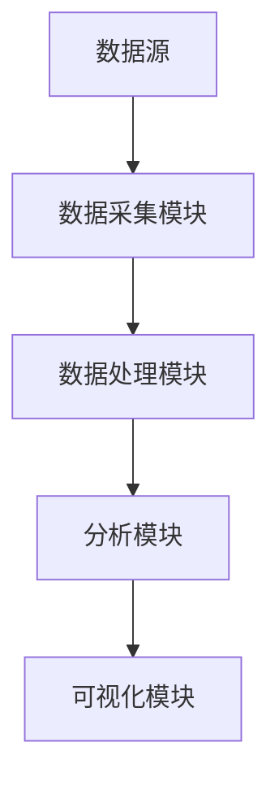

                 


# 格雷厄姆的工作资本分析方法

## 关键词：格雷厄姆，工作资本分析，投资分析，企业价值评估，现金流预测，资产质量指数

## 摘要：  
格雷厄姆的工作资本分析方法是价值投资领域的重要工具，用于评估企业的内在价值。本文通过详细解析工作资本的核心概念、数学模型、系统架构设计以及项目实战，帮助读者掌握这一经典分析方法。从基础理论到实际应用，文章内容丰富，结构清晰，适合投资分析从业者和对价值投资感兴趣的学习者阅读。

---

# 第一部分: 工作资本分析的核心概念

## 第1章: 工作资本分析的背景与意义

### 1.1 企业价值评估的基本问题

#### 1.1.1 企业价值评估的核心挑战
企业价值评估的核心挑战在于如何准确衡量企业的内在价值。投资者需要通过分析企业的财务状况、盈利能力以及市场地位来判断其投资价值。

#### 1.1.2 工作资本在企业价值中的作用
工作资本是企业运营的核心资源，直接影响企业的偿债能力和盈利能力。通过分析工作资本，投资者可以评估企业的财务健康状况和经营效率。

#### 1.1.3 格雷厄姆投资理念的核心思想
格雷厄姆的投资理念强调安全边际和价值投资。他认为，投资者应以低于内在价值的价格买入优质资产。工作资本分析是实现这一理念的重要工具。

---

## 第2章: 工作资本分析的数学模型与公式

### 2.1 工作资本的核心公式

#### 2.1.1 工作资本计算公式
工作资本是流动资产减去流动负债，公式如下：
$$\text{工作资本} = \text{流动资产} - \text{流动负债}$$

#### 2.1.2 核心资产质量评估公式
资产质量指数用于衡量核心资产的质量，公式如下：
$$\text{资产质量指数} = \frac{\text{核心资产}}{\text{总资产}}$$

---

### 2.2 现金流分析的数学模型

#### 2.2.1 现金流预测公式
现金流预测是工作资本分析的重要组成部分，公式如下：
$$\text{现金流} = \text{营业收入} - \text{运营成本} - \text{税费}$$

#### 2.2.2 现金流与工作资本的关系
现金流净额是企业运营的核心指标，公式如下：
$$\text{现金流净额} = \text{营业收入} - \text{运营成本} - \text{税费} - \text{资本支出}$$

---

### 2.3 工作资本分析的统计模型

#### 2.3.1 回归分析模型
回归分析模型用于预测工作资本的变化趋势，公式如下：
$$\text{Y} = \beta_0 + \beta_1X + \epsilon$$

#### 2.3.2 时间序列分析模型
时间序列分析模型用于分析工作资本的历史趋势，公式如下：
$$\text{ARIMA}(p, d, q)$$

---

## 第3章: 工作资本分析的系统架构设计

### 3.1 系统功能模块设计

#### 3.1.1 数据采集模块
数据采集模块负责从财务报表中提取相关数据，包括流动资产、流动负债等。

#### 3.1.2 数据处理模块
数据处理模块对采集到的数据进行清洗和转换，确保数据的准确性和一致性。

#### 3.1.3 分析模块
分析模块基于数学模型对数据进行计算，生成工作资本分析结果。

#### 3.1.4 可视化模块
可视化模块将分析结果以图表形式展示，便于用户理解和决策。

---

### 3.2 系统架构图



---

### 3.3 系统接口设计

#### 3.3.1 数据接口
数据接口用于与外部数据源（如财务报表）进行交互。

#### 3.3.2 分析接口
分析接口用于调用数学模型进行工作资本计算。

#### 3.3.3 可视化接口
可视化接口用于将分析结果展示为图表。

---

## 第4章: 工作资本分析的项目实战

### 4.1 项目环境安装

#### 4.1.1 Python环境配置
安装Python和必要的库，如Pandas、Matplotlib等。

#### 4.1.2 数据分析工具安装
安装Jupyter Notebook或其他数据分析工具。

#### 4.1.3 开发环境配置
配置开发环境，确保所有库和工具正常运行。

---

### 4.2 核心代码实现

#### 4.2.1 数据读取与处理
```python
import pandas as pd

# 读取财务数据
df = pd.read_csv('financial_data.csv')

# 数据清洗
df.dropna(inplace=True)
df['流动资产'] = df['流动资产'].astype('float')
df['流动负债'] = df['流动负债'].astype('float')

# 计算工作资本
df['工作资本'] = df['流动资产'] - df['流动负债']
```

#### 4.2.2 现金流预测
```python
import numpy as np

# 计算现金流
df['现金流'] = df['营业收入'] - df['运营成本'] - df['税费']

# 时间序列预测
from statsmodels.tsa.arima_model import ARIMA

model = ARIMA(df['现金流'], order=(1, 1, 1))
model_fit = model.fit()
```

---

### 4.3 实际案例分析

#### 4.3.1 案例背景
以某制造公司为例，分析其工作资本状况。

#### 4.3.2 数据分析与结果展示
```python
import matplotlib.pyplot as plt

# 绘制工作资本趋势图
plt.figure(figsize=(10, 6))
plt.plot(df['日期'], df['工作资本'], label='工作资本')
plt.title('工作资本趋势图')
plt.xlabel('日期')
plt.ylabel('工作资本（万元）')
plt.legend()
plt.show()
```

---

## 第5章: 总结与展望

### 5.1 总结
格雷厄姆的工作资本分析方法是价值投资的重要工具。通过分析工作资本，投资者可以准确评估企业的内在价值，做出明智的投资决策。

### 5.2 未来展望
随着人工智能和大数据技术的发展，工作资本分析将更加智能化和精准化。未来的研究可以结合机器学习算法，进一步提升分析的效率和准确性。

---

## 作者：AI天才研究院/AI Genius Institute & 禅与计算机程序设计艺术 /Zen And The Art of Computer Programming

