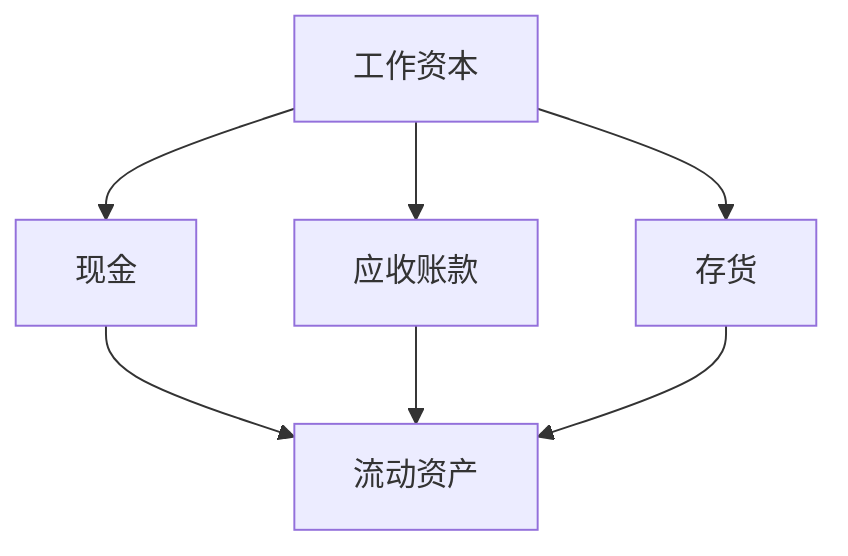
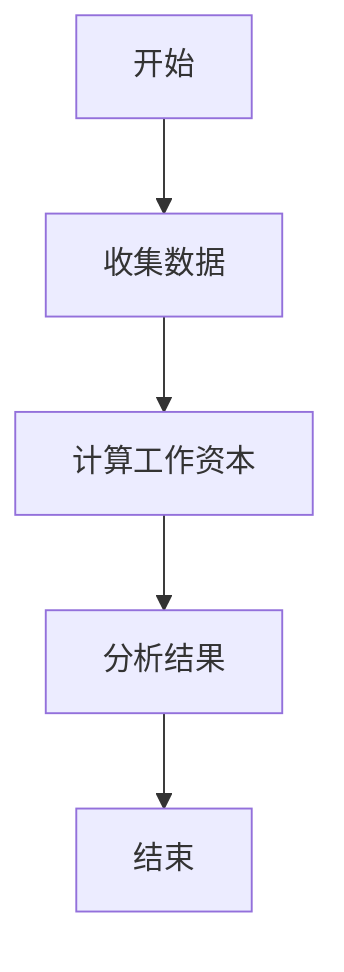
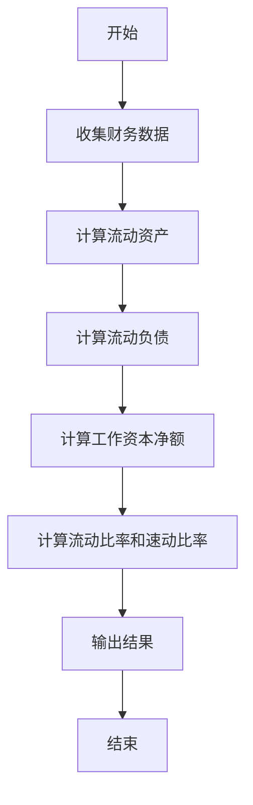
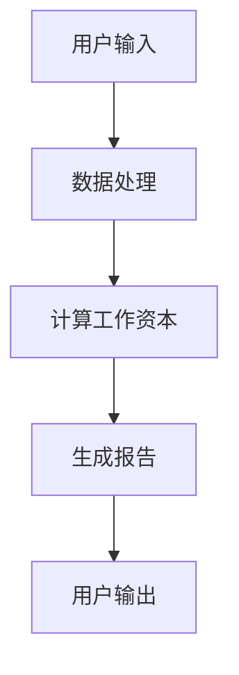
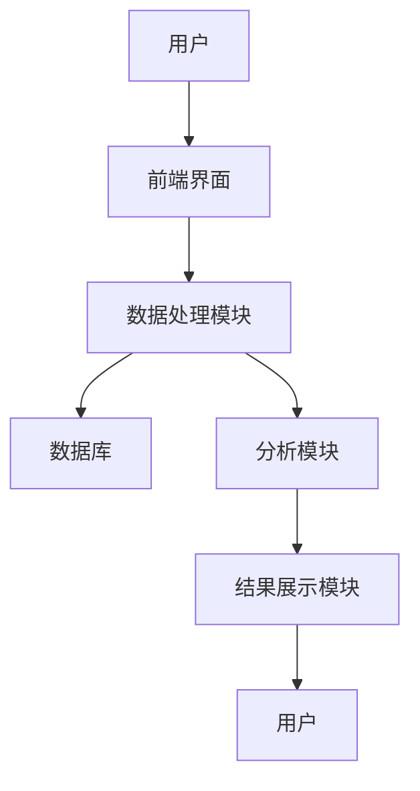
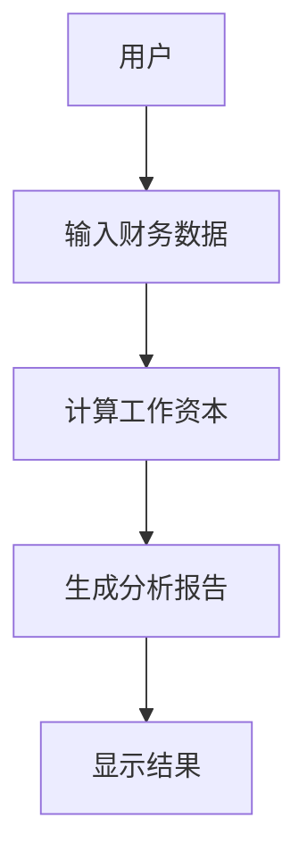

                 


# 格雷厄姆的工作资本分析：评估公司短期健康

## 关键词：工作资本分析，格雷厄姆，价值投资，短期财务健康，投资决策

## 摘要：  
格雷厄姆的工作资本分析是一种经典且实用的财务分析方法，旨在评估公司的短期财务健康状况，帮助投资者做出明智的投资决策。本文将从工作资本分析的背景、核心概念、算法原理、系统架构、项目实战和最佳实践等方面，全面解析如何通过工作资本分析评估公司短期健康。通过本文，读者将深入了解格雷厄姆的工作资本分析方法，并能够将其应用于实际投资决策中。

---

# 第1章: 工作资本分析的背景介绍

## 1.1 工作资本分析的起源与发展

### 1.1.1 工作资本分析的定义  
工作资本（Working Capital），也称为营运资本，是指企业在日常经营活动中可以快速转化为现金的资产，主要包括现金、应收账款、存货等流动资产。工作资本分析的核心目标是评估企业的短期偿债能力和流动性。

### 1.1.2 格雷厄姆的贡献与工作资本分析的核心思想  
本杰明·格雷厄姆（Benjamin Graham）是价值投资的鼻祖，他提出的工作资本分析方法是其投资理论的重要组成部分。格雷厄姆认为，工作资本是衡量企业短期财务健康的关键指标，能够反映企业的流动性和偿债能力。他的核心思想是：企业的短期健康状况直接关系到其生存能力和投资价值。

### 1.1.3 工作资本分析在投资决策中的重要性  
在投资决策中，工作资本分析能够帮助投资者评估企业的短期偿债能力，从而判断企业是否具备安全边际。通过分析工作资本，投资者可以更好地识别那些财务健康、具备长期发展潜力的企业。

---

## 1.2 格雷厄姆的价值投资理论

### 1.2.1 价值投资的核心理念  
价值投资的核心理念是寻找那些市场价格低于其内在价值的股票。格雷厄姆认为，内在价值可以通过对企业财务状况的深入分析来估算，而工作资本分析是其中的重要环节。

### 1.2.2 工作资本分析在价值投资中的地位  
工作资本分析是格雷厄姆价值投资理论的重要组成部分。通过分析企业的流动资产、流动负债及其差额，投资者可以评估企业的短期偿债能力和财务健康状况。

### 1.2.3 格雷厄姆的投资策略与工作资本分析的关系  
格雷厄姆的投资策略强调安全边际和风险控制。工作资本分析帮助他在投资决策中识别那些具备充足流动资产、能够应对短期债务的企业，从而降低投资风险。

---

## 1.3 工作资本分析的应用场景

### 1.3.1 企业短期财务健康评估  
工作资本分析能够帮助企业评估自身的短期财务状况，识别潜在的财务风险。

### 1.3.2 投资决策中的应用  
投资者可以通过工作资本分析筛选出具备短期偿债能力、财务健康的企业，从而做出更明智的投资决策。

### 1.3.3 行业分析与公司比较  
工作资本分析还可以用于行业分析和公司比较，帮助投资者识别行业趋势和潜在的投资机会。

---

# 第2章: 工作资本分析的核心概念与联系

## 2.1 工作资本的定义与组成部分

### 2.1.1 工作资本的定义  
工作资本是指企业在日常经营活动中能够快速转化为现金的资产，主要包括现金、应收账款、存货等流动资产。

### 2.1.2 工作资本的组成部分  
工作资本的主要组成部分包括：  
1. **现金**：企业的现金及现金等价物。  
2. **应收账款**：企业因赊销而产生的应收款。  
3. **存货**：企业尚未售出的原材料、在制品和产成品。  
4. **预付款项**：企业为购买商品或服务而支付的预付款。  

### 2.1.3 工作资本与非工作资本的区别  
非工作资本主要包括长期资产（如固定资产、无形资产等），这些资产流动性较低，难以快速变现。

---

## 2.2 工作资本分析的核心原理

### 2.2.1 工作资本与流动资产的关系  
工作资本是流动资产的一部分，流动资产还包括其他短期资产，如短期投资、应收票据等。

### 2.2.2 工作资本的流动性与变现能力  
工作资本的流动性决定了其变现能力。流动性越强的资产，变现能力越强，企业的短期偿债能力也越强。

### 2.2.3 工作资本与企业偿债能力的联系  
工作资本净额（即流动资产减去流动负债）是衡量企业短期偿债能力的重要指标。当工作资本净额为正时，企业具备较强的短期偿债能力。

---

## 2.3 工作资本分析的ER实体关系图



---

## 2.4 工作资本分析的流程图



---

# 第3章: 工作资本分析的算法与数学模型

## 3.1 工作资本分析的数学模型

### 3.1.1 工作资本净额计算公式  
$$工作资本净额 = 流动资产 - 流动负债$$

### 3.1.2 流动比率计算公式  
$$流动比率 = 流动资产 / 流动负债$$

### 3.1.3 速动比率计算公式  
$$速动比率 = (流动资产 - 存货) / 流动负债$$

---

## 3.2 工作资本分析的算法实现

### 3.2.1 算法流程  


### 3.2.2 Python实现  
```python
def calculate_working_capital(current_assets, current_liabilities):
    working_capital = current_assets - current_liabilities
    current_ratio = current_assets / current_liabilities
    quick_ratio = (current_assets - inventory) / current_liabilities
    return working_capital, current_ratio, quick_ratio
```

---

# 第4章: 工作资本分析的系统架构设计

## 4.1 系统功能设计

### 4.1.1 功能模块  
- 数据输入模块：收集企业的财务数据。  
- 数据处理模块：计算工作资本净额、流动比率和速动比率。  
- 结果展示模块：以图表形式展示分析结果。  

### 4.1.2 功能流程  


---

## 4.2 系统架构设计

### 4.2.1 系统架构图  


---

## 4.3 系统接口设计

### 4.3.1 数据输入接口  
```python
# 示例接口
def input_financial_data(current_assets, current_liabilities, inventory):
    return current_assets, current_liabilities, inventory
```

### 4.3.2 数据输出接口  
```python
# 示例接口
def output_results(working_capital, current_ratio, quick_ratio):
    print(f"工作资本净额：{working_capital}")
    print(f"流动比率：{current_ratio}")
    print(f"速动比率：{quick_ratio}")
```

---

## 4.4 系统交互流程图



---

# 第5章: 工作资本分析的项目实战

## 5.1 项目背景

### 5.1.1 项目目标  
通过工作资本分析评估一家企业的短期财务健康状况，为投资决策提供数据支持。

### 5.1.2 数据来源  
使用企业的财务报表数据，包括流动资产、流动负债和存货。

---

## 5.2 项目实现

### 5.2.1 环境安装  
安装必要的Python库，如Pandas、Matplotlib等。

### 5.2.2 核心代码实现  
```python
import pandas as pd
import matplotlib.pyplot as plt

def calculate_working_capital(current_assets, current_liabilities, inventory):
    working_capital = current_assets - current_liabilities
    current_ratio = current_assets / current_liabilities
    quick_ratio = (current_assets - inventory) / current_liabilities
    return working_capital, current_ratio, quick_ratio

# 示例数据
current_assets = 500000
current_liabilities = 300000
inventory = 100000

# 计算结果
working_capital, current_ratio, quick_ratio = calculate_working_capital(current_assets, current_liabilities, inventory)

# 可视化结果
data = {'指标': ['工作资本净额', '流动比率', '速动比率'], 
        '数值': [working_capital, current_ratio, quick_ratio]}
df = pd.DataFrame(data)
df.plot(kind='bar', x='指标', y='数值')
plt.title('工作资本分析结果')
plt.show()
```

---

## 5.3 案例分析

### 5.3.1 案例背景  
假设某企业流动资产为50万元，流动负债为30万元，存货为10万元。

### 5.3.2 分析过程  
1. 计算工作资本净额：50 - 30 = 20万元。  
2. 计算流动比率：50 / 30 ≈ 1.67。  
3. 计算速动比率：(50 - 10) / 30 ≈ 1.33。  

### 5.3.3 结果解读  
- 工作资本净额为正，说明企业具备短期偿债能力。  
- 流动比率和速动比率均大于1，说明企业的流动资产能够覆盖流动负债。  

---

## 5.4 项目小结

通过本项目，我们成功地将工作资本分析应用于实际案例中，验证了其在评估企业短期财务健康中的有效性。

---

# 第6章: 工作资本分析的最佳实践与注意事项

## 6.1 最佳实践

### 6.1.1 定期更新财务数据  
工作资本分析需要基于最新的财务数据进行，因此建议定期更新数据。

### 6.1.2 结合其他财务指标  
工作资本分析应与其他财务指标（如净利润率、ROE等）结合使用，以全面评估企业的财务状况。

### 6.1.3 考虑行业特点  
不同行业的企业具有不同的工作资本需求，因此在分析时需要考虑行业特点。

---

## 6.2 注意事项

### 6.2.1 数据的准确性和完整性  
确保输入的财务数据准确且完整，否则会影响分析结果。

### 6.2.2 分析结果的局限性  
工作资本分析仅能评估企业的短期财务健康，不能全面反映企业的长期发展潜力。

### 6.2.3 风险控制  
投资者应结合其他分析方法，制定全面的风险控制策略。

---

# 第7章: 小结

## 7.1 核心内容回顾  
本文详细介绍了格雷厄姆的工作资本分析方法，包括其背景、核心概念、算法原理、系统架构和项目实战等内容。

## 7.2 投资者的启示  
通过工作资本分析，投资者可以更好地评估企业的短期财务健康状况，从而做出更明智的投资决策。

## 7.3 未来展望  
工作资本分析作为价值投资的重要工具，未来仍将在投资决策中发挥重要作用。

---

# 作者：AI天才研究院 & 禅与计算机程序设计艺术

