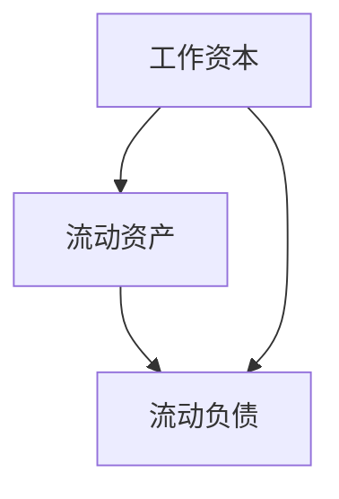

                 


# 格雷厄姆的工作资本分析：适应轻资产商业模式

> 关键词：格雷厄姆，工作资本分析，轻资产模式，商业模式，价值投资，系统架构，Python实现

> 摘要：本文从格雷厄姆的价值投资理论出发，深入探讨工作资本分析的核心概念、数学模型、算法实现及其在轻资产商业模式中的应用。通过系统架构设计、项目实战和最佳实践，详细阐述如何将格雷厄姆的工作资本分析方法应用于现代商业环境，为读者提供理论与实践相结合的指导。

---

## 第一部分：工作资本分析的背景与基础

### 第1章：工作资本分析的起源与发展

#### 1.1 工作资本分析的起源
工作资本分析是价值投资的重要工具，由本杰明·格雷厄姆在20世纪初提出。其核心思想是通过分析企业的流动资产与流动负债之间的关系，评估企业的短期偿债能力和财务健康状况。

#### 1.2 格雷厄姆对工作资本分析的贡献
格雷厄姆通过其投资理论，将工作资本分析从单纯的财务指标扩展为一种评估企业内在价值的方法。他认为，企业的内在价值远高于其市场价值，而工作资本分析是发现这种价值的重要手段。

#### 1.3 工作资本分析与轻资产模式
随着商业模式的演变，轻资产模式逐渐成为企业发展的主流趋势。格雷厄姆的工作资本分析方法在这种模式下依然具有重要的应用价值，尤其是在评估企业的流动资产和流动负债方面。

---

### 第2章：轻资产商业模式的特点与挑战

#### 2.1 轻资产模式的定义
轻资产模式是指企业通过减少固定资产投资，依赖无形资产（如品牌、技术、数据）和外部资源（如供应商、合作伙伴）进行运营的商业模式。

#### 2.2 轻资产模式的优势与劣势
| 优势 | 劣势 |
|------|------|
| 投资成本低 | 资产流动性差 |
| 灵活性高 | 财务风险高 |
| 依赖外部资源 | 核心竞争力弱 |

#### 2.3 轻资产模式与工作资本分析的结合
轻资产模式下，企业的流动资产和流动负债占比更高，因此工作资本分析在评估企业短期偿债能力和财务健康状况方面显得尤为重要。

---

## 第二部分：工作资本分析的核心概念与数学模型

### 第3章：工作资本分析的核心概念

#### 3.1 核心概念的定义与对比
| 概念 | 定义 | 关系 |
|------|------|------|
| 流动资产 | 可在一年内变现的资产 | 流动资产 > 流动负债 |
| 流动负债 | 短期内需要偿还的债务 | 流动负债 < 流动资产 |
| 工作资本 | 流动资产减去流动负债 | 工作资本 = 流动资产 - 流动负债 |

#### 3.2 工作资本分析的ER实体关系图


---

### 第4章：工作资本分析的数学模型与公式

#### 4.1 核心公式
$$ \text{工作资本} = \text{流动资产} - \text{流动负债} $$

#### 4.2 应用场景与举例
假设某企业流动资产为100万元，流动负债为60万元，则其工作资本为：
$$ \text{工作资本} = 100 - 60 = 40 \text{万元} $$

---

## 第三部分：工作资本分析的系统架构与实现

### 第5章：系统架构设计

#### 5.1 系统功能模块
| 模块 | 功能描述 |
|------|----------|
| 数据采集 | 从企业财务报表中提取流动资产和流动负债数据 |
| 数据分析 | 计算工作资本，并生成可视化报告 |
| 结果展示 | 显示工作资本分析结果，并提供投资建议 |

#### 5.2 系统架构图


---

### 第6章：工作资本分析的项目实战

#### 6.1 环境安装与数据准备
```bash
pip install pandas matplotlib numpy
```

#### 6.2 核心代码实现
```python
def calculate_working_capital(current_assets, current_liabilities):
    return current_assets - current_liabilities

# 示例数据
current_assets = 1000000  # 流动资产（元）
current_liabilities = 600000  # 流动负债（元）
working_capital = calculate_working_capital(current_assets, current_liabilities)
print(f"工作资本：{working_capital} 元")
```

---

## 第四部分：工作资本分析的优化与未来展望

### 第7章：最佳实践与小结

#### 7.1 最佳实践
- 定期更新财务数据，确保分析结果的准确性。
- 结合其他财务指标（如净利润率、ROE）进行综合评估。

#### 7.2 小结
格雷厄姆的工作资本分析方法在现代商业环境中依然具有重要的应用价值。通过系统化的分析和实践，企业可以更好地评估自身的财务健康状况，并制定科学的投资决策。

---

## 作者：AI天才研究院/AI Genius Institute & 禅与计算机程序设计艺术/Zen And The Art of Computer Programming

