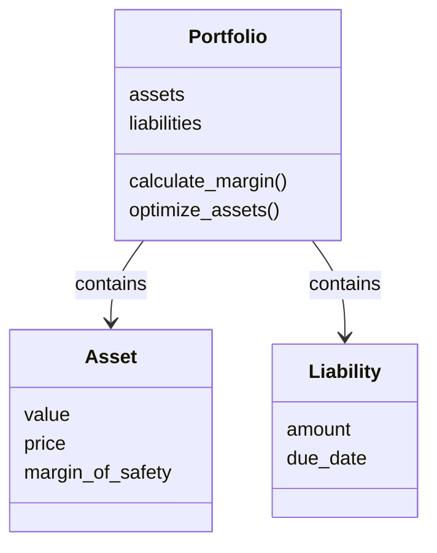
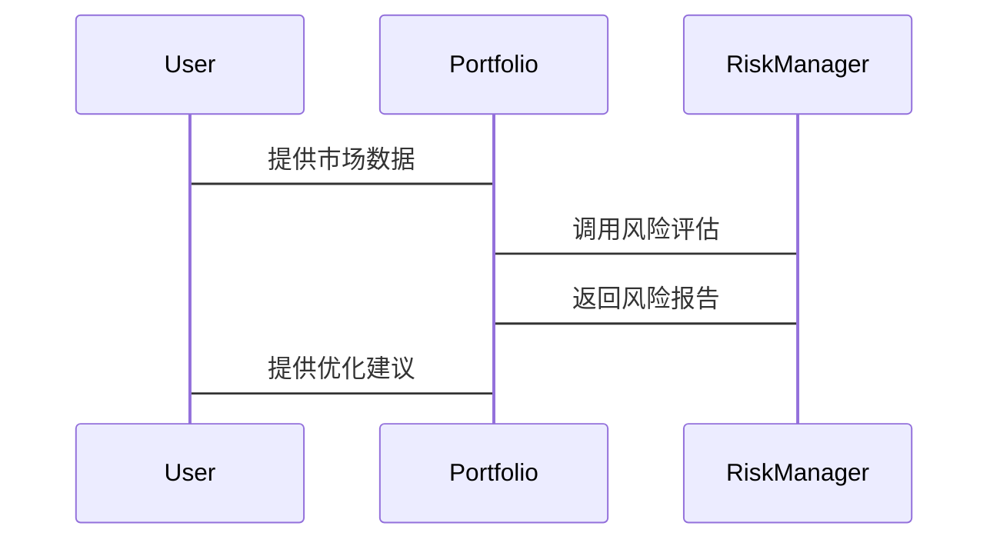

                 


# 格雷厄姆的工作资本策略：关注流动性

---

## 关键词：
- 格雷厄姆
- 工作资本策略
- 流动性管理
- 价值投资
- 安全边际
- 数字化流动性
- 金融风险管理

---

## 摘要：
本文深入探讨了本杰明·格雷厄姆的工作资本策略，重点分析其在流动性管理中的应用。通过结合现代金融理论与技术手段，详细阐述了流动性风险的定义、衡量指标及管理策略。文章还介绍了基于格雷厄姆理论的算法模型，结合实际案例，展示了如何通过技术手段优化流动性管理。最后，本文总结了工作资本策略的现代发展及其在数字化环境下的应用前景。

---

# 第一部分: 格雷厄姆工作资本策略的背景与基础

## 第1章: 工作资本策略的基本概念

### 1.1 工作资本策略的定义与核心要素

#### 1.1.1 什么是工作资本策略
工作资本策略是指企业在运营过程中，通过优化资本结构和管理流动性来实现稳健经营的策略。其核心在于平衡短期流动性与长期资本回报。

#### 1.1.2 工作资本策略的核心要素
- **流动性管理**：确保企业资金链的稳健。
- **资本结构优化**：合理配置债务与股权资本。
- **风险管理**：防范流动性风险和资本运作风险。

#### 1.1.3 工作资本与流动性的关系
流动性是工作资本策略的生命线，确保企业在经营活动中能够灵活应对资金需求。

---

### 1.2 流动性在工作资本策略中的重要性

#### 1.2.1 流动性的基本概念
流动性指资产转化为现金的能力，是衡量企业财务健康的重要指标。

#### 1.2.2 流动性与企业运营的关系
流动性管理直接关系到企业的日常运营、偿债能力和市场应对能力。

#### 1.2.3 流动性管理的目标
- **维持短期偿债能力**：确保企业能够偿还短期债务。
- **支持业务扩展**：为企业提供资金支持。
- **降低财务风险**：防范流动性危机。

---

## 第2章: 格雷厄姆的投资理论基础

### 2.1 格雷厄姆的价值投资理念

#### 2.1.1 价值投资的核心思想
格雷厄姆主张以低于内在价值的价格买入优质资产，长期持有，等待市场的理性回归。

#### 2.1.2 格雷厄姆的"安全边际"概念
"安全边际"是指实际价值与市场价格之间的差距，确保投资的安全性和收益性。

#### 2.1.3 投资中的"margin of safety"原则
通过安全边际，降低投资风险，提高投资的可预测性。

---

### 2.2 格雷厄姆的工作资本策略

#### 2.2.1 工作资本策略的起源
格雷厄姆通过研究市场波动性和资产流动性，提出了工作资本策略。

#### 2.2.2 格雷厄姆对流动性管理的贡献
他强调了流动性在投资组合管理中的重要性，并提出了基于流动性的投资策略。

#### 2.2.3 工作资本策略的核心原则
- **稳健性**：优先选择流动性高、风险可控的资产。
- **长期性**：注重长期收益，而非短期波动。
- **安全性**：确保投资本金的安全性。

---

## 第3章: 工作资本策略的现代发展

### 3.1 现代金融理论与工作资本策略

#### 3.1.1 现代投资组合理论与工作资本策略的关系
现代投资组合理论强调分散化，与格雷厄姆的工作资本策略在风险控制方面有相似之处。

#### 3.1.2 资本资产定价模型（CAPM）与工作资本策略
CAPM提供了一种评估资产回报的方法，与工作资本策略中的流动性管理相辅相成。

#### 3.1.3 风险管理在工作资本策略中的应用
通过量化风险，优化资本分配，提升流动性管理效率。

---

### 3.2 数字化时代的工作资本策略

#### 3.2.1 信息技术对工作资本策略的影响
信息技术提高了流动性管理的实时性和准确性。

#### 3.2.2 数据驱动的流动性管理
利用大数据分析，优化流动性预测和决策。

#### 3.2.3 人工智能在工作资本策略中的应用
AI技术能够实时监控市场变化，优化资产配置。

---

# 第二部分: 工作资本策略的核心概念与联系

## 第4章: 流动性管理的核心原理

### 4.1 流动性风险的定义与特征

#### 4.1.1 什么是流动性风险
流动性风险是指资产无法及时变现或以合理价格出售的风险。

#### 4.1.2 流动性风险的来源
- 市场波动
- 资金链断裂
- 资产贬值

#### 4.1.3 流动性风险的衡量指标
- **流动比率**：流动资产/流动负债
- **速动比率**：（流动资产-存货）/流动负债

---

### 4.2 工作资本策略中的流动性管理

#### 4.2.1 流动性管理的目标
- 维持短期偿债能力
- 支持业务扩展
- 降低财务风险

#### 4.2.2 流动性管理的工具与方法
- 现金储备
- 短期投资
- 应收账款管理

#### 4.2.3 流动性管理的策略选择
- **保守策略**：优先保留高流动性资产
- **积极策略**：适度配置低流动性资产，追求更高收益

---

## 第5章: 格雷厄姆工作资本策略的算法实现

### 5.1 算法原理讲解

#### 5.1.1 算法概述
基于格雷厄姆的工作资本策略，我们设计了一个流动性管理算法，用于优化资产配置。

#### 5.1.2 算法步骤
1. **数据收集**：收集市场数据和企业财务数据。
2. **流动性评估**：计算各项流动性指标。
3. **资产配置**：根据流动性评估结果，优化资产配置。
4. **风险控制**：设置安全边际，降低流动性风险。

#### 5.1.3 算法实现的代码示例

```python
def calculate_margin_of_safety(value, price):
    return value - price

def optimize_assets(assets, liabilities):
   流动比率 = assets / liabilities
    if流动比率 < 1:
        return "增加流动性资产"
    else:
        return "保持当前资产配置"
```

---

## 第6章: 系统分析与架构设计方案

### 6.1 系统功能设计

#### 6.1.1 领域模型（Mermaid 类图）


---

### 6.2 系统架构设计

#### 6.2.1 系统架构图
```mermaid
graph TD
    Portfolio -> AssetManager: manage assets
    Portfolio -> LiabilityManager: manage liabilities
    Portfolio -> RiskManager: calculate risk
    Portfolio -> MarginCalculator: calculate margin of safety
```

---

### 6.3 接口设计与交互

#### 6.3.1 系统接口设计
- **输入接口**：接收市场数据和企业财务数据。
- **输出接口**：提供流动性评估结果和资产优化建议。

#### 6.3.2 交互流程（Mermaid 序列图）


---

# 第三部分: 项目实战

## 第7章: 环境安装与核心代码实现

### 7.1 环境安装
- 安装Python和必要的库（如Pandas、NumPy）。
- 配置开发环境（如Jupyter Notebook）。

### 7.2 核心代码实现

#### 7.2.1 流动性评估代码
```python
import pandas as pd

def calculate流动性比率(assets, liabilities):
    return assets / liabilities

data = pd.read_csv("financial_data.csv")
流动比率 = calculate流动性比率(data['流动资产'], data['流动负债'])
print(流动比率)
```

#### 7.2.2 资产优化代码
```python
def optimize_assets(assets, liabilities):
    流动比率 = assets / liabilities
    if流动比率 < 1:
        return "增加流动性资产"
    else:
        return "保持当前资产配置"

优化建议 = optimize_assets(data['流动资产'], data['流动负债'])
print(优化建议)
```

---

## 第8章: 案例分析与代码解读

### 8.1 案例分析

#### 8.1.1 案例背景
某企业在2023年面临流动性不足的问题，流动比率低于1。

#### 8.1.2 应用算法
通过算法计算出需要增加20%的流动性资产。

#### 8.1.3 实施效果
流动比率提升至1.5，企业财务状况改善。

---

## 第9章: 项目小结

### 9.1 最佳实践
- 定期评估流动性风险。
- 根据市场变化动态调整资产配置。
- 结合安全边际，降低投资风险。

### 9.2 注意事项
- 确保数据的准确性和及时性。
- 合理设置安全边际，避免过度保守或冒险。

### 9.3 拓展阅读
- 格雷厄姆的《证券分析》
- 现代投资组合理论相关书籍

---

# 第四部分: 结语

## 10章: 小结与展望

### 10.1 核心观点回顾
格雷厄姆的工作资本策略强调流动性管理，通过优化资产配置和风险管理，实现稳健投资。

### 10.2 未来展望
随着数字化和人工智能的发展，工作资本策略将在金融领域发挥更大作用。

---

# 作者：
**AI天才研究院/AI Genius Institute**  
**禅与计算机程序设计艺术/Zen And The Art of Computer Programming**

