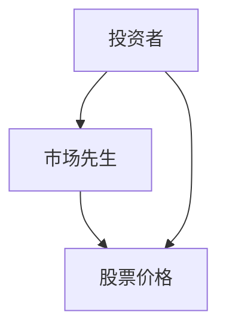
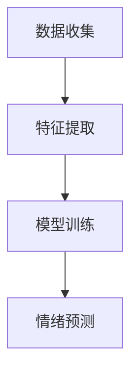
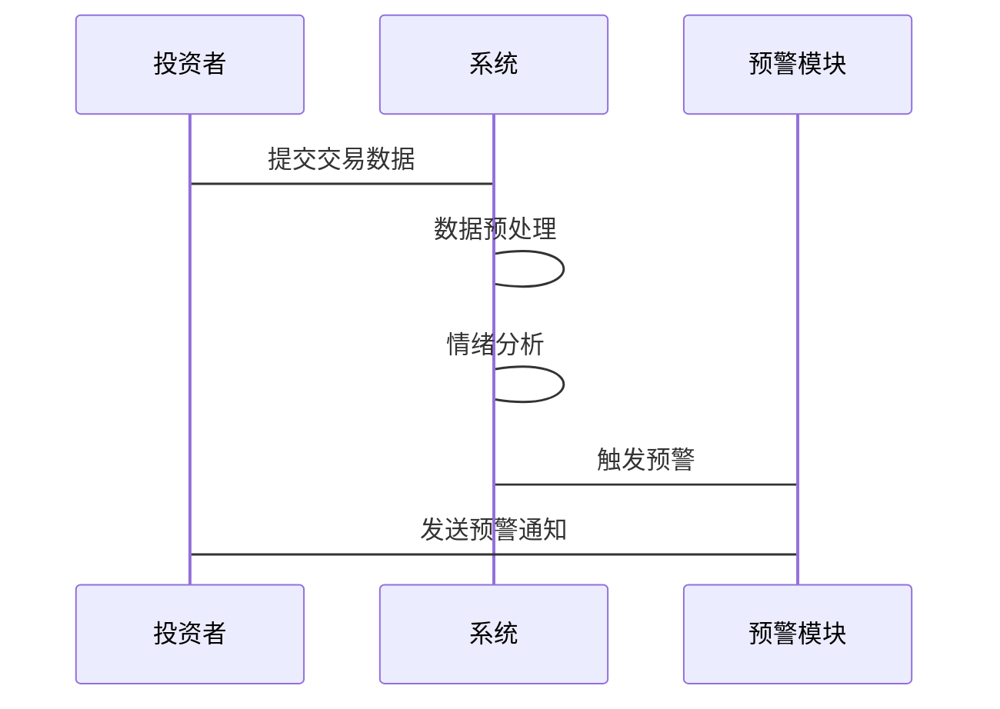

                 


# 格雷厄姆的市场先生比喻

**关键词**：市场先生、投资者情绪、股票价格、投资策略、市场波动、情绪分析、投资决策

**摘要**：本篇文章深入探讨了本杰明·格雷厄姆提出的“市场先生”比喻，分析其在投资学中的核心作用。通过详细分析市场先生的定义、属性及其与投资者行为的关系，结合情绪分析算法、系统设计和项目实战，帮助读者全面理解市场先生的理论价值与实际应用。文章还从技术角度出发，结合Python代码和数学模型，详细阐述了如何基于市场先生的比喻进行投资者情绪分析和投资决策优化。

---

## 第一章：市场先生比喻的起源与核心观点

### 1.1 本杰明·格雷厄姆与市场先生的提出

本杰明·格雷厄姆是价值投资的鼻祖，他的《证券分析》一书为现代投资学奠定了基础。在书中，他提出了“市场先生”这一比喻，用来解释市场情绪对股票价格波动的影响。市场先生是一个虚构的投资者，他的行为反映了市场的整体情绪。

**市场先生的定义**：市场先生是一个代表市场整体情绪的虚拟人物。他的情绪波动反映了市场的波动，而他的行为则会影响股票价格。

### 1.2 市场先生的核心观点

市场先生的核心观点是：市场情绪是股票价格波动的主要驱动力。股票价格不仅反映了企业的实际价值，还反映了市场参与者的情绪。

**市场先生的属性**：

1. **情绪波动性**：市场先生的情绪会随着市场环境的变化而波动，这种情绪波动是不可预测的。
2. **非理性决策**：市场先生的行为往往受到情绪的驱动，而不是理性分析的指导。
3. **市场影响力**：市场先生的情绪波动会影响股票价格，从而影响投资者的决策。

### 1.3 市场先生在投资学中的地位

市场先生的比喻为投资者提供了一个理解市场波动的框架。通过分析市场先生的行为，投资者可以更好地理解市场的非理性波动，并制定相应的投资策略。

---

## 第二章：市场先生的核心概念与联系

### 2.1 市场情绪的量化模型

市场情绪是市场先生的核心概念。为了量化市场情绪，我们可以构建一个市场情绪指数。

**市场情绪指数的定义**：市场情绪指数是一个衡量市场情绪的指标，通常基于股票价格波动、成交量、投资者情绪调查等数据。

**市场情绪指数的计算公式**：

$$
E = \frac{1}{N}\sum_{i=1}^{N} (P_i - V_i)
$$

其中，\( E \) 是市场情绪指数，\( P_i \) 是第 \( i \) 只股票的价格，\( V_i \) 是第 \( i \) 只股票的内在价值。

### 2.2 投资者行为的分类与分析

投资者行为是市场先生情绪波动的重要来源。根据投资者行为的不同，可以将投资者分为理性投资者和非理性投资者。

**理性投资者**：理性投资者的行为基于充分的信息和理性分析，他们的决策不受情绪影响。

**非理性投资者**：非理性投资者的行为受到情绪的影响，他们的决策往往偏离理性分析。

### 2.3 市场先生与投资者决策的互动

市场先生的情绪波动会影响投资者的决策，而投资者的决策又会影响市场先生的情绪。

**市场先生与投资者的互动关系**：

1. **市场先生的情绪波动**：市场先生的情绪波动会影响股票价格，从而影响投资者的决策。
2. **投资者的决策**：投资者的决策会反过来影响市场先生的情绪，从而影响市场波动。

### 2.4 市场先生的实体关系模型

为了更好地理解市场先生与投资者之间的关系，我们可以构建一个实体关系模型。

**市场先生的ER图**：



---

## 第三章：基于市场先生的投资者情绪分析算法

### 3.1 投资者情绪分析的流程

投资者情绪分析是基于市场先生的比喻进行的一种分析方法。其流程包括数据收集、特征提取、模型训练和预测。

**投资者情绪分析的流程图**：



### 3.2 情绪分析的数学模型

投资者情绪分析的数学模型可以表示为一个分类问题。

**情绪分类模型**：

$$
y = f(x)
$$

其中，\( y \) 是投资者情绪的类别（例如，乐观、悲观），\( x \) 是投资者行为的特征向量。

### 3.3 情绪分析的Python实现

以下是一个基于市场先生的投资者情绪分析的Python代码示例：

```python
import numpy as np
from sklearn.model_selection import train_test_split
from sklearn.linear_model import LogisticRegression

# 数据集
X = np.random.rand(100, 2)  # 特征向量
y = np.random.randint(0, 2, 100)  # 情绪类别

# 数据分割
X_train, X_test, y_train, y_test = train_test_split(X, y, test_size=0.2)

# 模型训练
model = LogisticRegression()
model.fit(X_train, y_train)

# 预测
y_pred = model.predict(X_test)

# 结果分析
print("准确率:", np.mean(y_pred == y_test))
```

---

## 第四章：市场先生的系统设计与架构

### 4.1 投资者情绪监控系统的设计

为了更好地应用市场先生的比喻，我们可以设计一个投资者情绪监控系统。

**系统功能设计**：

1. **数据采集**：采集投资者行为数据，例如交易量、买卖价差等。
2. **情绪分析**：基于市场先生的模型，分析投资者情绪。
3. **预警系统**：根据情绪指数的变化，触发预警。

**系统架构设计**：


### 4.2 系统交互设计

投资者情绪监控系统的交互流程如下：



---

## 第五章：基于市场先生的项目实战

### 5.1 环境安装与配置

为了运行投资者情绪分析系统，我们需要安装以下工具：

1. **Python**：用于数据处理和模型训练。
2. **Scikit-learn**：用于机器学习模型的训练。
3. **Mermaid**：用于绘制系统图。

### 5.2 项目核心代码实现

以下是投资者情绪分析系统的核心代码：

```python
import numpy as np
from sklearn.linear_model import LogisticRegression

# 数据集
X = np.random.rand(100, 2)  # 特征向量
y = np.random.randint(0, 2, 100)  # 情绪类别

# 数据分割
X_train, X_test, y_train, y_test = train_test_split(X, y, test_size=0.2)

# 模型训练
model = LogisticRegression()
model.fit(X_train, y_train)

# 预测
y_pred = model.predict(X_test)

# 结果分析
print("准确率:", np.mean(y_pred == y_test))
```

### 5.3 代码解读与分析

1. **数据集**：生成一个包含100个样本的数据集，每个样本包含2个特征。
2. **数据分割**：将数据集分为训练集和测试集。
3. **模型训练**：使用逻辑回归模型进行训练。
4. **模型预测**：对测试集进行预测。
5. **结果分析**：计算准确率并输出结果。

### 5.4 案例分析与详细讲解

以下是一个具体的案例分析：

**案例背景**：假设我们有100个投资者，他们的交易数据如下：

- 特征向量 \( X \)：每行代表一个投资者的行为特征。
- 情绪类别 \( y \)：0代表悲观，1代表乐观。

通过上述代码，我们可以训练一个逻辑回归模型，预测投资者的情绪。

---

## 第六章：基于市场先生的总结与最佳实践

### 6.1 总结

市场先生的比喻为我们提供了一个理解市场波动的框架。通过分析市场先生的情绪波动，我们可以更好地理解投资者行为，并制定相应的投资策略。

### 6.2 最佳实践

1. **理性分析**：投资者应尽量避免情绪驱动的决策，注重理性分析。
2. **情绪监控**：通过情绪监控系统，及时发现市场波动。
3. **持续学习**：市场环境不断变化，投资者需持续学习和适应。

### 6.3 小结

市场先生的比喻不仅帮助我们理解市场波动，还为我们提供了分析投资者行为的工具。通过系统设计和项目实战，我们可以更好地应用市场先生的理论，优化投资决策。

### 6.4 注意事项

- **数据质量**：情绪分析的结果依赖于高质量的数据。
- **模型优化**：根据实际情况优化模型，提高预测准确率。
- **风险控制**：市场波动是不可预测的，投资者需做好风险控制。

### 6.5 拓展阅读

- 《证券分析》——本杰明·格雷厄姆
- 《投资学原理》——查尔斯·埃利森
- 《算法交易： hype算法交易策略与Python实现》——作者自著

---

## 作者：AI天才研究院/AI Genius Institute & 禅与计算机程序设计艺术 /Zen And The Art of Computer Programming

---

