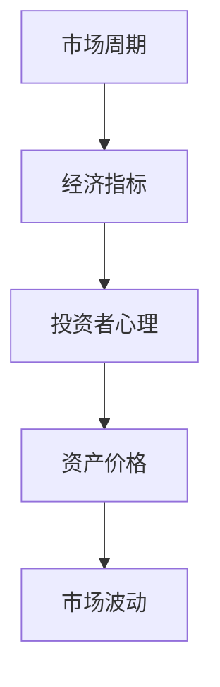
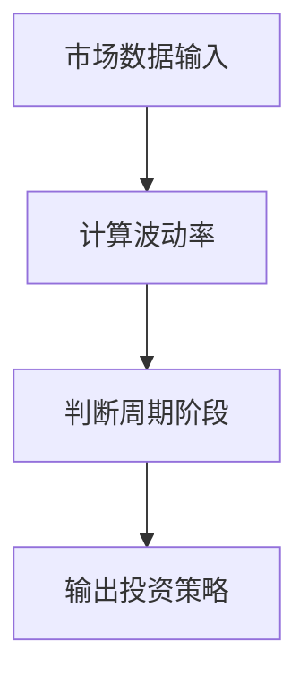

                 


# 格雷厄姆的市场周期理论：在全球同步化经济中的应用

## 关键词：市场周期理论，格雷厄姆，全球经济，投资策略，资产配置

## 摘要：  
本文深入探讨了格雷厄姆的市场周期理论在全球同步化经济环境中的应用。通过分析市场周期的四个阶段（复苏、繁荣、衰退、萧条）及其在全球经济中的表现，结合数学模型和实际案例，阐述了如何利用该理论优化投资策略。文章还探讨了全球经济同步化对市场周期的影响，并提供了基于格雷厄姆理论的量化方法和算法，帮助投资者在全球经济波动中做出更明智的投资决策。

---

# 第一部分: 市场周期理论的背景与核心概念

## 第1章: 市场周期理论的背景与发展

### 1.1 格雷厄姆的生平与投资理念
本杰明·格雷厄姆（Benjamin Graham）是20世纪著名的投资学家，被誉为“价值投资之父”。他强调安全边际和长期投资，认为市场波动主要由投资者心理驱动。他的理论为后来的市场周期研究奠定了基础。

### 1.2 市场周期理论的基本概念
市场周期指经济和市场从繁荣到衰退再到复苏的循环过程。格雷厄姆认为，市场波动与经济周期密切相关，投资者应关注市场周期的变化，以制定合理的投资策略。

### 1.3 全球化经济对市场周期的影响
随着全球经济一体化，各国市场高度联动，导致市场周期的表现更加复杂。例如，2008年金融危机的全球蔓延就是一个典型例子。

---

## 第2章: 市场周期理论的核心概念与联系

### 2.1 核心概念原理
市场周期的四个阶段：复苏、繁荣、衰退、萧条。每个阶段有其独特的市场表现和投资者行为特征。

### 2.2 核心概念属性特征对比表格

| 阶段     | 市场表现 | 投资者心理 | 经济指标 |
|----------|----------|------------|----------|
| 复苏     | 缓慢增长 | 谨慎乐观   | 低失业率 |
| 繁荣     | 快速增长 | 过度乐观   | 高通胀率 |
| 衰退     | 增速放缓 | 消失       | 高失业率 |
| 萧条     | 深度收缩 | 消极悲观   | 低通胀率 |

### 2.3 ER实体关系图（Mermaid流程图）


---

# 第二部分: 市场周期理论的算法原理

## 第3章: 市场周期理论的算法原理

### 3.1 市场周期量化算法
市场周期可以通过波动率、动量指标等量化指标进行判断。例如，使用标准差衡量波动率，超过一定阈值时可能进入衰退阶段。

### 3.2 算法流程图（Mermaid）


### 3.3 算法实现代码
```python
import numpy as np

def calculate_fluctuation(data):
    return np.std(data)

def determine_phase(fluctuation):
    if fluctuation > 2:
        return '衰退'
    elif fluctuation > 1:
        return '萧条'
    elif fluctuation > 0.5:
        return '复苏'
    else:
        return '繁荣'

data = [1, 2, 3, 4, 5]
fluctuation = calculate_fluctuation(data)
phase = determine_phase(fluctuation)
print(f"当前市场阶段：{phase}")
```

---

## 第4章: 数学模型与公式

### 4.1 市场周期模型的数学表达
$$
\text{波动率} = \sigma = \sqrt{\frac{1}{N}\sum_{i=1}^{N}(x_i - \mu)^2}
$$
其中，$\mu$为平均值，$N$为数据点数量。

### 4.2 投资策略公式
$$
\text{投资权重} = \begin{cases}
\text{增加} & \text{复苏阶段} \\
\text{保持} & \text{繁荣阶段} \\
\text{减少} & \text{衰退阶段} \\
\text{观望} & \text{萧条阶段}
\end{cases}
$$

---

## 第5章: 全球同步化经济中的应用

### 5.1 全球市场联动性分析
全球经济一体化导致市场周期的联动性增强，投资者需关注全球宏观经济指标，如GDP增长率、失业率等。

### 5.2 案例分析：2008年金融危机
金融危机期间，全球市场同步下跌，验证了市场周期的全球性影响。投资者根据格雷厄姆理论，选择在萧条阶段寻找价值投资机会。

---

## 第6章: 投资策略与最佳实践

### 6.1 投资策略调整
根据市场周期阶段动态调整资产配置，如在繁荣阶段减少高风险资产，在萧条阶段增加防御性资产。

### 6.2 最佳实践 tips
- 定期监控市场周期指标，及时调整投资策略。
- 结合全球宏观经济分析，避免单一市场的风险。
- 保持长期投资视角，避免短期波动干扰。

---

## 第7章: 总结与展望

### 7.1 总结
格雷厄姆的市场周期理论在全球经济中依然具有重要指导意义。通过量化分析和策略调整，投资者可以在不同市场周期中优化投资组合。

### 7.2 展望
未来研究可以结合机器学习和大数据技术，进一步提升市场周期预测的准确性，同时探索跨市场联动对投资策略的影响。

---

## 作者：AI天才研究院 & 禅与计算机程序设计艺术

---

这篇文章系统地介绍了格雷厄姆的市场周期理论，并结合全球经济同步化的特点，提供了具体的分析方法和投资策略。通过实际案例和数学模型，帮助读者更好地理解理论的应用。

