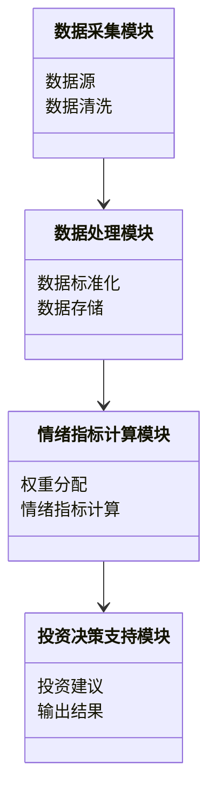

                 


# 格雷厄姆的市场情绪指标

> 关键词：市场情绪指标、投资决策、市场周期、情绪分类、数学模型

> 摘要：本文详细探讨了格雷厄姆的市场情绪指标，从其背景、核心概念、算法原理到系统架构和实战案例，全面解析了市场情绪指标在投资决策中的应用。通过格雷厄姆的理论框架，结合实际案例，本文为投资者提供了一套基于市场情绪分析的投资策略。

---

## 第1章: 市场情绪指标的背景与意义

### 1.1 市场情绪指标的定义与核心概念

#### 1.1.1 市场情绪指标的定义
市场情绪指标是一种量化市场参与者情绪状态的工具，用于分析市场的乐观或悲观情绪，帮助投资者做出更明智的投资决策。它通过收集和分析市场数据，将市场情绪转化为可量化的指标。

#### 1.1.2 市场情绪指标的核心概念
市场情绪指标的核心概念包括情绪强度、情绪趋势和情绪波动。情绪强度反映了市场参与者的整体情绪状态，情绪趋势展示了情绪的变化方向，而情绪波动则衡量了情绪变化的剧烈程度。

#### 1.1.3 市场情绪指标在投资决策中的作用
市场情绪指标在投资决策中起着关键作用。它可以帮助投资者识别市场的超买或超卖状态，预测市场的拐点，并制定相应的投资策略。通过分析市场情绪，投资者可以更好地应对市场的波动。

### 1.2 格雷厄姆的市场情绪指标理论

#### 1.2.1 格雷厄姆的投资理念概述
格雷厄姆是价值投资的鼻祖，他强调以合理的价格投资于具有内在价值的公司。他的投资理念基于长期视角，注重基本面分析和安全边际。

#### 1.2.2 市场情绪指标与格雷厄姆投资策略的关系
格雷厄姆的投资策略强调在市场恐慌时买入，在市场狂热时卖出。市场情绪指标为他的策略提供了数据支持，帮助投资者识别市场的非理性波动。

#### 1.2.3 格雷厄姆市场情绪指标的独特性
格雷厄姆的市场情绪指标结合了市场情绪和基本面分析，注重长期趋势而非短期波动。他的指标强调安全边际和价值投资，与传统的情绪指标有所不同。

---

## 第2章: 市场情绪指标的核心概念与联系

### 2.1 核心概念原理

#### 2.1.1 市场情绪指标的构成要素
市场情绪指标的构成要素包括市场参与者的心理、市场行为和市场数据。这些要素共同反映了市场的整体情绪状态。

#### 2.1.2 情绪指标的分类与特征
市场情绪指标可以分为情绪强度、情绪趋势和情绪波动三类。情绪强度反映了市场的乐观或悲观程度，情绪趋势展示了情绪的变化方向，而情绪波动则衡量了情绪变化的剧烈程度。

#### 2.1.3 格雷厄姆市场情绪指标的数学模型
格雷厄姆的市场情绪指标可以通过以下公式进行计算：
$$EI = \sum_{i=1}^{n} w_i \cdot S_i$$
其中，$EI$表示情绪强度，$w_i$是各个情绪指标的权重，$S_i$是各个指标的值。

### 2.2 情绪指标与投资决策的关系

#### 2.2.1 情绪指标在市场周期中的表现
市场情绪指标在市场周期中表现出明显的波动性。在市场上涨阶段，情绪指标通常较高；在市场下跌阶段，情绪指标则较低。

#### 2.2.2 情绪指标与资产价格波动的关联
市场情绪指标与资产价格波动密切相关。当市场情绪高涨时，资产价格可能被高估；当市场情绪低落时，资产价格可能被低估。

#### 2.2.3 情绪指标对投资者决策的影响
市场情绪指标可以帮助投资者识别市场的非理性波动，避免盲目跟风。通过分析市场情绪，投资者可以制定更科学的投资策略。

---

## 第3章: 市场情绪指标的算法原理

### 3.1 情绪指标计算算法

#### 3.1.1 基于格雷厄姆理论的情绪指标计算方法
基于格雷厄姆理论的情绪指标计算方法包括数据采集、数据处理和情绪指标计算三个步骤。数据采集包括收集市场数据，如股票价格、成交量等；数据处理包括清洗和标准化；情绪指标计算则通过加权平均的方法得出最终的情绪强度。

#### 3.1.2 情绪指标的加权计算公式
情绪指标的加权计算公式如下：
$$EI = \sum_{i=1}^{n} w_i \cdot S_i$$
其中，$w_i$是各个指标的权重，$S_i$是各个指标的值。

#### 3.1.3 算法流程图（使用mermaid）
```mermaid
graph TD
    A[开始] -> B[数据采集]
    B -> C[数据清洗]
    C -> D[数据标准化]
    D -> E[计算情绪指标]
    E -> F[输出结果]
```

### 3.2 情绪指标的数学模型

#### 3.2.1 情绪强度计算公式：$$EI = \sum_{i=1}^{n} w_i \cdot S_i$$
情绪强度计算公式将各个情绪指标的值乘以相应的权重，求和得到最终的情绪强度。

#### 3.2.2 情绪趋势预测模型：$$P(t) = a \cdot EI(t-1) + b$$
情绪趋势预测模型基于前一期的情绪强度，通过回归分析预测下一期的情绪趋势。

#### 3.2.3 情绪波动分析的方差公式：$$Var = \frac{1}{N}\sum_{i=1}^{N}(x_i - \mu)^2$$
方差公式用于衡量情绪波动的剧烈程度，$\mu$是情绪指标的平均值。

---

## 第4章: 市场情绪指标的系统分析与架构设计

### 4.1 系统功能设计

#### 4.1.1 市场情绪数据采集模块
市场情绪数据采集模块负责收集市场数据，如股票价格、成交量、新闻标题等。

#### 4.1.2 情绪指标计算模块
情绪指标计算模块通过数据处理和加权计算，得出市场情绪指标。

#### 4.1.3 投资决策支持模块
投资决策支持模块根据市场情绪指标，提供投资建议，如买入或卖出信号。

### 4.2 系统架构设计

#### 4.2.1 系统架构图（使用mermaid）


#### 4.2.2 模块之间的交互关系
模块之间的交互关系包括数据采集、数据处理、情绪指标计算和投资决策支持。数据采集模块将数据传递给数据处理模块，数据处理模块将处理后的数据传递给情绪指标计算模块，情绪指标计算模块将计算结果传递给投资决策支持模块。

---

## 第5章: 市场情绪指标的项目实战

### 5.1 环境安装与数据准备

#### 5.1.1 Python环境搭建
安装Python，安装必要的库，如pandas、numpy、scikit-learn。

#### 5.1.2 数据源获取与处理
从数据源获取市场数据，如股票价格、成交量等，进行数据清洗和标准化。

### 5.2 核心代码实现

#### 5.2.1 情绪指标计算代码
```python
import pandas as pd
import numpy as np

# 数据加载
data = pd.read_csv('market_data.csv')

# 数据清洗
data.dropna()

# 数据标准化
data = (data - data.mean()) / data.std()

# 情绪指标计算
weights = [0.4, 0.3, 0.2, 0.1]
indices = ['price', 'volume', 'news_sentiment', 'market_cap']
emotional_intensity = np.dot(weights, data[indices].values.T)
```

#### 5.2.2 投资决策支持代码
```python
from sklearn import linear_model

# 情绪趋势预测
model = linear_model.LinearRegression()
model.fit(X, y)

# 情绪波动分析
variance = np.var(data['emotional_intensity'])
```

---

## 第6章: 最佳实践与小结

### 6.1 最佳实践 tips

#### 6.1.1 情绪指标的实时更新
为了保持市场情绪指标的准确性，建议定期更新数据和重新计算指标。

#### 6.1.2 结合基本面分析
市场情绪指标应与基本面分析相结合，避免仅依赖情绪指标做出决策。

#### 6.1.3 风险管理
投资者应根据市场情绪指标调整投资组合，合理配置资产，控制风险。

### 6.2 小结

通过本文的分析，我们可以看出格雷厄姆的市场情绪指标在投资决策中的重要性。市场情绪指标可以帮助投资者识别市场的非理性波动，制定更科学的投资策略。然而，投资者在使用市场情绪指标时，应结合基本面分析，避免单一依赖情绪指标。

---

## 作者：AI天才研究院/AI Genius Institute & 禅与计算机程序设计艺术 /Zen And The Art of Computer Programming

