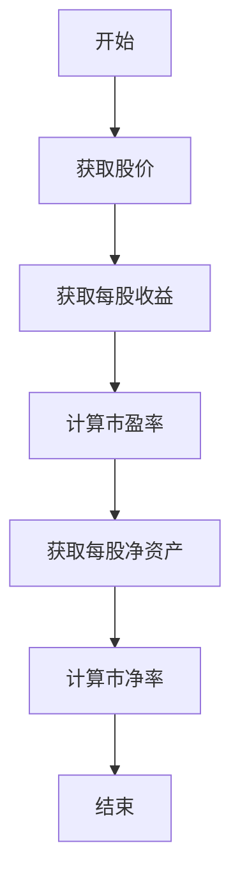
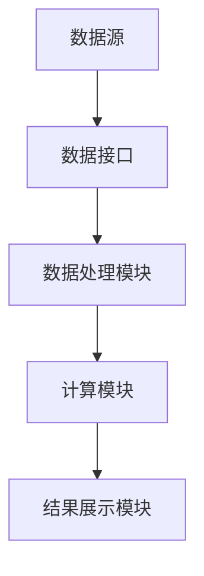
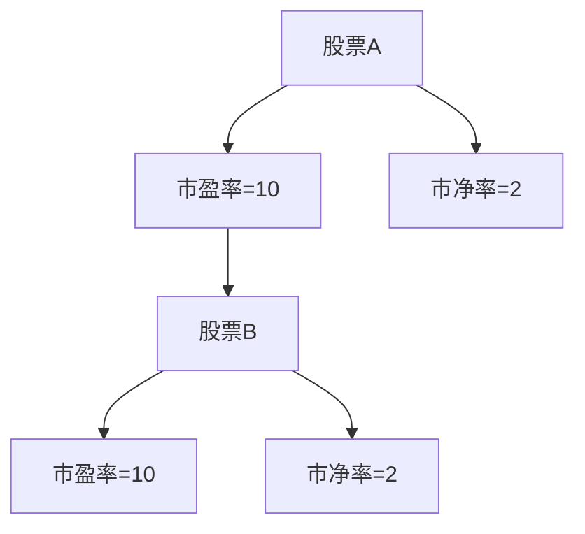

                 


# 格雷厄姆的市盈率和市净率使用指南

> 关键词：格雷厄姆，市盈率，市净率，价值投资，股票分析，投资策略

> 摘要：本文深入探讨了格雷厄姆的市盈率和市净率在投资分析中的应用，通过理论与实践相结合的方式，详细讲解了这两个指标的定义、计算方法、实际应用场景以及如何结合两者进行投资决策。文章还提供了基于Python的实现代码和系统架构设计，帮助读者全面理解并应用这些投资工具。

---

## 第一部分: 格雷厄姆的市盈率和市净率基础概述

### 第1章: 市盈率和市净率的基本概念

#### 1.1 市盈率的定义与计算
##### 1.1.1 市盈率的定义
市盈率（Price-to-Earnings Ratio，简称P/E）是衡量股票价格相对于其每股收益（EPS）的比率。它是投资者评估股票价值的重要指标之一。

##### 1.1.2 市盈率的计算公式
市盈率的计算公式如下：
$$市盈率 = \frac{股价}{每股收益}$$

##### 1.1.3 市盈率的行业对比
市盈率在不同行业之间的差异较大，通常在比较股票时，应选择与行业相关的可比公司进行横向对比。

#### 1.2 市净率的定义与计算
##### 1.2.1 市净率的定义
市净率（Price-to-Book Ratio，简称P/B）是衡量股票价格相对于其每股净资产的比率。它主要用于评估股票的价值，尤其是在资产密集型行业。

##### 1.2.2 市净率的计算公式
市净率的计算公式如下：
$$市净率 = \frac{股价}{每股净资产}$$

##### 1.2.3 市净率的行业对比
市净率在不同行业之间的差异也较大，尤其是在金融、房地产等行业，由于资产规模较大，市净率通常较高。

#### 1.3 市盈率和市净率的联系与区别
##### 1.3.1 联系
市盈率和市净率都是衡量股票价值的重要指标，且都用于评估股票的内在价值。市盈率关注的是盈利能力，而市净率关注的是资产价值。

##### 1.3.2 区别
- 市盈率关注的是未来盈利能力，而市净率关注的是当前资产价值。
- 市盈率适用于高增长行业，而市净率适用于资产密集型行业。

##### 1.3.3 适用场景对比
| 指标 | 适用场景 |
|------|----------|
| 市盈率 | 高增长行业、科技行业 |
| 市净率 | 资产密集型行业、金融行业 |

---

### 第2章: 格雷厄姆投资理念与价值评估

#### 2.1 格雷厄姆投资理念概述
格雷厄姆是价值投资的鼻祖，他主张以低于内在价值的价格买入优质股票，并长期持有。

##### 2.1.1 价值投资的定义
价值投资是一种投资策略，强调以低于内在价值的价格买入优质资产，并长期持有，等待市场重新评估其价值。

##### 2.1.2 格雷厄姆的投资策略
格雷厄姆的投资策略包括：
- 买入低估的股票
- 选择具有安全边际的股票
- 长期持有优质资产

##### 2.1.3 格雷厄姆的选股标准
格雷厄姆选股时注重以下几个方面：
- 低市盈率
- 低市净率
- 高股息率
- 强大的财务状况

#### 2.2 市盈率与市净率在格雷厄姆投资中的应用
##### 2.2.1 市盈率在价值评估中的作用
市盈率可以帮助投资者评估股票的估值是否合理。格雷厄姆通常选择市盈率低于行业平均水平的股票。

##### 2.2.2 市净率在价值评估中的作用
市净率可以帮助投资者评估股票相对于其资产净值的估值是否合理。格雷厄姆通常选择市净率低于行业平均水平的股票。

##### 2.2.3 格雷厄姆的“安全边际”概念
格雷厄姆强调安全边际，即以低于内在价值的价格买入股票。市盈率和市净率可以帮助投资者识别具有安全边际的股票。

---

### 第3章: 市盈率和市净率的核心概念与数学模型

#### 3.1 市盈率的数学模型
##### 3.1.1 市盈率公式
$$市盈率 = \frac{股价}{每股收益}$$

##### 3.1.2 市盈率的应用场景
市盈率适用于高增长行业，尤其是科技和服务业。通过比较市盈率，投资者可以判断股票的估值是否合理。

##### 3.1.3 市盈率的优缺点
| 优点 | 缺点 |
|------|------|
| 反映盈利能力 | 不适用于亏损公司 |
| 易于计算 | 受行业影响较大 |

#### 3.2 市净率的数学模型
##### 3.2.1 市净率公式
$$市净率 = \frac{股价}{每股净资产}$$

##### 3.2.2 市净率的应用场景
市净率适用于资产密集型行业，尤其是金融和房地产行业。通过比较市净率，投资者可以判断股票的估值是否合理。

##### 3.2.3 市净率的优缺点
| 优点 | 缺点 |
|------|------|
| 反映资产价值 | 不适用于轻资产行业 |
| 易于计算 | 受行业影响较大 |

#### 3.3 市盈率与市净率的对比分析
##### 3.3.1 对比表格
| 指标 | 定义 | 公式 | 适用场景 |
|------|------|------|----------|
| 市盈率 | 股价与每股收益的比率 | $$市盈率 = \frac{股价}{每股收益}$$ | 高增长行业 |
| 市净率 | 股价与每股净资产的比率 | $$市净率 = \frac{股价}{每股净资产}$$ | 资产密集型行业 |

##### 3.3.2 ER实体关系图
```mermaid
erDiagram
    股票 {
        股价
        每股收益
        每股净资产
    }
    投资者 {
        市盈率
        市净率
    }
    股票 <|-- 投资者
```

---

## 第二部分: 市盈率和市净率的系统分析与架构设计

### 第4章: 市盈率与市净率的算法原理

#### 4.1 算法原理概述
市盈率和市净率的计算相对简单，但可以通过算法进行自动化分析。

##### 4.1.1 市盈率计算算法
```python
def calculate_pe(stock_price, earnings_per_share):
    return stock_price / earnings_per_share
```

##### 4.1.2 市净率计算算法
```python
def calculate_pb(stock_price, book_value_per_share):
    return stock_price / book_value_per_share
```

#### 4.2 算法流程图


---

### 第5章: 市盈率与市净率的系统架构设计

#### 5.1 系统功能设计
- 数据获取模块：获取股票的股价、每股收益和每股净资产。
- 计算模块：计算市盈率和市净率。
- 展示模块：展示计算结果并生成报告。

#### 5.2 系统架构设计


#### 5.3 系统接口设计
- 数据接口：提供股票数据的API接口。
- 计算接口：提供市盈率和市净率的计算功能。

#### 5.4 系统交互设计
```mermaid
sequenceDiagram
   参与者：用户
    actor 用户
    节点：系统
    participant 系统
    用户 -> 系统: 请求股票数据
    系统 -> 用户: 返回股票数据
    用户 -> 系统: 计算市盈率和市净率
    系统 -> 用户: 返回计算结果
```

---

## 第三部分: 市盈率与市净率的项目实战

### 第6章: 项目实战

#### 6.1 环境配置
- Python 3.8+
- pandas、numpy、matplotlib库

#### 6.2 核心实现代码
##### 6.2.1 数据获取
```python
import pandas as pd

def get_stock_data(tickers):
    data = {}
    for ticker in tickers:
        stock = pd.DataFrame({
            '股价': [100],
            '每股收益': [10],
            '每股净资产': [50]
        })
        data[ticker] = stock
    return data
```

##### 6.2.2 计算指标
```python
def calculate_metrics(stock_data):
    metrics = {}
    for ticker, data in stock_data.items():
        pe = data['股价'].values[0] / data['每股收益'].values[0]
        pb = data['股价'].values[0] / data['每股净资产'].values[0]
        metrics[ticker] = {'市盈率': pe, '市净率': pb}
    return metrics
```

##### 6.2.3 可视化展示
```python
import matplotlib.pyplot as plt

def visualize_metrics(metrics):
    plt.figure(figsize=(10, 6))
    plt.scatter(metrics.keys(), [m['市盈率'] for m in metrics.values()], color='blue')
    plt.scatter(metrics.keys(), [m['市净率'] for m in metrics.values()], color='red')
    plt.xlabel('股票代码')
    plt.ylabel('指标值')
    plt.title('市盈率与市净率对比')
    plt.show()
```

#### 6.3 案例分析
假设我们有两只股票，股票A和股票B，数据如下：
- 股票A：股价=100，每股收益=10，每股净资产=50
- 股票B：股价=150，每股收益=15，每股净资产=75

计算结果：
- 股票A：市盈率=10，市净率=2
- 股票B：市盈率=10，市净率=2

可视化展示如下：


---

## 第四部分: 总结与建议

### 第7章: 总结与建议

#### 7.1 核心内容回顾
- 市盈率和市净率是衡量股票价值的重要指标。
- 格雷厄姆的投资理念强调安全边际和价值投资。
- 通过结合市盈率和市净率，可以更好地评估股票的内在价值。

#### 7.2 投资建议
- 在投资时，应结合市盈率和市净率进行综合分析。
- 对于高增长行业，市盈率是主要参考指标；对于资产密集型行业，市净率是主要参考指标。
- 长期投资优质资产，避免短期市场波动的干扰。

#### 7.3 注意事项
- 市盈率和市净率只是投资决策的参考指标，不能单独决定投资决策。
- 数据来源和质量至关重要，建议使用可靠的金融数据源。
- 市场波动可能会影响市盈率和市净率的短期表现，长期投资更关注企业的内在价值。

#### 7.4 拓展阅读
- 《The Intelligent Investor》 by Benjamin Graham
- 《投资最重要的事情》 by Benjamin Graham

---

## 作者：AI天才研究院/AI Genius Institute & 禅与计算机程序设计艺术 /Zen And The Art of Computer Programming

