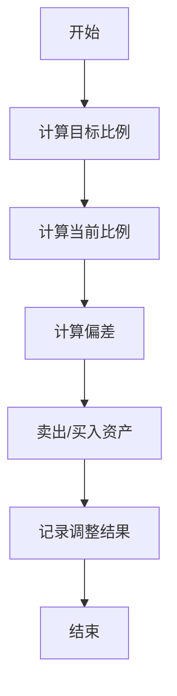

                 


# 格雷厄姆的投资组合再平衡策略

## 关键词
投资组合, 再平衡, 格雷厄姆, 投资策略, 风险管理

## 摘要
本文深入探讨了格雷厄姆的投资组合再平衡策略，分析了其核心理念、策略实施步骤及数学模型。文章通过详细讲解再平衡的重要性、时机选择、实施方法，结合实际案例和系统架构设计，帮助投资者理解和应用这一策略，以实现长期稳健的投资回报。

---

## 正文

### 第一部分：引言

#### 1.1 投资组合再平衡概述

##### 1.1.1 投资组合的定义
投资组合是投资者持有的多种资产（如股票、债券、基金等）的集合，旨在分散风险并实现收益最大化。通过合理配置资产，投资者可以在不同市场条件下平衡风险与收益。

##### 1.1.2 投资组合的重要性
投资组合的重要性体现在其分散风险的能力。单一资产的风险较高，而多样化投资可以有效降低整体风险，同时提高收益的稳定性。

##### 1.1.3 再平衡的概念与作用
再平衡是指定期调整投资组合，以维持预定的资产配置比例。其作用包括优化风险收益比、应对市场变化、保持投资策略一致性。

---

### 第二部分：格雷厄姆投资理念

#### 2.1 格雷厄姆的价值投资理论

##### 2.1.1 价值投资的核心思想
格雷厄姆强调以低于内在价值的价格购买资产，长期持有，通过安全边际（资产价格与内在价值的差距）来降低风险。

##### 2.1.2 安全边际的概念
安全边际是投资中保护投资者免受市场波动影响的缓冲区，确保以合理价格购买资产，避免过度支付。

##### 2.1.3 长期投资的重要性
格雷厄姆主张长期持有优质资产，避免频繁交易，降低交易成本和税务负担，实现复利效应。

---

### 第三部分：投资组合管理基础

#### 3.1 投资组合管理的定义

##### 3.1.1 投资组合管理的范围
管理范围包括资产配置、风险控制、绩效评估和再平衡等。

##### 3.1.2 管理的目标与方法
目标是实现投资目标与风险承受能力的匹配，方法包括定期审视和调整投资组合。

#### 3.2 投资组合的类型

##### 3.2.1 按资产类别划分
包括股票、债券、现金等，不同类别资产的风险和收益不同。

##### 3.2.2 按风险偏好划分
保守型、平衡型、成长型，不同偏好决定资产配置比例。

##### 3.2.3 按投资期限划分
短期、中期、长期，期限影响资产流动性安排。

---

### 第四部分：再平衡策略的核心内容

#### 4.1 再平衡的必要性

##### 4.1.1 市场变化的影响
市场波动导致资产比例偏离预期，需调整以维持目标配置。

##### 4.1.2 投资目标的变化
如风险偏好、收益目标的变化，需调整资产配置。

##### 4.1.3 风险偏好的调整
根据市场环境和个人情况，动态调整风险承受能力。

#### 4.2 再平衡的时机与频率

##### 4.2.1 定期再平衡
定期（如每年或每季度）调整，保持资产配置不变。

##### 4.2.2 事件驱动的再平衡
市场剧烈波动或重大事件后，及时调整。

#### 4.3 再平衡的步骤

##### 4.3.1 确定目标配置比例
根据投资目标和风险偏好设定各资产的比例。

##### 4.3.2 计算当前比例偏差
比较当前实际比例与目标比例，找出偏差。

##### 4.3.3 调整资产头寸
通过买卖资产，调整至目标比例，最小化偏差。

---

### 第五部分：系统分析与架构设计

#### 5.1 再平衡算法模型

##### 5.1.1 问题场景
假设投资组合初始配置为60%股票，30%债券，10%现金，市场变化后股票比例升至70%，需调整至60%。

##### 5.1.2 算法步骤
1. 计算各资产偏离目标比例的部分。
2. 卖出或买入资产，调整至目标比例。
3. 记录调整后的组合情况。

##### 5.1.3 mermaid流程图


##### 5.1.4 Python代码实现
```python
def calculate_weights(current_weights, target_weights):
    # 计算各资产的偏差
    deviations = {asset: target - current for asset, target in target_weights.items()}
    # 计算需要调整的金额
    adjustments = {}
    for asset in target_weights:
        current = current_weights.get(asset, 0)
        target = target_weights[asset]
        if current < target:
            adjustments[asset] = target - current
        else:
            adjustments[asset] = -(current - target)
    return adjustments

# 示例
current_weights = {'股票': 70, '债券': 20, '现金': 10}
target_weights = {'股票': 60, '债券': 30, '现金': 10}
adjustments = calculate_weights(current_weights, target_weights)
print(adjustments)
```

##### 5.1.5 数学模型
目标是调整投资组合，使各资产权重等于目标权重。数学模型如下：
$$ w_i' = w_i + \Delta w_i $$
其中，$$w_i$$是当前权重，$$\Delta w_i$$是调整量，确保$$\sum w_i' = 1$$。

---

### 第六部分：项目实战

#### 6.1 环境安装

##### 6.1.1 Python环境安装
安装Python和必要的库（pandas, numpy）。

##### 6.1.2 数据获取
获取历史数据和当前市场数据。

#### 6.2 核心代码实现

##### 6.2.1 再平衡算法实现
使用pandas进行数据处理，计算偏差并调整头寸。

##### 6.2.2 代码解读
```python
import pandas as pd

def rebalance_portfolio(current_weights, target_weights):
    # 计算偏差
    deviations = {asset: target_weights[asset] - current_weights[asset] for asset in target_weights}
    # 调整头寸
    adjusted_weights = {}
    for asset in target_weights:
        current = current_weights.get(asset, 0)
        target = target_weights[asset]
        deviation = target - current
        if deviation > 0:
            adjusted_weights[asset] = current + deviation
        else:
            adjusted_weights[asset] = current + deviation
    return adjusted_weights

# 示例
current_weights = {'股票': 70, '债券': 20, '现金': 10}
target_weights = {'股票': 60, '债券': 30, '现金': 10}
adjusted_weights = rebalance_portfolio(current_weights, target_weights)
print(adjusted_weights)
```

##### 6.2.3 实际案例分析
假设投资组合初始为$100,000，股票60%，债券30%，现金10%。市场波动后股票涨至70%，需调整至60%。计算调整金额：卖出股票$10,000，买入债券$10,000，保持现金不变。

---

### 第七部分：结论与展望

#### 7.1 最佳实践
定期审视投资组合，根据市场变化和个人情况调整配置。使用工具辅助计算，减少人为误差。

#### 7.2 小结
格雷厄姆的再平衡策略是实现稳健投资的重要手段，通过定期调整，保持目标配置，分散风险，实现长期收益。

#### 7.3 注意事项
再平衡涉及税务和交易成本，需综合考虑。避免过度交易，减少费用支出。

#### 7.4 拓展阅读
推荐阅读格雷厄姆的《证券分析》和《 Intelligent Investor》，深入了解价值投资理论。

---

## 结论

通过本文的详细讲解，读者可以全面理解格雷厄姆的投资组合再平衡策略，并在实际投资中应用这些方法。再平衡策略不仅帮助投资者应对市场波动，还能优化风险收益比，实现长期稳健的投资回报。

---

## 作者

作者：AI天才研究院/AI Genius Institute & 禅与计算机程序设计艺术 /Zen And The Art of Computer Programming

---

以上是《格雷厄姆的投资组合再平衡策略》的完整目录和内容概要，您可以根据需要进一步扩展各部分的内容，添加更多详细说明和案例分析。

