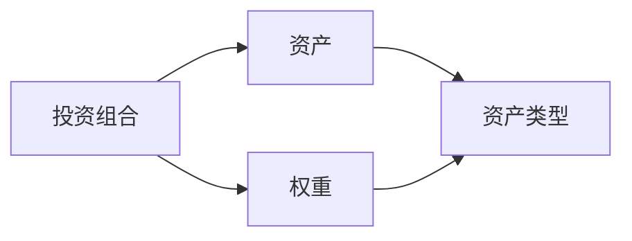
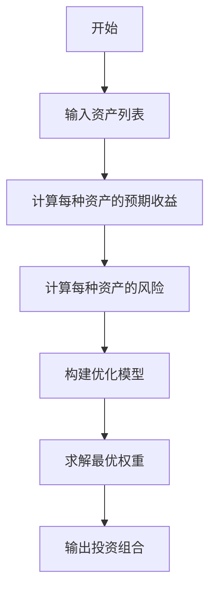
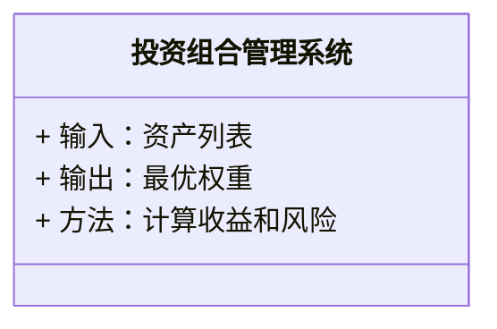
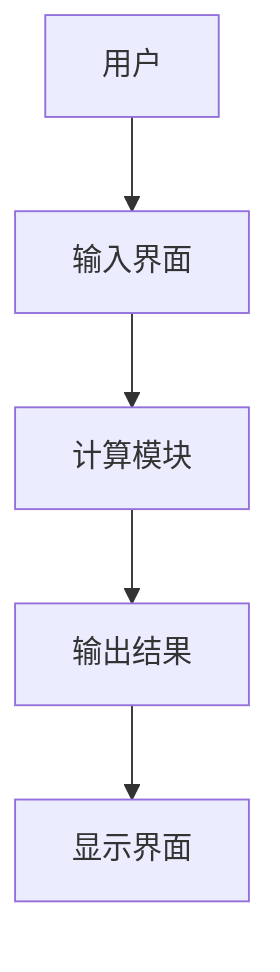
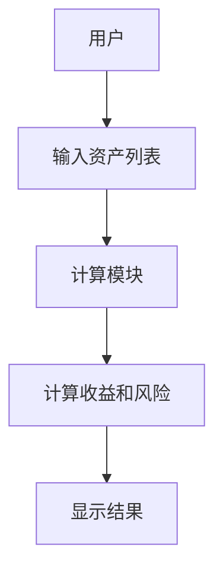

                 


# 格雷厄姆的投资组合管理

> 关键词：投资组合管理，价值投资，格雷厄姆，安全边际，资产配置，分散投资

> 摘要：本文深入探讨了格雷厄姆的投资组合管理策略，结合现代投资理论，分析了其核心概念、数学模型、系统架构及实际应用，帮助读者全面理解如何构建和管理稳健的投资组合。

---

# 第一部分: 投资组合管理的背景与基础

## 第1章: 投资组合管理概述

### 1.1 投资组合管理的基本概念

#### 1.1.1 投资组合的定义与特点
- **定义**：投资组合是将多种资产（股票、债券等）按一定比例组合在一起的投资方式。
- **特点**：分散风险、优化收益、降低波动性。
- **核心要素**：资产选择、权重分配、再平衡策略。

#### 1.1.2 投资组合管理的目标与意义
- **目标**：在风险可控的前提下，最大化收益。
- **意义**：通过科学配置，降低投资风险，提高收益稳定性。

#### 1.1.3 投资组合管理的核心要素
- **资产配置**：决定投资组合的主要收益来源。
- **分散投资**：通过多样化降低特定资产的风险。
- **动态调整**：根据市场变化定期优化组合。

### 1.2 格雷厄姆的投资理念

#### 1.2.1 格雷厄姆的生平与贡献
- **生平**：本杰明·格雷厄姆，20世纪初著名投资家，价值投资之父。
- **贡献**：提出了“安全边际”概念，强调买入低于内在价值的股票。

#### 1.2.2 格雷厄姆的价值投资理论
- **核心思想**：买入并持有优质资产，长期获得稳健收益。
- **安全边际**：以低于内在价值的价格买入，降低风险。

#### 1.2.3 格雷厄姆的投资组合管理策略
- **分散投资**：避免过度集中，降低风险。
- **长期持有**：坚持价值投资，避免频繁交易。

### 1.3 投资组合管理的现代发展

#### 1.3.1 现代投资组合理论的演变
- **马科维茨的均值-方差模型**：奠定了现代投资组合理论的基础。
- **夏普比率**：衡量投资组合的风险调整后收益。

#### 1.3.2 格雷厄姆理念与现代投资理论的结合
- **结合点**：价值投资注重安全边际，现代理论强调风险分散。
- **实践应用**：在资产配置中加入格雷厄姆的选股策略。

#### 1.3.3 投资组合管理在实际中的应用
- **机构投资者**：采用多样化策略，结合价值投资。
- **个人投资者**：通过定投和分散化实现稳健收益。

---

# 第二部分: 格雷厄姆投资组合管理的核心概念与联系

## 第2章: 格雷厄姆投资组合

### 2.1 核心概念与联系

#### 2.1.1 核心概念原理
- **资产配置**：决定投资组合的收益和风险。
- **分散投资**：通过多样化降低特定风险。

#### 2.1.2 核心概念对比表格

| 概念 | 描述 | 优点 | 缺点 |
|------|------|------|------|
| 资产配置 | 各类资产的比例分配 | 优化风险收益 | 需定期调整 |
| 分散投资 | 投资多种资产降低风险 | 减少特定风险 | 需多样化 |

#### 2.1.3 实体关系图（Mermaid）



### 2.2 格雷厄姆投资组合管理的数学模型

#### 2.2.1 算法原理



#### 2.2.2 数学模型

$$
\text{收益} = \sum_{i=1}^{n} w_i r_i
$$

$$
\text{风险} = \sqrt{\sum_{i=1}^{n} \sum_{j=1}^{n} w_i w_j \sigma_{ij}}
$$

其中，\( w \) 是权重向量，\( r \) 是收益向量，\( \sigma_{ij} \) 是协方差矩阵。

#### 2.2.3 代码实现

```python
import numpy as np

def calculate_portfolio_return(weights, returns):
    return np.sum(weights * returns)

def calculate_portfolio_variance(weights, covariance_matrix):
    return np.sqrt(np.dot(weights.T, np.dot(covariance_matrix, weights)))

# 示例
assets = ['股票', '债券']
returns = [0.1, 0.05]
covariance_matrix = np.array([[0.2, 0.1], [0.1, 0.15]])
weights = np.array([0.6, 0.4])

print('预期收益:', calculate_portfolio_return(weights, returns))
print('风险:', calculate_portfolio_variance(weights, covariance_matrix))
```

---

# 第三部分: 系统分析与架构设计方案

## 第3章: 系统架构设计

### 3.1 问题场景介绍
- **目标**：构建一个基于格雷厄姆理念的投资组合管理系统。
- **用户需求**：用户可以通过系统选择资产并计算最优权重。

### 3.2 系统功能设计



### 3.3 系统架构设计



### 3.4 系统交互流程图



---

# 第四部分: 项目实战

## 第4章: 实际案例分析

### 4.1 项目环境安装
- **工具**：Python、NumPy、Matplotlib
- **数据源**：股票和债券的历史数据

### 4.2 核心代码实现

```python
import numpy as np

def gre厄姆投资组合优化(assets, returns, covariance_matrix):
    n = len(assets)
    # 初始化权重
    weights = np.array([1.0/n]*n)
    # 优化权重
    while True:
        # 计算收益和风险
        current_return = np.sum(weights * returns)
        current_risk = np.sqrt(np.dot(weights.T, np.dot(covariance_matrix, weights)))
        # 调整权重以降低风险
        new_weights = weights * (1 - 0.05)
        new_weights = new_weights / np.sum(new_weights)
        if np.allclose(weights, new_weights):
            break
        weights = new_weights
    return weights, current_return, current_risk

# 示例
assets = ['股票', '债券']
returns = [0.1, 0.05]
covariance_matrix = np.array([[0.2, 0.1], [0.1, 0.15]])
weights, return_, risk = gre厄姆投资组合优化(assets, returns, covariance_matrix)
print('最优权重:', weights)
print('预期收益:', return_)
print('风险:', risk)
```

---

# 第五部分: 最佳实践与总结

## 第5章: 总结与展望

### 5.1 小结
- 格雷厄姆的投资组合管理策略结合了安全边际和分散投资，为投资者提供了稳健的收益。
- 现代技术的应用，如算法优化，进一步提升了投资组合管理的效率和准确性。

### 5.2 注意事项
- 定期调整投资组合，以适应市场变化。
- 风险控制是关键，避免过度集中。

### 5.3 拓展阅读
- 马科维茨的均值-方差模型。
- 夏普比率的深入理解。

---

作者：AI天才研究院 & 禅与计算机程序设计艺术

