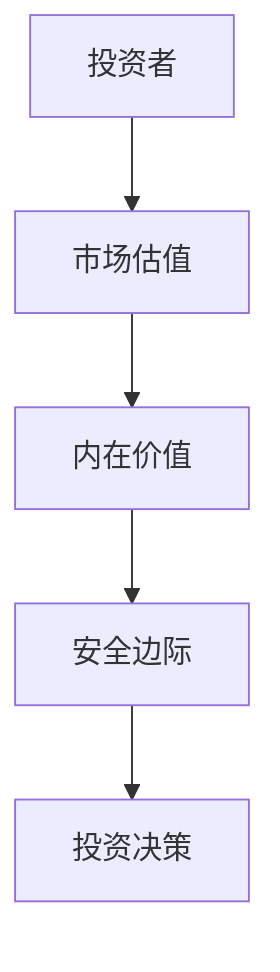
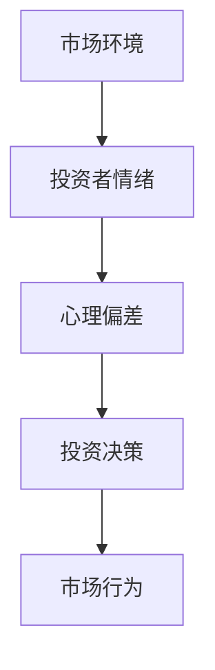
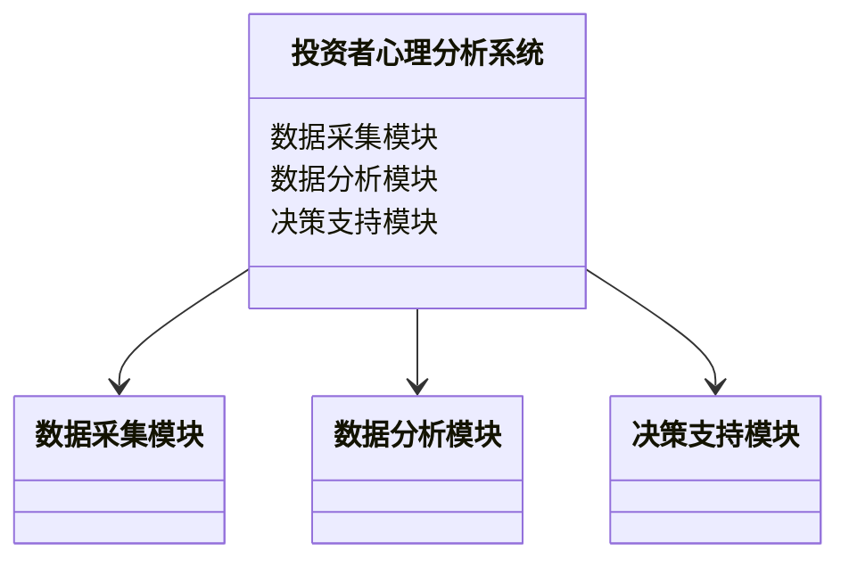

                 


```markdown
# 《格雷厄姆的投资者心理建设》

## 关键词：投资者心理，价值投资，安全边际，市场先生，心理偏差，行为金融学，投资决策模型

## 摘要：  
本文从格雷厄姆的价值投资理念出发，深入分析投资者心理在投资决策中的重要作用。通过探讨心理偏差对投资行为的影响，结合行为金融学的理论，构建了投资者心理建设的框架。文章详细阐述了格雷厄姆投资理念的核心概念，包括安全边际、市场先生等，并通过数学模型和算法原理分析了投资者心理对投资决策的影响。同时，本文提供了实际案例分析和系统架构设计方案，帮助投资者更好地理解和应用格雷厄姆的投资理念，实现长期稳健的投资收益。

---

## 第一部分: 背景介绍

### 第1章: 投资者心理建设的背景与重要性

#### 1.1 价值投资的背景与发展  
价值投资作为一种长期有效的投资策略，起源于20世纪初，由本杰明·格雷厄姆和戴维德·多德提出。价值投资的核心理念是寻找市场估值低于其内在价值的股票，并在市场恐慌时买入，在市场狂热时卖出。格雷厄姆强调安全边际的重要性，认为投资者应以低于内在价值的价格买入优质资产。  

#### 1.2 心理偏差与行为金融学  
投资者在决策过程中常常受到心理偏差的影响，如过度自信、从众心理、损失厌恶等。这些心理偏差可能导致投资者做出非理性的决策，如盲目追涨杀跌或过度交易。行为金融学研究发现，投资者的心理因素是影响投资决策的重要因素，甚至超过了传统金融模型中理性假设的作用。  

#### 1.3 格雷厄姆投资理念与心理建设的结合  
格雷厄姆的投资理念强调理性、耐心和纪律，这与投资者心理建设密切相关。通过心理建设，投资者可以更好地控制情绪，避免被市场波动干扰，从而坚持价值投资的原则。本文将结合格雷厄姆的投资理念，探讨如何通过心理建设提升投资决策的质量。

---

## 第二部分: 核心概念与联系

### 第2章: 格雷厄姆投资理念的核心概念

#### 2.1 安全边际的定义与计算  
安全边际是格雷厄姆理论中的核心概念，指股票的市场价格低于其内在价值的部分。计算公式为：  
$$ 安全边际 = 内在价值 - 市场价格 $$  
安全边际越大，投资的风险越小，收益潜力越大。  

#### 2.2 市场先生的概念与作用  
市场先生是格雷厄姆提出的一个比喻，指市场情绪的波动。市场先生每天都会为投资者提供买卖的机会，但投资者应以独立判断为基础，避免被市场先生的情绪左右。  

#### 2.3 内在价值的评估方法  
内在价值是股票的真实价值，与市场波动无关。评估内在价值的方法包括基本面分析、现金流折现法等。格雷厄姆常用的方法是计算市盈率和市净率，以确定股票是否被市场低估。  

#### 2.4 核心概念的属性特征对比  
以下是核心概念的对比分析：  

| 概念       | 属性特征                       |  
|------------|--------------------------------|  
| 安全边际   | 量化指标，反映投资风险         |  
| 市场先生   | 比喻性概念，反映市场情绪       |  
| 内在价值   | 客观指标，反映股票真实价值     |  

#### 2.5 实体关系图与流程图  
以下是核心概念的ER实体关系图：  

```mermaid
er
  actor 投资者
  actor 市场先生
  actor 内在价值
  actor 安全边际
  relation - "评估" --> 投资者 --> 内在价值
  relation - "计算" --> 内在价值 --> 安全边际
  relation - "影响" --> 市场先生 --> 安全边际
```

以下是格雷厄姆投资理念的Mermaid流程图：  



---

## 第三部分: 算法原理讲解

### 第3章: 投资者心理分析的算法原理

#### 3.1 心理偏差对投资决策的影响  
心理偏差是投资者在决策过程中常见的错误认知模式。例如，过度自信可能导致投资者过度交易，而损失厌恶可能导致投资者在亏损时难以割肉。  

#### 3.2 投资者心理决策模型  
以下是投资者心理决策模型的Mermaid流程图：  



#### 3.3 数学模型与公式  
以下是心理偏差对投资决策影响的数学模型：  
$$ 投资决策 = f(心理偏差, 市场环境) $$  
其中，$f$ 表示非线性函数，用于描述心理偏差与市场环境之间的复杂关系。  

---

## 第四部分: 系统分析与架构设计

### 第4章: 投资者心理分析系统架构设计

#### 4.1 系统功能设计  
以下是投资者心理分析系统的功能模块：  



#### 4.2 系统架构设计  
以下是系统架构的Mermaid图：  

```mermaid
container 投资者心理分析系统 {
    service 数据采集模块 --> 数据库
    service 数据分析模块 --> 数据处理模块
    service 决策支持模块 --> 投资者报告
}
```

---

## 第五部分: 项目实战

### 第5章: 项目实战与案例分析

#### 5.1 环境安装与数据准备  
需要安装Python和相关库（如Pandas、NumPy），并收集目标公司的财务数据。  

#### 5.2 核心代码实现  
以下是计算安全边际的Python代码示例：  

```python
import pandas as pd

def calculate_margin_of_safety(intrinsic_value, market_price):
    return intrinsic_value - market_price

# 示例数据
data = {
    '公司': ['苹果', '微软', '谷歌'],
    '内在价值': [100, 150, 200],
    '市场价格': [90, 140, 190]
}
df = pd.DataFrame(data)
df['安全边际'] = df.apply(lambda x: calculate_margin_of_safety(x['内在价值'], x['市场价格']), axis=1)
print(df)
```

#### 5.3 案例分析与解读  
以苹果公司为例，计算其安全边际和市盈率，分析其投资价值。  

#### 5.4 项目小结  
通过实际案例分析，验证了格雷厄姆投资理念的有效性，并展示了心理建设在投资决策中的重要性。

---

## 第六部分: 最佳实践

### 第6章: 最佳实践与注意事项

#### 6.1 投资者心理建设的实践经验  
- 保持理性和耐心，避免情绪化决策。  
- 定期复盘和总结，反思自己的投资行为。  
- 建立合理的目标，避免过度追求短期收益。  

#### 6.2 注意事项与风险提示  
- 投资有风险，需谨慎评估自身风险承受能力。  
- 避免盲目跟风，保持独立思考。  
- 定期更新和优化投资策略，适应市场变化。  

#### 6.3 拓展阅读与资源推荐  
推荐阅读格雷厄姆的《聪明的投资者》和行为金融学相关的书籍，如《怪诞行为学》。

---

## 作者：AI天才研究院/AI Genius Institute & 禅与计算机程序设计艺术 /Zen And The Art of Computer Programming
```

### 总结：
这篇文章系统地探讨了格雷厄姆的投资理念与投资者心理建设的结合，通过理论分析、算法原理、系统设计和实际案例，为投资者提供了全面的指导。从心理偏差到安全边际的计算，再到系统的架构设计，文章层层深入，帮助投资者更好地理解和应用价值投资策略。

