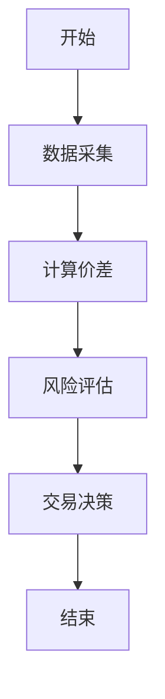

                 


# 格雷厄姆的特殊情况投资：寻找套利机会

## 关键词：格雷厄姆，特殊情况投资，套利机会，投资策略，数学模型，系统架构，项目实战

## 摘要：本文探讨了格雷厄姆的特殊情况投资策略，分析了套利机会的识别与评估方法，详细讲解了套利的算法原理和数学模型，并通过系统架构设计和项目实战案例，展示了如何利用格雷厄姆的策略在实际投资中寻找套利机会。

---

## 第一部分：背景介绍

### 第1章：格雷厄姆的投资哲学

#### 1.1 格雷厄姆的生平简介
Benjamin Graham 是20世纪的投资大师，被誉为“价值投资之父”。他在1924年出版的《安全的套利》奠定了现代价值投资的基础。Graham 强调以内在价值为基础的投资策略，认为市场波动为投资者提供了低价买入优质资产的机会。

#### 1.2 格雷厄姆的价值投资理论
Graham 提出，市场的短期波动不可预测，但长期趋势可以通过分析企业的基本面来确定。他强调安全边际的重要性，即以低于内在价值的价格买入资产，以减少风险并确保收益。

#### 1.3 格雷厄姆的投资哲学对现代投资的影响
Graham 的理论影响了众多投资者，包括巴菲特。他的策略尤其适合在市场波动较大时寻找套利机会，通过分析价差、跨市场差异等找到短期盈利点。

---

### 第2章：特殊情况投资的定义与特点

#### 2.1 特殊情况投资的定义
特殊情况投资是指在特定市场条件下，利用资产的暂时性价格差异进行投资，以期在价格回归理性时获利。这种投资策略依赖于对市场结构、资产流动性和信息不对称的深入分析。

#### 2.2 特殊情况投资的特点
- **市场波动性**：套利者利用短期价格波动，寻找价格差异。
- **信息不对称**：套利者通过分析非公开信息或市场遗漏寻找机会。
- **机会稀缺性**：套利机会通常短暂，需快速反应。

---

## 第二部分：套利机会的识别与评估

### 第3章：套利机会的识别

#### 3.1 识别套利机会的方法
1. **跨市场价差**：同一资产在不同市场或交易平台的价格差异。
2. **事件驱动**：公司并购、重组等事件引发的价格波动。
3. **市场流动性**：低流动性市场中可能出现的价格偏差。

#### 3.2 识别套利机会的工具
- **数据分析工具**：利用Python进行市场数据挖掘和分析。
- **市场监控系统**：实时监控市场波动，识别潜在套利机会。

### 第4章：套利机会的评估

#### 4.1 套利机会的评估指标
- **价差分析**：计算资产在不同市场或时间点的价格差异。
- **风险评估**：分析套利交易的风险，包括市场风险和流动性风险。

#### 4.2 套利机会的数学模型
使用Black-Scholes模型量化套利机会，评估潜在收益和风险。

---

## 第三部分：套利的算法原理

### 第5章：套利的算法原理

#### 5.1 套利的算法流程
1. 数据采集：收集相关市场的实时数据。
2. 价差计算：识别资产在不同市场或时间点的价格差异。
3. 风险评估：计算套利交易的潜在风险。
4. 交易决策：根据分析结果决定是否执行套利交易。

#### 5.2 套利算法的mermaid流程图


### 第6章：数学模型与公式

#### 6.1 Black-Scholes模型
套利机会的量化可以通过Black-Scholes公式计算期权价格：
$$C = S_0 e^{r t} N(d_1) - K e^{r T} N(d_2)$$
其中，$d_1 = \frac{\ln(S_0/K) + (r + \sigma^2/2)(T-t)}{\sigma \sqrt{T-t}}$$
$$d_2 = d_1 - \sigma \sqrt{T-t}$$

---

## 第四部分：系统架构与实现

### 第7章：系统架构设计

#### 7.1 系统功能设计
- 数据采集模块：实时收集市场数据。
- 数据分析模块：识别套利机会。
- 交易执行模块：根据分析结果执行交易。

#### 7.2 系统架构图


### 第8章：系统实现

#### 8.1 环境安装
- Python 3.8+
- 数据分析库（Pandas、NumPy）
- 绘图库（Matplotlib、Seaborn）

#### 8.2 核心代码实现
```python
import pandas as pd
import numpy as np

def calculate_price_difference(data):
    # 计算资产在不同市场的价格差异
    return data['MarketA'] - data['MarketB']

# 示例数据
data = {'MarketA': [100, 105, 110], 'MarketB': [95, 100, 105]}
df = pd.DataFrame(data)
price_diff = calculate_price_difference(df)
print(price_diff)
```

---

## 第五部分：项目实战

### 第9章：套利机会分析与案例

#### 9.1 案例背景
假设在两个市场中，同一资产的价格分别为95和100，价差为5。通过分析，发现市场流动性差异导致价格差异，存在套利机会。

#### 9.2 数据分析与结论
通过数据分析，计算得出套利交易的潜在收益和风险，最终决定执行套利交易。

### 第10章：总结与展望

#### 10.1 总结
本文详细介绍了格雷厄姆的特殊情况投资策略，分析了套利机会的识别与评估方法，并通过系统架构设计和项目实战展示了如何在实际投资中寻找套利机会。

#### 10.2 展望
未来，随着技术的发展，套利机会的识别将更加依赖于大数据分析和人工智能技术，投资者需要不断提升技术能力，以抓住更多套利机会。

---

## 作者：AI天才研究院/AI Genius Institute & 禅与计算机程序设计艺术 /Zen And The Art of Computer Programming

