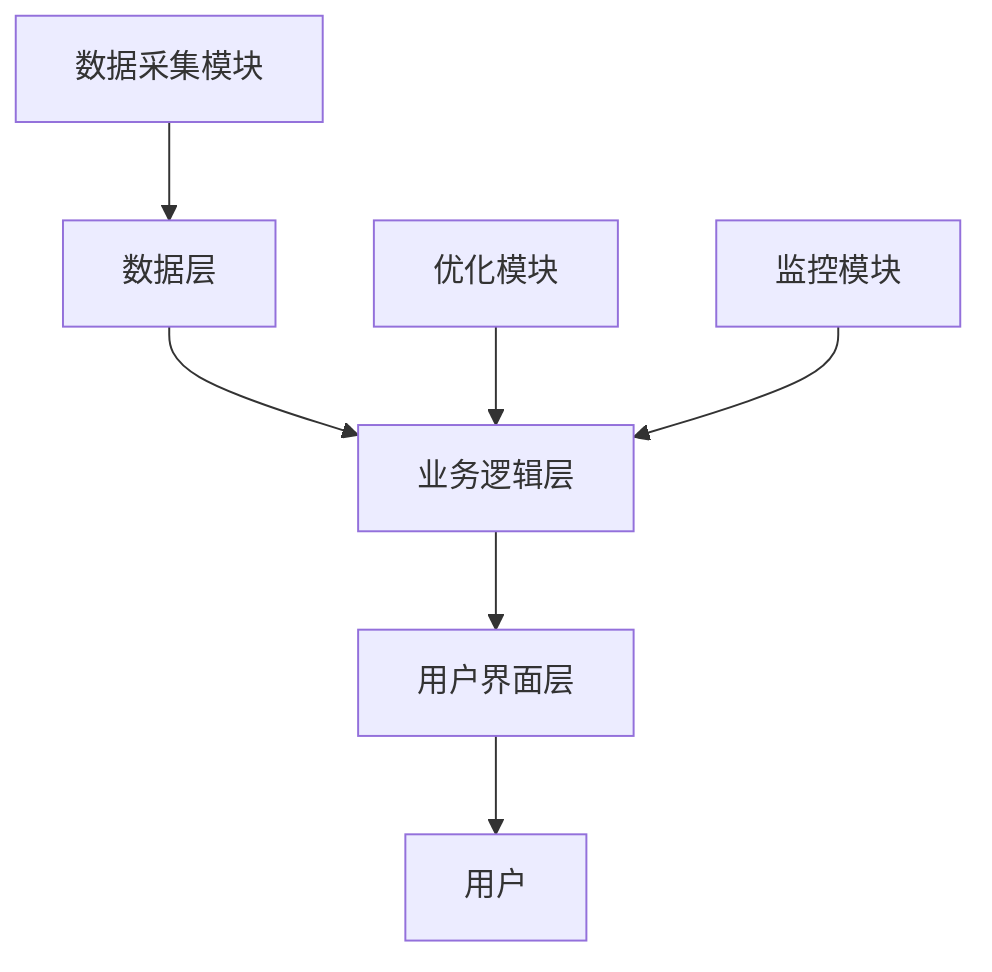

                 


# 格雷厄姆的股债平衡策略在现代市场中的应用

**关键词**：格雷厄姆、股债平衡、投资策略、数学模型、Python实现、系统架构

**摘要**：本文详细探讨了格雷厄姆的股债平衡策略在现代金融市场中的应用。通过分析该策略的核心理念、数学模型、系统架构和项目实现，本文为读者提供了从理论到实践的全面指导。结合Python代码和系统设计，本文展示了如何将经典投资策略应用于现代投资环境，帮助投资者在风险可控的前提下实现资产增值。

---

## 第1章: 格雷厄姆股债平衡策略的背景与核心理念

### 1.1 格雷厄姆投资理论的起源与核心思想

#### 1.1.1 本杰明·格雷厄姆的生平与贡献
- 介绍格雷厄姆作为价值投资之父的背景及其对投资理论的贡献。
- 强调格雷厄姆对安全边际和价值评估的重视。

#### 1.1.2 股债平衡策略的核心理念
- 股票与债券的基本属性对比。
- 格雷厄姆对资产配置的建议：分散投资、长期持有。
- 安全边际的概念及其在股债平衡中的作用。

#### 1.1.3 格雷厄姆策略的现代意义
- 分析现代金融市场与格雷厄姆时代的主要区别。
- 探讨股债平衡策略在当前市场中的适用性。

### 1.2 现代市场环境下的股债平衡策略

#### 1.2.1 现代金融市场的特点与挑战
- 股市波动性增加。
- 债市收益率下降。
- 经济周期对股债资产的影响。

#### 1.2.2 格雷厄姆策略的适应性与局限性
- 适应性：在波动性较大的市场中，股债平衡的优势。
- 局限性：在低利率环境下，债券收益率下降对策略的影响。

#### 1.2.3 股债平衡策略在不同经济周期的表现
- 经济衰退期：债券的优势。
- 经济复苏期：股票的增值潜力。
- 综合策略：动态调整资产比例。

### 1.3 股债平衡策略的核心要素与实施原则

#### 1.3.1 核心要素
- 资产比例：股票与债券的合理配比。
- 安全边际：买入价格与内在价值的差距。
- 分散投资：避免过度集中风险。

#### 1.3.2 实施原则
- 长期持有：避免频繁交易。
- 定期再平衡：根据市场变化调整资产配置。
- 逆向投资：在市场恐慌时增加配置。

---

## 第2章: 股债平衡策略的数学模型与算法实现

### 2.1 股票与债券的风险收益分析

#### 2.1.1 风险与收益的定义与度量
- 风险：收益的波动性。
- 收益：资产增值的幅度。
- 风险收益比：单位风险下的收益。

#### 2.1.2 股票与债券的风险收益特征对比
- 股票：高风险，高收益。
- 债券：低风险，稳定收益。
- 风险收益权衡：股债平衡的核心。

### 2.2 股债平衡策略的数学模型

#### 2.2.1 均值-方差优化模型
- 核心公式：
  $$\min \sigma^2 \text{ s.t. } \mu \geq r$$
  其中，$\sigma^2$为投资组合的方差，$\mu$为期望收益，$r$为最低收益要求。
- 优化目标：在满足收益要求的前提下，最小化投资组合的风险。

#### 2.2.2 Markowitz有效前沿理论
- 有效前沿的定义：所有可能的最优投资组合的集合。
- 图解：将风险与收益的关系可视化，帮助投资者找到最佳组合。

#### 2.2.3 格雷厄姆策略的数学表达式
- 资产配置比例：
  $$\text{股票比例} = \frac{1}{(1 + \text{债券比例})}$$
- 安全边际计算：
  $$\text{买入价格} = \text{内在价值} \times (1 - \text{安全边际率})$$

### 2.3 股债平衡策略的算法实现

#### 2.3.1 数据采集与预处理
- 数据来源：历史价格、收益率、宏观经济指标。
- 数据清洗：处理缺失值、异常值。

#### 2.3.2 资产配置模型的构建
- 使用Python的优化库（如`scipy.optimize`）实现均值-方差优化。
- 代码示例：
  ```python
  import numpy as np
  from scipy.optimize import minimize

  # 定义目标函数
  def portfolio_variance(weights):
      return np.dot(weights.T, np.dot(cov_matrix, weights))

  # 定义约束条件
  constraints = [{'type': 'eq', 'fun': lambda w: np.sum(w) - 1}]

  # 最小化方差
  result = minimize(portfolio_variance, initial_guess, constraints)
  ```

#### 2.3.3 算法实现的步骤与流程
- 步骤：
  1. 收集资产数据。
  2. 计算协方差矩阵。
  3. 设定优化目标。
  4. 求解优化问题。
  5. 输出最优资产配置。

---

## 第3章: 股债平衡策略的系统分析与架构设计

### 3.1 系统功能需求分析

#### 3.1.1 系统目标与功能模块划分
- 系统目标：实现股债平衡策略的自动化配置与监控。
- 功能模块：
  - 数据采集模块：收集股票和债券数据。
  - 风险评估模块：计算资产的风险收益比。
  - 资产配置模块：根据模型输出最优配置。
  - 监控模块：实时跟踪市场变化。

#### 3.1.2 用户需求分析
- 投资者：希望获得个性化的资产配置建议。
- 理财顾问：需要工具辅助客户管理投资组合。

#### 3.1.3 系统性能需求
- 数据处理速度：实时或准实时。
- 计算精度：确保优化结果的准确性。

### 3.2 系统架构设计

#### 3.2.1 分层架构设计
- 数据层：存储历史数据和实时数据。
- 业务逻辑层：实现数据处理和优化算法。
- 用户界面层：提供直观的操作界面。

#### 3.2.2 组件交互设计
- 数据采集模块与业务逻辑层的交互。
- 优化结果的可视化展示。

#### 3.2.3 数据流设计
- 数据从采集到处理的流程。
- 结果从计算到展示的路径。

### 3.3 系统接口设计

#### 3.3.1 输入接口设计
- 数据接口：接收股票和债券的历史与实时数据。
- 用户输入：资产规模、风险偏好等。

#### 3.3.2 输出接口设计
- 优化结果：资产配置比例。
- 报告输出：定期生成投资建议报告。

#### 3.3.3 接口交互流程
- 用户输入需求。
- 系统调用优化算法。
- 系统输出配置结果。

### 3.4 系统架构图


---

## 第4章: 股债平衡策略的项目实战

### 4.1 环境搭建与数据准备

#### 4.1.1 环境安装
- 安装Python、Pandas、NumPy、Matplotlib等库。
- 安装优化库，如`scipy.optimize`。

#### 4.1.2 数据准备
- 数据来源：Yahoo Finance、Alpha Vantage等。
- 数据格式：CSV或Excel。

### 4.2 核心代码实现

#### 4.2.1 数据采集与预处理
- 使用`pandas`读取数据：
  ```python
  import pandas as pd
  df = pd.read_csv('stock_data.csv')
  ```

#### 4.2.2 资产配置模型的实现
- 实现均值-方差优化：
  ```python
  def portfolio_variance(weights, covariance_matrix):
      return np.dot(weights.T, np.dot(covariance_matrix, weights))

  initial_guess = np.array([0.5, 0.5])
  result = minimize(portfolio_variance, initial_guess, args=(cov_matrix,))
  ```

#### 4.2.3 代码运行结果的分析
- 输出最优权重：
  ```python
  print(result.x)
  ```

### 4.3 案例分析与结果解读

#### 4.3.1 实际案例分析
- 假设资产规模为100万元，风险偏好中等。
- 计算结果：股票比例40%，债券比例60%。

#### 4.3.2 结果解读
- 股票部分：选择估值低的蓝筹股。
- 债券部分：配置长期国债和企业债。

### 4.4 项目小结

---

## 第5章: 格雷厄姆股债平衡策略的最佳实践与注意事项

### 5.1 最佳实践 tips
- 定期再平衡：每年调整一次。
- 结合宏观经济分析：判断经济周期。
- 使用技术工具辅助：利用算法优化配置。

### 5.2 小结
- 格雷厄姆策略的长期有效性。
- 现代市场的挑战与机遇。

### 5.3 注意事项
- 避免过度依赖算法，结合市场情绪。
- 定期评估策略的有效性。

### 5.4 拓展阅读
- 推荐书籍：《证券分析》（格雷厄姆原著）。
- 推荐工具：量化交易平台（如QuantConnect）。

---

## 作者：AI天才研究院 & 禅与计算机程序设计艺术

---

**本文通过系统分析和详细讲解，为读者提供了格雷厄姆股债平衡策略在现代市场中的应用指南。从理论到实践，从算法到系统设计，本文为投资者提供了全面的指导，帮助他们在复杂多变的市场中实现稳健投资。**

