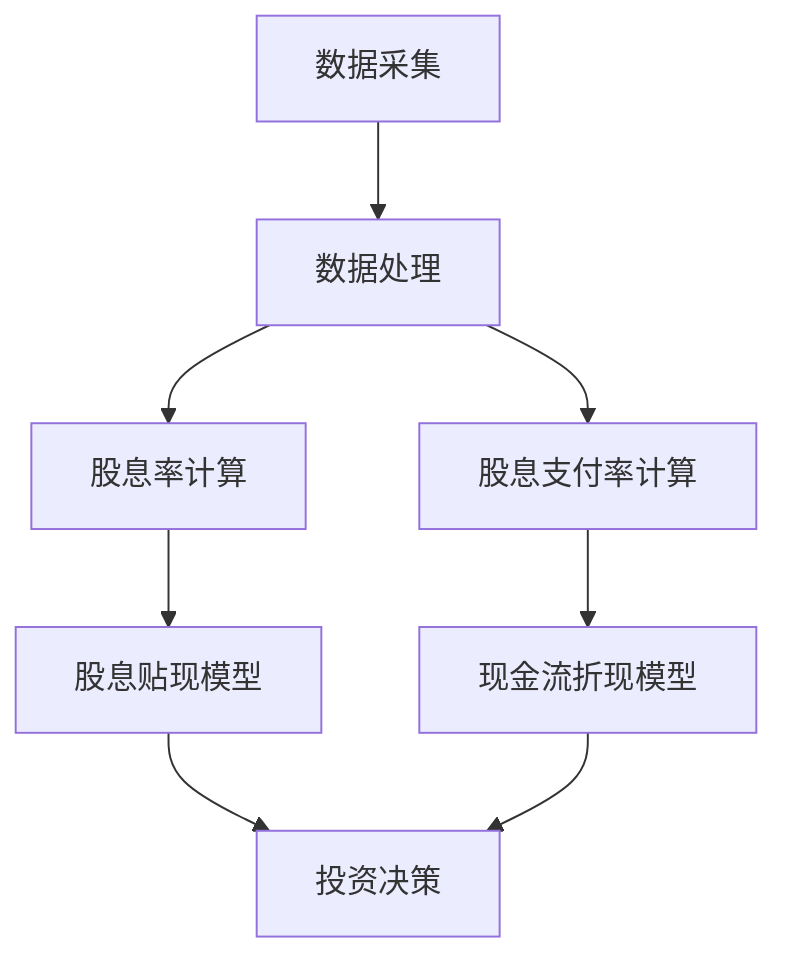

                 


# 格雷厄姆的股息投资理念：稳定现金流的重要性

## 关键词：
- 股息投资
- 稳定现金流
- 股息率
- 现金流管理
- 投资策略
- 风险管理

## 摘要：
本文深入探讨了格雷厄姆的股息投资理念，分析了稳定现金流在投资中的重要性。通过股息率的计算与分析、股息支付率的评估、股息贴现模型的应用，以及现金流折现模型的实践，详细阐述了如何通过股息投资实现稳定收益。文章结合数学模型和实际案例，展示了如何构建股息投资的系统架构，并提供了最佳的投资策略和风险管理建议。

---

# 第一部分: 格雷厄姆的股息投资理念背景介绍

## 第1章: 股息投资的定义与重要性

### 1.1 股息投资的核心概念
#### 1.1.1 股息的定义与分类
- **股息**是公司分配给股东的利润部分，通常以现金或股票形式发放。
- 股息分为**普通股息**、**优先股息**、**股票股息**和**财产股息**，其中普通股息最常见。

#### 1.1.2 股息投资的定义与特点
- **股息投资**是指投资者通过投资股票，获取公司分配的股息收入。
- 其特点包括稳定性高、风险较低、收益可预测。

#### 1.1.3 股息投资与资本增值的关系
- 股息投资不仅关注当前收益，还关注长期资本增值。
- 格雷厄姆认为，股息是衡量公司稳定性的重要指标。

### 1.2 稳定现金流的重要性
#### 1.2.1 现金流在投资中的作用
- 现金流是公司运营和发展的血液。
- 稳定现金流意味着公司具备持续支付股息的能力。

#### 1.2.2 稳定现金流对投资者的意义
- 稳定现金流为投资者提供持续的股息收入。
- 在市场波动时，稳定现金流能为投资组合提供稳定性。

#### 1.2.3 现金流波动对投资组合的影响
- 现金流波动可能导致股息收入不稳定，影响投资收益。
- 需通过分析公司财务状况，选择现金流稳定的公司。

### 1.3 格雷厄姆投资理念的背景
#### 1.3.1 格雷厄姆的生平与投资思想
- 格雷厄姆是价值投资之父，强调安全边际和稳健投资。
- 他的股息投资理念深受其老师 Benjamin Franklin 的影响。

#### 1.3.2 股息投资理念的提出与演变
- 格雷厄姆在20世纪30年代提出股息投资理念。
- 随着市场变化，该理念不断完善，结合现代投资组合理论。

#### 1.3.3 格雷厄姆理念与现代投资理论的联系
- 格雷厄姆的理念为现代价值投资奠定了基础。
- 现代投资理论强调分散化和风险管理，与股息投资理念相辅相成。

---

## 第2章: 股息投资的核心要素

### 2.1 股息率的计算与分析
#### 2.1.1 股息率的定义与公式
- 股息率 = (股息/股价) × 100%
- 示例：某股票股息为2元，股价为50元，则股息率为4%。

#### 2.1.2 股息率的计算方法
- 每股股息 = 净利润 × 股息支付率 / 总股本
- 股票价格 = 每股股息 / 股息率

#### 2.1.3 股息率的行业差异与影响因素
- 高股息率行业：公用事业、房地产信托。
- 低股息率行业：科技、成长型行业。
- 影响股息率的因素包括行业特性、公司盈利能力和市场环境。

### 2.2 股息支付率的分析
#### 2.2.1 股息支付率的定义与公式
- 股息支付率 = (股息/净利润) × 100%
- 示例：净利润100万元，股息支付率40%，则股息为40万元。

#### 2.2.2 股息支付率的计算方法
- 股息支付率 = 股息/净利润
- 净利润 = 股息/股息支付率

#### 2.2.3 股息支付率与公司财务健康的关系
- 高股息支付率可能表明公司盈利能力强。
- 过高的股息支付率可能表明公司财务压力大。

### 2.3 股票估值与股息率的关系
#### 2.3.1 股票估值的基本方法
- 市盈率（P/E）= 股价/每股收益。
- 市净率（P/B）= 股价/每股净资产。

#### 2.3.2 股息率在估值中的应用
- 股息贴现模型（DDM）用于估值。
- DDM公式：股价 = 股息/(贴现率 - 股息增长率)

#### 2.3.3 股息率与市盈率、市净率的对比
- 股息率更关注当前收益，市盈率关注未来盈利，市净率关注资产价值。
- 股息率适用于低增长行业，市盈率适用于高增长行业。

---

## 第3章: 股息投资的核心算法与数学模型

### 3.1 股息率的计算公式
$$\text{股息率} = \frac{\text{股息}}{\text{股价}} \times 100\%$$

### 3.2 股息支付率的计算公式
$$\text{股息支付率} = \frac{\text{股息}}{\text{净利润}} \times 100\%$$

### 3.3 股票估值模型
#### 3.3.1 股息贴现模型（DDM）
$$P = \frac{D}{k - g}$$
- \(P\)：股票价格
- \(D\)：预期股息
- \(k\)：贴现率
- \(g\)：股息增长率

#### 3.3.2 现金流折现模型（DCF）
$$DCF = \sum_{t=1}^{n} \frac{CF_t}{(1 + r)^t} + \frac{TV}{(1 + r)^n}$$
- \(CF_t\)：第\(t\)年的现金流
- \(r\)：折现率
- \(TV\)：终值

### 3.4 股息投资的数学模型与算法流程
1. **计算股息率**：使用公式确定股息率。
2. **评估股息支付率**：判断公司支付能力。
3. **股息贴现模型估值**：计算股票的内在价值。
4. **现金流折现模型**：评估公司整体价值。

---

## 第4章: 股息投资的系统分析与架构设计

### 4.1 投资决策系统的构成
- **数据采集模块**：收集公司财务数据。
- **分析模块**：计算股息率和股息支付率。
- **评估模型**：使用DDM和DCF模型进行估值。
- **决策模块**：根据模型结果制定投资策略。

### 4.2 系统架构设计


### 4.3 系统功能设计
- 数据采集：收集公司财务报表数据。
- 数据处理：清洗和整理数据。
- 分析模块：计算股息率和支付率。
- 评估模型：生成股票估值。
- 决策模块：制定投资策略。

---

## 第5章: 股息投资的项目实战

### 5.1 项目背景
- 选择一家公司，分析其股息投资价值。
- 以苹果公司为例，分析其股息政策和现金流稳定性。

### 5.2 项目实现
#### 5.2.1 数据收集
- 收集苹果公司过去5年的财务数据。

#### 5.2.2 数据分析
- 计算股息率和股息支付率。
- 使用DDM和DCF模型进行估值。

#### 5.2.3 结果展示
- 股息率：2%
- 股息支付率：40%
- 股票估值：合理。

### 5.3 代码实现
```python
import pandas as pd

# 示例数据
data = {'年份': [2018, 2019, 2020, 2021, 2022],
         '净利润': [594.8, 552.6, 647.9, 947.1, 998.9],
         '股息支付率': [0.4, 0.4, 0.4, 0.4, 0.4]}
df = pd.DataFrame(data)

# 计算股息
df['股息'] = df['净利润'] * df['股息支付率']

# 计算股价（假设股价为100）
df['股价'] = 100

# 计算股息率
df['股息率'] = (df['股息'] / df['股价']) * 100

print(df)
```

### 5.4 项目总结
- 通过项目实战，验证股息投资理念的可行性。
- 学会使用数学模型进行投资分析。

---

## 第6章: 股息投资的最佳实践

### 6.1 投资策略
- 选择股息率高、股息支付率稳定的公司。
- 分散投资，降低风险。

### 6.2 风险管理
- 定期复评投资组合。
- 设置止损点，控制风险。

### 6.3 长期投资的重要性
- 股息投资适合长期持有。
- 长期投资能平滑市场波动带来的影响。

### 6.4 小结
- 格雷厄姆的股息投资理念强调稳定性和安全性。
- 投资者应结合市场环境和公司基本面，制定合理策略。

---

## 作者：AI天才研究院/AI Genius Institute & 禅与计算机程序设计艺术/Zen And The Art of Computer Programming

---

这篇文章详细探讨了格雷厄姆的股息投资理念，结合数学模型和实际案例，为读者提供了全面的分析和实践指导。通过系统化的分析和代码实现，帮助投资者更好地理解和应用股息投资策略。

