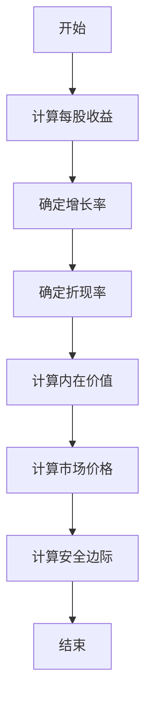
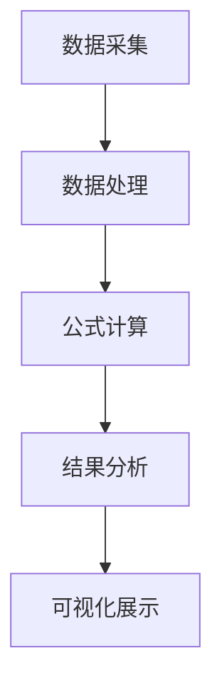
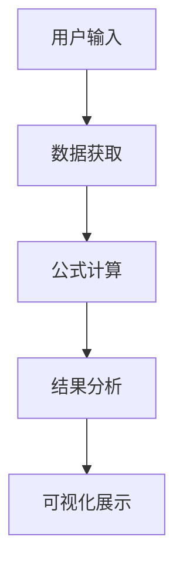

                 


# 《格雷厄姆的股票选择公式》

> 关键词：价值投资，安全边际，内在价值，市盈率，市净率，投资组合优化

> 摘要：本文详细介绍了格雷厄姆的股票选择公式，探讨了其背后的理论基础、数学模型以及实际应用。通过逐步分析，揭示了格雷厄姆投资理念的核心思想，并结合实际案例展示了如何使用该公式进行股票筛选和投资决策。

---

## 第一部分: 格雷厄姆的股票选择公式概述

### 第1章: 投资的基础与格雷厄姆的投资理念

#### 1.1 投资的基本概念
- 什么是投资？投资的本质是通过资源配置实现财富增值。
- 投资的目的：追求资产的保值与增值。
- 投资的意义：帮助个人和机构实现财务目标。

#### 1.2 格雷厄姆与价值投资的起源
- 格雷厄姆的贡献：被誉为“价值投资之父”，其投资理念深刻影响了巴菲特等投资大师。
- 价值投资的核心思想：买入低于内在价值的股票，长期持有，等待市场回归理性。
- 安全边际的概念：通过购买价格低于内在价值的股票，降低投资风险。

---

### 第2章: 格雷厄姆股票选择公式的背景与核心要素

#### 2.1 格雷厄姆股票选择公式的背景
- 股票市场的基本特性：波动性、不确定性和周期性。
- 投资者面临的挑战：信息不对称、情绪影响决策、市场波动带来的风险。
- 格雷厄姆公式的历史演变：从最初的简单筛选到逐步完善的数学模型。

#### 2.2 格雷厄姆股票选择公式的构成
- 核心要素：内在价值、安全边际、市盈率、市净率。
- 内在价值的定义：企业未来现金流的现值。
- 安全边际的定义：市场价格与内在价值之间的差异。

---

## 第二部分: 格雷厄姆股票选择公式的数学模型与公式

### 第3章: 格雷厄姆股票选择公式的数学模型与公式

#### 3.1 内在价值的计算公式
- 内在价值的计算公式：
$$
\text{内在价值} = \frac{\text{每股收益} \times (1 + \text{增长率})}{\text{折现率}}
$$
- 案例分析：假设某公司每股收益为 $10，增长率 $5\%，折现率 $10\%。
$$
\text{内在价值} = \frac{10 \times 1.05}{0.10} = 105
$$

#### 3.2 安全边际的计算公式
- 安全边际的计算公式：
$$
\text{安全边际} = \text{内在价值} - \text{市场价格}
$$
- 案例分析：某股票内在价值为 $100，市场价格为 $80。
$$
\text{安全边际} = 100 - 80 = 20
$$

#### 3.3 公式流程图


---

## 第三部分: 格雷厄姆股票选择公式的系统分析与架构设计

### 第4章: 格雷厄姆股票选择公式的系统分析

#### 4.1 系统分析
- 投资决策系统的构成：数据采集、计算、分析、可视化。
- 数据采集模块：获取公司财务数据、市场数据。
- 计算模块：计算内在价值、安全边际。
- 分析模块：筛选符合标准的股票。
- 可视化模块：生成报告、图表。

#### 4.2 系统架构设计


#### 4.3 系统交互流程


---

## 第四部分: 格雷厄姆股票选择公式的项目实战

### 第5章: 项目实战

#### 5.1 环境安装
- 安装Python环境：使用Anaconda或PyCharm。
- 安装相关库：Pandas、NumPy、Matplotlib。

#### 5.2 核心代码实现
```python
import pandas as pd
import numpy as np

def calculate_intrinsic_value(eps, growth_rate, discount_rate):
    return (eps * (1 + growth_rate)) / discount_rate

def calculate_margin_of_safety(intrinsic_value, market_price):
    return intrinsic_value - market_price

# 示例数据
eps = 10
growth_rate = 0.05
discount_rate = 0.10
market_price = 80

# 计算内在价值
intrinsic_value = calculate_intrinsic_value(eps, growth_rate, discount_rate)
print(f"内在价值: {intrinsic_value}")

# 计算安全边际
margin_of_safety = calculate_margin_of_safety(intrinsic_value, market_price)
print(f"安全边际: {margin_of_safety}")
```

#### 5.3 案例分析
- 数据获取：从Yahoo Finance获取股票数据。
- 计算内在价值与安全边际。
- 筛选符合标准的股票：安全边际为正，且市盈率低于行业平均水平。

#### 5.4 代码应用解读
- 数据获取：使用Pandas库从网络获取股票数据。
- 数据处理：计算每股收益、市盈率、市净率。
- 公式计算：计算内在价值与安全边际。
- 可视化：绘制股票筛选结果图表。

---

## 第五部分: 总结与展望

### 第6章: 总结与展望

#### 6.1 总结
- 格雷厄姆股票选择公式的核心思想：寻找低于内在价值的股票，通过安全边际降低投资风险。
- 公式的实际应用：帮助投资者筛选优质股票，制定投资策略。

#### 6.2 未来展望
- 结合AI技术：利用机器学习算法优化股票筛选过程。
- 多因子模型：结合更多财务指标，提高筛选精度。
- 动态调整：根据市场变化动态调整投资组合。

---

## 作者：AI天才研究院/AI Genius Institute & 禅与计算机程序设计艺术 /Zen And The Art of Computer Programming

