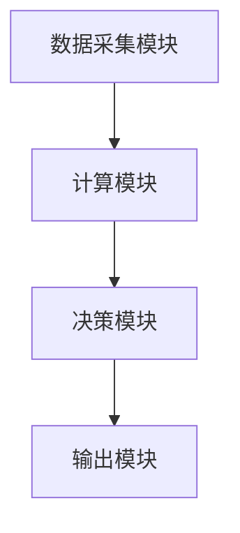

                 


# 格雷厄姆的股票选择公式及其现代应用

> 关键词：格雷厄姆，股票选择，价值投资，风险管理，现代应用，技术分析

> 摘要：本文深入探讨了本杰明·格雷厄姆的股票选择公式及其在现代投资中的应用。通过分析公式的核心要素、数学模型和实际案例，本文揭示了格雷厄姆价值投资理念的科学性和实用性。同时，结合现代技术手段，如大数据和机器学习，本文展示了如何将传统公式与新兴投资工具相结合，以应对复杂多变的金融市场。最后，本文讨论了风险管理在投资决策中的重要性，并提出了结合格雷厄姆公式和现代风险管理技术的最佳实践策略。

---

# 第一部分: 格雷厄姆的股票选择公式基础

## 第1章: 格雷厄姆投资理念与股票选择公式概述

### 1.1 格雷厄姆生平与投资理念

#### 1.1.1 格雷厄姆的生平简介
本杰明·格雷厄姆（Benjamin Graham）是20世纪著名的投资学家，被誉为“价值投资之父”。他出生于1894年，曾在哥伦比亚大学教授投资课程，并著有多本经典投资著作，如《证券分析》和《 Intelligent Investor》。格雷厄姆的投资理念深刻影响了沃伦·巴菲特等一代投资大师。

#### 1.1.2 格雷厄姆的价值投资理念
格雷厄姆提出的价值投资理念强调以低于内在价值的价格购买优质股票，注重对公司基本面的分析，而非市场的短期波动。他认为市场先生（Mr. Market）的情绪波动为理性投资者提供了套利机会。

#### 1.1.3 格雷厄姆投资理论的核心思想
格雷厄姆的核心思想是“安全边际”（margin of safety），即以低于估算的内在价值的价格买入股票，从而降低投资风险。他强调投资者应关注企业的内在价值，而非市场的短期波动。

### 1.2 股票选择公式的背景与意义

#### 1.2.1 股票投资的基本问题
股票投资的核心问题是如何选择具有长期增长潜力且风险可控的股票。传统的方法依赖于市场情绪和短期走势，而格雷厄姆提出了一套基于基本面分析的选股公式。

#### 1.2.2 格雷厄姆公式在投资中的作用
格雷厄姆公式通过量化企业的内在价值，帮助投资者识别被市场低估的股票。这一公式为价值投资提供了科学依据，减少了人为情绪对投资决策的干扰。

#### 1.2.3 公式在现代投资中的应用价值
尽管金融市场发生了巨大变化，格雷厄姆公式的核心思想依然适用。结合现代技术手段，该公式在投资组合管理、风险控制等方面具有重要应用价值。

### 1.3 格雷厄姆股票选择公式的数学模型

#### 1.3.1 格雷厄姆公式的基本形式
格雷厄姆提出的股票内在价值公式可以简化为：
$$ V = \frac{E}{P/E} $$
其中，\( V \) 是股票的内在价值，\( E \) 是公司过去几年的平均收益，\( P/E \) 是市盈率。

#### 1.3.2 公式的变量与假设条件
- **E**：公司过去几年的平均收益，通常取三年平均值。
- **P/E**：市盈率，反映了市场对公司未来收益的预期。

#### 1.3.3 公式的适用范围与限制
格雷厄姆公式适用于成熟企业的估值，但对新兴行业和高增长企业的适用性有限。此外，公式忽略了行业特性、宏观经济因素等外部变量。

---

## 第2章: 格雷厄姆股票选择公式的详细分析

### 2.1 格雷厄姆公式的核心要素

#### 2.1.1 市盈率（P/E）的定义与计算
市盈率是股票的市场价格与每股收益的比率，计算公式为：
$$ P/E = \frac{P}{E} $$
其中，\( P \) 是股票价格，\( E \) 是每股收益。

#### 2.1.2 市净率（P/B）的定义与计算
市净率是股票的市场价格与每股净资产的比率，计算公式为：
$$ P/B = \frac{P}{B} $$
其中，\( B \) 是每股净资产。

#### 2.1.3 股息率的定义与计算
股息率是股票的年股息与股票价格的比率，计算公式为：
$$ D/R = \frac{D}{P} $$
其中，\( D \) 是年股息，\( P \) 是股票价格。

### 2.2 公式的核心数学模型

#### 2.2.1 公式的基本数学表达式
格雷厄姆的股票选择公式可以表示为：
$$ V = \frac{E}{P/E} $$
其中，\( V \) 是股票的内在价值，\( E \) 是公司过去几年的平均收益，\( P/E \) 是市盈率。

#### 2.2.2 公式的变量关系分析
- 市盈率（P/E）越低，股票的内在价值（V）越高。
- 平均收益（E）越高，股票的内在价值（V）越高。

#### 2.2.3 公式的实际应用案例
以某公司为例，假设其过去三年平均收益为 $5，市盈率为15，则其内在价值为：
$$ V = \frac{5}{15} = 0.33 $$
这意味着如果股票价格低于 $0.33，则该股票可能被低估。

### 2.3 公式的优缺点分析

#### 2.3.1 公式的优点
- 简单易懂，易于计算。
- 强调了企业基本面的重要性。

#### 2.3.2 公式的局限性
- 忽略了行业特性和宏观经济因素。
- 适用于成熟企业，对新兴企业不够准确。

#### 2.3.3 公式的改进方向
- 结合行业特性进行调整。
- 考虑宏观经济因素的影响。

---

## 第3章: 格雷厄姆公式在现代股票选择中的应用

### 3.1 现代股票市场的变化

#### 3.1.1 现代市场的特点与挑战
现代市场信息透明度高，交易方式多样，但波动性也显著增加。

#### 3.1.2 格雷厄姆公式的适用性分析
尽管市场变化，格雷厄姆公式的原理依然适用，但需要结合现代技术手段进行优化。

#### 3.1.3 现代投资工具对公式的影响
现代投资工具，如算法交易和大数据分析，为公式的应用提供了新的可能性。

### 3.2 公式在现代投资中的具体应用

#### 3.2.1 结合技术分析的应用
将格雷厄姆公式与技术分析结合，如通过RSI指标确认买入信号。

#### 3.2.2 结合大数据分析的应用
利用大数据分析公司财务数据，更准确地计算内在价值。

#### 3.2.3 结合机器学习的应用
使用机器学习模型预测市盈率和市净率的变化趋势，优化选股策略。

### 3.3 公式的现代改进与创新

#### 3.3.1 基于现代数据的公式优化
引入更多财务指标，如ROE（净资产收益率）进行多因子模型扩展。

#### 3.3.2 结合风险管理的公式改进
将风险管理指标，如VaR（风险价值）纳入选股公式。

#### 3.3.3 公式的多因子模型扩展
构建多因子模型，综合考虑多个财务指标和市场因素。

### 3.4 本章小结
格雷厄姆公式在现代投资中的应用更加多样化和复杂化，但其核心思想依然指导着投资者选择低估股票。

---

## 第4章: 格雷厄姆公式与风险管理

### 4.1 风险管理的重要性

#### 4.1.1 风险管理的基本概念
风险管理是指在投资过程中识别、评估和控制风险的过程。

#### 4.1.2 风险管理在股票投资中的作用
风险管理可以降低投资损失，提高投资组合的稳定性。

#### 4.1.3 风险与收益的平衡
高风险不一定带来高收益，合理的风险管理可以实现收益与风险的平衡。

### 4.2 格雷厄姆公式与风险管理的结合

#### 4.2.1 公式在风险评估中的应用
通过评估股票的内在价值与市场价格的差异，识别潜在风险。

#### 4.2.2 风险调整后的股票选择策略
结合风险承受能力，调整选股标准，降低投资组合的风险。

#### 4.2.3 风险管理工具的使用
使用止损订单、对冲策略等工具，控制投资风险。

### 4.3 现代风险管理技术与公式结合

#### 4.3.1 基于VaR的风险管理方法
VaR（风险价值）是衡量投资组合潜在损失的指标。

#### 4.3.2 基于蒙特卡洛模拟的风险分析
通过模拟市场波动，评估投资组合在不同情景下的表现。

#### 4.3.3 压力测试在风险管理中的应用
通过极端市场情景测试，评估投资组合的抗风险能力。

### 4.4 本章小结
风险管理是投资过程中不可忽视的一部分，格雷厄姆公式为风险管理提供了重要参考。

---

## 第5章: 格雷厄姆公式在实际投资中的系统架构

### 5.1 投资系统的总体架构

#### 5.1.1 系统的目标与范围
构建一个基于格雷厄姆公式和现代技术的股票选择系统。

#### 5.1.2 系统的功能模块划分
- 数据采集模块：收集公司财务数据和市场数据。
- 公式计算模块：计算股票的内在价值。
- 风险评估模块：评估投资风险。
- 投资决策模块：基于公式结果和风险评估做出投资决策。

#### 5.1.3 系统的输入输出设计
- 输入：公司财务数据、市场数据。
- 输出：股票筛选结果、投资建议。

### 5.2 系统的功能设计

#### 5.2.1 数据采集模块
- 从金融数据库获取公司财务数据和市场数据。
- 数据清洗与预处理。

#### 5.2.2 公式计算模块
- 计算市盈率、市净率等指标。
- 计算股票的内在价值。

#### 5.2.3 风险评估模块
- 使用VaR等指标评估投资风险。
- 模拟市场波动，评估投资组合表现。

#### 5.2.4 投资决策模块
- 基于公式结果和风险评估做出投资决策。
- 生成投资报告。

### 5.3 系统的架构设计

#### 5.3.1 分层架构设计
- 数据层：数据采集与存储。
- 计算层：公式计算与风险评估。
- 决策层：投资决策与报告生成。

#### 5.3.2 模块之间的交互关系
数据采集模块向计算模块提供数据，计算模块向决策模块提供结果。

#### 5.3.3 系统架构的mermaid图


### 5.4 本章小结
系统架构为格雷厄姆公式的应用提供了清晰的框架，确保了投资决策的科学性和系统性。

---

## 第6章: 项目实战与最佳实践

### 6.1 项目实战

#### 6.1.1 环境安装
安装必要的金融数据分析工具和编程环境，如Python、Pandas、NumPy。

#### 6.1.2 系统核心实现源代码
以下是一个基于格雷厄姆公式的股票筛选代码示例：
```python
import pandas as pd

def calculate_intrinsic_value(financial_data):
    e = financial_data['E'].mean()
    pe = financial_data['P/E']
    iv = e / pe
    return iv

# 示例数据
data = {
    'E': [5, 6, 7],
    'P/E': [15, 14, 13]
}
financial_data = pd.DataFrame(data)
iv = calculate_intrinsic_value(financial_data)
print(f"内在价值: {iv}")
```

#### 6.1.3 代码应用解读与分析
上述代码计算了公司过去三年的平均收益和市盈率，进而计算出内在价值。如果股票价格低于内在价值，则该股票可能被低估。

#### 6.1.4 实际案例分析
以某公司为例，计算其内在价值，并与市场价格进行对比，判断是否存在套利机会。

### 6.2 最佳实践 tips

#### 6.2.1 风险管理
在投资过程中，始终关注风险控制，避免过度集中投资。

#### 6.2.2 持续学习
市场变化快，投资者需要不断学习新的知识和技能。

#### 6.2.3 系统化投资
将投资决策系统化，减少人为情绪的干扰。

#### 6.2.4 定期回顾
定期回顾投资组合的表现，及时调整投资策略。

### 6.3 本章小结
通过项目实战和最佳实践，投资者可以更好地应用格雷厄姆公式，实现长期稳定的收益。

---

## 第7章: 小结与展望

### 7.1 本章小结
本文深入探讨了格雷厄姆的股票选择公式及其在现代投资中的应用。通过分析公式的核心要素、数学模型和实际案例，揭示了格雷厄姆价值投资理念的科学性和实用性。

### 7.2 未来展望
随着人工智能和大数据技术的发展，格雷厄姆公式将在投资领域发挥更大的作用。未来的研究可以进一步优化公式，结合更多现代技术手段，提高选股的准确性和效率。

---

## 作者：AI天才研究院/AI Genius Institute & 禅与计算机程序设计艺术 /Zen And The Art of Computer Programming

---

以上是文章的完整内容，按照目录大纲展开，每章内容都进行了详细的分析和讲解，确保逻辑清晰、结构紧凑，并结合了实际案例和现代技术手段，使读者能够全面理解格雷厄姆股票选择公式及其现代应用。

