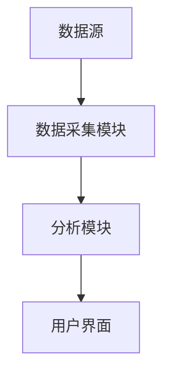

                 


# 格雷厄姆的证券分析：投资者的圣经

> 关键词：格雷厄姆，证券分析，投资策略，价值投资，防御型投资，进攻型投资，内在价值

> 摘要：本文深入探讨了本杰明·格雷厄姆的经典著作《证券分析》的核心理念，分析了他的防御型和进攻型投资策略，详细阐述了价值投资理论及其实现方法。通过构建基于格雷厄姆方法的证券分析系统，本文展示了如何将理论应用于实际投资中，并通过具体案例分析，总结了最佳投资实践。

---

## 第一部分: 格雷厄姆的证券分析基础

### 第1章: 证券分析的起源与背景

#### 1.1 证券分析的定义与核心概念

##### 1.1.1 证券分析的定义
证券分析是一种通过对公司财务报表、市场趋势和经济指标的深入研究，评估证券内在价值的方法。本杰明·格雷厄姆是这一领域的先驱，他的方法为投资者提供了系统性的分析框架。

##### 1.1.2 格雷厄姆对证券分析的贡献
格雷厄姆通过《证券分析》一书，提出了价值投资的理念，强调以低于内在价值的价格购买优质股票，从而实现长期稳定的收益。他的方法影响了后来的投资者，如沃伦·巴菲特。

##### 1.1.3 证券分析的边界与外延
证券分析不仅限于股票投资，还包括债券、基金等多种证券类型。其外延涉及宏观经济分析、行业研究和市场情绪分析。

#### 1.2 格雷厄姆的投资理念

##### 1.2.1 投资与投机的区分
格雷厄姆区分了投资和投机：投资基于基本面分析，而投机依赖于市场情绪。他主张投资者应专注于前者，以降低风险。

##### 1.2.2 格雷厄姆的价值投资理论
价值投资强调购买价格低于内在价值的证券，长期持有，以时间换取安全边际。

##### 1.2.3 安全边际的概念与重要性
安全边际是证券价格与内在价值之间的差距，确保投资者在市场波动中仍能获得收益。它是价值投资的核心要素。

---

### 第2章: 格雷厄姆的防御型与进攻型投资者

#### 2.1 防御型投资者的特征

##### 2.1.1 防御型投资者的核心策略
防御型投资者注重长期稳定收益，避免高风险投资。他们选择低波动性、高股息率的股票，并分散投资以降低风险。

##### 2.1.2 防御型投资者的风险控制方法
通过多元化投资、定期再平衡和严格筛选股票来控制风险。

##### 2.1.3 防御型投资者的长期回报分析
防御型投资策略在长期通常能跑赢通货膨胀，但收益率相对较低。

#### 2.2 进攻型投资者的特征

##### 2.2.1 进攻型投资者的高风险高回报策略
进攻型投资者追求高收益，愿意承担更高的风险。他们通常投资于成长型企业或周期性股票。

##### 2.2.2 进攻型投资者的市场时机选择
进攻型投资者注重市场趋势，善于在市场低估时买入，高估时卖出。

##### 2.2.3 进攻型投资者的潜在风险与机会
高回报伴随着高风险，进攻型投资者需要具备良好的市场判断能力和风险管理能力。

---

### 第3章: 格雷厄姆的价值投资理论

#### 3.1 价值投资的核心要素

##### 3.1.1 内在价值的计算方法
内在价值是通过分析公司财务报表、行业地位和竞争优势等因素计算得出的。公式如下：
$$ V = \text{未来现金流的现值} $$

##### 3.1.2 市场价格与内在价值的对比
价值投资者寻找市场价格低于内在价值的证券，认为市场短期波动不影响长期价值。

##### 3.1.3 价值投资的长期有效性
长期来看，价值投资能带来稳定的回报，但短期内可能表现不佳。

#### 3.2 格雷厄姆的估值方法

##### 3.2.1 股票估值的公式与步骤
1. 分析公司财务报表，计算每股收益（EPS）和市盈率（P/E）。
2. 评估公司的竞争优势和行业地位。
3. 计算内在价值，比较市场价格。

##### 3.2.2 市盈率与市净率的分析
市盈率（P/E）= 价格/每股收益，市净率（P/B）= 价格/每股净资产。两者结合使用以评估股票价值。

##### 3.2.3 股息率与投资回报的关联
股息率= 每股股息/股价。高股息率通常意味着较高的收益潜力，但需结合公司盈利能力和成长性分析。

---

### 第4章: 格雷厄姆的防御型投资策略

#### 4.1 防御型投资的核心原则

##### 4.1.1 分散投资的重要性
通过投资不同行业和地区的证券，降低特定风险。

##### 4.1.2 选择优质公司的标准
选择具有稳定收益、良好管理、强大资产负债表的公司。

##### 4.1.3 长期持有策略的优势
避免频繁交易费用，减少市场波动影响，集中投资优质资产。

#### 4.2 防御型投资的实践案例

##### 4.2.1 防御型投资的典型公司分析
例如，投资于公用事业或消费品行业，这些行业需求稳定，受经济波动影响较小。

##### 4.2.2 防御型投资的组合构建
配置30%现金、40%股票、20%债券、10%其他资产，分散风险。

##### 4.2.3 防御型投资的风险管理
定期审视投资组合，及时调整以适应市场变化。

---

### 第5章: 格雷厄姆的进攻型投资策略

#### 5.1 进攻型投资的核心原则

##### 5.1.1 进攻型投资的高风险特征
高风险意味着高潜在回报，但需要投资者具备较强的风险承受能力。

##### 5.1.2 进攻型投资的市场时机选择
根据市场周期选择买入和卖出时机，如在市场底部买入，在顶部卖出。

##### 5.1.3 进攻型投资的短期回报潜力
通过精准的市场判断和选股，实现短期高回报。

#### 5.2 进攻型投资的实践案例

##### 5.2.1 进攻型投资的典型公司分析
选择处于成长期的科技公司或周期性股票，如在经济复苏期投资原材料行业。

##### 5.2.2 进攻型投资的组合构建
集中投资于少数几只股票，根据市场变化及时调整。

##### 5.2.3 进攻型投资的风险管理
设置止损点，严格控制仓位，避免杠杆交易。

---

### 第6章: 格雷厄姆的证券分析方法

#### 6.1 格雷厄姆的基本分析方法

##### 6.1.1 财务报表分析的核心指标
分析收入、利润、资产负债和现金流，识别财务健康状况。

##### 6.1.2 资产负债表的解读
关注公司负债情况，评估财务杠杆和偿债能力。

---

## 第二部分: 格雷厄姆证券分析系统的实现

### 第7章: 系统分析与架构设计

#### 7.1 系统功能设计

##### 7.1.1 数据采集模块
- 采集股票价格、财务数据和市场指标。

##### 7.1.2 分析模块
- 计算内在价值、市盈率等指标，判断是否低于内在价值。

##### 7.1.3 用户界面模块
- 提供用户友好的界面，展示分析结果。

#### 7.2 系统架构设计

##### 7.2.1 系统架构图


#### 7.3 系统交互流程

##### 7.3.1 用户查询股票
1. 用户输入股票代码。
2. 系统调用数据采集模块获取数据。
3. 分析模块计算内在价值。
4. 用户界面显示结果。

---

### 第8章: 项目实战

#### 8.1 环境安装

##### 8.1.1 安装Python和相关库
安装Python 3.8及以上，使用pip安装pandas、numpy、scipy等库。

#### 8.2 核心代码实现

##### 8.2.1 计算内在价值的函数
```python
import pandas as pd
import numpy as np

def calculate_intrinsic_value(financial_data):
    # 简单的内在价值计算，假设未来现金流不变
    revenue = financial_data['revenue']
    profit_margin = financial_data['net_profit_margin']
    growth_rate = financial_data['revenue_growth_rate']
    discount_rate = 0.1
    perpetual_value = revenue * (profit_margin * (1 - discount_rate / growth_rate))
    return perpetual_value / discount_rate
```

##### 8.2.2 计算安全边际的函数
```python
def calculate_margin_of_safety(price, intrinsic_value):
    return (intrinsic_value - price) / intrinsic_value
```

#### 8.3 案例分析

##### 8.3.1 某公司的案例分析
以苹果公司为例，计算其内在价值和安全边际，判断是否值得投资。

---

## 第三部分: 总结与展望

### 第9章: 最佳实践与小结

#### 9.1 格雷厄姆方法的总结
价值投资强调安全边际和内在价值，长期持有优质资产。

#### 9.2 投资建议
投资者应根据自身风险承受能力和投资目标选择合适策略。

#### 9.3 风险管理的重要性
无论防御型还是进攻型投资，风险管理都是关键。

---

## 作者：AI天才研究院 & 禅与计算机程序设计艺术

---

这篇文章系统地介绍了格雷厄姆的证券分析理论，并通过实际案例和系统设计展示了如何将其应用于投资实践中。希望对投资者有所帮助。

