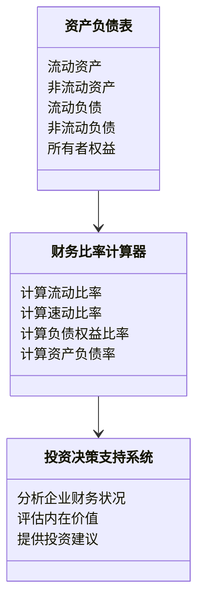
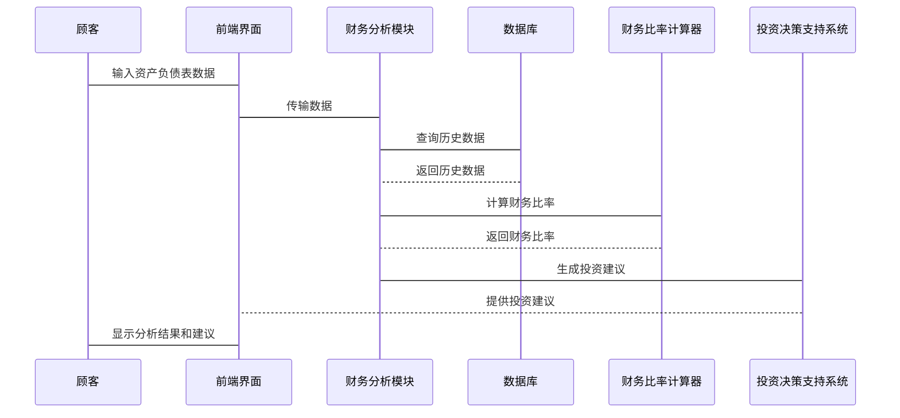

                 


# 目录大纲：《格雷厄姆的资产负债表分析技巧》

---

## 文章标题：格雷厄姆的资产负债表分析技巧

---

### 关键词：
- 资产负债表分析
- 格雷厄姆分析法
- 价值投资
- 财务报表分析
- 资产评估

---

### 摘要：
本文深入探讨了格雷厄姆的资产负债表分析技巧，结合其价值投资理念，系统地介绍了如何通过分析资产负债表来评估企业财务健康状况、识别投资机会和规避财务风险。文章从资产负债表的基本概念、核心分析方法、数学模型、系统架构设计到实际案例分析，层层展开，帮助读者掌握格雷厄姆的分析技巧，并将其应用于实际投资决策中。

---

## 第一部分：背景介绍

### 第1章：资产负债表的基本概念

#### 1.1 资产负债表的定义与作用
- **1.1.1 资产负债表的定义**
  - 资产负债表是反映企业在某一特定时点的财务状况的报表，包含资产、负债和所有者权益三个部分。
  - 资产负债表的平衡关系：资产 = 负债 + 所有者权益。

- **1.1.2 资产负债表的作用**
  - 评估企业的财务健康状况。
  - 识别企业的财务风险。
  - 为投资决策提供重要依据。

- **1.1.3 资产负债表与其他财务报表的关系**
  - 资产负债表与利润表的关系：利润表反映企业的经营成果，资产负债表反映企业的财务状况。
  - 资产负债表与现金流量表的关系：现金流量表反映企业的现金流动情况，资产负债表反映企业的财务结构。

#### 1.2 资产负债表分析的重要性
- **1.2.1 投资决策中的关键作用**
  - 通过分析资产负债表，投资者可以评估企业的偿债能力、运营能力和盈利能力。
  - 资产负债表分析是价值投资的核心步骤之一。

- **1.2.2 评估企业财务健康状况**
  - 分析企业的资产结构、负债结构和所有者权益状况。
  - 识别企业的财务风险，如流动性风险、偿债风险等。

- **1.2.3 识别潜在财务风险**
  - 通过分析资产负债表，识别企业的潜在财务问题，如资产质量下降、负债过高、现金流不足等。

#### 1.3 格雷厄姆的分析方法
- **1.3.1 价值投资的核心理念**
  - 格雷厄姆是价值投资的鼻祖，主张以低于内在价值的价格买入优质股票。
  - 资产负债表分析是其投资决策的重要组成部分。

- **1.3.2 资产负债表分析的独特视角**
  - 格雷厄姆注重企业的资产质量、负债结构和财务稳定性。
  - 他强调通过分析资产负债表来评估企业的内在价值。

- **1.3.3 格雷厄姆分析法的步骤与特点**
  - **步骤**：
    1. 分析资产质量，评估企业的核心资产价值。
    2. 分析负债结构，评估企业的偿债能力。
    3. 综合分析，评估企业的财务健康状况和内在价值。
  - **特点**：
    - 强调安全边际，即以低于内在价值的价格买入。
    - 注重企业的财务稳定性，而非短期收益。

---

## 第二部分：核心概念与联系

### 第2章：资产负债表的结构与项目分析

#### 2.1 资产负债表的基本结构
- **2.1.1 资产、负债和所有者权益的定义**
  - 资产：企业拥有的资源，预期能够带来经济利益。
  - 负债：企业承担的义务，预期需要通过资产或现金清偿。
  - 所有者权益：企业资产减去负债后的剩余部分，代表所有者的权益。

- **2.1.2 资产负债表的平衡关系**
  - 资产 = 负债 + 所有者权益
  - 该关系是财务报表的基本原则，也是分析的基础。

#### 2.2 资产项目分析
- **2.2.1 流动资产与非流动资产**
  - **流动资产**：可以在一年内或一个正常营业周期内变现或耗用的资产。
    - 现金及现金等价物
    - 应收账款
    - 存货
  - **非流动资产**：不能在一年内或一个正常营业周期内变现或耗用的资产。
    - 固定资产
    - 无形资产
    - 长期投资

- **2.2.2 资产质量评估**
  - 资产的流动性：资产是否容易变现。
  - 资产的保值性：资产是否能保持其价值。
  - 资产的盈利能力：资产是否能为企业创造收益。

- **2.2.3 格雷厄姆对资产质量的重视**
  - 格雷厄姆认为，企业的核心资产必须具有较高的质量和盈利能力。
  - 他特别关注流动资产，因为它们直接关系到企业的流动性。

#### 2.3 负债项目分析
- **2.3.1 流动负债与非流动负债**
  - **流动负债**：将在一年内或一个正常营业周期内清偿的负债。
    - 短期借款
    - 应付账款
    - 应付工资
  - **非流动负债**：将在一年以上或一个正常营业周期以上清偿的负债。
    - 长期借款
    - 应付债券

- **2.3.2 负债结构分析**
  - 负债的偿付能力：企业是否有足够的资产或现金流来偿还负债。
  - 负债的期限结构：短期负债和长期负债的比例是否合理。
  - 负债的利率风险：负债的利率是否会影响企业的财务稳定性。

- **2.3.3 格雷厄姆对负债结构的重视**
  - 格雷厄姆认为，过高的负债会增加企业的财务风险。
  - 他特别关注流动负债，因为它们直接影响企业的短期偿债能力。

#### 2.4 所有者权益分析
- **2.4.1 所有者权益的构成**
  - 实收资本
  - 盈余公积
  - 未分配利润
  - 其他权益工具

- **2.4.2 所有者权益的变化**
  - 净利润对所有者权益的影响。
  - 股东分红对所有者权益的影响。

- **2.4.3 格雷厄姆对所有者权益的重视**
  - 所有者权益是企业净资产的重要组成部分。
  - 格雷厄姆认为，所有者权益的增长反映了企业的盈利能力。

#### 2.5 核心概念对比表格
| **项目** | **流动资产** | **非流动资产** | **流动负债** | **非流动负债** |
|----------|--------------|----------------|---------------|----------------|
| **定义** | 短期内可变现的资产 | 长期内不可变现的资产 | 短期内需清偿的负债 | 长期内需清偿的负债 |
| **例子** | 现金、应收账款 | 固定资产、无形资产 | 短期借款、应付账款 | 长期借款、应付债券 |

#### 2.6 ER实体关系图架构
```mermaid
erd
    顾客: 顾客ID, 姓名, 联系方式
    订单: 订单ID, 顾客ID, 订单日期, 总金额
    产品: 产品ID, 产品名称, 产品价格
    供应商: 供应商ID, 供应商名称, 联系方式
    购买: 购买ID, 订单ID, 产品ID, 数量
    销售: 销售ID, 产品ID, 销售数量, 销售金额
```

---

## 第三部分：算法原理讲解

### 第3章：数学模型与财务比率分析

#### 3.1 财务比率分析
- **3.1.1 流动比率（Current Ratio）**
  - 公式：流动比率 = 流动资产 / 流动负债
  - 解释：衡量企业短期偿债能力，正常值为1以上。

- **3.1.2 速动比率（Quick Ratio）**
  - 公式：速动比率 = （流动资产 - 存货） / 流动负债
  - 解释：进一步衡量企业短期偿债能力，正常值为0.5以上。

- **3.1.3 负债权益比率（Debt-to-Equity Ratio）**
  - 公式：负债权益比率 = 负债总额 / 所有者权益
  - 解释：衡量企业负债与所有者权益的比例，正常值因行业而异。

- **3.1.4 资产负债率（Debt Ratio）**
  - 公式：资产负债率 = 负债总额 / 资产总额
  - 解释：衡量企业负债在总资产中的比例，正常值为30%~60%。

#### 3.2 格雷厄姆的数学模型
- **3.2.1 格雷厄姆的内在价值公式**
  - 格雷厄姆认为，内在价值是企业未来现金流的现值。
  - 公式：内在价值 = 现金流的现值 + 资产的重估价值。

- **3.2.2 格雷厄姆的防御性投资策略**
  - 格雷厄姆强调安全边际，即以低于内在价值的价格买入股票。
  - 公式：安全边际 = 内在价值 - 市场价格。

#### 3.3 实例分析
- 假设某公司资产负债表数据如下：
  - 流动资产：$500,000
  - 流动负债：$200,000
  - 负债总额：$300,000
  - 所有者权益：$700,000

- 计算财务比率：
  - 流动比率 = 500,000 / 200,000 = 2.5
  - 速动比率 = (500,000 - 存货) / 200,000（假设存货为$100,000，则速动比率 = 400,000 / 200,000 = 2）
  - 负债权益比率 = 300,000 / 700,000 ≈ 0.4286
  - 资产负债率 = 300,000 / (500,000 + 300,000) = 300,000 / 800,000 = 0.375

---

## 第四部分：系统分析与架构设计方案

### 第4章：系统架构设计

#### 4.1 问题场景介绍
- 需求：构建一个基于格雷厄姆分析法的资产负债表分析系统。
- 目标：帮助投资者快速分析企业的财务状况，评估内在价值，制定投资决策。

#### 4.2 系统功能设计
- **领域模型（Mermaid 类图）**


- **系统架构（Mermaid 架构图）**
```mermaid
archi
    顾客
    前端界面
    财务分析模块
    数据库
    第三方数据源
    财务比率计算器
    投资决策支持系统
```

- **系统接口设计**
  - 输入接口：接收资产负债表数据。
  - 输出接口：提供财务比率分析结果和投资建议。

- **系统交互（Mermaid 序列图）**


---

## 第五部分：项目实战

### 第5章：基于格雷厄姆分析法的资产负债表分析

#### 5.1 项目背景与目标
- 分析某上市公司的资产负债表，评估其财务状况和内在价值。
- 基于格雷厄姆的分析方法，提供投资建议。

#### 5.2 项目环境与工具安装
- **环境要求**：
  - 操作系统：Windows/Mac/Linux
  - 编程语言：Python 3.8+
  - 数据库：MySQL/PostgreSQL
  - 开发工具：Jupyter Notebook/PyCharm
- **工具安装**：
  - Python 包：pandas, numpy, matplotlib
  - 数据库连接工具：pyodbc

#### 5.3 系统核心实现源代码
- **数据处理模块**：
```python
import pandas as pd
import numpy as np

# 读取资产负债表数据
df = pd.read_csv('balance_sheet.csv')

# 计算流动比率
current_ratio = df['流动资产'].sum() / df['流动负债'].sum()
print(f"流动比率 = {current_ratio:.2f}")
```

- **财务比率分析模块**：
```python
def calculate_financial_ratios(balance_sheet):
   流动资产 = balance_sheet['流动资产'].sum()
   流动负债 = balance_sheet['流动负债'].sum()
   负债总额 = balance_sheet['负债总额'].sum()
   所有者权益 = balance_sheet['所有者权益'].sum()

   流动比率 =流动资产 /流动负债
   速动比率 = (流动资产 - balance_sheet['存货'].sum()) /流动负债
   负债权益比率 =负债总额 /所有者权益
   资产负债率 =负债总额 / (流动资产 + 非流动资产)

    return {
        '流动比率':流动比率,
        '速动比率':速动比率,
        '负债权益比率':负债权益比率,
        '资产负债率':资产负债率
    }

financial_ratios = calculate_financial_ratios(df)
print(financial_ratios)
```

- **可视化模块**：
```python
import matplotlib.pyplot as plt

plt.figure(figsize=(10, 6))
plt.bar(['流动资产', '非流动资产'], [df['流动资产'].sum(), df['非流动资产'].sum()], label='资产')
plt.bar(['流动负债', '非流动负债'], [df['流动负债'].sum(), df['非流动负债'].sum()], label='负债')
plt.title('资产负债结构')
plt.ylabel('金额（万元）')
plt.legend()
plt.show()
```

#### 5.4 项目小结
- 通过本项目，读者可以掌握如何使用Python和pandas进行资产负债表数据处理。
- 学会如何计算和分析关键财务比率，评估企业的财务状况。
- 理解如何将格雷厄姆的分析方法应用于实际投资决策中。

---

## 第六部分：最佳实践

### 第6章：总结与建议

#### 6.1 小结
- 格雷厄姆的资产负债表分析技巧是价值投资的核心方法之一。
- 通过分析资产负债表，投资者可以评估企业的财务健康状况，识别潜在风险，制定合理的投资策略。

#### 6.2 注意事项
- **数据准确性**：确保资产负债表数据的准确性和完整性。
- **行业差异**：不同行业的资产负债表分析标准不同，需结合行业特点进行分析。
- **动态调整**：定期更新分析结果，根据市场变化和企业经营状况调整投资策略。

#### 6.3 拓展阅读
- 格兰姆的其他著作，如《聪明的投资者》。
- 其他投资分析方法，如技术分析、基本面分析等。

---

## 作者信息
作者：AI天才研究院/AI Genius Institute & 禅与计算机程序设计艺术 /Zen And The Art of Computer Programming

---

## 附录
- **附录A**：常用财务比率公式汇总
- **附录B**：Python代码库安装指南
- **附录C**：案例公司资产负债表数据（示例）

---

### 总结：
通过本文的系统学习，读者将能够掌握格雷厄姆的资产负债表分析技巧，并将其应用于实际投资决策中，从而提升自身的财务分析能力和投资决策水平。

