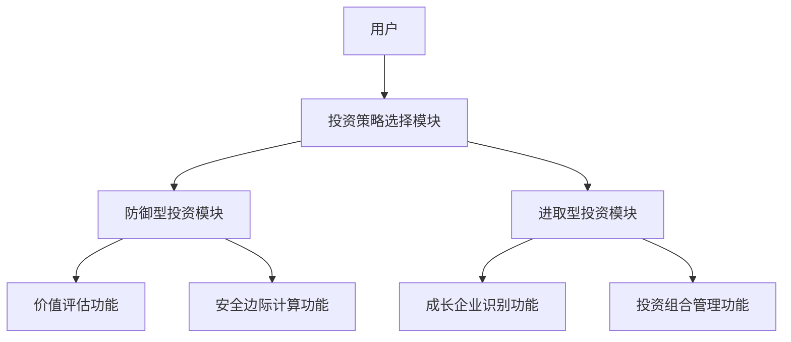

                 


# 格雷厄姆的防御型和进取型投资者区别

> 关键词：格雷厄姆，防御型投资，进取型投资，投资策略，价值投资，成长投资

> 摘要：本文深入分析了格雷厄姆提出的防御型和进取型投资者的区别，从投资目标、策略、对象等多维度进行对比，并结合数学模型和实际案例，探讨了这两种投资策略在实际中的应用与风险。

---

## 第1章：格雷厄姆投资理念的背景与核心思想

### 1.1 投资学派的形成与发展

投资学作为一门学科，经历了从传统到现代的演变。20世纪初，本杰明·格雷厄姆（Benjamin Graham）提出了一套基于基本面分析的投资理论，为现代投资学奠定了基础。他的理论以“安全边际”为核心，强调以低于内在价值的价格买入优质资产。

格雷厄姆的学生大卫·多德（David Dodd）进一步完善了这一理论，提出了“防御型”和“进取型”投资者的概念。这两种投资策略在目标、风险偏好和操作手法上存在显著差异，为投资者提供了两种不同的选择。

---

### 1.2 防御型与进取型投资的基本概念

#### 1.2.1 防御型投资的定义与特征

防御型投资是一种注重稳健收益的投资策略，其核心目标是保护本金不受损失，同时追求稳定的回报。格雷厄姆将防御型投资定义为：

> 防御型投资者追求的是 **确定性** 的收益，而非 **潜在的** 高回报。

防御型投资的主要特征包括：

- **注重安全边际**：买入价格低于内在价值的资产。
- **分散投资**：通过投资多个低相关性资产降低风险。
- **低风险偏好**：避免高波动性资产。

#### 1.2.2 进取型投资的定义与特征

进取型投资是一种注重高收益的投资策略，其核心目标是通过投资高成长性资产实现超额收益。格雷厄姆将进取型投资定义为：

> 进取型投资者追求的是 **潜在的** 高回报，但愿意承担更高的风险。

进取型投资的主要特征包括：

- **注重成长潜力**：投资于高成长性的企业或行业。
- **集中投资**：押注少数优质资产以获取更高收益。
- **高风险偏好**：愿意承担波动性和周期性风险。

---

## 第2章：防御型与进取型投资的核心区别

### 2.1 投资目标的差异

#### 2.1.1 防御型投资的目标：保本与稳定收益

防御型投资的目标是 **保护本金**，同时通过优质资产获取稳定的收益。其收益主要来源于资产的内在价值增长和分红收益。

#### 2.1.2 进取型投资的目标：追求超额收益

进取型投资的目标是 **实现资产的高增长**，其收益主要来源于资产价格的上涨。这种策略的风险较高，但潜在回报也更大。

#### 2.1.3 两者目标的对比分析

| 投资目标 | 防御型投资 | 进取型投资 |
|----------|-------------|-------------|
| 核心目标 | 保本与稳定收益 | 追求超额收益 |
| 风险偏好 | 低风险 | 高风险 |
| 收益来源 | 内在价值增长与分红 | 资产价格波动 |

---

### 2.2 投资策略的差异

#### 2.2.1 防御型投资策略：价值投资与分散投资

防御型投资者倾向于 **价值投资**，即买入价格低于内在价值的资产。其策略还包括：

- **分散投资**：通过投资多个资产降低风险。
- **长期持有**：避免频繁交易以减少成本。

#### 2.2.2 进取型投资策略：成长投资与集中投资

进取型投资者倾向于 **成长投资**，即投资于具有高成长潜力的企业。其策略还包括：

- **集中投资**：押注少数优质资产以获取更高回报。
- **短期交易**：通过波段操作捕捉市场波动。

#### 2.2.3 两种策略的风险与收益对比

| 投资策略 | 防御型投资 | 进取型投资 |
|----------|-------------|-------------|
| 风险 | 低 | 高 |
| 收益 | 稳定 | 波动性大 |
| 适合场景 | 经济衰退、市场波动 | 经济繁荣、市场上涨 |

---

### 2.3 投资对象的差异

#### 2.3.1 防御型投资的主要对象：低波动性股票、债券等

防御型投资者倾向于投资 **低波动性资产**，如：

- **蓝筹股**：具有稳定收益和良好声誉的公司股票。
- **债券**：提供固定利息收入的债务工具。
- **房地产投资信托（REITs）**：通过房地产投资获取稳定收益。

#### 2.3.2 进取型投资的主要对象：高成长性股票、新兴行业等

进取型投资者倾向于投资 **高成长性资产**，如：

- **成长股**：具有高增长潜力的公司股票。
- **科技股**：技术创新驱动的高成长性企业。
- **新兴行业**：朝阳产业中的龙头公司。

---

## 第3章：格雷厄姆防御型与进取型投资的理论基础

### 3.1 防御型投资的理论基础

#### 3.1.1 价值投资理论的核心思想

价值投资理论的核心是 **“买入低于内在价值的资产”**。格雷厄姆提出，市场波动为投资者提供了以合理价格买入优质资产的机会。

#### 3.1.2 股票的安全边际概念

安全边际是指 **内在价值与市场价格之间的差额**，即：

$$ \text{安全边际} = \text{内在价值} - \text{市场价格} $$

安全边际越大，投资风险越小。

#### 3.1.3 防御型投资的内在价值评估方法

格雷厄姆提出了 **“内在价值”** 的计算方法，即通过分析公司的财务报表、行业地位等因素，估算其真实价值。

---

### 3.2 进取型投资的理论基础

#### 3.2.1 成长投资理论的核心思想

成长投资理论的核心是 **“投资于具有高成长潜力的企业”**。多德提出，企业未来的增长潜力是决定其股票价值的关键因素。

#### 3.2.2 高成长企业的识别标准

高成长企业通常具有以下特征：

- **高净利润增长率**：$$ \text{净利润增长率} = \frac{\text{今年净利润} - \text{去年净利润}}{\text{去年净利润}} $$
- **高营收增长率**：$$ \text{营收增长率} = \frac{\text{今年营收} - \text{去年营收}}{\text{去年营收}} $$
- **高ROE（净资产收益率）**：$$ \text{ROE} = \frac{\text{净利润}}{\text{净资产}} $$

#### 3.2.3 进取型投资的风险管理策略

进取型投资者需要通过 **分散投资** 和 **动态调整** 来降低风险。例如，当市场出现大幅波动时，及时调整投资组合以规避风险。

---

## 第4章：格雷厄姆防御型与进取型投资的系统架构设计

### 4.1 系统功能设计

#### 4.1.1 防御型投资模块

- **价值评估功能**：计算资产的内在价值。
- **安全边际计算功能**：评估资产的安全边际。
- **投资组合优化功能**：优化投资组合以降低风险。

#### 4.1.2 进取型投资模块

- **成长企业识别功能**：筛选高成长性企业。
- **投资组合管理功能**：管理高成长性资产。
- **风险评估功能**：评估投资组合的风险。

### 4.2 系统架构设计

#### 4.2.1 系统整体架构图



---

## 第5章：格雷厄姆防御型与进取型投资的数学模型与公式

### 5.1 防御型投资的数学模型

#### 5.1.1 安全边际计算公式

$$ \text{安全边际} = \text{内在价值} - \text{市场价格} $$

#### 5.1.2 投资组合风险评估模型

$$ \text{风险} = \text{标准差（投资组合）} $$

### 5.2 进取型投资的数学模型

#### 5.2.1 高成长企业评估公式

$$ \text{增长潜力} = \frac{\text{净利润增长率} + \text{营收增长率}}{2} $$

#### 5.2.2 投资组合收益评估模型

$$ \text{收益} = \text{投资组合的平均收益率} $$

---

## 第6章：格雷厄姆防御型与进取型投资的项目实战

### 6.1 环境安装

- **Python环境**：安装Python 3.8及以上版本。
- **相关库**：安装`pandas`, `numpy`, `scipy`等库。

### 6.2 核心实现源代码

#### 6.2.1 防御型投资代码示例

```python
import pandas as pd
import numpy as np

# 计算内在价值
def calculate_intrinsic_value(financial_data):
    return financial_data['净利润'] / financial_data['市盈率']

# 计算安全边际
def calculate_margin_of_safety(current_price, intrinsic_value):
    return intrinsic_value - current_price

# 示例数据
data = {
    '净利润': [100, 200, 300],
    '市盈率': [15, 20, 25]
}
df = pd.DataFrame(data)

intrinsic_values = df.apply(lambda x: calculate_intrinsic_value(x), axis=1)
print("内在价值:", intrinsic_values)
```

#### 6.2.2 进取型投资代码示例

```python
import pandas as pd
import numpy as np

# 计算增长潜力
def calculate_growth_potential(finance_data):
    return (finance_data['净利润增长率'] + finance_data['营收增长率']) / 2

# 示例数据
data = {
    '净利润增长率': [0.3, 0.4, 0.5],
    '营收增长率': [0.2, 0.3, 0.4]
}
df = pd.DataFrame(data)

growth_potentials = df.apply(lambda x: calculate_growth_potential(x), axis=1)
print("增长潜力:", growth_potentials)
```

### 6.3 案例分析

#### 6.3.1 防御型投资案例

假设当前市场环境不佳，投资者选择防御型投资策略，买入一只蓝筹股：

```python
current_price = 50
intrinsic_value = 60
margin_of_safety = 10

print("安全边际为:", margin_of_safety)
```

#### 6.3.2 进取型投资案例

假设市场处于上升周期，投资者选择进取型投资策略，买入一只科技股：

```python
net_profit_growth = 0.5
revenue_growth = 0.4
growth_potential = (0.5 + 0.4) / 2 = 0.45
```

---

## 第7章：格雷厄姆防御型与进取型投资的总结与展望

### 7.1 总结

格雷厄姆提出的防御型和进取型投资策略为投资者提供了两种截然不同的选择。防御型投资注重稳健收益，适合风险偏好较低的投资者；进取型投资注重高成长潜力，适合风险偏好较高的投资者。两者各有优劣，关键在于根据市场环境和个人风险承受能力选择合适的投资策略。

### 7.2 注意事项

- **市场环境**：防御型投资适合经济衰退或市场波动较大的时期；进取型投资适合经济繁荣或市场上涨的时期。
- **个人风险偏好**：投资者需要根据自身风险承受能力选择投资策略。
- **动态调整**：市场环境和投资者需求会变化，需要定期调整投资组合。

### 7.3 拓展阅读

- 格雷厄姆的经典著作《聪明的投资者》。
- 多德的《投资学原理》。
- 现代投资组合理论（MPT）的相关研究。

---

## 作者：AI天才研究院/AI Genius Institute & 禅与计算机程序设计艺术 /Zen And The Art of Computer Programming

---

通过本文的分析，读者可以清晰理解格雷厄姆防御型和进取型投资者的区别，并根据自身需求选择合适的投资策略。希望本文能为投资者在实际操作中提供有价值的参考。

