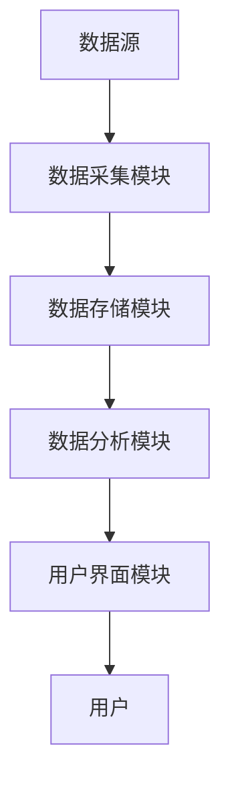

                 


# 格雷厄姆的防御型和进取型投资者：知己知彼

## 关键词：
- 格雷厄姆，防御型投资者，进取型投资者，投资策略，知己知彼，价值投资

## 摘要：
本文深入探讨了格雷厄姆的防御型和进取型投资者理论，分析了两种投资者的核心策略和区别，并结合数学模型和系统架构，展示了如何在实际投资中应用这些理论。通过知己知彼的投资策略，投资者可以更好地进行风险管理和收益优化。

---

# 目录大纲：《格雷厄姆的防御型和进取型投资者：知己知彼》

## 第一部分：投资学基础

### 第1章：防御型与进取型投资者概述

#### 1.1 投资学的基本概念
- 1.1.1 什么是投资
- 1.1.2 投资的分类与特点
- 1.1.3 格雷厄姆的价值投资理念

#### 1.2 防御型与进取型投资者的定义
- 1.2.1 防御型投资者的特征
- 1.2.2 进取型投资者的特征
- 1.2.3 两者的核心区别

#### 1.3 知己知彼的投资策略
- 1.3.1 知己知彼的概念
- 1.3.2 知己知彼在投资中的应用
- 1.3.3 知己知彼的必要性

---

## 第二部分：防御型投资者的核心策略

### 第2章：防御型投资者的策略与原则

#### 2.1 防御型投资者的投资原则
- 2.1.1 安全边际的概念
- 2.1.2 股票内在价值的计算
- 2.1.3 分散投资的重要性

#### 2.2 防御型投资组合的构建

---

## 第三部分：进取型投资者的策略

### 第3章：进取型投资者的策略与原则

#### 3.1 进取型投资者的投资原则
- 3.1.1 高风险高回报的特性
- 3.1.2 时机选择的重要性
- 3.1.3 集中投资的策略

#### 3.2 进取型投资组合的构建

---

## 第四部分：知己知彼的投资分析方法

### 第4章：投资分析的核心方法

#### 4.1 基本面分析与技术分析
- 4.1.1 基本面分析的步骤
- 4.1.2 技术分析的工具与指标

#### 4.2 投资组合优化的数学模型
- 4.2.1 均值-方差优化模型
- 4.2.2 资本资产定价模型（CAPM）

---

## 第五部分：算法与数学模型

### 第5章：投资组合优化的算法实现

#### 5.1 现代投资组合理论（MPT）
- 5.1.1 理论背景
- 5.1.2 数学公式
- 5.1.3 算法实现

#### 5.2 Python代码实现
```python
import numpy as np
from scipy.optimize import minimize

# 示例数据
returns = np.array([0.05, 0.07, 0.03, 0.08, 0.06])

# 定义优化函数
def portfolioOptimizer(weights, returns):
    return np.var(weights.dot(returns))

# 约束条件
def constraint(weights):
    return np.sum(weights) - 1

# 初始化权重
initial_weights = np.array([0.2, 0.2, 0.2, 0.2, 0.2])

# 优化
result = minimize(portfolioOptimizer, initial_weights, 
                 method='SLSQP', 
                 constraints={'type': 'eq', 'fun': constraint})

print(result.x)
```

---

## 第六部分：系统分析与架构设计

### 第6章：投资决策支持系统的架构

#### 6.1 系统功能设计
- 6.1.1 数据采集模块
- 6.1.2 数据分析模块
- 6.1.3 用户界面模块

#### 6.2 系统架构图


---

## 第七部分：项目实战

### 第7章：投资决策支持系统的实现

#### 7.1 环境搭建
- 7.1.1 安装Python和相关库
- 7.1.2 安装Jupyter Notebook

#### 7.2 核心代码实现
```python
import pandas as pd
import numpy as np
from sklearn import linear_model

# 示例数据
data = pd.DataFrame({
    '股票代码': ['A', 'B', 'C', 'D', 'E'],
    '收益率': [0.05, 0.07, 0.03, 0.08, 0.06]
})

# 线性回归模型
model = linear_model.LinearRegression()
model.fit(data[['股票代码']], data['收益率'])
print(model.predict(data[['股票代码']]))
```

#### 7.3 代码解读与分析

#### 7.4 实际案例分析

#### 7.5 项目总结

---

## 第八部分：最佳实践

### 第8章：投资策略的优化与调整

#### 8.1 小结
- 8.1.1 核心要点回顾
- 8.1.2 未来趋势展望

#### 8.2 注意事项
- 8.2.1 风险管理的重要性
- 8.2.2 定期审视投资组合

#### 8.3 拓展阅读
- 8.3.1 推荐书籍
- 8.3.2 相关博客和资源

---

## 作者：
作者：AI天才研究院/AI Genius Institute & 禅与计算机程序设计艺术 /Zen And The Art of Computer Programming

---

以上是《格雷厄姆的防御型和进取型投资者：知己知彼》的技术博客文章的完整目录大纲和部分内容展示，您可以根据这个大纲撰写完整的文章。

