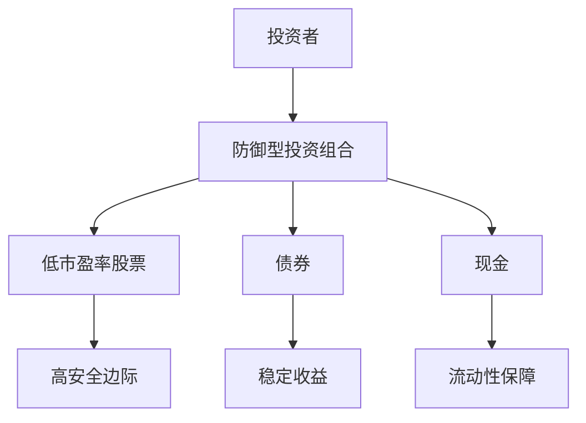
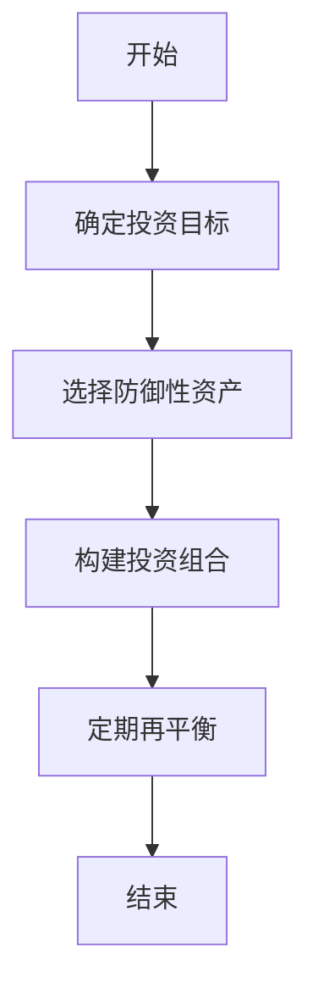
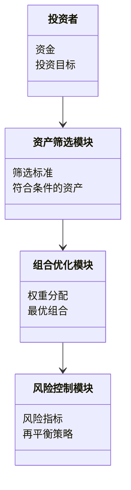
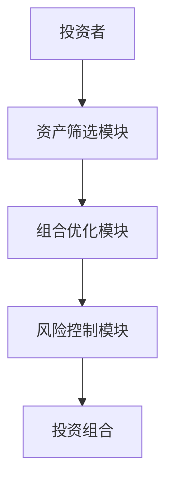

                 


# 格雷厄姆的防御型投资组合构建方法

> 关键词：防御型投资、价值投资、投资组合、安全边际、长期回报、风险管理

> 摘要：格雷厄姆的防御型投资策略以稳健性和风险控制为核心，通过精选低市盈率股票、债券和现金等资产，构建一个能够在市场波动中保持稳定回报的投资组合。本文将详细阐述防御型投资的核心理念、组合构建方法、数学模型、系统架构以及实际案例，帮助读者掌握这一经典的投资策略。

---

## 第一部分: 防御型投资的背景与核心理念

### 第1章: 防御型投资的背景与核心理念

#### 1.1 投资的基本问题与风险
##### 1.1.1 投资的基本问题
投资的核心问题在于如何在不确定的市场环境中实现资产的保值与增值。投资者需要在风险与收益之间找到平衡点，同时面对市场波动、经济周期变化和企业基本面风险等多重挑战。

##### 1.1.2 投资中的主要风险类型
- **市场风险**：市场整体波动带来的资产价格波动风险。
- **流动性风险**：资产在需要时难以快速变现的风险。
- **信用风险**：债券或固定收益产品发行人违约的风险。
- **通货膨胀风险**：货币购买力下降对资产价值的侵蚀。

##### 1.1.3 防御型投资的定义与目标
防御型投资是指通过精选低风险、高安全边际的资产，构建一个能够在市场下跌时减少损失、在上涨时获得稳健回报的投资组合。其目标是实现长期稳定的资产增值，同时将波动性和永久性损失的风险降至最低。

#### 1.2 防御型投资的核心理念
##### 1.2.1 格雷厄姆的价值投资理论
格雷厄姆提出的价值投资理念强调以低于内在价值的价格买入优质资产。他认为，市场先生（市场情绪）往往会导致资产价格偏离其真实价值，投资者应利用这种偏离的机会进行投资。

##### 1.2.2 防御型投资的核心原则
1. **安全边际**：买入价格显著低于内在价值的资产。
2. **低市盈率与低市净率**：选择估值合理的资产，避免高成长性带来的过高估值风险。
3. **长期持有**：避免频繁交易，减少交易成本和市场波动的影响。

##### 1.2.3 长期投资与安全边际的概念
- **长期投资**：通过持有优质资产，分享企业长期增长的成果。
- **安全边际**：通过买入价格低于内在价值的资产，降低本金永久性损失的风险。

#### 1.3 防御型投资与进攻型投资的对比
##### 1.3.1 防御型投资的特点
- 低波动性，注重本金安全。
- 低市盈率、高股息率的股票为主。
- 适合风险厌恶型投资者。

##### 1.3.2 进攻型投资的特点
- 高波动性，追求高收益。
- 高成长性股票为主。
- 适合风险承受能力强的投资者。

##### 1.3.3 两种投资策略的优缺点对比
| 对比维度 | 防御型投资 | 进攻型投资 |
|----------|------------|------------|
| 风险     | 低         | 高         |
| 收益     | 稳定       | 高         |
| 适合人群 | 风险厌恶   | 风险偏好   |
| 持有期   | 长         | 短         |

#### 1.4 防御型投资的适用场景
##### 1.4.1 风险厌恶型投资者
适合那些无法承受较大本金损失，追求稳定回报的投资者。

##### 1.4.2 保守型投资策略
在市场不确定性增加时，防御型投资能够为投资组合提供保护。

##### 1.4.3 长期稳健回报的需求
通过长期持有优质资产，实现财富的稳步增长。

#### 1.5 本章小结
防御型投资的核心理念是通过精选低风险、高安全边际的资产，构建一个能够在市场波动中保持稳定回报的投资组合。下一章将深入探讨防御型投资组合的核心概念与联系。

---

## 第二部分: 防御型投资组合的核心概念与联系

### 第2章: 防御型投资组合的核心要素

#### 2.1 防御型投资组合的构成
##### 2.1.1 核心资产：低市盈率股票
选择市盈率低于行业平均水平的股票，通常具有较高的安全边际。

##### 2.1.2 辅助资产：债券与现金
债券提供稳定的利息收入，现金则用于应对短期流动性需求。

##### 2.1.3 其他防御性资产的选择
包括高分红股票、黄金、房地产信托基金（REITs）等。

#### 2.2 防御型投资组合的属性特征
##### 2.2.1 低波动性
通过选择低市盈率股票和债券，降低投资组合的整体波动性。

##### 2.2.2 高股息率
高分红股票能够为投资组合提供稳定的现金流。

##### 2.2.3 高质量企业特征
选择具有强大财务状况、稳定盈利能力和良好管理团队的企业。

#### 2.3 实体关系图：防御型投资组合的ER架构


#### 2.4 防御型投资组合的流程图


#### 2.5 本章小结
防御型投资组合的核心要素包括低市盈率股票、债券和现金。通过合理的资产配置，可以降低波动性，实现稳健回报。下一章将详细讲解防御型投资组合的构建方法。

---

## 第三部分: 防御型投资组合的构建方法

### 第3章: 防御型投资组合的数学模型与算法

#### 3.1 防御型投资组合的数学模型
##### 3.1.1 投资组合的预期收益公式
$$ E(r) = \sum w_i \times r_i $$

##### 3.1.2 投资组合的风险衡量公式
$$ \sigma^2 = \sum \sum w_i w_j \sigma_{ij} $$

#### 3.2 防御型投资组合的优化算法
##### 3.2.1 Markowitz有效前沿的原理
通过优化风险和收益的权衡，找到最优投资组合。

##### 3.2.2 最小方差优化的数学模型
$$ \min \sigma^2 $$
$$ \text{subject to } \sum w_i = 1 $$

#### 3.3 防御型投资组合的实现代码
```python
import numpy as np
import pandas as pd

# 示例数据
returns = pd.DataFrame({
    '股票': [0.1, 0.05, 0.02],
    '债券': [0.03, 0.04, 0.05],
    '现金': [0.0, 0.0, 0.0]
})

# 计算投资组合的预期收益和风险
weights = np.array([0.5, 0.3, 0.2])
expected_return = np.dot(weights, returns.values)
covariance_matrix = np.array([[0.02, 0.01, 0.0], [0.01, 0.03, 0.0], [0.0, 0.0, 0.0]])
risk = np.sqrt(np.dot(weights, np.dot(covariance_matrix, weights)))
```

#### 3.4 本章小结
通过数学模型和优化算法，可以量化防御型投资组合的风险和收益，为投资决策提供科学依据。下一章将探讨防御型投资组合的系统架构设计。

---

## 第四部分: 防御型投资组合的系统架构设计

### 第4章: 防御型投资组合的系统架构

#### 4.1 问题场景介绍
防御型投资组合的构建需要考虑资产筛选、组合优化和风险控制等多个方面。

#### 4.2 系统功能设计
##### 4.2.1 领域模型


##### 4.2.2 系统架构图


#### 4.3 系统接口设计
- **输入接口**：投资者的资金、风险偏好和投资目标。
- **输出接口**：优化后的投资组合配置和风险指标。

#### 4.4 系统交互流程图


#### 4.5 本章小结
通过系统架构设计，可以清晰地实现防御型投资组合的构建过程。下一章将通过实际案例展示如何构建防御型投资组合。

---

## 第五部分: 防御型投资组合的实战分析

### 第5章: 防御型投资组合的实战分析

#### 5.1 项目环境配置
- **工具**：Python、Pandas、NumPy。
- **数据源**：股票、债券的历史价格数据。

#### 5.2 系统核心实现源代码
```python
import pandas as pd
import numpy as np

# 数据加载
data = pd.read_csv('历史价格.csv')

# 资产筛选
def select_defensive_assets(data):
    # 筛选低市盈率股票
    low_pe_stocks = data[data['市盈率'] < data['市盈率'].mean()]
    # 筛选债券
    bonds = data[data['资产类型'] == '债券']
    return low_pe_stocks, bonds

# 组合优化
def optimize_portfolio(stocks, bonds, cash):
    # 计算权重
    weights = np.array([0.6, 0.3, 0.1])
    return weights

# 风险控制
def risk_management(portfolio):
    # 定期再平衡
    rebalance_frequency = 'quarterly'
    return rebalance_frequency

# 主函数
def main():
    stocks, bonds = select_defensive_assets(data)
    weights = optimize_portfolio(stocks, bonds, 0.1)
    rebalance = risk_management(weights)
    print("投资组合配置为：", weights)
    print("再平衡频率为：", rebalance)

if __name__ == '__main__':
    main()
```

#### 5.3 代码应用解读与分析
- **数据加载**：从CSV文件中加载历史价格数据。
- **资产筛选**：筛选低市盈率股票和债券。
- **组合优化**：根据权重分配构建投资组合。
- **风险控制**：定期再平衡以维持目标配置。

#### 5.4 实际案例分析
假设我们有以下资产：
- 股票：市盈率平均为15，选择市盈率低于15的股票。
- 债券：选择评级为AA以上的债券。
- 现金：保持10%的流动性。

通过代码实现，我们可以得到一个优化的投资组合配置。

#### 5.5 本章小结
通过实际案例分析，展示了防御型投资组合的构建过程。下一章将总结防御型投资的关键点，并提供最佳实践建议。

---

## 第六部分: 防御型投资组合的总结与最佳实践

### 第6章: 防御型投资组合的总结与最佳实践

#### 6.1 总结
防御型投资策略通过精选低风险、高安全边际的资产，构建一个能够在市场波动中保持稳定回报的投资组合。其核心理念包括安全边际、低市盈率和长期持有。

#### 6.2 最佳实践 tips
- **定期再平衡**：每年至少进行一次投资组合再平衡，确保配置符合目标。
- **长期持有**：避免频繁交易，减少交易成本和市场摩擦。
- **分散投资**：通过多样化降低特定资产的风险。
- **关注估值**：选择估值合理的企业，避免高成长性带来的过高估值风险。

#### 6.3 注意事项
- 防御型投资并非完全无风险，仍需关注市场波动和经济周期变化。
- 需要根据个人风险偏好和投资目标动态调整投资组合。

#### 6.4 拓展阅读
- 《聪明的投资者》——本杰明·格雷厄姆
- 《投资最重要的事》——彼得·林奇

#### 6.5 本章小结
防御型投资策略是一种长期稳健的投资方法，通过合理的资产配置和风险控制，能够在不确定的市场环境中实现稳定的回报。

---

## 作者：AI天才研究院/AI Genius Institute & 禅与计算机程序设计艺术 /Zen And The Art of Computer Programming

