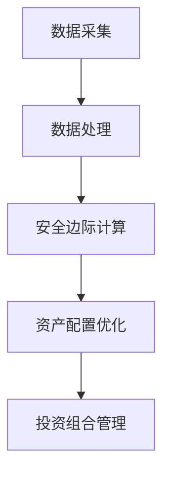

                 


# 防御型投资者策略：格雷厄姆的投资智慧

## 关键词：防御型投资，价值投资，安全边际，资产配置，投资策略

## 摘要：本文深入探讨了格雷厄姆的防御型投资者策略，从基本概念到实战应用，系统分析其核心原理和实践方法。通过数学模型、系统架构和案例分析，揭示如何通过安全边际和分散投资实现稳健收益。

---

# 第一部分：防御型投资者策略概述

## 第1章：防御型投资的基本概念

### 1.1 防御型投资的定义与背景

防御型投资是一种注重长期稳健回报的投资策略，旨在通过价值发现和风险控制，实现资本的保值与增值。其核心理念是购买被市场低估的资产，以安全边际为护城河，抵御市场波动带来的风险。

### 1.2 防御型投资的核心理念

防御型投资者注重安全边际，即以低于内在价值的价格买入资产，从而在市场波动时降低损失。此外，分散投资和长期持有是实现稳健回报的关键策略。

---

# 第二部分：防御型投资者的核心策略

## 第2章：安全边际的计算与应用

### 2.1 安全边际的定义与作用

安全边际是防御型投资者的核心概念，指投资标的市场价格低于其内在价值的部分。它为投资者提供了风险缓冲区，确保在市场波动时仍能获得收益。

#### 安全边际的计算公式

安全边际（Margin of Safety, MoS） = 内在价值（IV） - 市场价格（P）

#### 示例分析

假设某股票的内在价值为10元，市场价格为8元，则安全边际为2元。这意味着即使市场价格波动至9元，投资者仍能获得1元的收益。

### 2.2 防御型投资中的分散策略

分散投资通过将资金分配到多个资产类别或行业，降低特定资产的风险。以下是分散投资的数学模型：

$$ \text{分散投资回报} = \sum_{i=1}^{n} w_i \times r_i $$

其中，\( w_i \) 是第i个资产的权重，\( r_i \) 是第i个资产的回报率。

### 2.3 资产配置的数学模型

防御型投资的资产配置需考虑风险承受能力和收益目标。常用模型包括：

$$ \text{最优资产配置} = \arg \max_{w} \left( w \times \mu - \frac{1}{2} w^T \Sigma w \right) $$

其中，\( \mu \) 是收益向量，\( \Sigma \) 是协方差矩阵。

---

# 第三部分：防御型投资者的决策系统

## 第3章：投资决策的系统化方法

### 3.1 投资决策的基本步骤

防御型投资者通过以下步骤进行决策：

1. 确定投资目标
2. 分析市场环境
3. 评估投资标的
4. 计算安全边际
5. 制定投资计划

### 3.2 投资决策的数学模型

#### 市场估值模型

$$ P = \frac{E}{k} $$

其中，\( E \) 是预期收益，\( k \) 是风险溢价。

#### 股票估值模型

$$ \text{内在价值} = \frac{\text{年现金流}}{\text{折现率}} $$

### 3.3 投资决策的系统架构

#### 系统功能模块

1. 数据采集与处理
2. 安全边际计算
3. 资产配置优化
4. 投资组合管理

#### 系统架构图



---

# 第四部分：防御型投资者的实战案例

## 第4章：实战中的防御型投资策略

### 4.1 防御型投资的环境配置

#### 投资环境分析

- 市场波动性
- 利率水平
- 经济周期

### 4.2 防御型投资的核心实现

#### 安全边际计算

使用以下代码计算安全边际：

```python
def calculate_margin_of_safety(iv, price):
    return iv - price

# 示例计算
iv = 10
price = 8
mos = calculate_margin_of_safety(iv, price)
print(f"安全边际为: {mos}元")
```

#### 资产配置优化

通过优化模型实现资产配置：

```python
import numpy as np

def optimize_portfolio(returns, cov_matrix):
    n = len(returns)
    return np.linalg.solve(cov_matrix, returns)

returns = np.array([0.05, 0.07])
cov_matrix = np.array([[0.02, 0.01], [0.01, 0.03]])
weights = optimize_portfolio(returns, cov_matrix)
print(f"最优权重为: {weights}")
```

### 4.3 实际案例分析

#### 案例背景

假设某投资者在2020年选择投资一家低估的制造业公司，市场价格为20元，内在价值为25元，安全边际为5元。

#### 案例分析与解读

通过计算安全边际，投资者确认该股票具有较高的投资价值。随后，通过分散投资策略，将资金分配到多个具有类似安全边际的标的，降低整体风险。

---

# 第五部分：防御型投资者的最佳实践

## 第5章：最佳实践与总结

### 5.1 防御型投资的关键点

1. **安全边际**：始终关注市场价格与内在价值的差距。
2. **分散投资**：避免过度集中，降低特定风险。
3. **长期持有**：耐心持有优质资产，避免短期波动干扰。

### 5.2 小结

防御型投资策略通过安全边际和分散投资，帮助投资者在不确定的市场中实现稳健回报。通过系统化的决策和数学模型的应用，投资者可以更好地把握投资机会，降低风险。

### 5.3 注意事项

- **持续学习**：市场环境不断变化，需及时调整策略。
- **风险控制**：定期评估投资组合，确保安全边际。
- **纪律执行**：坚持投资计划，避免情绪化决策。

### 5.4 拓展阅读

建议阅读格雷厄姆的《 Intelligent Investor》深入了解防御型投资的理论基础。

---

作者：AI天才研究院 & 禅与计算机程序设计艺术

