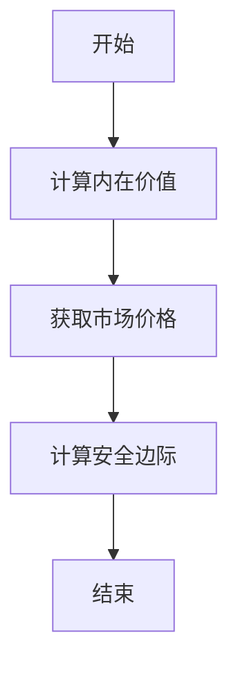
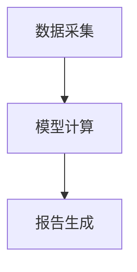
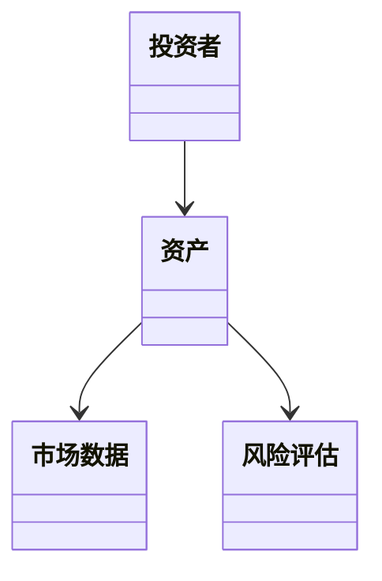
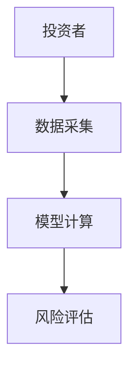
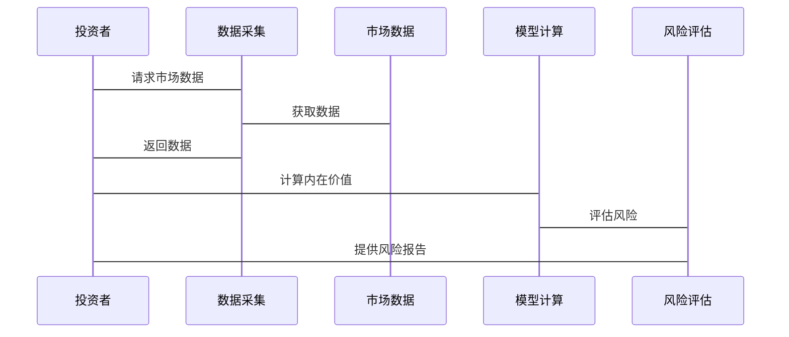

                 


# 格雷厄姆的防御型投资者策略：稳健致胜

## 关键词：
- 防御型投资
- 格雷厄姆
- 投资策略
- 稳健回报
- 安全边际

## 摘要：
格雷厄姆的防御型投资者策略是一种以稳健和安全为核心的投资方法，强调通过基本面分析、安全边际和长期持有来实现稳定的收益。本文详细解析了防御型投资的核心概念、数学模型、系统架构和实战案例，帮助读者掌握这一策略的精髓。

---

# 第1章: 防御型投资的起源与背景

## 1.1 防御型投资的核心概念

### 1.1.1 防御型投资的定义与特点
防御型投资是一种以稳健和安全为核心的投资策略，强调通过基本面分析和价值评估来选择被低估的资产。其核心特点是：
- 避免高风险投资
- 注重安全边际
- 以长期持有为目标

### 1.1.2 防御型投资的历史背景
防御型投资理念起源于20世纪，由本杰明·格雷厄姆提出，强调在市场波动中寻找低估资产，避免盲目跟风。

### 1.1.3 格雷厄姆的防御型投资理念
格雷厄姆认为，投资者应关注安全边际，即资产的内在价值与市场价格之间的差距，以确保投资的安全性。

---

## 1.2 防御型投资与现代投资理念的联系

### 1.2.1 防御型投资与价值投资的区别
- 防御型投资注重安全性和稳健性，而价值投资更注重内在价值。
- 防御型投资更保守，而价值投资可能更具进攻性。

### 1.2.2 防御型投资在现代金融体系中的地位
防御型投资为投资者提供了在不确定市场中稳定收益的策略，尤其适合风险厌恶型投资者。

### 1.2.3 防御型投资的适用场景与局限性
- 适用场景：市场波动较大、经济不确定性增加时。
- 局限性：可能在牛市中错失高收益机会。

---

## 1.3 本章小结
防御型投资以安全性和稳健性为核心，通过基本面分析和安全边际选择低估资产，适合风险厌恶型投资者。

---

# 第2章: 防御型投资者的核心特征

## 2.1 防御型投资者的心理特征

### 2.1.1 理性决策的重要性
防御型投资者需要理性分析市场信息，避免情绪化决策。

### 2.1.2 风险厌恶与收益平衡
防御型投资者更注重本金安全，愿意为稳定收益放弃短期高风险机会。

### 2.1.3 长期投资与耐心的培养
防御型投资强调长期持有，需要投资者具备耐心和纪律性。

---

## 2.2 防御型投资者的行为特征

### 2.2.1 逆向思维的应用
在市场恐慌时买入低估资产，避免在市场高点追涨。

### 2.2.2 安全边际的概念与计算
安全边际 = 内在价值 - 市场价格，确保投资的安全性。

### 2.2.3 投资组合的分散化策略
通过分散投资降低风险，避免过度集中于单一资产。

---

## 2.3 防御型投资者的决策框架

### 2.3.1 投资决策的逻辑步骤
1. 确定投资目标
2. 进行基本面分析
3. 计算安全边际
4. 选择低估资产
5. 构建投资组合

### 2.3.2 信息筛选与分析方法
- 数据筛选：选择财务数据透明的公司
- 财务分析：关注市盈率、市净率等指标

### 2.3.3 决策执行与风险管理
- 定期审视投资组合
- 严格执行止损策略

---

## 2.4 本章小结
防御型投资者具备理性、风险厌恶和耐心等心理特征，通过逆向思维和分散化策略实现稳健投资。

---

# 第3章: 防御型投资策略的核心要素

## 3.1 防御型投资的三大支柱

### 3.1.1 安全边际的计算方法
$$ \text{安全边际} = \text{内在价值} - \text{市场价格} $$

### 3.1.2 内在价值的评估标准
$$ \text{内在价值} = \sum_{t=1}^{n} \frac{C_t}{(1 + r)^t} $$
其中，\( C_t \) 是第 \( t \) 年的现金流，\( r \) 是折现率。

### 3.1.3 风险调整后的收益模型
$$ \text{风险调整后收益} = \text{预期收益} - \text{风险溢价} $$

---

## 3.2 防御型投资组合的构建

### 3.2.1 资产配置的基本原则
- 股票与债券的合理配比
- 行业和地区的分散化

### 3.2.2 股票与债券的配比策略
建议将资产分配为60%股票和40%债券，以平衡风险和收益。

### 3.2.3 定期再平衡的必要性
每季度审视投资组合，根据市场变化进行调整。

---

## 3.3 防御型投资的风险管理

### 3.3.1 风险识别与量化方法
- 风险识别：关注市场波动和公司基本面变化
- 风险量化：使用VaR等方法评估潜在损失

### 3.3.2 风险对冲的策略选择
- 使用期权进行对冲
- 通过分散化降低特定风险

### 3.3.3 应急预案的制定与执行
- 设定止损点
- 定期评估和更新应急预案

---

## 3.4 本章小结
防御型投资策略通过安全边际、内在价值和风险调整后的收益模型，构建稳健的投资组合。

---

# 第4章: 防御型投资的数学模型与算法

## 4.1 安全边际的数学公式
$$ \text{安全边际} = \text{内在价值} - \text{市场价格} $$

## 4.2 内在价值的评估模型
$$ \text{内在价值} = \sum_{t=1}^{n} \frac{C_t}{(1 + r)^t} $$
其中，\( C_t \) 是第 \( t \) 年的现金流，\( r \) 是折现率。

## 4.3 风险调整后的收益模型
$$ \text{风险调整后收益} = \text{预期收益} - \text{风险溢价} $$

---

## 4.4 安全边际计算的算法流程

### 4.4.1 算法流程图


### 4.4.2 安全边际计算的Python代码
```python
def calculate_margin_of_safety(intrinsic_value, market_price):
    return intrinsic_value - market_price

# 示例：计算某股票的安全边际
iv = 50
mp = 40
margin = calculate_margin_of_safety(iv, mp)
print(f"安全边际为: {margin}")
```

---

## 4.5 内在价值评估的系统架构

### 4.5.1 系统功能模块
- 数据采集模块：获取公司财务数据
- 模型计算模块：计算内在价值
- 报告生成模块：输出评估结果

### 4.5.2 系统架构图


---

## 4.6 本章小结
通过数学模型和算法，防御型投资者可以量化安全边际和内在价值，做出科学的投资决策。

---

# 第5章: 防御型投资的系统分析与架构设计

## 5.1 防御型投资的系统功能设计

### 5.1.1 领域模型类图


### 5.1.2 系统功能模块
- 数据采集：获取市场数据
- 模型计算：评估资产价值
- 风险管理：制定对冲策略

---

## 5.2 系统架构设计

### 5.2.1 系统架构图


### 5.2.2 系统接口设计
- API接口：投资者与系统交互
- 数据接口：获取市场数据

---

## 5.3 系统交互序列图



---

## 5.4 本章小结
通过系统架构设计，防御型投资可以实现自动化和高效管理。

---

# 第6章: 防御型投资的项目实战

## 6.1 环境安装与配置

### 6.1.1 安装Python环境
- 安装Anaconda或PyCharm

### 6.1.2 安装必要的库
- pandas、numpy、scipy

---

## 6.2 核心实现源代码

### 6.2.1 计算内在价值
```python
import numpy as np

def calculate_intrinsic_value(cash_flows, discount_rate):
    return np.sum(cash_flows / (1 + discount_rate)**np.arange(len(cash_flows)))

# 示例：计算某股票的内在价值
cf = [100, 120, 150]
r = 0.1
iv = calculate_intrinsic_value(cf, r)
print(f"内在价值为: {iv}")
```

---

## 6.3 实际案例分析

### 6.3.1 案例：投资某低估股票
- 公司名称：ABC公司
- 市场价格：40元
- 内在价值：50元
- 安全边际：10元

### 6.3.2 投资组合构建
- 股票：60%
- 债券：40%

---

## 6.4 项目小结
通过实战案例，读者可以理解防御型投资的策略和实际操作方法。

---

# 第7章: 防御型投资的最佳实践与小结

## 7.1 最佳实践 tips

### 7.1.1 风险管理
- 设定止损点
- 定期审视投资组合

### 7.1.2 长期投资
- 避免频繁交易
- 保持耐心

### 7.1.3 分散投资
- 避免过度集中
- 选择多样化的资产

---

## 7.2 小结
防御型投资以稳健和安全为核心，通过基本面分析和安全边际选择低估资产，适合风险厌恶型投资者。

---

## 7.3 注意事项

### 7.3.1 避免过度分散
过度分散可能导致收益下降。

### 7.3.2 定期再平衡
根据市场变化调整投资组合。

---

## 7.4 拓展阅读

### 7.4.1 推荐书籍
- 《格雷厄姆投资哲学》
- 《防御型投资策略》

### 7.4.2 在线资源
- 投资论坛和博客
- 专业投资网站

---

# 作者：AI天才研究院/AI Genius Institute & 禅与计算机程序设计艺术 /Zen And The Art of Computer Programming

---

通过以上内容，读者可以全面了解格雷厄姆的防御型投资者策略，并掌握其数学模型、系统架构和实战方法。

