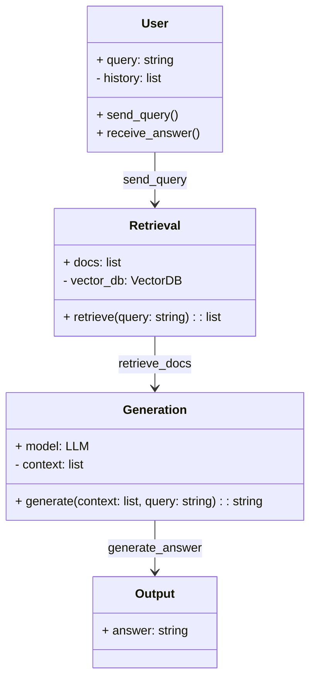
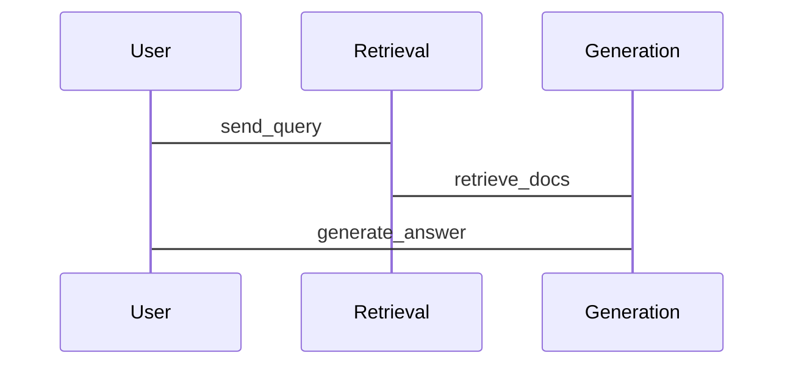

                 


# 检索增强生成：提高AI Agent回答的准确性

> 关键词：检索增强生成，RAG，大语言模型，向量数据库，信息检索，生成模型

> 摘要：本文深入探讨了检索增强生成（RAG）技术，结合信息检索与生成模型的优势，通过向量数据库和大语言模型的协同工作，显著提升了AI Agent的回答准确性。文章详细阐述了RAG的核心原理、算法实现、系统架构，并通过项目实战展示了具体应用，最后给出了最佳实践建议。

---

# 第1章: 检索增强生成（RAG）的背景与概念

## 1.1 问题背景与描述

### 1.1.1 当前AI生成技术的局限性
当前的大语言模型（如GPT系列）虽然在生成文本方面表现出色，但存在以下问题：
- **知识过时性**：模型参数固定后，无法更新知识库。
- **回答准确性**：生成结果可能偏离事实或语境。
- **上下文依赖**：无法根据实时数据或特定领域知识进行优化。

### 1.1.2 检索增强生成的提出背景
为了克服上述问题，检索增强生成（RAG）技术应运而生。RAG结合了信息检索与生成模型的优势：
- **动态知识库**：通过检索实时数据或领域知识，生成更准确的回答。
- **上下文感知**：根据查询动态调整生成内容，避免生成与上下文无关的答案。

### 1.1.3 RAG的核心目标与应用场景
- **核心目标**：通过结合检索与生成技术，提升AI Agent回答的准确性、相关性和实用性。
- **应用场景**：问答系统、智能客服、对话机器人、知识图谱问答等。

## 1.2 检索与生成的协同机制

### 1.2.1 检索技术的基本原理
信息检索是基于向量的相似度计算，找到最相关的文档或段落。常见的检索算法包括：
- **BM25**：基于词频的加权检索算法。
- **DPR（Dense Passage Retrieval）**：基于密集向量的检索模型。

### 1.2.2 生成模型的工作原理
生成模型（如GPT）通过概率分布生成文本，但缺乏对输入查询的直接关联。通过结合检索结果，生成模型可以更精准地生成回答。

### 1.2.3 检索与生成的结合方式
1. **检索后生成**：
   - 根据检索结果生成回答。
2. **检索增强生成**：
   - 检索结果作为生成的条件，生成更精准的回答。

## 1.3 RAG的核心概念与边界

### 1.3.1 RAG的核心要素
- **检索模块**：负责从知识库中检索相关段落或文档。
- **生成模块**：基于检索结果生成最终回答。
- **协同优化模块**：平衡检索与生成的性能，确保回答的准确性。

### 1.3.2 RAG的应用边界
- **数据来源**：基于知识库或实时数据。
- **生成长度**：支持长文本生成。
- **领域限制**：适用于需要专业知识的领域。

### 1.3.3 RAG与其他技术的区别与联系
- **区别**：RAG结合检索与生成，而传统生成模型仅依赖内部参数。
- **联系**：生成模型提供语言模型，检索技术提供内容筛选。

## 1.4 本章小结
本章介绍了RAG的背景、核心概念与协同机制，为后续章节的深入分析奠定了基础。

---

# 第2章: 检索与生成的协同原理

## 2.1 检索模块的核心原理

### 2.1.1 向量空间模型
向量空间模型将文本表示为向量，通过计算向量相似度进行检索。公式如下：
$$ BM25(q, d) = \sum_{i=1}^{n} \log(1 + \frac{freq(q, d_i)}{k}) \cdot \log(N \cdot \frac{1}{freq(q, C)}) $$

### 2.1.2 相似度计算方法
- **BM25**：基于词频的加权检索。
- **DPR**：基于密集向量的检索模型。

## 2.2 生成模块的核心原理

### 2.2.1 大语言模型的生成机制
大语言模型通过自注意力机制生成文本，公式如下：
$$ P(word|context) = \frac{exp(score)}{\sum exp(score)} $$

### 2.2.2 基于检索结果的条件生成
生成模型在检索结果的基础上生成回答，公式如下：
$$ P(answer|query, docs) = \prod_{i=1}^{k} P(word_i|query, docs) $$

## 2.3 检索与生成的协同优化

### 2.3.1 检索结果对生成的影响
检索结果提供上下文信息，帮助生成更准确的回答。

### 2.3.2 生成结果对检索的反馈机制
生成结果用于优化检索策略，例如通过A/B测试选择更优的检索结果。

---

# 第3章: RAG的数学模型与算法原理

## 3.1 向量空间模型

### 3.1.1 BM25算法
BM25算法基于词频计算相似度，公式如下：
$$ BM25(q, d) = \sum_{i=1}^{n} \log(1 + \frac{freq(q, d_i)}{k}) \cdot \log(N \cdot \frac{1}{freq(q, C)}) $$

### 3.1.2 DPR算法
DPR算法基于密集向量计算相似度，公式如下：
$$ sim(v_q, v_d) = v_q^T v_d $$

## 3.2 大语言模型的生成机制

### 3.2.1 自注意力机制
自注意力机制公式如下：
$$ \text{Attention}(Q, K, V) = \text{softmax}(\frac{QK^T}{\sqrt{d}})V $$

### 3.2.2 基于检索结果的条件生成
条件生成公式如下：
$$ P(answer|query, docs) = \prod_{i=1}^{k} P(word_i|query, docs) $$

---

# 第4章: 系统分析与架构设计方案

## 4.1 问题场景介绍
- **用户查询**：输入一个查询请求。
- **检索模块**：从知识库中检索相关段落。
- **生成模块**：基于检索结果生成回答。

## 4.2 系统功能设计

### 4.2.1 领域模型（Mermaid类图）


## 4.3 系统架构设计（Mermaid架构图）


## 4.4 系统接口设计

### 4.4.1 检索接口
- **输入**：查询字符串。
- **输出**：相关段落列表。

### 4.4.2 生成接口
- **输入**：检索结果和查询字符串。
- **输出**：生成回答。

## 4.5 系统交互（Mermaid序列图）


---

# 第5章: 项目实战

## 5.1 环境安装

```bash
pip install transformers faiss-cpu sentence-transformers
```

## 5.2 系统核心实现源代码

### 5.2.1 向量数据库实现
```python
from sentence_transformers import SentenceTransformer
from faiss import IndexFlat

class VectorDB:
    def __init__(self, sentences):
        self.model = SentenceTransformer('all-mpnet-base')
        self.encoder = self.model.encode(sentences)
        self.index = IndexFlat(self.encoder.shape[1])
        self.index.add(self.encoder)

    def retrieve(self, query, k=3):
        qemb = self.model.encode(query)
        D, I = self.index.search(qemb, k)
        return [sentences[i] for i in I[0]]
```

### 5.2.2 生成模块实现
```python
from transformers import AutoTokenizer, AutoModelForCausalLM

class Generator:
    def __init__(self, model_name):
        self.tokenizer = AutoTokenizer.from_pretrained(model_name)
        self.model = AutoModelForCausalLM.from_pretrained(model_name)

    def generate(self, prompt, max_length=100):
        inputs = self.tokenizer(prompt, return_tensors="np")
        outputs = self.model.generate(inputs.input_ids, max_length=max_length)
        return self.tokenizer.decode(outputs[0][0], skip_special_tokens=True)
```

## 5.3 实际案例分析
- **输入查询**：如何提高代码质量？
- **检索结果**：提供相关代码规范文档。
- **生成回答**：基于检索结果生成详细建议。

## 5.4 项目小结
通过实现RAG系统，我们能够显著提升AI Agent的回答准确性。

---

# 第6章: 最佳实践与总结

## 6.1 最佳实践 Tips
- **数据质量**：确保知识库数据的准确性和相关性。
- **检索优化**：选择合适的检索算法和向量模型。
- **生成调优**：通过微调和参数调整优化生成效果。

## 6.2 小结
RAG结合了检索与生成的优势，显著提升了AI Agent的回答准确性。

## 6.3 注意事项
- **性能优化**：平衡检索和生成的性能。
- **隐私安全**：确保数据的安全性。

## 6.4 拓展阅读
- **相关论文**：《Dense Passage Retrieval》、《Large Language Models for Question Answering》
- **技术博客**：Hugging Face Transformers库的官方文档。

---

作者：AI天才研究院/AI Genius Institute & 禅与计算机程序设计艺术 /Zen And The Art of Computer Programming

