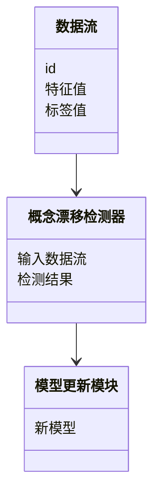
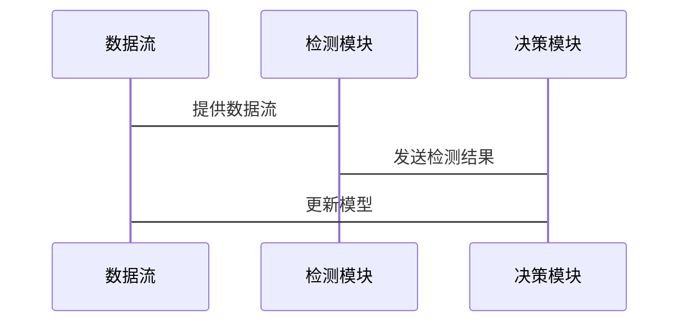

                 


# 概念漂移检测：适应动态变化的环境

## 关键词
概念漂移检测，机器学习，数据分布变化，模型更新，实时决策系统

## 摘要
概念漂移检测是机器学习和数据科学中的一个重要问题，特别是在动态变化的环境中，数据分布的变化会导致模型性能下降。本文系统地介绍了概念漂移的基本概念、检测方法和应对策略。通过详细讲解统计方法、机器学习方法和在线检测方法，本文为读者提供了一套完整的概念漂移检测解决方案。结合实际项目案例，本文还探讨了系统设计与架构，帮助读者将理论知识应用于实际场景。最后，本文总结了概念漂移检测的最佳实践和未来研究方向。

---

# 目录

## 第1章: 概念漂移的基本概念

### 1.1 问题背景与定义
#### 1.1.1 机器学习中的数据分布变化
#### 1.1.2 概念漂移的定义与分类
#### 1.1.3 概念漂移的检测与应对

### 1.2 概念漂移的类型
#### 1.2.1 突发性漂移
#### 1.2.2 渐进性漂移
#### 1.2.3 周期性漂移

### 1.3 概念漂移检测的重要性
#### 1.3.1 模型性能下降的预警
#### 1.3.2 动态环境下的模型更新
#### 1.3.3 实时决策系统的可靠性

## 第2章: 概念漂移的核心概念与联系

### 2.1 概念漂移的核心属性
#### 2.1.1 数据分布的变化
#### 2.1.2 标签分布的变化
#### 2.1.3 特征重要性的变化

### 2.2 概念漂移与相关概念的对比
#### 2.2.1 概念漂移与数据漂移
#### 2.2.2 概念漂移与模型退化
#### 2.2.3 概念漂移与概念漂移检测

### 2.3 概念漂移的ER实体关系图
```mermaid
er
    entity 概念漂移 {
        id
        数据分布
        标签分布
        特征重要性
    }
    entity 数据点 {
        id
        特征值
        标签值
    }
    概念漂移 --> 数据点
```

## 第3章: 概念漂移检测的算法原理

### 3.1 统计方法
#### 3.1.1 基于分布差异的检测
#### 3.1.2 基于假设检验的检测
#### 3.1.3 统计方法的优缺点

### 3.2 机器学习方法
#### 3.2.1 基于模型性能的检测
#### 3.2.2 基于特征变化的检测
#### 3.2.3 机器学习方法的数学模型

### 3.3 在线检测方法
#### 3.3.1 基于滑动窗口的检测
#### 3.3.2 基于增量学习的检测
#### 3.3.3 在线检测的实现细节

## 第4章: 概念漂移检测的数学模型与公式

### 4.1 统计方法的数学模型
#### 4.1.1 基于Kullback-Leibler散度的公式
$$D_{KL}(P||Q) = \sum P(i) \log \frac{P(i)}{Q(i)}$$
#### 4.1.2 基于Hellinger距离的公式
$$H(P, Q) = \frac{1}{\sqrt{2}} \sqrt{\sum \left( \sqrt{P(i)} - \sqrt{Q(i)} \right)^2}$$

### 4.2 机器学习方法的数学模型
#### 4.2.1 基于SVM的分布变化检测
$$\text{score} = \frac{1}{2} \left(1 - \text{sign}(\text{score}_i - \text{score}_j)\right)$$

## 第5章: 概念漂移检测的系统设计与架构

### 5.1 问题场景介绍
#### 5.1.1 实时决策系统的背景
#### 5.1.2 动态数据流的处理需求
#### 5.1.3 系统实时性的挑战

### 5.2 系统功能设计
#### 5.2.1 领域模型mermaid类图


### 5.3 系统架构设计


### 5.4 系统接口设计
#### 5.4.1 数据流接口
#### 5.4.2 检测结果接口
#### 5.4.3 模型更新接口

### 5.5 系统交互设计


## 第6章: 概念漂移检测的项目实战

### 6.1 环境安装与准备
#### 6.1.1 安装Python和相关库
#### 6.1.2 数据集准备
#### 6.1.3 环境配置

### 6.2 系统核心实现
#### 6.2.1 数据流处理模块
#### 6.2.2 概念漂移检测模块
#### 6.2.3 模型更新模块

### 6.3 代码实现与解读
#### 6.3.1 数据流处理代码
```python
def process_data_stream(data_stream):
    # 处理数据流并返回特征值
    return features
```

#### 6.3.2 概念漂移检测代码
```python
def detect_drift(features_before, features_after):
    # 使用Kullback-Leibler散度进行检测
    return has_drift
```

#### 6.3.3 模型更新代码
```python
def update_model(model, new_data):
    # 更新模型并返回新模型
    return updated_model
```

### 6.4 案例分析与详细讲解
#### 6.4.1 数据流的特征提取
#### 6.4.2 检测结果的分析
#### 6.4.3 模型更新的效果评估

### 6.5 项目小结
#### 6.5.1 项目实现的关键点
#### 6.5.2 项目中的经验教训
#### 6.5.3 项目的未来优化方向

## 第7章: 总结与展望

### 7.1 核心知识点总结
#### 7.1.1 概念漂移的基本概念
#### 7.1.2 检测方法的分类
#### 7.1.3 系统设计与实现

### 7.2 未来研究方向
#### 7.2.1 更高效的检测算法
#### 7.2.2 更智能的模型更新策略
#### 7.2.3 多维度的概念漂移检测

### 7.3 最佳实践 tips
#### 7.3.1 定期监控数据分布
#### 7.3.2 及时更新模型
#### 7.3.3 结合业务场景进行优化

### 7.4 注意事项
#### 7.4.1 数据质量的重要性
#### 7.4.2 模型选择的合理性
#### 7.4.3 实时性与准确性的平衡

## 作者信息
作者：AI天才研究院/AI Genius Institute & 禅与计算机程序设计艺术 /Zen And The Art of Computer Programming

---

以上是《概念漂移检测：适应动态变化的环境》的技术博客文章的详细目录大纲，涵盖了从基础理论到实际应用的各个方面，结合了数学公式、代码示例和系统设计，帮助读者全面理解和掌握概念漂移检测的相关知识。

