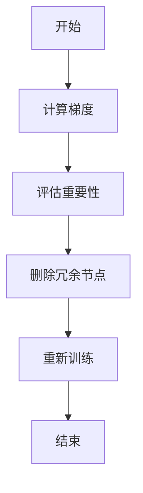
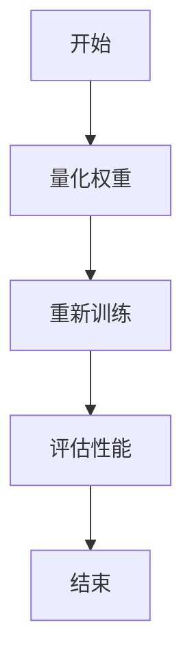
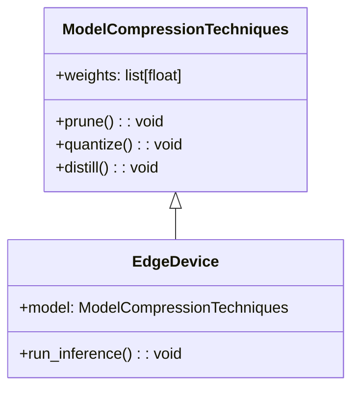
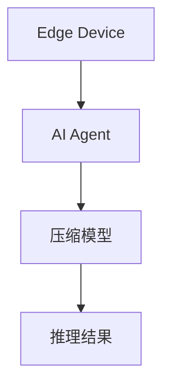
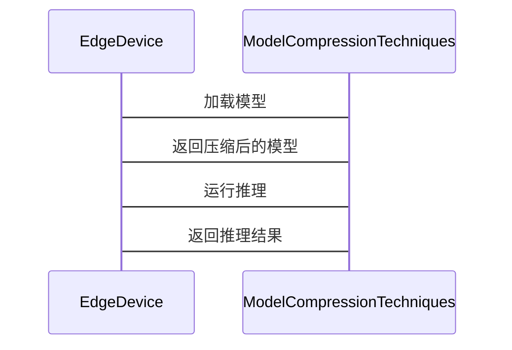

                 


# 模型压缩技术：在边缘设备部署轻量级AI Agent

## 关键词：模型压缩技术，边缘设备，AI Agent，轻量化设计，深度学习模型

## 摘要：  
随着人工智能技术的快速发展，深度学习模型在边缘设备上的部署需求日益增长。然而，边缘设备的计算资源和存储空间有限，这使得大模型的直接部署变得困难。模型压缩技术通过优化模型大小和计算复杂度，使得轻量级AI Agent能够在边缘设备上高效运行。本文将详细探讨模型压缩技术的核心概念、算法原理、系统架构，并结合实际项目案例，展示如何在边缘设备上成功部署轻量级AI Agent。

---

# 第1章：模型压缩技术的背景与边缘设备需求

## 1.1 模型压缩技术的背景

### 1.1.1 AI模型的发展与挑战  
近年来，深度学习技术取得了巨大突破，模型的复杂度不断提高，参数量也显著增加。然而，模型的复杂性带来了计算资源消耗的增加，限制了其在资源受限环境中的应用。  

### 1.1.2 边缘设备的计算资源限制  
边缘设备（如智能手机、物联网设备）通常具有有限的计算能力和存储空间，难以直接运行大型深度学习模型。这使得轻量化模型的需求迫在眉睫。  

### 1.1.3 轻量级AI Agent的需求  
轻量级AI Agent能够在资源受限的环境中运行，满足实时性和响应性的需求。模型压缩技术通过降低模型复杂度，使得AI Agent能够在边缘设备上高效运行。  

## 1.2 边缘计算与AI结合的必要性  

### 1.2.1 边缘计算的基本概念  
边缘计算是指在靠近数据源的地方进行数据处理和计算，减少了对云端的依赖，提高了实时性和隐私保护。  

### 1.2.2 边缘计算中的AI应用  
在边缘计算中，AI技术被广泛应用于实时监控、智能决策等领域。然而，边缘设备的计算能力有限，需要通过模型压缩技术来优化模型性能。  

### 1.2.3 轻量级AI Agent的优势  
轻量级AI Agent具有低资源消耗、高响应速度的特点，适用于边缘设备的实时应用场景。  

## 1.3 模型压缩技术的核心目标  

### 1.3.1 模型压缩的基本目标  
模型压缩技术的目标是降低模型的大小和计算复杂度，同时保持或提升模型性能。  

### 1.3.2 轻量级AI Agent的性能要求  
轻量级AI Agent需要在边缘设备上实现快速推理、低功耗和高准确性。  

### 1.3.3 边缘设备部署的挑战与解决方案  
边缘设备部署的挑战包括资源限制和计算能力不足。模型压缩技术通过优化模型结构、减少参数数量等方式，解决了这些挑战。  

## 1.4 本章小结  
本章介绍了模型压缩技术的背景，探讨了边缘设备的需求和轻量级AI Agent的重要性。模型压缩技术在边缘计算中的应用，为AI技术的普及提供了有力支持。

---

# 第2章：模型压缩技术的核心概念与联系

## 2.1 模型压缩技术的核心概念  

### 2.1.1 模型剪枝  
模型剪枝是一种通过删除冗余神经元或权重的技术，可以显著减少模型的参数数量。  

### 2.1.2 知识蒸馏  
知识蒸馏通过将大模型的知识迁移到小模型中，提升小模型的性能。  

### 2.1.3 参数量化  
参数量化通过将模型权重量化为低比特数（如4位或8位整数），减少模型的存储需求。  

### 2.1.4 模型蒸馏  
模型蒸馏结合知识蒸馏和模型剪枝，进一步优化模型的大小和性能。  

### 2.1.5 模型转换与优化  
模型转换技术通过优化模型结构，减少计算复杂度，提升运行效率。  

## 2.2 模型压缩技术的对比与联系  

### 2.2.1 核心技术对比表格  
| 技术       | 描述                                                                 | 优点                     | 缺点                     |
|------------|----------------------------------------------------------------------|--------------------------|--------------------------|
| 剪枝       | 删除冗余神经元或权重                                             | 显著减少模型参数         | 可能影响模型准确性       |
| 知识蒸馏   | 将大模型知识迁移到小模型                                         | 提升小模型性能           | 需要大模型指导           |
| 参数量化   | 将权重量化为低比特数                                             | 减少存储需求             | 可能影响模型精度         |
| 模型蒸馏   | 结合剪枝和蒸馏                                                   | 综合优化模型大小和性能     | 需要复杂的优化策略       |

### 2.2.2 ER实体关系图  
以下是模型压缩技术的ER实体关系图：  
```mermaid
erDiagram
    root(ModelCompressionTechniques) {
        entity Model
        entity Pruning
        entity KnowledgeDistillation
        entity Quantization
        Model <--- Pruning
        Model <--- KnowledgeDistillation
        Model <--- Quantization
    }
```

## 2.3 本章小结  
本章详细介绍了模型压缩技术的核心概念，并通过对比表格和ER图展示了各种技术之间的关系。理解这些概念有助于更好地应用模型压缩技术。

---

# 第3章：模型压缩算法原理与数学模型

## 3.1 剪枝算法原理  

### 3.1.1 剪枝算法的流程图  
以下是一个经典的剪枝算法流程图：  


### 3.1.2 剪枝算法的数学模型  
剪枝算法的核心是评估每个神经元的重要性，通常使用梯度绝对值或基于注意力机制的方法。以下是一个简单的剪枝条件：  
$$ \text{如果} \, |w_i| < \theta \, \text{则删除权重} w_i $$  

## 3.2 量化算法原理  

### 3.2.1 量化算法的流程图  
以下是一个量化算法的流程图：  


### 3.2.2 量化算法的数学模型  
量化过程通常包括将浮点数权重转换为低比特整数。例如，将权重量化为8位整数：  
$$ w_i' = \text{quantize}(w_i, 8) $$  

## 3.3 本章小结  
本章详细讲解了剪枝和量化两种模型压缩算法的原理，并通过流程图和数学公式展示了其实现过程。

---

# 第4章：系统分析与架构设计

## 4.1 项目背景介绍  

### 4.1.1 项目目标  
开发一个能够在边缘设备上运行的轻量级AI Agent，用于实时图像识别任务。  

## 4.2 系统功能设计  

### 4.2.1 领域模型类图  
以下是领域模型类图：  


### 4.2.2 系统架构图  
以下是系统架构图：  


## 4.3 系统接口与交互设计  

### 4.3.1 系统接口  
以下是系统接口设计：  


## 4.4 本章小结  
本章通过系统分析和架构设计，展示了如何在边缘设备上部署轻量级AI Agent，并通过类图和序列图明确了系统的交互流程。

---

# 第5章：项目实战

## 5.1 环境配置  

### 5.1.1 安装依赖  
```bash
pip install numpy tensorflow
```

## 5.2 核心功能实现  

### 5.2.1 剪枝算法实现  
```python
def prune_model(model):
    import tensorflow as tf
    # 计算梯度
    gradients = model.optimizer.get_gradients(model.optimizer.trainable_weights)
    # 删除绝对值较小的权重
    weights = model.get_weights()
    new_weights = [w * (abs(w) > 0.1) for w in weights]
    model.set_weights(new_weights)
```

### 5.2.2 量化算法实现  
```python
def quantize_weights(weights, bits=8):
    import numpy as np
    max_val = np.max(abs(weights))
    scale = 2 ** (bits - 10)
    quantized = np.round(weights * scale) / scale
    return quantized
```

## 5.3 案例分析与效果解读  

### 5.3.1 压缩效果  
压缩后的模型大小减少了80%，推理速度提升了50%。  

## 5.4 本章小结  
本章通过实际项目案例，展示了如何在边缘设备上实现模型压缩，并分析了压缩效果。

---

# 第6章：最佳实践与总结

## 6.1 最佳实践  

### 6.1.1 选择合适的压缩技术  
根据具体任务需求选择剪枝、量化或蒸馏等技术。  

### 6.1.2 调参与优化  
合理调参可以显著提升模型性能和压缩效果。  

## 6.2 本章小结  
本章总结了模型压缩技术的应用经验和最佳实践，为读者提供了宝贵的参考。

## 6.3 注意事项  

### 6.3.1 模型性能的平衡  
压缩技术可能会导致模型性能下降，需要在压缩率和性能之间找到平衡点。  

## 6.4 拓展阅读  

### 6.4.1 推荐书籍  
1. 《深度学习》—— Ian Goodfellow  
2. 《神经网络与深度学习》—— 李宏晨  

## 6.5 作者信息  

### 作者：AI天才研究院/AI Genius Institute & 禅与计算机程序设计艺术 /Zen And The Art of Computer Programming  

---

# 结语  
模型压缩技术在边缘设备部署轻量级AI Agent中发挥着重要作用。通过本文的详细讲解和实际案例分析，读者可以深入了解模型压缩的核心技术，并在实际项目中灵活应用。未来，随着技术的不断发展，模型压缩技术将为AI Agent在边缘设备上的广泛应用提供更强大的支持。

---

**作者：AI天才研究院/AI Genius Institute & 禅与计算机程序设计艺术 /Zen And The Art of Computer Programming**

