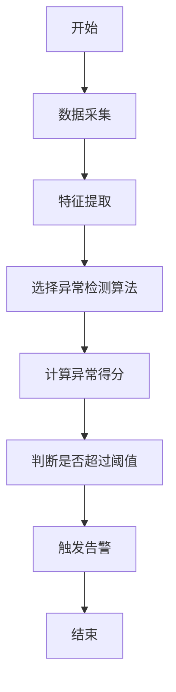
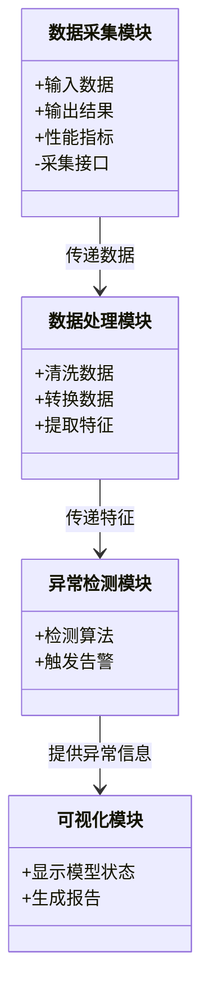
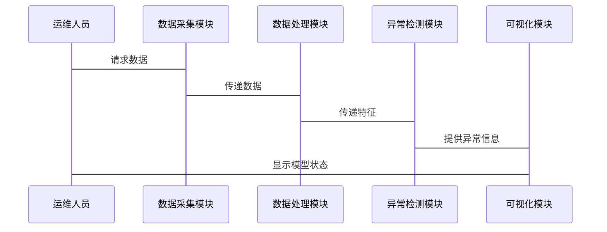

                 


# 模型监控：实时跟踪AI Agent的健康状态

关键词：模型监控, AI Agent, 实时跟踪, 异常检测, 模型健康, 系统架构, 项目实战

摘要：本文将详细探讨模型监控的背景、核心概念、算法原理、系统架构设计以及项目实战。通过逐步分析，本文将揭示如何实时跟踪AI Agent的健康状态，确保其在实际应用中的稳定性和可靠性。从理论到实践，本文将为读者提供全面的指导，帮助其掌握模型监控的关键技术与方法。

---

# 第一部分: 模型监控概述

# 第1章: 模型监控的背景与概念

## 1.1 模型监控的背景与问题背景
### 1.1.1 AI Agent的广泛应用
AI Agent（智能体）在各个领域的应用日益广泛，从自动驾驶到智能客服，从医疗诊断到金融交易，AI Agent已经成为推动技术进步的重要力量。然而，随着AI Agent的应用场景越来越复杂，模型的健康状态监控变得尤为重要。

### 1.1.2 模型失效的潜在风险
AI模型在运行过程中可能会因为数据漂移、概念漂移或模型退化等原因导致性能下降甚至完全失效。这种情况下，如果不及时发现和处理，可能会导致严重的后果，例如经济损失、用户信任的丧失甚至安全风险。

### 1.1.3 实时监控的必要性
实时监控AI Agent的健康状态，可以及时发现模型的异常行为，快速定位问题并采取措施，从而避免潜在风险。此外，实时监控还可以帮助我们了解模型的性能变化趋势，为模型优化和更新提供数据支持。

## 1.2 模型监控的定义与问题描述
### 1.2.1 模型监控的核心目标
模型监控的核心目标是实时跟踪AI Agent的健康状态，确保其在运行过程中的稳定性和可靠性。具体目标包括：
1. 监测模型的性能指标，如准确率、召回率、F1值等。
2. 发现模型的异常行为，如预测结果的偏差、推理时间的异常等。
3. 提供实时告警，帮助运维人员快速定位问题。

### 1.2.2 模型健康状态的定义
模型健康状态可以通过多个指标来定义，例如：
1. **性能指标**：模型在特定数据集上的准确率、召回率、F1值等。
2. **响应时间**：模型处理请求的时间是否在预期范围内。
3. **数据分布**：输入数据的分布是否与训练数据一致。
4. **异常行为**：模型输出结果是否偏离预期范围。

### 1.2.3 监控的主要问题与挑战
模型监控面临的主要问题和挑战包括：
1. **数据漂移**：输入数据的分布发生变化，导致模型性能下降。
2. **概念漂移**：目标概念的分布发生变化，模型无法准确预测。
3. **模型退化**：模型在运行过程中逐渐失去准确性。
4. **实时性要求**：需要实时监控模型状态，对延迟有较高的要求。

## 1.3 模型监控的解决思路
### 1.3.1 监控的总体框架
模型监控的总体框架可以分为以下几个步骤：
1. **数据采集**：收集模型的输入数据、输出结果、性能指标等。
2. **数据处理**：对采集到的数据进行清洗、转换和标准化。
3. **模型评估**：基于处理后的数据，计算模型的性能指标。
4. **异常检测**：基于模型的性能指标，检测是否存在异常。
5. **告警与反馈**：当检测到异常时，触发告警并提供反馈信息。

### 1.3.2 监控的主要方法
目前，模型监控的主要方法包括：
1. **基于统计的方法**：通过统计学方法检测数据分布的变化。
2. **基于机器学习的方法**：使用监督或无监督学习算法检测异常。
3. **基于时间序列的方法**：分析模型性能随时间的变化趋势。

### 1.3.3 监控的边界与外延
模型监控的边界在于模型的输入和输出，不涉及模型内部的参数调整。其外延则包括对模型运行环境的监控，例如服务器负载、网络延迟等。

## 1.4 模型监控的核心要素
### 1.4.1 数据采集与处理
数据采集是模型监控的基础，需要采集模型的输入数据、输出结果以及性能指标。数据处理包括数据清洗、标准化和特征提取。

### 1.4.2 模型性能评估
模型性能评估是通过一系列指标来衡量模型的健康状态，例如准确率、召回率、F1值等。

### 1.4.3 异常检测与告警
异常检测是通过算法检测模型性能的异常变化，并触发告警机制。

### 1.4.4 可视化与分析工具
可视化工具可以帮助运维人员直观地了解模型的健康状态，分析工具则用于深入挖掘异常的原因。

## 1.5 本章小结
本章介绍了模型监控的背景、定义、目标、问题与挑战以及解决思路。通过这些内容，读者可以对模型监控的整体框架和核心要素有一个清晰的认识。

---

# 第2章: 模型监控的核心概念与联系

## 2.1 模型监控的核心概念
### 2.1.1 数据流与模型交互
模型监控需要实时采集模型的输入数据、输出结果以及性能指标，并通过数据流与模型进行交互。

### 2.1.2 模型性能的评估指标
模型性能的评估指标包括准确率、召回率、F1值、响应时间等。

### 2.1.3 异常检测的原理
异常检测是通过分析模型的性能指标或输入数据的变化，发现异常行为并触发告警。

## 2.2 核心概念的对比分析
### 2.2.1 数据流与模型状态的关系
数据流的变化可以直接影响模型的输入，进而影响模型的输出结果和性能指标。

### 2.2.2 不同模型监控方法的对比
不同的模型监控方法在实现原理和适用场景上存在差异，需要根据具体需求选择合适的方法。

### 2.2.3 监控指标与模型性能的关联
监控指标的变化可以反映模型性能的变化，通过分析这些变化可以发现模型的异常行为。

## 2.3 模型监控的ER实体关系图
以下是一个简单的ER实体关系图，展示了模型监控系统的主要实体及其关系：

```mermaid
er
  actor: 监控系统
  model: AI Agent模型
  data: 输入数据
  metrics: 性能指标
  alert: 告警信息
  relation: 监控系统 -> 数据采集
  relation: 数据 -> 模型输入
  relation: 模型 -> 性能指标
  relation: 性能指标 -> 监控系统
  relation: 监控系统 -> 告警信息
```

## 2.4 本章小结
本章通过对比分析和实体关系图，详细解释了模型监控的核心概念及其相互关系，帮助读者更好地理解模型监控的整体架构。

---

# 第3章: 模型监控的算法原理

## 3.1 模型性能监控算法
### 3.1.1 基于统计的性能评估
基于统计的性能评估方法通过计算模型性能指标的统计量（如均值、方差）来判断模型是否异常。

### 3.1.2 基于机器学习的异常检测
基于机器学习的异常检测方法通过训练模型来识别正常和异常的性能指标。

### 3.1.3 模型退化检测方法
模型退化检测方法通过分析模型性能随时间的变化趋势，判断模型是否退化。

## 3.2 异常检测算法
### 3.2.1 基于阈值的异常检测
基于阈值的异常检测方法通过设定阈值，判断性能指标是否超过阈值。

### 3.2.2 基于聚类的异常检测
基于聚类的异常检测方法通过将相似的性能指标聚类，识别异常点。

### 3.2.3 基于时间序列的异常检测
基于时间序列的异常检测方法通过分析性能指标的时间序列数据，发现异常变化。

## 3.3 算法实现的Mermaid流程图
以下是一个基于时间序列的异常检测算法流程图：



## 3.4 算法实现的Python代码示例
以下是一个基于统计的异常检测算法的Python代码示例：

```python
import numpy as np
from scipy import stats

def detect_anomaly(data, threshold=3):
    # 计算均值和标准差
    mean = np.mean(data)
    std = np.std(data)
    
    # 计算Z分数
    z_scores = stats.zscore(data)
    
    # 判断是否存在异常值
    anomalies = np.where(z_scores > threshold)[0]
    return anomalies

# 示例数据
data = [1, 2, 3, 4, 5, 6, 7, 8, 9, 10, 100]
# 检测异常值
anomalies = detect_anomaly(data)
print("异常索引:", anomalies)
```

## 3.5 算法的数学模型与公式
### 3.5.1 基于统计的异常检测公式
Z分数公式：
$$ Z = \frac{X - \mu}{\sigma} $$
其中，$$\mu$$ 是均值，$$\sigma$$ 是标准差。

### 3.5.2 基于机器学习的异常检测公式
随机森林异常检测模型的损失函数：
$$ \text{损失函数} = \sum_{i=1}^{n} (y_i - \hat{y}_i)^2 $$

## 3.6 本章小结
本章通过详细讲解模型监控的算法原理，包括基于统计、机器学习和时间序列的异常检测方法，帮助读者掌握模型监控的核心技术。

---

# 第4章: 模型监控的系统架构设计

## 4.1 问题场景介绍
模型监控系统需要实时采集模型的输入数据、输出结果和性能指标，分析数据的变化，检测异常行为，并提供实时反馈。

## 4.2 系统功能设计
### 4.2.1 数据采集模块
负责采集模型的输入数据、输出结果和性能指标。

### 4.2.2 数据处理模块
对采集到的数据进行清洗、转换和特征提取。

### 4.2.3 异常检测模块
基于算法对模型的性能指标进行异常检测，触发告警。

### 4.2.4 可视化模块
将模型的健康状态可视化，帮助运维人员直观了解模型状态。

## 4.3 系统架构设计的Mermaid类图
以下是一个模型监控系统的领域模型类图：



## 4.4 系统架构设计的Mermaid架构图
以下是一个模型监控系统的总体架构图：


## 4.5 系统接口设计
系统接口设计包括数据采集接口、异常检测接口和可视化接口。

## 4.6 系统交互的Mermaid序列图
以下是一个系统交互的序列图：



## 4.7 本章小结
本章通过系统架构设计，详细讲解了模型监控系统的各个模块及其交互关系，为后续的项目实现奠定了基础。

---

# 第5章: 模型监控的项目实战

## 5.1 环境安装与配置
### 5.1.1 安装Python环境
使用Anaconda或虚拟环境安装Python 3.8及以上版本。

### 5.1.2 安装依赖库
安装以下依赖库：
```
pip install numpy
pip install pandas
pip install scikit-learn
pip install matplotlib
pip install mermaid
```

## 5.2 系统核心实现
### 5.2.1 数据采集模块
编写数据采集脚本，采集模型的输入数据、输出结果和性能指标。

### 5.2.2 数据处理模块
编写数据处理脚本，对采集到的数据进行清洗、转换和特征提取。

### 5.2.3 异常检测模块
实现异常检测算法，检测模型的性能指标是否异常。

### 5.2.4 可视化模块
编写可视化脚本，将模型的健康状态可视化。

## 5.3 代码实现与解读
### 5.3.1 数据采集模块代码
```python
import requests

def collect_data(api_url):
    try:
        response = requests.get(api_url)
        data = response.json()
        return data
    except Exception as e:
        print(f"数据采集失败: {e}")
        return None

# 示例API地址
api_url = "http://localhost:8000/api"
data = collect_data(api_url)
print("采集到的数据:", data)
```

### 5.3.2 异常检测模块代码
```python
from sklearn.ensemble import IsolationForest

def detect_anomaly(data, n_estimators=100, contamination=0.05):
    model = IsolationForest(n_estimators=n_estimators, contamination=contamination, random_state=42)
    model.fit(data)
    anomalies = model.predict(data)
    anomalies = anomalies == -1
    return anomalies

# 示例数据
data = np.random.randn(100, 2)
anomalies = detect_anomaly(data)
print("异常样本索引:", np.where(anomalies)[0])
```

### 5.3.3 可视化模块代码
```python
import matplotlib.pyplot as plt

def visualize_data(data, anomalies):
    plt.figure(figsize=(10, 6))
    plt.scatter(range(len(data)), data[:, 0], c='blue', label='正常数据')
    plt.scatter(range(len(data))[anomalies], data[anomalies, 0], c='red', label='异常数据')
    plt.xlabel('样本索引')
    plt.ylabel('特征值')
    plt.title('模型健康状态可视化')
    plt.legend()
    plt.show()

# 示例可视化
data = np.random.randn(100, 2)
anomalies = np.random.choice([False, True], 100, p=[0.95, 0.05])
visualize_data(data, anomalies)
```

## 5.4 项目小结
本章通过实际项目案例，详细讲解了模型监控系统的实现过程，包括环境安装、代码实现和可视化展示。通过这些内容，读者可以掌握模型监控的具体操作方法。

---

# 第6章: 模型监控的最佳实践

## 6.1 最佳实践 Tips
1. **实时性**：确保模型监控的实时性，避免因延迟导致的问题。
2. **数据质量**：保证采集数据的准确性和完整性。
3. **算法选择**：根据具体场景选择合适的异常检测算法。
4. **可视化**：通过可视化工具帮助运维人员直观了解模型状态。
5. **持续优化**：根据监控结果不断优化模型和监控策略。

## 6.2 小结
模型监控是一项复杂的任务，需要结合理论知识和实践经验。通过本文的讲解，读者可以掌握模型监控的核心技术和方法，并在实际项目中灵活应用。

## 6.3 注意事项
1. **数据隐私**：确保数据的安全性和隐私性。
2. **系统稳定性**：保证监控系统的稳定运行，避免因系统故障导致监控中断。
3. **模型更新**：定期更新模型，并重新评估其健康状态。

## 6.4 拓展阅读
1. 《深入理解机器学习》
2. 《时间序列分析与应用》
3. 《实时数据分析与可视化》

---

# 作者：AI天才研究院/AI Genius Institute & 禅与计算机程序设计艺术/Zen And The Art of Computer Programming

