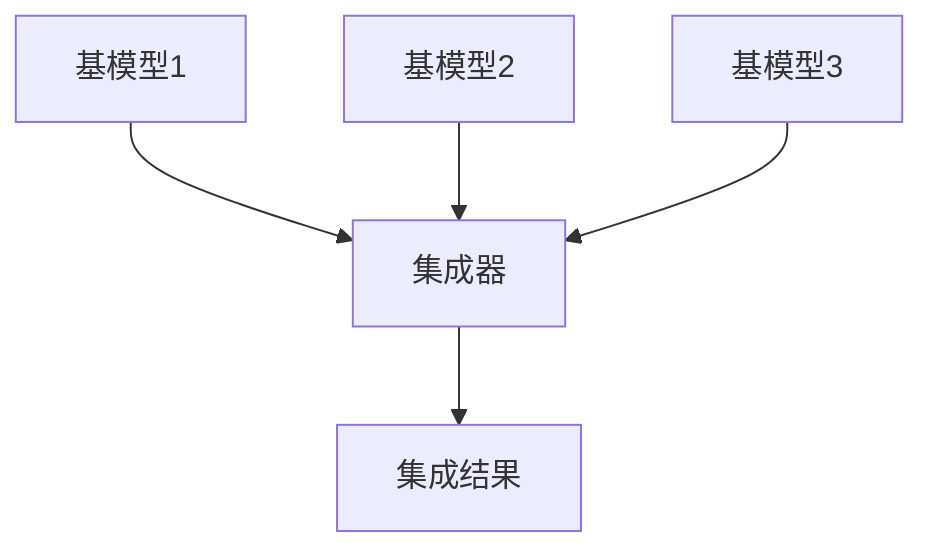
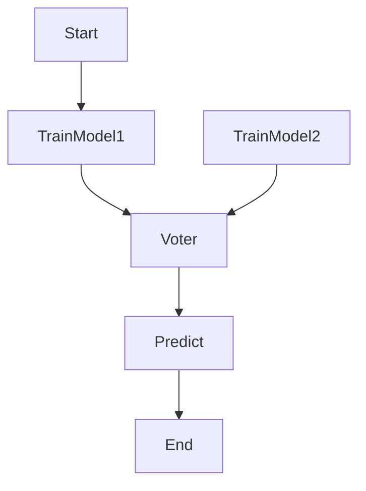

                 


# 《模型集成与系统部署》

---

## 关键词：模型集成、系统部署、机器学习、深度学习、人工智能

---

## 摘要：  
模型集成与系统部署是人工智能领域中的两大核心技术，前者通过结合多个模型的优势提升系统性能，后者则确保这些模型能够高效、稳定地运行于实际场景中。本文将从模型集成的核心原理出发，逐步探讨其在系统部署中的应用，结合实际案例，详细讲解模型集成与系统部署的关键技术、实现方法和优化策略。通过本文的分析，读者将能够全面理解模型集成与系统部署的内在联系，并掌握实际应用中的关键要点。

---

## 第一部分: 模型集成与系统部署基础

### 第1章: 模型集成与系统部署概述

#### 1.1 模型集成的核心概念  
模型集成是一种将多个独立模型的输出进行综合的技术，旨在通过多样化的模型预测结果来提升整体系统的准确性和鲁棒性。常见的模型集成方法包括投票法、堆叠法和模型融合等。模型集成的核心在于利用“集成智慧”，通过多个模型的优势互补，解决单个模型可能存在的过拟合、欠拟合或性能不足等问题。  

**问题背景：**  
在实际应用场景中，单个模型的性能往往难以满足需求，尤其是在复杂任务中，例如图像识别、自然语言处理等领域。通过集成多个模型，可以有效提升系统的泛化能力和稳定性。  

**概念结构：**  
模型集成主要由以下核心要素组成：  
1. **基模型**：构成集成的基本单元，可以是任何类型的模型（如决策树、神经网络等）。  
2. **集成器**：负责将多个基模型的输出进行整合，生成最终的预测结果。  
3. **融合策略**：决定如何将多个基模型的输出进行综合的方法，例如投票、加权平均等。  

#### 1.2 系统部署的基本概念  
系统部署是将开发完成的模型或系统应用到实际生产环境中的过程。它涉及到模型的封装、服务化、监控和维护等多个方面。系统部署的目标是确保模型能够在实际场景中高效、稳定地运行，并能够快速响应用户的请求。  

**问题背景：**  
随着深度学习模型的复杂度不断提高，模型的部署难度也在增加。如何将复杂的模型高效地部署到生产环境，成为当前技术领域的重要挑战。  

**概念结构：**  
系统部署的核心要素包括：  
1. **部署方式**：可以是单机部署、分布式部署或边缘计算部署。  
2. **技术选型**：包括选择合适的框架（如TensorFlow、PyTorch）、容器化技术（如Docker）、 orchestration工具（如Kubernetes）等。  
3. **监控与维护**：包括日志监控、性能监控、自动扩缩容等。  

#### 1.3 模型集成与系统部署的关联  
模型集成与系统部署是密不可分的两个环节。模型集成的目标是提升系统的性能和稳定性，而系统部署则是将这些优化后的模型应用到实际环境中。通过合理的系统部署，可以充分发挥模型集成的优势，同时在部署过程中发现和解决集成模型可能存在的问题。  

**问题解决：**  
模型集成可以提升系统的性能，但复杂的集成模型可能面临部署效率低、资源消耗大的问题。因此，如何在模型集成的同时考虑系统的可部署性，成为技术优化的重要方向。  

---

## 第二部分: 模型集成的核心概念与联系

### 第2章: 模型集成的核心原理

#### 2.1 模型集成的原理  
模型集成的原理可以简单理解为“智慧的组合”。通过将多个基模型的输出进行综合，集成器能够生成更优的预测结果。以下是几种常见的模型集成方法：  

1. **投票法（Voting）**：  
   - 将多个基模型的预测结果进行投票，最终结果由投票数决定。  
   - 适用于分类任务，尤其是当基模型的输出是类别标签时。  

2. **堆叠法（Stacking）**：  
   - 将多个基模型的输出作为新数据的特征，训练一个元模型（Meta-Model）进行预测。  
   - 堆叠法可以进一步提升模型的性能，但需要额外的训练过程。  

3. **模型融合（Model Fusion）**：  
   - 将多个基模型的预测结果进行加权或融合，生成最终的预测结果。  
   - 常见的融合策略包括加权平均、概率加和等。  

#### 2.2 模型集成的属性对比  
以下是几种常见模型集成方法的对比分析：  

| **属性**       | **投票法**       | **堆叠法**       | **模型融合**       |
|----------------|------------------|------------------|--------------------|
| **实现复杂度** | 低               | 高               | 中                 |
| **计算资源**   | 较低             | 较高             | 中等               |
| **性能提升**   | 显著             | 更显著           | 视权重设计而定     |
| **适用场景**   | 分类任务         | 分类与回归任务    | 多任务集成         |

#### 2.3 模型集成的ER实体关系图  
以下是一个简单的模型集成实体关系图：  



#### 2.4 本章小结  
本章详细介绍了模型集成的核心原理，包括投票法、堆叠法和模型融合等方法。通过对比不同集成方法的属性，帮助读者理解如何根据实际需求选择合适的集成策略。

---

## 第三部分: 模型集成的算法原理与实现

### 第3章: 模型集成的算法原理

#### 3.1 模型集成的算法流程  
以下是基于投票法的模型集成算法流程图：  



#### 3.2 模型集成的数学模型  
以下是基于投票法的集成模型的数学表达式：  

投票法的准确率计算公式：  
$$ \text{集成准确率} = \frac{\sum_{i=1}^{n} w_i \cdot y_i^{(correct)}}{\sum_{i=1}^{n} w_i} $$  

其中，$w_i$ 是第$i$个基模型的权重，$y_i^{(correct)}$ 是第$i$个基模型的预测是否正确的标记（1表示正确，0表示错误）。  

#### 3.3 模型集成的Python实现  
以下是一个简单的投票法分类器的Python代码示例：  

```python
from sklearn.ensemble import VotingClassifier
from sklearn.datasets import load_iris
from sklearn.model_selection import train_test_split
from sklearn.metrics import accuracy_score

# 加载数据集
data = load_iris()
X_train, X_test, y_train, y_test = train_test_split(data.data, data.target, test_size=0.2)

# 定义基模型
from sklearn.svm import SVC
from sklearn.tree import DecisionTreeClassifier
from sklearn.linear_model import LogisticRegression

# 初始化基模型
model1 = SVC()
model2 = DecisionTreeClassifier()
model3 = LogisticRegression()

# 初始化投票分类器
voting_clf = VotingClassifier(
    estimators=[('svm', model1), ('tree', model2), ('logistic', model3)],
    voting='hard'
)

# 训练模型
voting_clf.fit(X_train, y_train)

# 预测
y_pred = voting_clf.predict(X_test)

# 计算准确率
print("投票法分类器准确率:", accuracy_score(y_test, y_pred))
```

---

## 第四部分: 模型集成的系统部署

### 第4章: 模型集成的系统架构设计

#### 4.1 系统部署的基础  
以下是模型集成系统的架构图：  

```mermaid
graph LR
    Client --> API Gateway
    API Gateway --> Load Balancer
    Load Balancer --> Model Server1
    Load Balancer --> Model Server2
    Model Server1 --> Database
    Model Server2 --> Database
    Database --> Monitor
    Monitor --> Log System
```

---

## 作者：AI天才研究院/AI Genius Institute & 禅与计算机程序设计艺术 /Zen And The Art of Computer Programming

