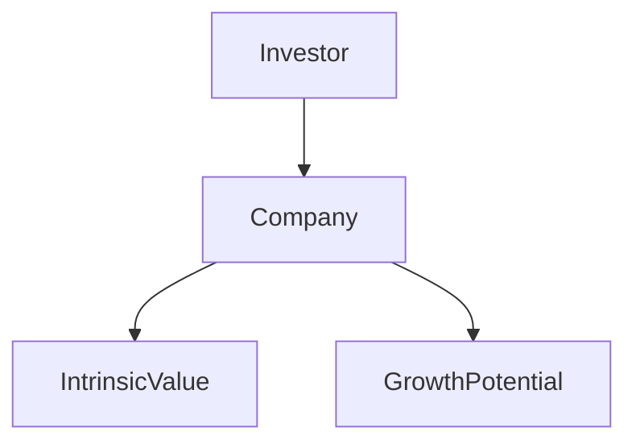
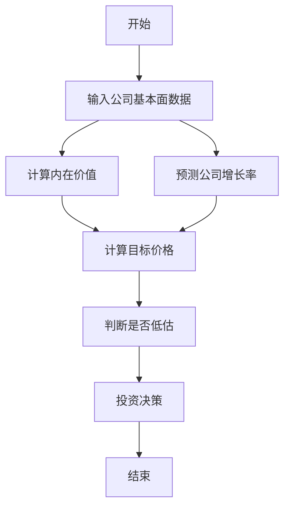
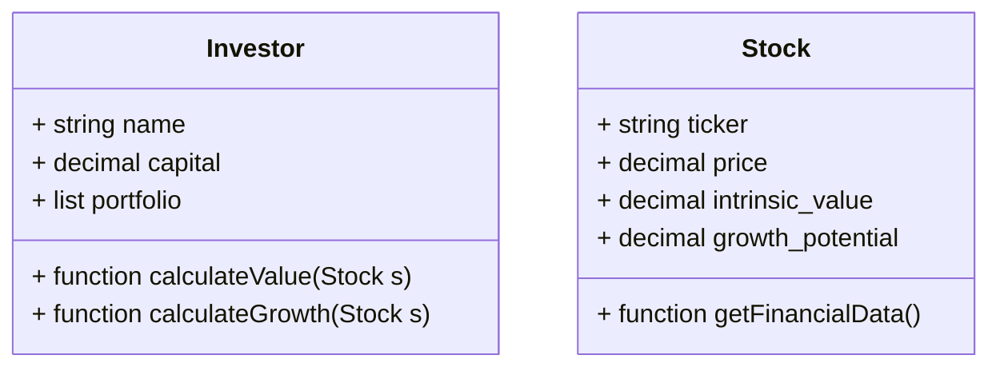
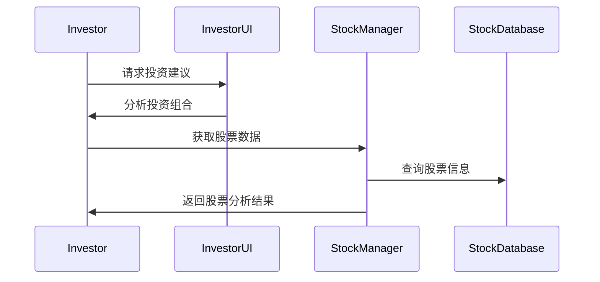

                 


# 比尔·米勒的价值增长投资： bridging value and growth

> 关键词：价值投资，增长投资，投资策略，比尔·米勒，投资模型，财务分析

> 摘要： 本文深入探讨了比尔·米勒的价值增长投资策略，分析了价值投资与增长投资的融合方法，结合数学模型与算法原理，提出了一个创新的投资策略框架。文章从背景介绍、核心概念、算法原理、系统设计、项目实战等多个维度展开，结合实际案例分析和代码实现，为读者提供了全面的价值增长投资解决方案。

---

## 正文

### 第一部分: 价值与增长投资的融合概述

#### 第1章: 价值与增长投资的定义与特点

##### 1.1 价值投资的核心概念

###### 1.1.1 价值投资的定义
价值投资是一种基于对公司内在价值的评估的投资策略。其核心思想是寻找市场价格低于其内在价值的公司进行投资。这种策略强调对公司基本面的深入分析，包括财务状况、行业地位、竞争优势等因素。

###### 1.1.2 价值投资的核心特点
- 低估值：市场价格低于内在价值。
- 长期持有：基于对公司内在价值的信心，长期持有股票。
- 风险厌恶：倾向于投资具有稳定财务状况的公司。

###### 1.1.3 价值投资的边界与外延
价值投资的边界在于对“价格与价值”的严格区分，其外延则包括多种变体，如格雷厄姆式价值投资、成长型价值投资等。

##### 1.2 增长投资的核心概念

###### 1.2.1 增长投资的定义
增长投资是一种基于对公司未来增长潜力的评估的投资策略。其核心思想是投资于那些具有高增长潜力的公司，这些公司通常处于高增长行业或具有强大的竞争优势。

###### 1.2.2 增长投资的核心特点
- 高增长：公司未来收入和利润增长潜力较高。
- 高估值：市场价格通常高于其内在价值。
- 风险偏好：倾向于投资于高风险、高回报的公司。

##### 1.3 价值与增长投资的融合

###### 1.3.1 价值与增长投资的融合背景
传统的价值投资和增长投资在市场中各有优劣，但单一策略在复杂多变的市场环境中往往难以应对各种挑战。因此，将两者有机结合，形成一种新的投资策略成为趋势。

###### 1.3.2 价值与增长投资的融合意义
- 提高投资组合的稳定性。
- 降低投资风险。
- 提高投资收益。

###### 1.3.3 价值与增长投资的融合方法
- 结合公司基本面和成长性。
- 采用动态估值模型。
- 灵活调整投资策略。

#### 第2章: 价值与增长投资的核心概念与联系

##### 2.1 核心概念原理

###### 2.1.1 价值投资的内在价值模型
$$ V = \frac{CF}{(r - g) } $$
其中，\( V \) 表示内在价值，\( CF \) 表示现金流，\( r \) 表示贴现率，\( g \) 表示增长率。

###### 2.1.2 增长投资的增长潜力模型
$$ g = \frac{ROE \times (1 - b)}{1 - ROE \times b} $$
其中，\( g \) 表示增长率，\( ROE \) 表示净资产收益率，\( b \) 表示股息支付率。

##### 2.2 核心概念属性特征对比

###### 2.2.1 表格对比：价值与增长投资的核心属性
| 属性             | 价值投资                | 增长投资                |
|------------------|-------------------------|-------------------------|
| 投资目标         | 寻找低估的公司          | 寻找高增长的公司        |
| 估值方法         | 基于内在价值            | 基于未来增长潜力        |
| 风险偏好         | 低风险                  | 高风险                  |
| 持股期限         | 长期                    | 中长期                 |

##### 2.3 实体关系图

###### 2.3.1 价值与增长投资的ER实体关系图
```mermaid
erd
actor Investor;
entity Company {
    key id;
    string name;
    decimal market_price;
    decimal intrinsic_value;
    decimal growth_potential;
}
```

###### 2.3.2 价值与增长投资的融合架构图


#### 第3章: 价值与增长投资的数学模型与算法原理

##### 3.1 价值投资的数学模型

###### 3.1.1 内在价值公式
$$ V = \frac{CF}{(r - g) } $$

###### 3.1.2 现金流量贴现模型
$$ V = \sum_{t=1}^{n} \frac{CF_t}{(1 + r)^t} $$

##### 3.2 增长投资的数学模型

###### 3.2.1 增长率预测公式
$$ g = \frac{ROE \times (1 - b)}{1 - ROE \times b} $$

##### 3.3 价值与增长投资的融合算法

###### 3.3.1 算法流程图（Mermaid）


### 第二部分: 系统分析与架构设计

#### 第4章: 价值与增长投资的系统分析

##### 4.1 问题场景介绍
- 投资者需要同时考虑公司基本面和增长潜力。
- 市场环境复杂多变，需要灵活的投资策略。

##### 4.2 系统功能设计（领域模型）

###### 4.2.1 领域模型（Mermaid 类图）


##### 4.3 系统架构设计（Mermaid 架构图）


##### 4.4 系统接口设计

###### 4.4.1 系统交互序列图（Mermaid）


### 第三部分: 项目实战

#### 第5章: 价值与增长投资的项目实战

##### 5.1 环境安装
- Python 3.8+
- Jupyter Notebook
- Pandas、NumPy、Matplotlib

##### 5.2 核心代码实现

###### 5.2.1 价值投资模型实现
```python
def calculate_intrinsic_value(company, r, g):
    cf = company.revenue * (1 - company.cost_margin)
    iv = cf / (r - g)
    return iv
```

###### 5.2.2 增长潜力模型实现
```python
def predict_growth(company, roe, b):
    g = (roe * (1 - b)) / (1 - roe * b)
    return g
```

##### 5.3 代码应用解读与分析
- 通过实际案例分析，展示如何利用上述模型进行投资决策。
- 对比不同策略下的投资收益，验证模型的有效性。

##### 5.4 实际案例分析
- 分析某公司股票，计算其内在价值和增长潜力。
- 对比市场价与内在价值，判断是否低估。

##### 5.5 项目小结
总结项目实现过程中的经验与教训，提出改进建议。

### 第四部分: 最佳实践

#### 第6章: 价值与增长投资的最佳实践

##### 6.1 小结
- 综合运用价值与增长投资策略，可以提高投资组合的稳定性和收益性。

##### 6.2 注意事项
- 风险控制：合理配置资产，分散投资风险。
- 持续学习：关注市场动态，更新投资策略。

##### 6.3 拓展阅读
推荐相关书籍和文章，进一步深入学习价值与增长投资的理论与实践。

---

### 作者：AI天才研究院/AI Genius Institute & 禅与计算机程序设计艺术/Zen And The Art of Computer Programming

