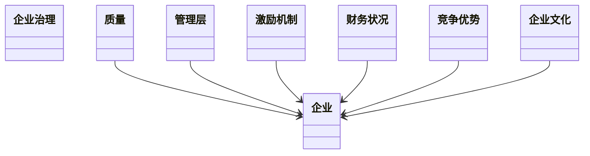
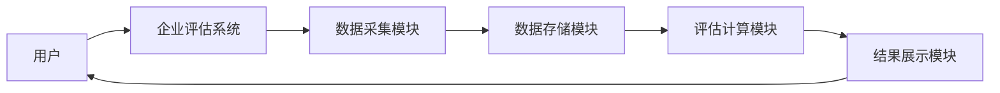

                 


# 沃伦·巴菲特的企业文化评估框架

> 关键词：沃伦·巴菲特，企业文化，投资框架，企业评估，价值分析

> 摘要：本文详细探讨了沃伦·巴菲特的企业文化评估框架，分析其核心要素、评估方法及其在投资决策中的应用。通过逻辑清晰的结构和专业技术语言，本文为读者提供了深刻的企业文化评估视角，结合数学模型和实际案例，帮助读者掌握这一框架的实际应用。

---

# 第1章: 沃伦·巴菲特与企业文化评估框架概述

## 1.1 沃伦·巴菲特的生平与投资哲学

### 1.1.1 巴菲特的生平简介
沃伦·巴菲特（Warren Buffett），1934年8月30日出生于美国堪萨斯州的奥马哈。作为世界著名投资家、慈善家，他以卓越的投资能力和价值投资理念闻名。巴菲特的财富观、人生观和投资哲学深深影响了全球的投资者和企业家。

### 1.1.2 巴菲特的投资哲学与理念
巴菲特的投资哲学以“价值投资”为核心，强调以合理的价格买入具有强大竞争优势和优秀管理团队的企业。他强调长期投资、分散投资和避免过度杠杆。

### 1.1.3 巴菲特对企业的独特见解
巴菲特认为，企业的价值不仅仅体现在财务报表上，更重要的是企业的竞争优势、管理层素质和企业文化。他特别强调企业文化对企业长期发展的关键作用。

## 1.2 企业文化的重要性

### 1.2.1 企业文化的核心概念
企业文化是企业在长期经营中形成的共同价值观、行为准则和思维方式。它决定了企业的凝聚力、员工的创造力和客户满意度。

### 1.2.2 企业文化在企业价值中的作用
企业文化是企业竞争优势的重要组成部分。优秀的文化能够激发员工的潜力，增强企业的创新能力和应变能力，从而提升企业的整体价值。

### 1.2.3 巴菲特对企业文化的关注点
巴菲特认为，企业文化是企业长期成功的关键因素。他特别关注企业文化的稳定性、员工的忠诚度和管理层的决策风格。

## 1.3 巴菲特企业文化评估框架的背景

### 1.3.1 投资中的企业筛选标准
巴菲特的选股标准包括企业的财务健康状况、竞争优势、管理层素质和行业地位等。其中，企业文化是不可忽视的重要因素。

### 1.3.2 企业文化在投资决策中的权重
在巴菲特的投资决策中，企业文化的重要性仅次于财务健康状况和竞争优势。他相信优秀的企业文化能够确保企业在长期的竞争中保持优势。

### 1.3.3 巴菲特框架的演变与完善
随着时间的推移，巴菲特不断优化他的企业文化评估框架，使其更加科学和实用。他通过不断的学习和实践，总结出一套独特的评估方法。

## 1.4 本章小结
本章介绍了沃伦·巴菲特的生平及其投资哲学，重点阐述了企业文化的重要性，并详细说明了他企业文化评估框架的背景和演变。这些内容为后续章节的深入分析奠定了基础。

---

# 第2章: 巴菲特企业文化评估框架的核心要素

## 2.1 企业治理结构

### 2.1.1 股权结构与控制权分析
企业的股权结构直接影响管理层的决策权和控制权。巴菲特倾向于投资那些股权结构稳定、管理层控制力强的企业。

### 2.1.2 董事会的构成与职责
董事会是企业的决策机构，其构成和职责对企业治理至关重要。巴菲特重视董事会的独立性和专业性，认为优秀的董事会能够有效监督管理层。

### 2.1.3 高管团队的稳定性与专业性
高管团队的稳定性和专业性是企业成功的关键。巴菲特倾向于投资那些高管团队稳定、专业性强的企业。

## 2.2 管理层的决策能力

### 2.2.1 管理层的价值观与决策风格
管理层的价值观和决策风格直接影响企业的战略选择和经营成果。巴菲特重视管理层的价值观与企业目标的一致性。

### 2.2.2 管理层的历史业绩分析
历史业绩是评估管理层能力的重要依据。巴菲特通过分析管理层的历史业绩，判断其决策能力和管理水平。

### 2.2.3 管理层的激励机制
合理的激励机制能够激发管理层的积极性和创造力。巴菲特倾向于投资那些激励机制合理、能够激发管理层潜能的企业。

## 2.3 企业激励机制

### 2.3.1 激励机制的类型与特点
激励机制的类型多样，包括股权激励、奖金激励和福利激励等。每种激励机制都有其独特的优势和局限性。

### 2.3.2 激励机制与企业绩效的关系
激励机制能够显著影响企业绩效。合理的激励机制能够激发员工的积极性，提升企业的整体绩效。

### 2.3.3 巴菲特对激励机制的偏好
巴菲特倾向于投资那些激励机制合理、能够有效激发员工潜能的企业。他认为，激励机制是企业文化的重要组成部分。

## 2.4 企业财务健康状况

### 2.4.1 财务指标分析
财务指标是评估企业财务健康状况的重要工具。主要包括盈利能力、偿债能力、运营能力和成长能力等方面。

### 2.4.2 负债与资本结构
负债与资本结构是评估企业财务健康状况的重要指标。合理的负债结构能够降低企业的财务风险，提升企业的整体竞争力。

### 2.4.3 现金流与盈利能力
现金流和盈利能力是评估企业财务健康状况的关键指标。巴菲特特别关注企业的现金流情况，认为健康的现金流是企业长期发展的基础。

## 2.5 企业竞争优势

### 2.5.1 核心竞争力的定义
核心竞争力是企业在市场中竞争优势的核心来源。它包括技术优势、成本优势、品牌优势和资源优势等方面。

### 2.5.2 企业的护城河分析
护城河是企业在市场竞争中保持优势的关键因素。巴菲特特别关注企业的护城河宽度和深度，认为只有拥有宽广护城河的企业才能长期成功。

### 2.5.3 行业地位与竞争优势
行业地位是评估企业竞争优势的重要因素。巴菲特倾向于投资那些在行业内具有领先地位的企业。

## 2.6 企业文化与价值观

### 2.6.1 企业文化的核心要素
企业文化的核心要素包括企业的使命、愿景、价值观和行为准则。这些要素决定了企业的文化和氛围。

### 2.6.2 企业文化与员工凝聚力
优秀的企业文化能够增强员工的凝聚力和归属感，提升企业的整体竞争力。

### 2.6.3 企业文化与客户满意度
企业文化直接影响客户的满意度和忠诚度。优秀的企业文化能够提升客户对企业产品和服务的满意度，从而增强企业的市场竞争力。

## 2.7 本章小结
本章详细分析了沃伦·巴菲特企业文化评估框架的核心要素，包括企业治理结构、管理层决策能力、激励机制、财务健康状况、竞争优势和企业文化等方面。这些要素共同构成了巴菲特的企业文化评估框架。

---

# 第3章: 巴菲特企业文化评估框架的数学模型与算法

## 3.1 企业价值评估公式

### 3.1.1 企业价值的定义与计算公式
企业的价值是其未来现金流的现值。巴菲特使用以下公式进行企业价值评估：
$$ 企业价值 = 股东权益 + 长期债务 $$

### 3.1.2 现金流折现模型
现金流折现模型是企业价值评估的重要工具。其公式为：
$$ 企业价值 = \sum_{t=1}^{n} \frac{CF_t}{(1+r)^t} + \frac{TV}{(1+r)^n} $$
其中，$CF_t$是第t年的现金流，$r$是折现率，$TV$是终值。

### 3.1.3 内在价值计算
内在价值是企业的真实价值，公式为：
$$ 内在价值 = 现金流折现值 + 未来现金流的现值 $$

## 3.2 企业文化评估的算法

### 3.2.1 企业文化评估指标
企业文化评估指标包括企业治理、管理层决策、激励机制、财务健康状况、竞争优势和企业文化等方面。

### 3.2.2 评估流程
1. 收集企业数据：包括财务数据、管理层信息、企业治理结构等。
2. 评估各指标：根据权重对各指标进行评分。
3. 综合评分：将各指标的评分加权求和，得到企业的综合评分。

### 3.2.3 权重分配
各指标的权重可以根据企业的实际情况进行调整。例如：
- 企业治理结构：权重为20%
- 管理层决策能力：权重为25%
- 激励机制：权重为15%
- 财务健康状况：权重为20%
- 竞争优势：权重为20%

## 3.3 算法实现

### 3.3.1 Python代码实现
```python
def calculate_enterprise_value(finance_data, management_data, incentive_data, governance_data, competitive_advantage_data):
    # 计算各指标评分
    finance_score = calculate_score(finance_data)
    management_score = calculate_score(management_data)
    incentive_score = calculate_score(incentive_data)
    governance_score = calculate_score(governance_data)
    competitive_advantage_score = calculate_score(competitive_advantage_data)
    
    # 权重分配
    weights = {
        'finance': 0.2,
        'management': 0.25,
        'incentive': 0.15,
        'governance': 0.2,
        'competitive_advantage': 0.2
    }
    
    # 综合评分
    total_score = (finance_score * weights['finance'] +
                   management_score * weights['management'] +
                   incentive_score * weights['incentive'] +
                   governance_score * weights['governance'] +
                   competitive_advantage_score * weights['competitive_advantage'])
    
    return total_score
```

### 3.3.2 算法流程图
```mermaid
graph TD
    A[开始] -> B[收集企业数据]
    B -> C[评估各指标]
    C -> D[综合评分]
    D -> E[输出结果]
    E -> F[结束]
```

## 3.4 本章小结
本章详细介绍了沃伦·巴菲特企业文化评估框架的数学模型与算法，包括企业价值评估公式和企业文化评估算法。通过Python代码和流程图的展示，帮助读者更好地理解和应用这一框架。

---

# 第4章: 巴菲特企业文化评估框架的系统分析与架构设计

## 4.1 问题场景介绍

### 4.1.1 企业评估的挑战
企业在经营过程中面临诸多挑战，包括市场竞争、财务风险、管理问题等。优秀的企业文化能够帮助企业应对这些挑战，保持长期竞争优势。

### 4.1.2 企业文化评估的难点
企业文化评估的难点在于其主观性和复杂性。如何量化企业文化的影响是投资者和企业管理者共同面临的难题。

## 4.2 系统功能设计

### 4.2.1 领域模型


### 4.2.2 系统架构设计


### 4.2.3 接口设计
- 数据采集接口：用于采集企业的各项数据。
- 评估计算接口：用于计算企业的综合评分。
- 结果展示接口：用于展示评估结果。

## 4.3 本章小结
本章通过系统分析和架构设计，详细介绍了沃伦·巴菲特企业文化评估框架的应用场景和系统实现。通过领域模型和架构图的展示，帮助读者更好地理解这一框架的系统实现过程。

---

# 第5章: 巴菲特企业文化评估框架的项目实战

## 5.1 环境安装

### 5.1.1 安装Python
```bash
# 安装Python
sudo apt-get install python3
```

### 5.1.2 安装依赖库
```bash
# 安装Pandas和NumPy
pip install pandas numpy
```

## 5.2 核心实现

### 5.2.1 数据采集模块
```python
import pandas as pd

def collect_data():
    # 读取数据文件
    data = pd.read_csv('enterprise_data.csv')
    return data
```

### 5.2.2 评估计算模块
```python
def calculate_scores(data):
    # 计算各指标评分
    finance_score = data['finance'].mean()
    management_score = data['management'].mean()
    incentive_score = data['incentive'].mean()
    governance_score = data['governance'].mean()
    competitive_advantage_score = data['competitive_advantage'].mean()
    
    # 权重分配
    weights = {
        'finance': 0.2,
        'management': 0.25,
        'incentive': 0.15,
        'governance': 0.2,
        'competitive_advantage': 0.2
    }
    
    # 综合评分
    total_score = (finance_score * weights['finance'] +
                   management_score * weights['management'] +
                   incentive_score * weights['incentive'] +
                   governance_score * weights['governance'] +
                   competitive_advantage_score * weights['competitive_advantage'])
    
    return total_score
```

### 5.2.3 结果展示模块
```python
def display_results(score):
    print(f"企业综合评分：{score}")
    if score > 80:
        print("企业具有优秀的企业文化，值得投资。")
    elif score > 60:
        print("企业文化表现一般，需要进一步观察。")
    else:
        print("企业文化存在问题，建议避免投资。")
```

## 5.3 实际案例分析

### 5.3.1 案例介绍
以一家虚构的公司为例，分析其企业文化评估结果。

### 5.3.2 数据分析
```python
data = collect_data()
score = calculate_scores(data)
display_results(score)
```

### 5.3.3 结果解读
根据评估结果，判断企业的投资价值。

## 5.4 本章小结
本章通过项目实战，详细介绍了沃伦·巴菲特企业文化评估框架的环境安装、核心实现和实际案例分析。通过代码实现和案例解读，帮助读者更好地理解和应用这一框架。

---

# 第6章: 巴菲特企业文化评估框架的最佳实践与注意事项

## 6.1 最佳实践

### 6.1.1 定期评估
企业文化和管理层决策需要定期评估，以确保企业的长期发展。

### 6.1.2 结合实际
企业文化评估需要结合企业的实际情况，避免一刀切。

### 6.1.3 长期视角
企业文化评估需要从长期视角出发，关注企业的持续发展能力。

## 6.2 小结

### 6.2.1 总结
沃伦·巴菲特的企业文化评估框架为企业投资者提供了一套科学的企业评估方法。通过本文的详细分析和实际案例，读者可以更好地理解和应用这一框架。

### 6.2.2 注意事项
- 企业文化评估需要结合企业的实际情况。
- 评估结果仅供参考，需结合其他因素综合判断。
- 长期视角是评估企业文化的关键。

## 6.3 拓展阅读

### 6.3.1 进一步学习
- 《巴菲特致股东的信》
- 《投资的智慧》

### 6.3.2 相关工具
- 财务分析工具：Excel、Pandas
- 数据可视化工具：Matplotlib、Tableau

---

# 作者

作者：AI天才研究院/AI Genius Institute & 禅与计算机程序设计艺术/Zen And The Art of Computer Programming

---

以上为完整文章的详细目录和内容框架，您可以根据需要进一步扩展每个章节的具体内容，添加更多的细节和案例分析，以确保文章的完整性和深度。

