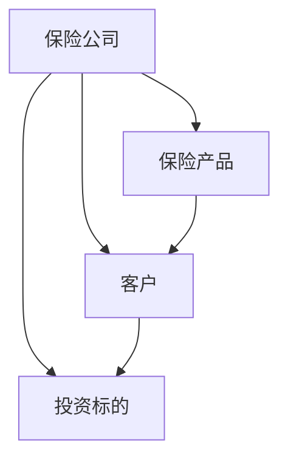
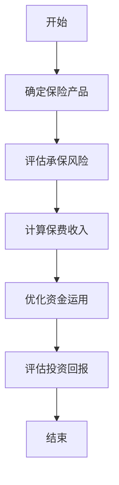
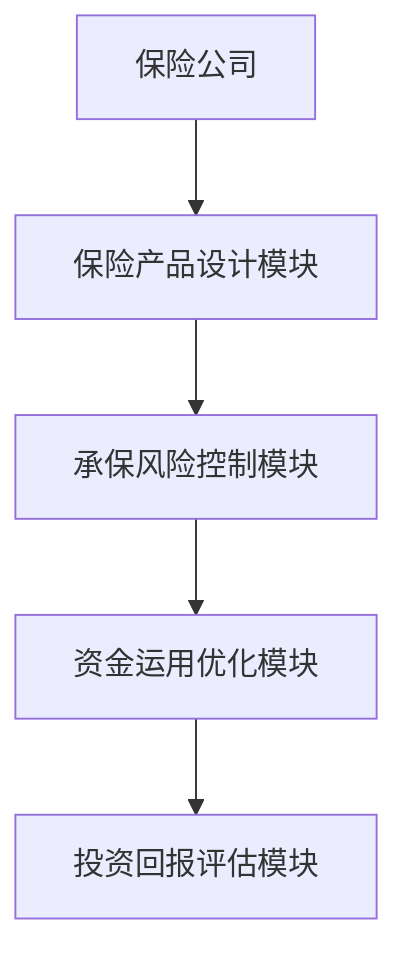

                 


# 沃伦·巴菲特的保险业价值链投资策略

> 关键词：保险业价值链，巴菲特投资策略，保险承保，保险资金运用，价值投资，风险管理

> 摘要：本文系统性地分析了沃伦·巴菲特在保险业价值链中的投资策略。通过结合保险业价值链的核心要素与巴菲特的投资哲学，详细阐述了其在保险产品设计、承保风险控制、资金运用优化等方面的具体策略。本文还从算法原理、系统架构设计等技术视角，深入探讨了巴菲特保险投资策略的数学模型和系统实现方案，并结合实际案例分析了该策略在保险业中的应用效果，最后总结了其投资策略的成功经验与未来展望。

---

## 第一部分: 引言

### 第1章: 保险业价值链投资策略的背景与意义

#### 1.1 保险业的价值链概述

保险业作为现代金融体系的重要组成部分，其价值链涵盖了从产品设计、承保、资金运用到客户服务的各个环节。保险业价值链的核心在于通过承保风险与资金运用的优化，实现保险公司长期价值的最大化。

- **保险业的基本概念与分类**  
  保险是一种以风险转移为核心的金融工具，通过将风险转移给保险公司，以换取风险保障。保险业主要分为财产保险、人身保险、责任保险和信用保证保险四大类。

- **保险业价值链的构成与特点**  
  保险业价值链包括以下几个关键环节：
  1. **产品设计**：确定保险产品的保障范围、保费、赔付条件等。
  2. **承保**：通过精算模型评估风险，决定是否承保以及承保条件。
  3. **资金运用**：将保费收入用于投资，以实现资金的保值增值。
  4. **客户服务**：为客户提供保险咨询、理赔服务等。

- **保险业在经济中的作用与地位**  
  保险业不仅是风险管理的重要工具，也是金融体系的重要组成部分。通过分散风险，保险业为社会经济发展提供了重要的支持。

#### 1.2 沃伦·巴菲特的投资哲学

沃伦·巴菲特是全球最著名的投资者之一，其投资哲学的核心是“价值投资”。他强调以合理的价格投资于具有持续竞争优势的企业，追求长期稳定的收益。

- **价值投资的核心思想**  
  价值投资强调以低于内在价值的价格买入优质资产，长期持有，避免短期市场的波动干扰。

- **保险业在巴菲特投资组合中的重要性**  
  巴菲特认为保险业具有独特的商业模式，保险公司通过收取保费形成浮存金（float），并利用这些资金进行长期投资，从而创造额外价值。因此，保险业是巴菲特投资组合中的重要组成部分。

- **巴菲特投资策略的长期性与稳定性**  
  巴菲特的投资策略注重长期稳定收益，而非短期利润。他选择那些具有强大竞争优势、良好管理和健康的财务状况的企业进行投资。

---

### 第2章: 巴菲特保险业投资策略的核心概念

#### 2.1 保险业价值链的关键环节

- **保险产品的设计与开发**  
  保险产品的设计需要考虑市场需求、风险特征、盈利能力等因素。巴菲特注重选择那些具有稳定需求和较低风险的保险产品。

- **保险承保与风险控制**  
  承保是保险公司核心竞争力的体现。巴菲特强调通过精算模型和风险控制技术，选择优质客户，避免承保高风险业务。

- **保险资金的运用与管理**  
  保险资金的运用是保险公司实现价值增长的关键。巴菲特注重将保险浮存金投资于具有长期稳定收益的资产，如股票、债券等。

#### 2.2 巴菲特保险业投资策略的特征

- **以承保业务为核心的策略**  
  巴菲特认为，保险公司应以承保业务为基础，通过优化承保结构和风险管理，实现稳健的保费收入。

- **保险浮存金的运用与管理**  
  浮存金是保险公司收取的保费与赔付支出的差额，是保险公司的重要资金来源。巴菲特强调合理利用浮存金，进行长期投资，以实现资金的保值增值。

- **长期投资与价值创造**  
  巴菲特注重通过长期投资，将保险浮存金投资于具有竞争优势的企业，实现价值创造。

#### 2.3 保险业价值链与巴菲特策略的结合

- **保险业价值链的优化与重构**  
  巴菲特的策略强调优化保险业价值链的各个环节，从产品设计到承保、资金运用，都注重效率和风险控制。

- **巴菲特策略对保险业价值链的影响**  
  巴菲特的策略推动了保险业价值链的重构，特别是在承保风险控制和资金运用效率方面，为保险公司提供了新的发展方向。

- **保险业价值链中的巴菲特模式**  
  巴菲特模式的核心是通过优化承保和资金运用，实现保险公司的长期价值增长。这种模式不仅提升了保险公司的核心竞争力，也为投资者带来了稳定的收益。

---

## 第二部分: 巴菲特保险业投资策略的核心概念与联系

### 第3章: 保险业价值链的核心要素与关系

#### 3.1 保险业价值链的实体关系图

保险业价值链涉及多个实体，包括保险公司、客户、保险产品、投资标的等。以下是实体关系图的 mermaid 描述：



#### 3.2 保险业价值链的关键属性对比

以下是保险业价值链中不同要素的关键属性对比：

| 要素       | 属性                         | 对比内容                         |
|------------|------------------------------|----------------------------------|
| 保险产品   | 风险特征、保障范围、保费     | 风险特征是核心，保费与保障范围需匹配客户需求。 |
| 承保业务   | 承保能力、风险控制能力       | 承保能力决定保费收入的稳定性，风险控制能力影响赔付支出。 |
| 资金运用   | 投资收益、投资风险           | 投资收益是关键，投资风险需与公司风险承受能力匹配。 |
| 客户需求   | 保险需求、客户满意度         | 客户需求是产品设计和承保的基础，客户满意度影响公司长期发展。 |

#### 3.3 保险业价值链的 ER 实体关系图

以下是保险业价值链的 ER 实体关系图：

```mermaid
er
    A[保险公司]
    B[保险产品]
    C[客户]
    D[投资标的]
    
    A --O--> B
    A --O--> C
    B --O--> C
    A --O--> D
    C --O--> D
```

---

### 第4章: 巴菲特保险业投资策略的算法原理

#### 4.1 巴菲特保险业投资策略的数学模型

以下是巴菲特保险业投资策略的核心数学模型：

1. **承保能力评估模型**  
   $$ \text{承保能力} = \text{精算模型} \times \text{风险控制能力} $$

2. **保险资金运用效率模型**  
   $$ \text{资金运用效率} = \frac{\text{投资收益}}{\text{保费收入}} $$

3. **长期投资回报模型**  
   $$ \text{长期投资回报} = \text{投资收益} - \text{资金成本} $$

#### 4.2 巴菲特保险业投资策略的流程图

以下是巴菲特保险业投资策略的流程图：



---

### 第5章: 保险业投资策略的系统分析与架构设计

#### 5.1 保险业投资策略的系统功能设计

以下是保险业投资策略的系统功能设计：

1. **保险产品设计模块**  
   - 功能：根据市场需求设计保险产品，包括保障范围、保费、赔付条件等。
2. **承保风险控制模块**  
   - 功能：通过精算模型评估承保风险，优化承保结构。
3. **资金运用优化模块**  
   - 功能：将保费收入投资于股票、债券等资产，实现资金的保值增值。

#### 5.2 保险业投资策略的系统架构设计

以下是保险业投资策略的系统架构设计：



---

### 第6章: 巴菲特保险业投资策略的项目实战

#### 6.1 项目环境安装与配置

以下是项目实战的环境安装与配置步骤：

1. **安装 Python 环境**  
   - 使用 Anaconda 或 virtualenv 安装 Python 3.8 及以上版本。
2. **安装依赖库**  
   - 使用 pip 安装 numpy、pandas、matplotlib 等依赖库。

#### 6.2 系统核心实现源代码

以下是系统核心实现的源代码：

```python
import numpy as np
import pandas as pd
import matplotlib.pyplot as plt

# 承保能力评估函数
def calculate_underwriting_capacity(risk_assessment, risk_control):
    return risk_assessment * risk_control

# 资金运用效率计算函数
def calculate_funding_efficiency(investment_return, premium_income):
    return investment_return / premium_income

# 长期投资回报计算函数
def calculate_long_term_return(investment_return, funding_cost):
    return investment_return - funding_cost

# 示例数据
risk_assessment = np.array([0.8, 0.9, 0.7])
risk_control = np.array([0.9, 0.8, 0.8])
investment_return = np.array([0.1, 0.12, 0.15])
premium_income = np.array([1000000, 1200000, 1500000])
funding_cost = np.array([0.05, 0.04, 0.03])

# 计算承保能力
underwriting_capacity = calculate_underwriting_capacity(risk_assessment, risk_control)
print("承保能力：", underwriting_capacity)

# 计算资金运用效率
funding_efficiency = calculate_funding_efficiency(investment_return, premium_income)
print("资金运用效率：", funding_efficiency)

# 计算长期投资回报
long_term_return = calculate_long_term_return(investment_return, funding_cost)
print("长期投资回报：", long_term_return)
```

#### 6.3 代码实现与解读

以下是代码实现的详细解读：

- **承保能力评估函数**  
  该函数通过风险评估和风险控制能力的乘积，计算保险公司的承保能力。

- **资金运用效率计算函数**  
  该函数通过投资收益与保费收入的比值，计算保险公司的资金运用效率。

- **长期投资回报计算函数**  
  该函数通过投资收益减去资金成本，计算保险公司的长期投资回报。

---

## 第三部分: 总结与展望

### 第7章: 总结与最佳实践

#### 7.1 总结

- **巴菲特保险业投资策略的核心要素**  
  巴菲特的保险业投资策略强调承保业务的核心地位，注重保险浮存金的长期投资回报，以及保险公司的风险管理能力。

- **成功经验与小结**  
  巴菲特的成功在于其独特的投资哲学与保险业价值链的优化相结合，通过长期稳定的投资实现价值创造。

#### 7.2 最佳实践 tips

- **投资建议**  
  投资者应选择具有强大承保能力和长期投资能力的保险公司进行投资。

- **风险管理**  
  保险公司在承保和资金运用过程中，应注重风险控制，确保稳健发展。

- **持续学习**  
  投资者和保险公司应持续关注市场变化，优化投资策略，提升核心竞争力。

#### 7.3 小结与注意事项

- **小结**  
  巴菲特的保险业投资策略为投资者提供了重要的启示，即通过优化保险业价值链实现长期价值增长。

- **注意事项**  
  投资者在应用巴菲特策略时，应结合市场实际情况，灵活调整投资策略。

#### 7.4 拓展阅读

- **推荐阅读书籍**  
  - 《巴菲特传》
  - 《保险学原理》
  - 《价值投资实战策略》

---

## 作者信息

作者：AI天才研究院/AI Genius Institute & 禅与计算机程序设计艺术 /Zen And The Art of Computer Programming

---

以上是《沃伦·巴菲特的保险业价值链投资策略》的完整目录与文章内容，如果您需要对任何部分进行调整或补充，请随时告知！

