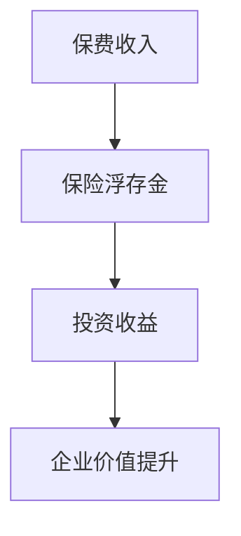
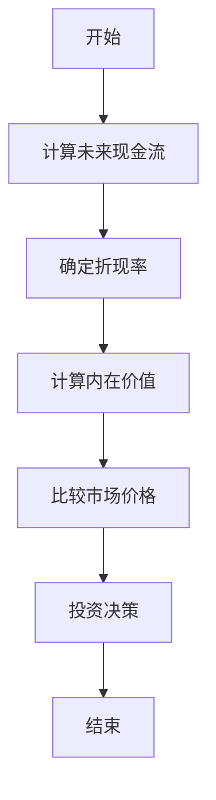
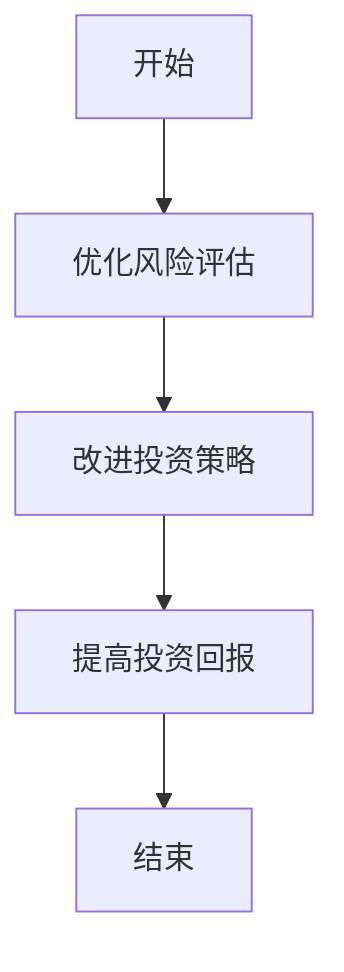
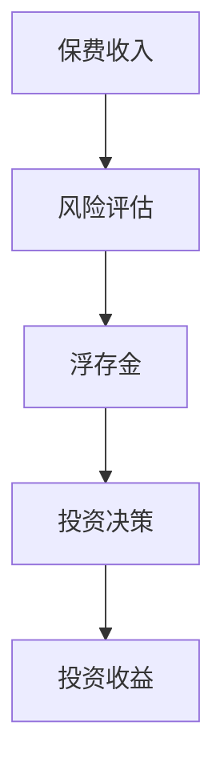
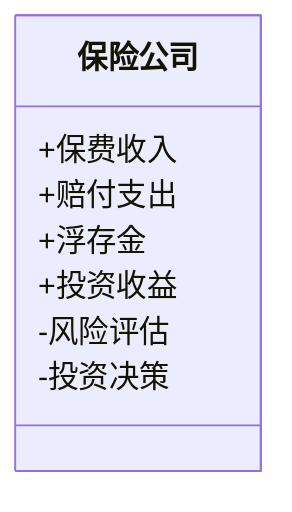
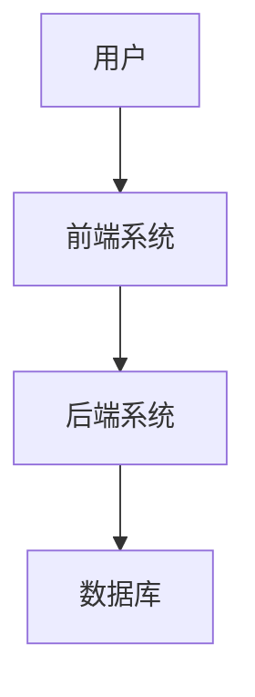
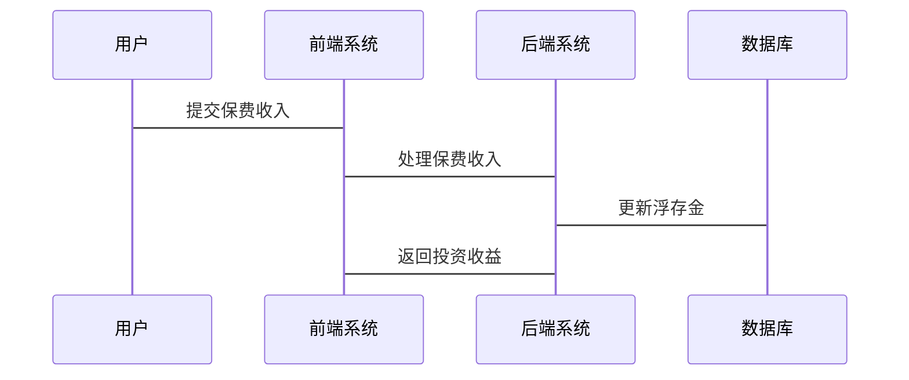

                 


# 沃伦·巴菲特的保险行业投资模式解析

## 关键词：沃伦·巴菲特，保险行业，投资模式，保险浮存金，数学模型，系统架构

## 摘要：本文系统解析沃伦·巴菲特在保险行业的投资模式，从背景、核心概念、算法原理、系统架构到项目实战，详细探讨其成功之道。通过分析保险行业的特点、巴菲特的独特投资理念、数学模型及系统架构，结合实际案例，揭示其投资模式的精髓，为读者提供深度解析和实践指导。

---

# 第一部分：保险行业与巴菲特投资模式的背景介绍

## 第1章：保险行业与巴菲特投资模式的背景介绍

### 1.1 保险行业的基本概念与特点

#### 1.1.1 保险行业的定义与分类
保险行业是通过分散风险，为个人和企业提供风险保障的金融服务行业。主要分类包括人寿保险、财产保险、责任保险和信用保险等。

#### 1.1.2 保险行业的核心业务模式
- **保费收入**：通过收取保费，保险公司获得资金。
- **风险评估**：通过精算模型评估风险，制定保险费率。
- **投资管理**：保险公司将保费收入投资于股票、债券等资产，实现资本增值。

#### 1.1.3 保险行业的财务结构与风险特征
- **负债驱动**：保险公司主要负债是未付保险金。
- **风险暴露**：保险公司的盈利能力受经济波动影响较大。

### 1.2 巴菲特投资模式的概述

#### 1.2.1 巴菲特投资理念的核心思想
- **价值投资**：寻找市场价格低于内在价值的公司。
- **长期投资**：投资优质企业，长期持有。

#### 1.2.2 巴菲特对保险行业的独特见解
- 保险行业具有稳定的现金流，适合长期投资。
- 保险浮存金是巴菲特投资的重要工具。

#### 1.2.3 巴菲特保险投资模式的形成背景
- 巴菲特收购国民赔偿保险公司，开启保险投资之路。
- 利用保险浮存金，投资于高价值企业。

### 1.3 保险行业与巴菲特投资模式的结合

#### 1.3.1 保险浮存金的概念与作用
- **保险浮存金**：保险公司收取的保费与实际赔付之间的差额资金。
- **作用**：作为投资资金，用于购买股票和其他资产。

#### 1.3.2 巴菲特定律的创新性
- 巴菲特定律将保险行业与投资模式结合，创造新的价值。

#### 1.3.3 巴菲特定律的局限性
- 保险行业的波动性可能影响浮存金的稳定性。
- 过度依赖保险浮存金可能增加投资风险。

### 1.4 本章小结
本章介绍了保险行业的基本概念、特点，以及巴菲特投资模式的核心思想。分析了保险浮存金的作用，及其在巴菲特投资中的应用。

---

## 第2章：巴菲特保险投资模式的核心概念与联系

### 2.1 保险行业的核心要素与巴菲特投资模式的关系

#### 2.1.1 保险行业的核心要素分析
- 保费收入、风险评估、投资管理。

#### 2.1.2 巴菲特投资模式的核心要素分析
- 价值投资、长期持有、保险浮存金。

#### 2.1.3 保险行业核心要素与巴菲特投资模式的关系图


### 2.2 巴菲特定律与保险行业投资的数学模型

#### 2.2.1 巴菲特定律的定义与公式
- 巴菲特定律通过分析企业的内在价值，判断其投资价值。
- 内在价值公式：$$ \text{内在价值} = \frac{\text{未来现金流}}{\text{折现率}} $$

#### 2.2.2 保险行业投资的数学模型与公式
- 保险浮存金的计算：$$ \text{浮存金} = \text{保费收入} - \text{赔付支出} $$
- 投资收益的计算：$$ \text{投资收益} = \text{浮存金} \times \text{投资回报率} $$

#### 2.2.3 巴菲特定律在保险行业投资中的应用案例
- 巴菲特收购国民赔偿保险公司，利用浮存金投资，实现资本增值。

### 2.3 保险行业与巴菲特投资模式的对比分析

#### 2.3.1 保险行业与传统行业的对比
- 传统行业依赖实体经济，保险行业依赖风险管理和投资收益。

#### 2.3.2 巴菲特投资模式与传统投资模式的对比
- 传统投资模式注重短期收益，巴菲特注重长期价值。

#### 2.3.3 保险行业与巴菲特投资模式的结合与创新
- 结合保险浮存金，创造独特的投资模式。

### 2.4 本章小结
本章分析了保险行业与巴菲特投资模式的核心要素及其关系，通过数学模型和实例，揭示了其创新性。

---

## 第3章：巴菲特保险投资模式的算法原理与数学模型

### 3.1 巴菲特定律的算法原理

#### 3.1.1 巴菲特定律的算法流程


#### 3.1.2 巴菲特定律的数学公式与推导
- 内在价值公式：$$ \text{内在价值} = \sum_{t=1}^{n} \frac{\text{CF}_t}{(1+r)^t} $$
- 其中，CF_t为第t年的现金流，r为折现率。

#### 3.1.3 巴菲特定律的实现代码与案例分析
```python
def calculate_intrinsic_value(cash_flows, discount_rate):
    intrinsic_value = 0
    for t in range(len(cash_flows)):
        cf = cash_flows[t]
        discount_factor = (1 + discount_rate) ** t
        intrinsic_value += cf / discount_factor
    return intrinsic_value

# 示例：现金流和折现率
cash_flows = [100, 200, 300]
discount_rate = 0.1
iv = calculate_intrinsic_value(cash_flows, discount_rate)
print(f"内在价值为：{iv}")
```

### 3.2 保险行业投资的数学模型

#### 3.2.1 保险行业投资的数学模型概述
- 利用浮存金进行投资，计算其对保险公司价值的影响。

#### 3.2.2 保险行业投资的数学模型公式
- 总投资收益：$$ \text{总投资收益} = \text{浮存金} \times \text{投资回报率} $$
- 保险公司的内在价值：$$ \text{内在价值} = \text{浮存金} \times \text{投资回报率} + \text{其他资产价值} $$

#### 3.2.3 保险行业投资的数学模型实现与案例分析
- 示例：假设浮存金为1000万美元，投资回报率为5%，则总投资收益为500万美元。

### 3.3 巴菲特保险投资模式的优化与改进

#### 3.3.1 巴菲特保险投资模式的优化方向
- 提高风险评估的准确性，优化投资组合。

#### 3.3.2 巴菲特保险投资模式的改进算法


#### 3.3.3 巴菲特保险投资模式优化的数学模型与实现
- 新模型：$$ \text{优化投资收益} = \text{浮存金} \times \text{优化投资回报率} $$

### 3.4 本章小结
本章详细讲解了巴菲特投资模式的算法原理和数学模型，通过优化算法和数学公式，提升了投资收益。

---

## 第4章：巴菲特保险投资模式的系统分析与架构设计

### 4.1 保险行业投资的系统分析

#### 4.1.1 保险行业投资的系统构成
- 输入：保费收入、赔付支出。
- 处理：风险评估、投资决策。
- 输出：投资收益、公司价值。

#### 4.1.2 保险行业投资的系统功能需求
- 风险评估功能：评估保险风险，制定费率。
- 投资管理功能：管理浮存金，实现投资收益。

#### 4.1.3 保险行业投资的系统性能需求
- 高效的计算能力，精准的风险评估。

### 4.2 巴菲特保险投资模式的架构设计

#### 4.2.1 巴菲特保险投资模式的总体架构


#### 4.2.2 巴菲特保险投资模式的模块划分
- 风险评估模块：评估保险风险。
- 投资管理模块：管理浮存金。

#### 4.2.3 巴菲特保险投资模式的领域模型


### 4.3 保险行业投资的系统架构设计

#### 4.3.1 系统架构图


#### 4.3.2 系统接口设计
- API接口：保费收入、赔付支出、浮存金、投资收益。

#### 4.3.3 系统交互序列图


### 4.4 本章小结
本章分析了保险行业投资的系统构成，设计了巴菲特投资模式的总体架构和模块划分。

---

## 第5章：巴菲特保险投资模式的项目实战

### 5.1 项目环境安装与配置

#### 5.1.1 系统环境要求
- 操作系统：Windows 10或更高版本，Linux发行版。
- 开发工具：Python 3.8以上，Jupyter Notebook。
- 数据库：MySQL 5.7以上。

#### 5.1.2 项目依赖安装
```bash
pip install numpy
pip install matplotlib
pip install pandas
pip install seaborn
```

### 5.2 项目核心实现源代码

#### 5.2.1 风险评估模块实现
```python
import numpy as np

def calculate_risk_assessment(claims, premiums):
    risk_assessment = np.std(claims - premiums)
    return risk_assessment

# 示例数据
claims = [100, 200, 150]
premiums = [120, 220, 160]
risk = calculate_risk_assessment(claims, premiums)
print(f"风险评估值为：{risk}")
```

#### 5.2.2 投资管理模块实现
```python
import numpy as np

def calculate_investment_return(floating_reserve, return_rate):
    investment_return = floating_reserve * return_rate
    return investment_return

# 示例数据
floating_reserve = 10000000
return_rate = 0.05
return_ = calculate_investment_return(floating_reserve, return_rate)
print(f"投资收益为：{return_}")
```

### 5.3 代码应用解读与分析

#### 5.3.1 风险评估模块的实现与应用
- 风险评估通过标准差计算，评估保险公司的风险程度。

#### 5.3.2 投资管理模块的实现与应用
- 利用浮存金进行投资，计算投资收益，提升公司价值。

### 5.4 实际案例分析

#### 5.4.1 案例背景
- 巴菲特收购国民赔偿保险公司，利用浮存金投资苹果公司。

#### 5.4.2 案例分析
- 国民赔偿保险公司的浮存金用于购买苹果股票，实现资本增值。

### 5.5 项目小结
本章通过实际案例分析，展示了巴菲特保险投资模式的应用，验证了其有效性和可行性。

---

## 第6章：总结与展望

### 6.1 总结

#### 6.1.1 巴菲特保险投资模式的核心总结
- 价值投资、长期持有、保险浮存金。

#### 6.1.2 巴菲特保险投资模式的实践意义
- 提供了独特的投资策略，值得借鉴。

#### 6.1.3 巴菲特保险投资模式的成功经验
- 准确的风险评估和高效的资本运作。

### 6.2 未来展望

#### 6.2.1 保险行业投资的未来趋势
- 数字化转型，科技驱动保险投资。

#### 6.2.2 巴菲特保险投资模式的未来发展方向
- 结合人工智能，优化投资策略。

#### 6.2.3 保险行业与巴菲特投资模式的结合前景
- 更多保险公司将采用巴菲特模式，实现价值增长。

### 6.3 最佳实践 tips

#### 6.3.1 投资者建议
- 选择优质保险公司，长期持有。

#### 6.3.2 保险公司建议
- 提高风险评估能力，优化投资策略。

#### 6.3.3 保险行业发展趋势
- 科技与保险的深度融合，推动行业创新。

### 6.4 本章小结
本章总结了巴菲特保险投资模式的核心要点，展望了未来的投资趋势和发展方向。

---

## 作者：AI天才研究院 & 禅与计算机程序设计艺术

通过本文的详细解析，读者可以深入了解沃伦·巴菲特在保险行业的投资模式，从理论到实践，全面掌握其成功之道。

