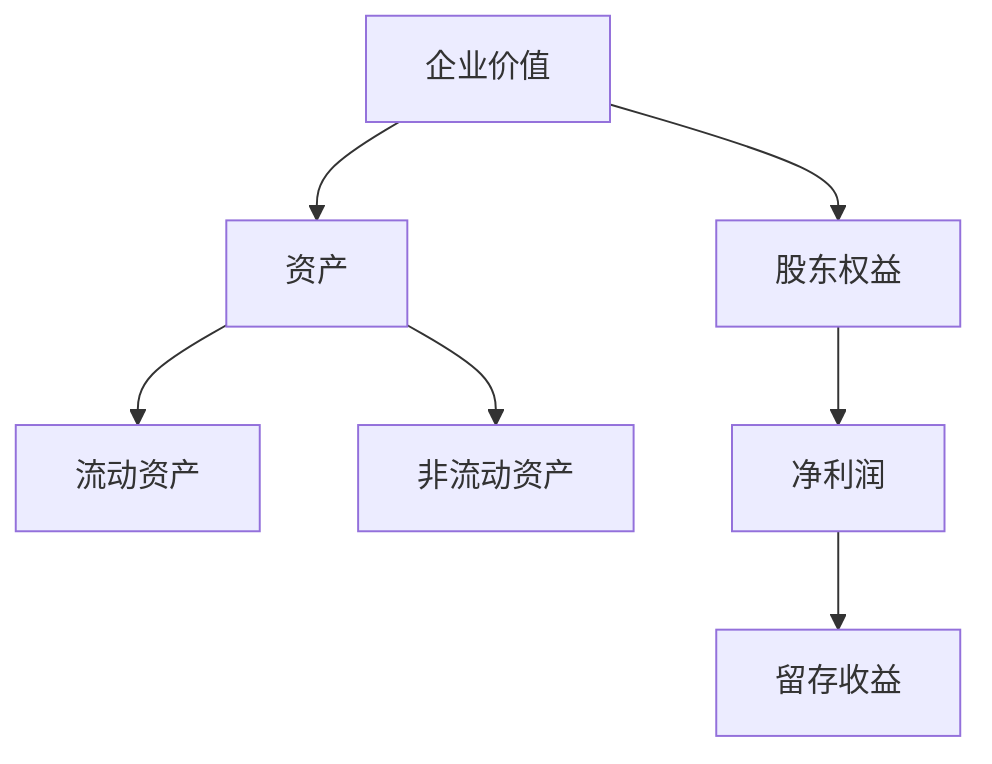
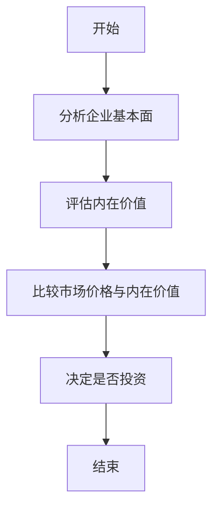
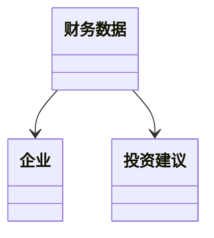
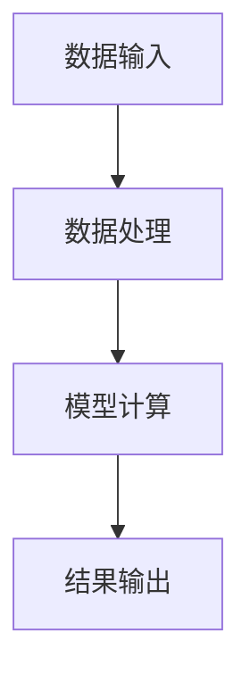
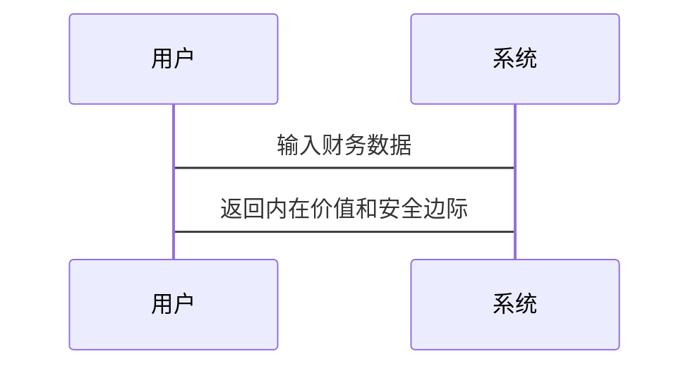

                 


# 第一部分: 背景介绍

# 第1章: 沃伦·巴菲特与价值投资概述

## 1.1 沃伦·巴菲特的生平与投资哲学
### 1.1.1 巴菲特的成长经历
沃伦·巴菲特（Warren Buffett）于1930年8月30日出生在美国堪萨斯州的奥马哈市。他在童年时期就展现出了对数字和投资的浓厚兴趣，这为他后来的职业生涯奠定了基础。巴菲特的早期生活相对朴素，他在高中时期就开始阅读投资相关的书籍，并在大学期间主修经济学，进一步深化了他对投资的理解。

### 1.1.2 巴菲特的投资理念与价值投资的定义
巴菲特的投资哲学以“价值投资”为核心。他认为，投资的本质是寻找那些具有持续竞争优势、良好管理和稳定收益的公司，并以低于其内在价值的价格买入。这种投资策略强调长期持有优质资产，而不是频繁交易以赚取短期利润。

### 1.1.3 巴菲特投资哲学的核心要素
- **安全边际**：巴菲特强调购买股票时，价格应显著低于其内在价值，以确保即使出现估值偏差，投资者也能获得安全边际。
- **内在价值**：内在价值是企业未来现金流的现值，巴菲特通过分析企业的财务状况、盈利能力和发展前景来估算其内在价值。
- **长期思维**：巴菲特倡导长期投资，认为市场波动是短期噪音，真正的价值会在长期内显现。

### 1.1.4 巴菲特投资哲学的边界与外延
- **边界**：巴菲特的投资主要集中在股票市场，尤其是那些具有强大护城河和稳定收益的公司。
- **外延**：他的投资哲学不仅适用于股票，还可以扩展到其他资产类别，如债券、房地产等。此外，巴菲特的长期思维也适用于企业战略和财务管理。

## 1.2 股东信的背景与重要性
### 1.2.1 股东信的起源与目的
巴菲特每年都会向伯克希尔·哈撒韦公司（Berkshire Hathaway）的股东发送一封信，这封信被称为“巴菲特股东信”。它的目的是向股东汇报公司的经营状况、投资策略和未来展望，同时分享巴菲特的投资智慧。

### 1.2.2 股东信在投资决策中的作用
股东信不仅是伯克希尔·哈撒韦公司的年报，更是巴菲特投资哲学的集中体现。通过这封信，投资者可以了解巴菲特的思考方式、投资策略以及他对市场的看法。

### 1.2.3 股东信的阅读与分析方法
- **阅读顺序**：从公司的财务状况开始，逐步分析投资策略、市场环境和未来展望。
- **重点内容**：关注公司的盈利能力和现金流，分析投资组合的构成和变化。
- **巴菲特的风格**：通过股东信的语言风格，感受巴菲特的投资哲学和价值观。

## 1.3 价值投资的核心概念
### 1.3.1 价值投资的定义与特点
价值投资是一种投资策略，强调以低于内在价值的价格买入优质资产。它的核心是寻找那些被市场低估的企业，并长期持有，直到其价值被市场认可。

### 1.3.2 价值投资与短期投资的区别
- **价值投资**：注重长期价值，追求安全边际，适合风险厌恶型投资者。
- **短期投资**：关注市场波动，追求短期收益，适合风险偏好型投资者。

### 1.3.3 价值投资的核心要素：安全边际与内在价值
- **安全边际**：购买价格低于内在价值，确保投资的安全性。
- **内在价值**：企业未来现金流的现值，是衡量股票价值的重要指标。

### 1.3.4 本章小结
本章通过分析沃伦·巴菲特的生平和投资哲学，阐述了价值投资的核心概念和特点。读者可以理解巴菲特的投资理念，并将其应用于实际投资中。

---

# 第二部分: 核心概念与联系

# 第2章: 价值投资的核心原理

## 2.1 价值投资的原理
### 2.1.1 内在价值的计算方法
内在价值是企业未来现金流的现值，计算公式为：
$$
\text{内在价值} = \sum_{t=1}^{\infty} \frac{\text{现金流}_t}{(1 + r)^t}
$$
其中，\( r \) 是折现率，通常使用企业的加权平均资本成本（WACC）。

### 2.1.2 安全边际的概念与应用
安全边际是购买价格与内在价值之间的差距，公式为：
$$
\text{安全边际} = \text{内在价值} - \text{市场价格}
$$
巴菲特强调，投资时应选择安全边际较大的股票，以降低投资风险。

### 2.1.3 股东权益与企业价值的关系
股东权益是企业净资产的体现，公式为：
$$
\text{股东权益} = \text{资产} - \text{负债}
$$
企业价值则包括所有权益，通常使用企业价值公式：
$$
\text{企业价值} = \text{息税折旧及摊销前利润} \times \text{市盈率}
$$

## 2.2 核心概念对比分析
### 2.2.1 价值投资与成长投资的对比
| 对比维度 | 价值投资 | 成长投资 |
|----------|-----------|----------|
| 投资目标 | 以低于内在价值的价格买入 | 寻找高成长性企业 |
| 财务指标 | 重视市盈率、市净率等估值指标 | 重视收入和利润增长率 |

### 2.2.2 价值投资与趋势投资的对比
| 对比维度 | 价值投资 | 趋势投资 |
|----------|-----------|----------|
| 投资依据 | 企业内在价值 | 市场趋势和动量效应 |
| 持股时间 | 长期持有 | 短期交易 |

### 2.2.3 价值投资与技术分析的对比
| 对比维度 | 价值投资 | 技术分析 |
|----------|-----------|----------|
| 投资依据 | 企业基本面 | 市场价格波动 |
| 持股时间 | 长期持有 | 短期交易 |

## 2.3 实体关系图：企业价值的构成


## 2.4 价值投资的流程图


---

# 第三部分: 算法原理讲解

# 第3章: 价值投资的数学模型与公式

## 3.1 内在价值的计算公式
如前所述，内在价值的计算公式为：
$$
\text{内在价值} = \sum_{t=1}^{\infty} \frac{\text{现金流}_t}{(1 + r)^t}
$$
其中，现金流 \( \text{现金流}_t \) 是企业未来第 \( t \) 年的现金流，\( r \) 是折现率。

### 3.1.1 现金流的估算
现金流的估算需要考虑企业的盈利能力和财务状况。公式为：
$$
\text{现金流}_t = \text{营业收入}_t - \text{运营成本}_t - \text{税金}_t
$$

### 3.1.2 折现率的确定
折现率通常使用企业的加权平均资本成本（WACC），计算公式为：
$$
\text{WACC} = w_d \times k_d \times (1 - t) + w_e \times k_e
$$
其中，\( w_d \) 和 \( w_e \) 是债务和股权的权重，\( k_d \) 和 \( k_e \) 是债务和股权的资本成本，\( t \) 是税率。

## 3.2 安全边际的计算
安全边际的计算公式为：
$$
\text{安全边际} = \text{内在价值} - \text{市场价格}
$$
如果安全边际为正，说明股票价格低于其内在价值，值得投资。

## 3.3 企业价值的评估
企业价值的评估公式为：
$$
\text{企业价值} = \text{息税折旧及摊销前利润} \times \text{市盈率}
$$
其中，息税折旧及摊销前利润（EBITDA）计算公式为：
$$
\text{EBITDA} = \text{营业收入} - \text{运营成本} - \text{折旧} - \text{摊销}
$$

## 3.4 投资组合优化
巴菲特的投资组合优化策略强调分散投资，公式为：
$$
\text{投资组合风险} = \sqrt{\sum_{i=1}^{n} w_i^2 \times \sigma_i^2}
$$
其中，\( w_i \) 是第 \( i \) 项资产的权重，\( \sigma_i^2 \) 是第 \( i \) 项资产的方差。

---

# 第四部分: 系统分析与架构设计方案

# 第4章: 系统分析与架构设计

## 4.1 问题场景介绍
假设我们希望开发一个基于巴菲特投资哲学的投资分析系统，该系统需要能够分析企业的基本面数据，计算内在价值和安全边际，并给出投资建议。

## 4.2 系统功能设计
### 4.2.1 领域模型


### 4.2.2 系统架构设计


### 4.2.3 系统接口设计
- **输入接口**：接收企业的财务数据，包括营业收入、成本、税金、折旧等。
- **输出接口**：输出内在价值、安全边际和投资建议。

### 4.2.4 系统交互流程图


---

# 第五部分: 项目实战

# 第5章: 项目实战与案例分析

## 5.1 环境安装
安装必要的工具和库，如Python、Pandas、NumPy等。

## 5.2 核心代码实现
### 5.2.1 计算内在价值
```python
def calculate_intrinsic_value(cash_flows, discount_rate):
    intrinsic_value = sum(cash_flow / (1 + discount_rate) ** t for t, cash_flow in enumerate(cash_flows))
    return intrinsic_value
```

### 5.2.2 计算安全边际
```python
def calculate_margin_of_safety(intrinsic_value, market_price):
    margin_of_safety = intrinsic_value - market_price
    return margin_of_safety
```

## 5.3 实际案例分析
以可口可乐为例，分析其内在价值和安全边际。

## 5.4 项目小结
总结项目实施过程中的经验教训，提出改进建议。

---

# 第六部分: 最佳实践与小结

# 第6章: 最佳实践与小结

## 6.1 巴菲特投资哲学的实战应用
### 6.1.1 长期思维与风险管理
巴菲特强调长期投资和风险管理，建议投资者在选择股票时，应关注企业的长期盈利能力，而不是短期市场波动。

### 6.1.2 安全边际的重要性
在实际投资中，计算安全边际可以帮助投资者避免高位买入，确保投资的安全性。

## 6.2 本章小结
本章通过实际案例分析和项目实战，总结了巴菲特投资哲学的实战应用，强调长期思维和风险管理的重要性。

---

# 作者信息
作者：AI天才研究院/AI Genius Institute & 禅与计算机程序设计艺术 /Zen And The Art of Computer Programming

