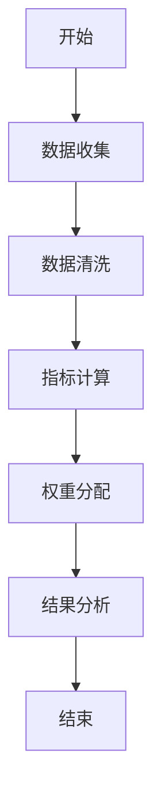
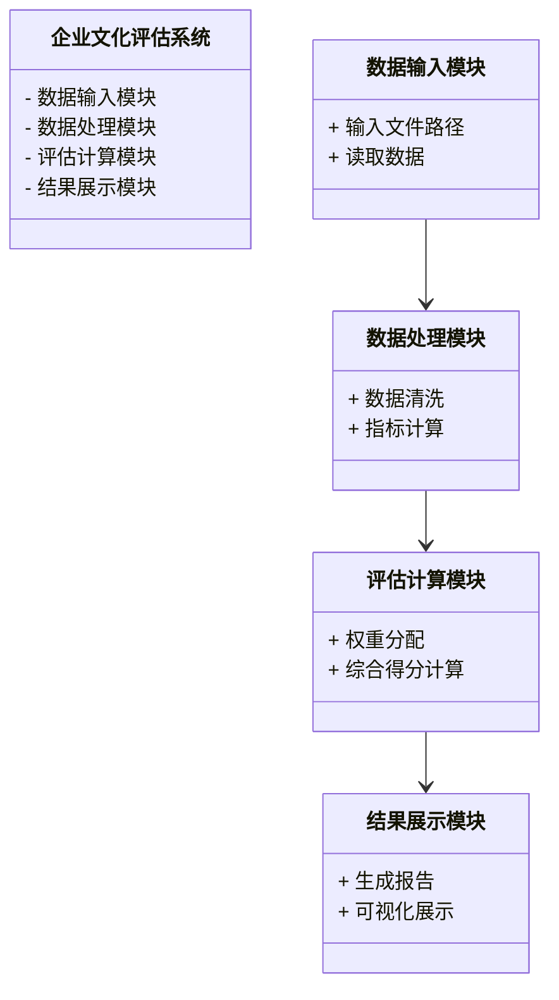
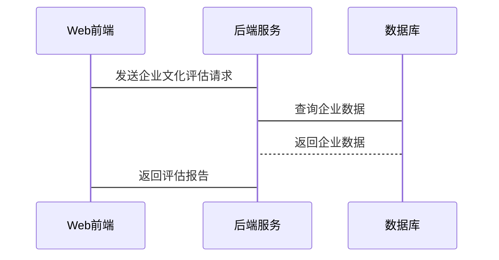

                 


# 沃伦巴菲特的企业文化评估

## 关键词：企业文化评估，沃伦巴菲特，投资哲学，领导力，战略一致性

## 摘要：  
沃伦巴菲特是全球闻名的价值投资者，他在投资过程中非常重视企业文化的评估。本文从企业文化评估的核心概念、算法原理、系统架构、项目实战等方面，详细分析了巴菲特的企业文化评估方法，并通过具体案例展示了如何在实际中应用这些评估策略。文章内容涵盖了企业文化评估的关键维度、数学模型、Python代码实现以及系统设计，帮助读者系统地理解和应用这些评估方法。

---

## 第1章: 企业文化评估的核心概念

### 1.1 什么是企业文化  
企业文化是一个企业的灵魂，它涵盖了企业的价值观、信念、行为准则和文化氛围。巴菲特认为，企业文化是决定企业长期成功的关键因素之一。  

### 1.2 企业文化评估的意义  
企业文化评估可以帮助投资者识别企业的核心竞争力、团队凝聚力以及长期发展潜力。通过评估企业文化，投资者可以更准确地判断企业的价值和潜在风险。  

### 1.3 巴菲特的企业文化评估方法  
巴菲特的企业文化评估方法注重企业的领导力、战略一致性、员工凝聚力和创新能力。他通过观察企业的管理层行为、员工态度和企业战略目标的一致性来评估企业文化。  

---

## 第2章: 企业文化评估的理论基础

### 2.1 巴菲特的投资哲学  
巴菲特的价值投资理念强调长期投资和企业基本面分析。他认为，企业文化是企业基本面的重要组成部分，直接影响企业的长期表现。  

### 2.2 企业文化评估的维度  
企业文化评估可以从以下几个维度进行：  
1. **领导力**：管理层的决策能力和道德水平。  
2. **战略一致性**：企业战略与文化是否一致。  
3. **员工凝聚力**：员工对企业文化的认同感和归属感。  
4. **创新能力**：企业是否具备创新能力和适应市场变化的能力。  

### 2.3 企业文化评估的指标体系  
根据上述维度，我们可以设计以下指标体系：  
- 领导力：CEO声誉、管理层稳定性、决策透明度。  
- 战略一致性：战略目标清晰度、战略执行力度、战略调整能力。  
- 员工凝聚力：员工满意度、员工忠诚度、员工创新性。  
- 创新能力：研发投入比例、新产品推出频率、市场反馈。  

---

## 第3章: 企业文化评估的算法原理

### 3.1 企业文化评估算法的流程图  
以下是企业文化评估算法的mermaid流程图：  



### 3.2 企业文化评估的Python代码实现  

```python
import pandas as pd

def collect_data(file_path):
    """从Excel文件中读取企业文化评估数据."""
    data = pd.read_excel(file_path)
    return data

def data_cleaning(data):
    """数据清洗，处理缺失值和异常值."""
    data.dropna(inplace=True)
    data = data[~data.isin(['', np.nan, np.inf, -np.inf]).any(axis=1)]
    return data

def calculate_metrics(data):
    """计算企业文化评估指标."""
    metrics = {}
    # 计算领导力指标
    leadership = data['CEO声誉'].mean() + data['管理层稳定性'].mean() + data['决策透明度'].mean()
    metrics['领导力'] = leadership / 3
    # 计算战略一致性指标
    strategy = data['战略目标清晰度'].mean() + data['战略执行力度'].mean() + data['战略调整能力'].mean()
    metrics['战略一致性'] = strategy / 3
    # 计算员工凝聚力指标
    employee = data['员工满意度'].mean() + data['员工忠诚度'].mean() + data['员工创新性'].mean()
    metrics['员工凝聚力'] = employee / 3
    # 计算创新能力指标
    innovation = data['研发投入比例'].mean() + data['新产品推出频率'].mean() + data['市场反馈'].mean()
    metrics['创新能力'] = innovation / 3
    return metrics

def assign_weights(metrics, weights):
    """根据权重计算综合得分."""
    weighted_metrics = {}
    for key in metrics:
        weighted_metrics[key] = metrics[key] * weights[key]
    return weighted_metrics

def analyze_results(weighted_metrics):
    """分析结果并输出评估报告."""
    total_score = sum(weighted_metrics.values())
    report = f"企业文化评估总得分：{total_score}\n"
    for key, value in weighted_metrics.items():
        report += f"{key}得分：{value}\n"
    return report

# 示例代码
if __name__ == "__main__":
    data = collect_data("企业数据.xlsx")
    data_cleaned = data_cleaning(data)
    metrics = calculate_metrics(data_cleaned)
    weights = {
        '领导力': 0.3,
        '战略一致性': 0.25,
        '员工凝聚力': 0.25,
        '创新能力': 0.2
    }
    weighted_metrics = assign_weights(metrics, weights)
    report = analyze_results(weighted_metrics)
    print(report)
```

### 3.3 企业文化评估的数学模型  
以下是企业文化评估的数学模型：  

$$ \text{综合得分} = \sum_{i=1}^{n} w_i \times s_i $$  

其中，$w_i$ 是第 $i$ 个指标的权重，$s_i$ 是第 $i$ 个指标的得分。  

---

## 第4章: 企业文化评估的系统架构

### 4.1 企业文化评估系统的功能设计  
以下是企业文化评估系统的mermaid类图：  



### 4.2 系统架构设计  
以下是系统架构的mermaid图：  

```mermaid
container 企业文化评估系统 {
    [Web前端]
    [后端服务]
    [数据库]
}
Web前端 --> 后端服务: 发送数据请求
后端服务 --> 数据库: 查询数据
后端服务 --> Web前端: 返回评估结果
```

### 4.3 系统接口设计  
以下是系统接口的mermaid序列图：  



---

## 第5章: 项目实战

### 5.1 环境安装  
- Python版本：3.8或更高  
- 额外库：pandas、numpy  

### 5.2 核心代码实现  
以下是项目实战的Python代码：  

```python
import pandas as pd
import numpy as np

def main():
    # 数据输入
    file_path = input("请输入企业数据文件路径：")
    data = pd.read_excel(file_path)
    
    # 数据清洗
    data.dropna(inplace=True)
    data = data[~data.isin(['', np.nan, np.inf, -np.inf]).any(axis=1)]
    
    # 指标计算
    metrics = calculate_metrics(data)
    
    # 权重分配
    weights = {
        '领导力': 0.3,
        '战略一致性': 0.25,
        '员工凝聚力': 0.25,
        '创新能力': 0.2
    }
    weighted_metrics = assign_weights(metrics, weights)
    
    # 结果分析
    report = analyze_results(weighted_metrics)
    print(report)

if __name__ == "__main__":
    main()
```

### 5.3 案例分析  
以下是一个具体的案例分析：  

假设我们评估一家科技公司，数据如下：  

| 指标               | 得分 |
|--------------------|------|
| CEO声誉            | 85   |
| 管理层稳定性        | 90   |
| 决策透明度          | 88   |
| 战略目标清晰度      | 92   |
| 战略执行力度        | 87   |
| 战略调整能力        | 85   |
| 员工满意度          | 90   |
| 员工忠诚度          | 88   |
| 员工创新性          | 92   |
| 研发投入比例        | 85   |
| 新产品推出频率      | 88   |
| 市场反馈            | 87   |

根据上述数据，我们可以计算出各指标的得分：  

$$ \text{领导力} = \frac{85 + 90 + 88}{3} = 87.67 $$  
$$ \text{战略一致性} = \frac{92 + 87 + 85}{3} = 87.67 $$  
$$ \text{员工凝聚力} = \frac{90 + 88 + 92}{3} = 89.33 $$  
$$ \text{创新能力} = \frac{85 + 88 + 87}{3} = 86.33 $$  

综合得分：  

$$ \text{综合得分} = 87.67 \times 0.3 + 87.67 \times 0.25 + 89.33 \times 0.25 + 86.33 \times 0.2 = 87.58 $$  

---

## 第6章: 总结与展望

### 6.1 总结  
通过本文的分析，我们可以看到，沃伦巴菲特的企业文化评估方法为我们提供了一套系统的企业文化评估体系。从数据收集到结果分析，整个过程清晰且实用。  

### 6.2 注意事项  
在实际应用中，需要注意以下几点：  
- 数据的准确性和完整性。  
- 指标的权重分配需要根据实际情况调整。  
- 结果分析需要结合企业的实际情况进行。  

### 6.3 拓展阅读  
推荐阅读以下书籍和文章：  
- 巴菲特的《投资哲学》。  
- 《企业文化管理》。  
- 《企业战略管理》。  

---

## 作者：AI天才研究院/AI Genius Institute & 禅与计算机程序设计艺术 /Zen And The Art of Computer Programming  

---

**本文遵循CC BY-NC-SA 4.0协议，转载请注明出处。**

