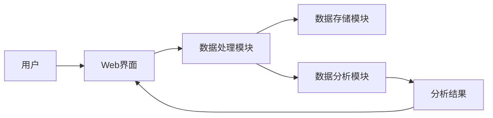

                 


# 沃尔特·施洛斯的公司内部人交易分析

---

## 关键词

- 沃尔特·施洛斯
- 内部人交易
- 投资分析
- 交易算法
- 系统架构
- 项目实战

---

## 摘要

本文详细探讨了沃尔特·施洛斯在公司内部人交易分析领域的投资哲学和方法。通过分析施洛斯的投资理念，内部人交易的定义与重要性，以及其在投资决策中的应用，本文为读者提供了系统化的分析框架和实战指导。结合统计分析、市场情绪分析等算法原理，以及详细的系统架构设计和项目实战案例，本文旨在帮助投资者深入理解内部人交易的潜在价值和应用策略。

---

# 第一部分: 沃尔特·施洛斯的公司内部人交易分析背景介绍

## 第1章: 沃尔特·施洛斯与内部人交易分析概述

### 1.1 沃尔特·施洛斯的生平与投资理念

#### 1.1.1 施洛斯的投资哲学
- **价值投资**：施洛斯以价值投资著称，专注于寻找被市场低估的公司。
- **长期投资**：他强调长期持有优质股票，避免频繁交易。
- **内部人交易的重要性**：施洛斯认为内部人交易是预测市场动向的重要信号。

#### 1.1.2 施洛斯对内部人交易的重视
- 内部人交易被视为公司管理层对公司前景的信心体现。
- 通过分析内部人交易，投资者可以识别潜在的投资机会。

#### 1.1.3 施洛斯投资方法的核心要素
- **基本面分析**：研究公司财务状况、行业地位和竞争优势。
- **内部人交易数据**：分析公司高管的买卖记录。
- **长期持有**：避免短期波动，关注长期收益。

### 1.2 内部人交易分析的基本概念

#### 1.2.1 内部人交易的定义
- 内部人交易是指公司内部人员（如董事、高管）基于对公司未来前景的了解，进行的股票买卖行为。
- 这种交易可能传递出公司未来的盈利预期或财务状况变化的信息。

#### 1.2.2 内部人交易的类型
| 类型             | 描述                                         |
|------------------|--------------------------------------------|
| 买入交易         | 内部人购买公司股票，表明对公司前景看好。   |
| 卖出交易         | 内部人卖出公司股票，可能表明对公司前景担忧。 |
| 买入信号强度     | 买入金额越大，信号强度越高。             |
| 卖出信号强度     | 卖出金额越大，信号强度越高。             |

#### 1.2.3 内部人交易的法律框架
- **美国证券交易法**：规定了内部人交易的披露要求。
- **公平信息披露规则**：确保所有投资者都能平等获取信息。

### 1.3 内部人交易分析的重要性

#### 1.3.1 内部人交易对股价的影响
- 买入交易通常会提振股价，因为市场认为内部人对公司前景有信心。
- 大额卖出交易可能导致股价下跌，因为可能暗示公司存在问题。

#### 1.3.2 内部人交易作为投资信号的作用
- 内部人交易可以帮助投资者识别潜在的投资机会。
- 通过分析内部人交易数据，投资者可以提前预判市场动向。

#### 1.3.3 施洛斯如何利用内部人交易进行投资决策
- 施洛斯会关注公司高管的交易行为，尤其是大额买入交易。
- 他认为，高管的买入行为通常预示着公司即将迎来利好消息。

---

## 第2章: 内部人交易分析的核心概念与联系

### 2.1 内部人交易分析的原理

#### 2.1.1 内部人信息的来源
- 公司公告：如10-K、13-D等 filings。
- 证券交易平台：如EDGAR系统。
- 新闻报道：部分高管交易可能通过新闻披露。

#### 2.1.2 内部人交易的动机分析
- **财务动机**：高管希望通过低买高卖获利。
- **市场信号动机**：通过买卖行为传递公司信息。
- **套期保值动机**：对冲个人持有的股票风险。

#### 2.1.3 内部人交易与市场情绪的关系
- 内部人买入通常会增强市场信心，推动股价上涨。
- 内部人卖出可能导致市场恐慌，引发股价下跌。

### 2.2 内部人交易分析的核心要素对比

#### 2.2.1 内部人交易的主体对比
| 主体     | 描述                                         |
|----------|--------------------------------------------|
| 董事     | 公司董事会成员，对公司战略有决策权。         |
| 高管     | 公司高级管理人员，对公司运营有直接影响。     |
| 大股东   | 持股超过一定比例的股东，对公司治理有影响。   |

#### 2.2.2 内部人交易的时间维度对比
| 时间维度 | 描述                                         |
|----------|--------------------------------------------|
| 短期交易   | 交易行为发生在较短时间内，可能反映短期信息。 |
| 长期交易   | 交易行为持续时间较长，可能反映长期战略。   |

#### 2.2.3 内部人交易的金额规模对比
| 金额规模   | 描述                                         |
|------------|--------------------------------------------|
| 小额交易     | 交易金额较小，可能影响有限。               |
| 大额交易     | 交易金额较大，可能对股价有显著影响。       |

### 2.3 内部人交易的实体关系图


---

## 第3章: 内部人交易分析的算法原理

### 3.1 内部人交易分析的基本算法

#### 3.1.1 统计分析法
- 计算内部人交易的平均值、中位数等统计指标。
- 通过对比历史数据，识别异常交易行为。

#### 3.1.2 市场情绪分析法
- 将内部人交易数据与市场整体情绪进行对比。
- 例如，使用恐慌指数（VIX）来衡量市场风险偏好。

#### 3.1.3 时间序列分析法
- 分析内部人交易的时间序列数据，识别趋势和周期性。
- 使用ARIMA模型预测未来交易行为。

### 3.2 内部人交易分析的数学模型

#### 3.2.1 统计分析模型
$$ \text{平均交易量} = \frac{\sum \text{交易量}}{\text{交易次数}} $$

#### 3.2.2 市场情绪分析模型
$$ \text{市场情绪指数} = \sum (\text{内部人买入比例} \times 0.7 + \text{市场上涨概率} \times 0.3) $$

#### 3.2.3 时间序列分析模型
$$ \text{预测交易量} = \alpha \times \text{过去交易量} + \beta \times \text{市场指数} + \gamma $$

### 3.3 内部人交易分析的流程图


---

## 第4章: 内部人交易分析的系统架构设计

### 4.1 系统功能设计

#### 4.1.1 数据采集模块
- 从EDGAR系统或其他交易平台获取内部人交易数据。
- 数据格式包括交易日期、交易金额、交易数量、交易类型等。

#### 4.1.2 数据处理模块
- 清洗数据：处理缺失值、异常值。
- 转换数据格式：将数据转换为可供分析的格式。

#### 4.1.3 数据分析模块
- 使用统计分析、时间序列分析等方法进行数据建模。
- 生成分析报告，包括交易趋势、异常检测等。

#### 4.1.4 用户界面模块
- 提供友好的用户界面，展示分析结果。
- 用户可以自定义筛选条件，查看特定交易行为。

### 4.2 系统架构设计



---

## 第5章: 内部人交易分析的项目实战

### 5.1 环境安装与配置

#### 5.1.1 安装Python
```bash
python --version
pip install --upgrade pip
```

#### 5.1.2 安装必要的库
```bash
pip install pandas numpy matplotlib
```

### 5.2 核心实现代码

#### 5.2.1 数据清洗代码
```python
import pandas as pd

# 读取数据
df = pd.read_csv('insider_trading.csv')

# 清洗数据
df.dropna(inplace=True)
df = df[~df['transaction'].isnull()]
```

#### 5.2.2 统计分析代码
```python
import numpy as np

# 计算平均交易量
average_volume = np.mean(df['volume'])

# 计算交易量的标准差
std_volume = np.std(df['volume'])
```

#### 5.2.3 可视化代码
```python
import matplotlib.pyplot as plt

plt.figure(figsize=(10,6))
plt.hist(df['volume'], bins=10, alpha=0.5)
plt.title('交易量分布')
plt.xlabel('交易量')
plt.ylabel('频数')
plt.show()
```

### 5.3 实际案例分析

#### 5.3.1 案例背景
- 某科技公司高管在特定时间进行大额买入交易。
- 通过分析交易数据，预测股价走势。

#### 5.3.2 数据分析
- 计算交易量的平均值和标准差。
- 对比市场整体情绪，判断交易行为的信号强度。

### 5.4 项目小结

---

## 第6章: 最佳实践与注意事项

### 6.1 小结

### 6.2 注意事项

#### 6.2.1 数据来源的可靠性
- 确保数据来源可靠，避免使用错误或过时的数据。

#### 6.2.2 模型的局限性
- 统计模型可能无法完全捕捉市场复杂性。
- 需要结合其他分析方法进行综合判断。

#### 6.2.3 风险管理
- 内部人交易分析仅为投资决策提供参考，需结合其他因素进行综合判断。
- 设置止损点，避免重大损失。

### 6.3 拓展阅读

---

## 作者：AI天才研究院/AI Genius Institute & 禅与计算机程序设计艺术 /Zen And The Art of Computer Programming

---

以上是《沃尔特·施洛斯的公司内部人交易分析》的完整目录和部分章节内容。通过系统化的分析和详细案例，读者可以深入了解内部人交易的分析方法，并将其应用于实际投资决策中。

