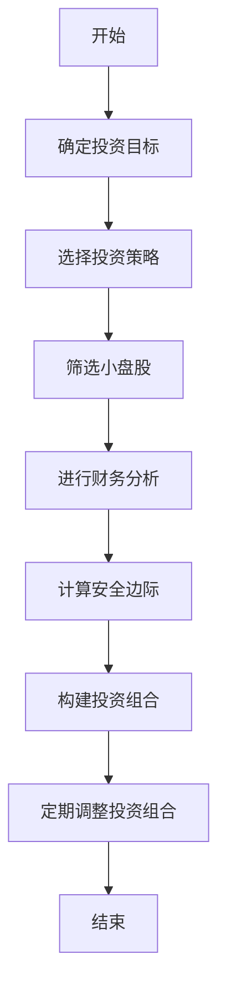

                 

# 沃尔特·施洛斯的小盘股价值投资策略

## 关键词：
- 小盘股投资
- 价值投资
- 投资策略
- 财务分析
- 投资组合管理

## 摘要：
沃尔特·施洛斯是价值投资领域的传奇人物，以其在小盘股投资中的卓越表现闻名。本文深入分析了施洛斯的投资哲学、选股标准、财务分析方法、投资组合管理策略以及风险管理措施。通过详细讲解其安全边际概念和数学模型，结合实际案例分析，为读者提供了在现代投资环境中应用施洛斯策略的实用指南。

---

## 第一部分：小盘股投资的背景与重要性

### 第1章：小盘股市场的特点

#### 1.1 小盘股的定义与分类
- 小盘股的定义：市值在5亿至30亿美元之间的公司股票。
- 小盘股的分类：根据市值和行业进一步细分。
- 小盘股市场的波动性与机会：高波动性带来高风险和高回报。

#### 1.2 小盘股市场的历史发展
- 小盘股市场的兴起：20世纪初至中期的发展历程。
- 小盘股市场的现状：现代市场的特点与挑战。

#### 1.3 小盘股投资的潜力
- 小盘股的增长空间：未被大公司占据的市场机会。
- 小盘股的创新性：新兴技术和商业模式的孵化器。

---

### 第2章：沃尔特·施洛斯的生平简介

#### 2.1 施洛斯的早年经历
- 出生与成长背景：出生于德国，早年移居美国。
- 教育背景：在经济大萧条期间的经历。

#### 2.2 施洛斯的投资理念形成
- 受导师本杰明·格雷厄姆的影响：格雷厄姆的价值投资理论对施洛斯的影响。
- 施洛斯的独特见解：将价值投资应用于小盘股。

#### 2.3 施洛斯的投资成就
- 长期投资业绩：长期稳定的收益表现。
- 对投资界的贡献：著书立说，影响后世投资者。

---

## 第二部分：施洛斯的价值投资哲学

### 第3章：价值投资的核心理念

#### 3.1 价值投资的定义
- 价值投资：以低于内在价值的价格购买优质资产。

#### 3.2 价值投资与小盘股的结合
- 小盘股的估值优势：小盘股通常被低估，适合价值投资。
- 小盘股的风险与回报：高回报伴随高风险。

#### 3.3 施洛斯的价值投资原则
- 买入便宜货：寻找市场价格低于内在价值的股票。
- 长期持有：避免频繁交易，降低交易成本。
- 风险控制：分散投资，避免过度集中。

---

### 第4章：施洛斯的投资策略

#### 4.1 小盘股的筛选标准
- 低市盈率（P/E）：市盈率低于行业平均水平。
- 低市净率（P/B）：市净率低于行业平均水平。
- 高股息率：稳定的股息收入。

#### 4.2 财务报表分析的重要性
- 收入与利润分析：关注收入增长和利润率。
- 资产负债表分析：关注资产质量和负债结构。
- 现金流量表分析：关注现金流健康状况。

#### 4.3 安全边际的概念与应用
- 安全边际的定义：内在价值与市场价格之间的差距。
- 安全边际的重要性：降低投资风险，确保收益。

---

### 第5章：投资组合管理

#### 5.1 投资组合的构建
- 分散投资：避免过度集中，降低风险。
- 定期调整：根据市场变化和个人财务状况调整投资组合。
- 股票与债券的配比：平衡风险与收益。

#### 5.2 风险管理与心态控制
- 风险的识别与评估：识别潜在风险，评估其影响。
- 心态管理：保持冷静，避免情绪化决策。
- 长期投资：坚持长期视角，避免短期波动干扰。

---

## 第三部分：施洛斯策略的实际应用

### 第6章：案例分析

#### 6.1 典型小盘股投资案例
- 案例一：某小盘股公司的投资决策过程。
- 案例二：财务分析与投资结果对比。

#### 6.2 投资决策的详细分析
- 财务数据的详细解读：如何通过财务数据判断投资价值。
- 安全边际的计算：如何确定安全边际，确保投资安全。

#### 6.3 案例的启示与经验总结
- 从案例中总结的经验教训。
- 如何将经验应用到实际投资中。

---

### 第7章：数学模型与投资决策

#### 7.1 市盈率（P/E）计算公式
$$ P/E = \frac{\text{股价}}{\text{每股收益}} $$

#### 7.2 市净率（P/B）计算公式
$$ P/B = \frac{\text{股价}}{\text{每股净资产}} $$

#### 7.3 安全边际计算示例
$$ \text{安全边际} = \text{内在价值} - \text{市场价格} $$

---

## 第四部分：现代启示与拓展阅读

### 第8章：现代投资环境的变化

#### 8.1 小盘股市场的流动性挑战
- 小盘股市场的流动性不足：如何应对流动性问题。
- 现代金融工具的应用：如ETF、指数基金等。

#### 8.2 信息透明度的提升
- 互联网时代的信息获取：如何利用信息优势进行投资。
- 数据分析工具的应用：如何通过数据分析提升投资决策效率。

#### 8.3 技术分析与基本面分析的结合
- 技术分析的辅助作用：如何结合技术分析进行投资决策。
- 面对市场的不确定性：如何结合技术分析和基本面分析制定投资策略。

---

### 第9章：最佳投资实践与小结

#### 9.1 确定投资目标
- 明确投资目的：是追求长期收益还是短期收益。
- 评估风险承受能力：根据自身财务状况确定风险承受能力。

#### 9.2 构建适合自己的投资组合
- 根据自身情况选择合适的投资策略：如保守型、平衡型、激进型。
- 定期审视和调整投资组合：根据市场变化和个人情况调整投资组合。

#### 9.3 持续学习与自我提升
- 关注市场动态：通过阅读、参加研讨会等方式保持对市场的敏感性。
- 学习投资知识：不断学习价值投资理论和其他投资策略，提升自己的投资能力。

---

## 附录：相关书籍与文献推荐

### 附录1：价值投资的经典著作
- 《The Intelligent Investor》——本杰明·格雷厄姆
- 《The Warren Buffett Way》——洛伦兹·瓦尔特·施利姆
- 《Security Analysis》——本杰明·格雷厄姆 & 多维德·多恩

### 附录2：小盘股投资的研究资料
- 《Small-Cap Stocks for Long-Term Gains》——沃尔特·施洛斯
- 《The New Finance: The Case for Stocking the Small Companies》——彼得·林奇

### 附录3：施洛斯投资思想的延伸阅读
- 《The Art of Value Investing》——卡尔·特雷勒
- 《Investing in Small Companies》——约翰·特雷尼

---

## 附录：施洛斯投资策略的流程图

---

## 附录：数学模型与公式

### 附录1：市盈率（P/E）计算公式
$$ P/E = \frac{\text{股价}}{\text{每股收益}} $$

### 附录2：市净率（P/B）计算公式
$$ P/B = \frac{\text{股价}}{\text{每股净资产}} $$

### 附录3：安全边际计算示例
$$ \text{安全边际} = \text{内在价值} - \text{市场价格} $$

---

## 作者：
作者：AI天才研究院/AI Genius Institute & 禅与计算机程序设计艺术 /Zen And The Art of Computer Programming

---

通过本文，读者可以深入了解沃尔特·施洛斯的小盘股价值投资策略，并将其应用到实际投资中。从理论到实践，从基础到深入，本文为投资者提供了全面的指导和实用的建议。

