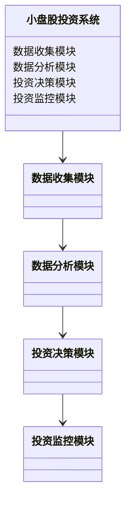
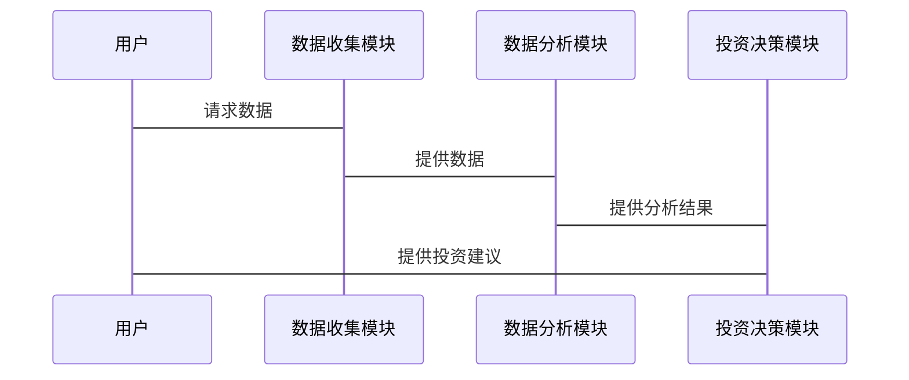

                 


# 沃尔特·施洛斯的小盘股价值投资：发掘被忽视的宝藏

## 关键词：价值投资，小盘股，沃尔特·施洛斯，内在价值，安全边际

## 摘要：本文深入探讨了沃尔特·施洛斯的小盘股价值投资策略，分析了其投资理念的核心要素，包括安全边际、内在价值评估、财务指标分析以及长期视角的重要性。通过数学模型和实际案例，本文展示了如何系统地应用这些方法来发现被忽视的宝藏。文章还介绍了投资管理系统的架构设计和优化算法，为读者提供了一套完整的投资框架。

---

## 第一部分: 小盘股价值投资的背景与核心概念

### 第1章: 小盘股价值投资的背景介绍

#### 1.1 价值投资的起源与发展

##### 1.1.1 价值投资的定义与核心理念

价值投资是一种以基本面分析为基础的投资策略，强调以低于内在价值的价格购买优质资产。其核心理念包括：

- **长期视角**：关注企业的长期价值，而非短期市场波动。
- **安全边际**：买入价格应显著低于内在价值，以降低风险。
- **质量优先**：选择财务健康、管理良好的企业。

##### 1.1.2 价值投资的起源与历史发展

价值投资的起源可以追溯到本杰明·格雷厄姆和戴维·多德的工作，他们提出了“安全边际”和“内在价值”的概念。沃尔特·施洛斯是格雷厄姆的学生，继承并发展了这一理念，专注于小盘股投资。

##### 1.1.3 小盘股投资的特殊性与重要性

小盘股通常是指市值较小的公司股票，具有以下特点：

- **低估值**：小盘股往往被市场忽视，可能蕴含较大的投资机会。
- **高波动性**：价格波动较大，但潜在回报也较高。
- **分散性**：小盘股分布广泛，覆盖多个行业，提供多样化的投资选择。

#### 1.2 沃尔特·施洛斯的投资风格

##### 1.2.1 施洛斯的生平与投资理念

沃尔特·施洛斯是20世纪的投资大师，以专注小盘股投资闻名。他强调通过深入的财务分析和对公司管理层的信任来选择投资标的。他的投资理念可以总结为：买入具有稳定收益和良好管理的公司股票，并长期持有。

##### 1.2.2 施洛斯与巴菲特的师徒关系

施洛斯曾师从格雷厄姆，而巴菲特也深受其影响。施洛斯的投资理念对巴菲特的价值投资思想产生了深远影响，尤其是对小盘股的关注。

##### 1.2.3 施洛斯对小盘股投资的独特贡献

施洛斯将小盘股投资系统化，提出了基于内在价值和安全边际的投资策略，强调对公司基本面的深入分析和长期持有的投资方式。

#### 1.3 小盘股投资的定义与特点

##### 1.3.1 小盘股的定义与分类

小盘股通常指市值在10亿美元以下的公司股票，根据市值大小可分为微小盘、小盘和中盘股。小盘股的分类有助于投资者根据规模选择合适的投资标的。

##### 1.3.2 小盘股市场的特点与风险

- **特点**：流动性较低、波动性较高、市场关注度低。
- **风险**：信息不透明、财务不稳定、市场波动大。

##### 1.3.3 小盘股投资的潜在机会

小盘股的低估值和高增长潜力为投资者提供了挖掘超额收益的机会，尤其是在经济周期的早期阶段。

#### 1.4 小盘股投资的核心要素

##### 1.4.1 小盘股的价值评估标准

- **内在价值**：基于DCF模型计算的公司价值。
- **安全边际**：买入价格与内在价值的折扣比例。
- **财务健康状况**：关注ROE、ROA等指标。

##### 1.4.2 小盘股的财务指标分析

- **盈利能力**：净利润率、ROE。
- **成长性**：收入增长率、净利润增长率。
- **财务杠杆**：资产负债率、利息覆盖倍数。

##### 1.4.3 小盘股的行业分析与选择

- **行业前景**：选择处于成长期的行业。
- **竞争优势**：评估公司的护城河。
- **管理层质量**：关注管理层的稳定性与决策能力。

#### 1.5 本章小结

本章介绍了小盘股投资的背景，分析了沃尔特·施洛斯的投资理念和方法，强调了小盘股投资的核心要素，为后续的分析奠定了基础。

---

## 第2章: 小盘股价值投资的核心概念

### 2.1 价值投资的哲学与方法论

#### 2.1.1 价值投资的哲学基础

价值投资的哲学基础包括：

- **市场有效性**：市场并非总是有效，存在估值偏差。
- **逆向思维**：在市场恐慌时寻找机会。
- **长期主义**：关注企业的长期价值。

#### 2.1.2 价值投资的核心方法论

价值投资的方法论包括：

- **基本面分析**：通过财务报表评估公司价值。
- **安全边际**：确保买入价格低于内在价值。
- **分散投资**：通过投资多个小盘股分散风险。

#### 2.1.3 价值投资与市场波动的关系

价值投资者认为市场波动是投资机会，而非风险。通过在市场恐慌时买入低估资产，可以在市场复苏时获得超额收益。

### 2.2 小盘股投资的三大支柱

#### 2.2.1 小盘股的价值评估标准

小盘股的价值评估标准包括：

- **DCF模型**：计算公司内在价值。
- **市盈率与市净率**：对比估值指标。
- **股息率**：评估收益能力。

#### 2.2.2 小盘股的财务指标分析

财务指标分析包括：

- **盈利能力**：净利润率、ROE。
- **成长性**：收入和利润增长率。
- **财务健康状况**：资产负债率、现金流情况。

#### 2.2.3 小盘股的行业分析与选择

行业分析包括：

- **行业周期**：选择处于上升周期的行业。
- **竞争优势**：评估公司是否具备独特优势。
- **管理层质量**：关注管理层的决策能力和稳定性。

### 2.3 小盘股投资中的安全边际

#### 2.3.1 安全边际的定义与作用

安全边际是指买入价格低于内在价值的部分，用于缓冲市场波动带来的风险。

#### 2.3.2 安全边际的计算方法

安全边际可以通过以下公式计算：

$$安全边际 = \text{内在价值} - \text{买入价格}$$

#### 2.3.3 安全边际与投资风险的关系

更高的安全边际意味着更低的投资风险。安全边际为投资者提供了缓冲空间，减少了市场波动对投资组合的影响。

### 2.4 小盘股投资的长期视角

#### 2.4.1 长期投资与复利效应

长期投资通过复利效应实现财富的稳步增长，避免了短期波动对投资组合的侵蚀。

#### 2.4.2 小盘股成长周期的把握

小盘股通常处于成长阶段，投资者需要准确把握其成长周期，选择处于上升阶段的公司。

#### 2.4.3 长期视角下的投资策略调整

长期视角下，投资者需要根据市场变化和公司基本面调整投资策略，保持投资组合的灵活性和适应性。

### 2.5 本章小结

本章深入分析了小盘股价值投资的核心概念，包括安全边际、财务指标分析和长期视角的重要性，为读者提供了全面的投资框架。

---

## 第3章: 小盘股价值投资的算法与数学模型

### 3.1 小盘股价值评估的数学模型

#### 3.1.1 现金流折现法（DCF）的数学公式

现金流折现法（DCF）是评估公司内在价值的重要工具，其公式如下：

$$DCF = \frac{CF_1}{(1+r)^1} + \frac{CF_2}{(1+r)^2} + \cdots + \frac{CF_n}{(1+r)^n}$$

其中，CF表示自由现金流，r表示折现率，n表示期限。

#### 3.1.2 市盈率与市净率的对比分析

市盈率（P/E）和市净率（P/B）是常用的估值指标，公式分别为：

$$P/E = \frac{\text{股价}}{\text{每股收益}}$$

$$P/B = \frac{\text{股价}}{\text{每股净资产}}$$

通过对比P/E和P/B，可以评估公司的估值水平。

#### 3.1.3 股息率与投资回报的数学关系

股息率（Dividend Yield）与投资回报的关系可以通过以下公式表示：

$$\text{股息回报率} = \frac{\text{股息支付率}}{\text{市盈率}}$$

### 3.2 小盘股投资的算法实现

#### 3.2.1 数据收集与预处理

数据收集包括获取公司的财务报表、市场数据等，预处理包括清洗数据、填补缺失值等。

#### 3.2.2 财务指标的量化分析

通过Python代码实现财务指标的量化分析：

```python
import pandas as pd

# 假设df是财务数据 dataframe
# 计算ROE（净资产收益率）
df['ROE'] = df['净利润'] / df['净资产']
# 计算ROA（资产净利率）
df['ROA'] = df['净利润'] / df['总资产']
```

#### 3.2.3 投资组合的优化算法

使用均值-方差模型优化投资组合：

```python
import numpy as np
from scipy.optimize import minimize

# 假设returns是收益矩阵，weights是初始权重
def portfolio_variance(weights, returns):
    return np.dot(weights.T, np.dot(returns, weights))

# 约束条件：权重之和为1
def constraint(weights):
    return np.sum(weights) - 1.0

# 优化问题
cons = [{'type': 'eq', 'fun': constraint}]
bounds = [(0.0, 1.0) for _ in range(len(returns))]
result = minimize(portfolio_variance, weights, constraints=cons, bounds=bounds)
optimal_weights = result.x
```

### 3.3 小盘股投资的数学优化

#### 3.3.1 线性规划在投资组合中的应用

使用线性规划优化投资组合的收益和风险。

#### 3.3.2 马科维茨均值-方差模型的优化

通过马科维茨模型优化投资组合的风险和收益。

#### 3.3.3 风险调整后的收益最大化策略

在考虑风险的情况下，最大化投资组合的收益。

### 3.4 本章小结

本章通过数学模型和算法实现，展示了如何系统地评估小盘股的价值，并优化投资组合，为读者提供了实践指导。

---

## 第4章: 小盘股投资的系统分析与架构设计

### 4.1 问题场景介绍

小盘股投资需要一个系统化的解决方案，包括数据收集、分析、决策和监控。

### 4.2 系统功能设计

#### 4.2.1 领域模型mermaid类图



#### 4.2.2 系统架构设计mermaid架构图


#### 4.2.3 系统接口设计

- 数据接口：从数据库或API获取数据。
- 分析接口：调用财务指标计算和估值模型。
- 决策接口：生成投资建议并输出报告。

#### 4.2.4 系统交互mermaid序列图



### 4.3 本章小结

本章通过系统架构设计，展示了如何构建一个完整的小盘股投资系统，从数据收集到投资决策，再到监控与反馈，提供了全面的解决方案。

---

## 第5章: 小盘股投资的项目实战

### 5.1 项目背景介绍

以一家小盘股公司为例，分析其财务状况和投资价值。

### 5.2 系统核心实现

#### 5.2.1 环境安装与数据获取

安装Python环境，使用pandas和numpy库，获取目标公司的财务数据。

#### 5.2.2 核心代码实现

实现DCF模型计算内在价值：

```python
def calculate_intrinsic_value(fcf, wacc, growth_rate):
    # 计算永续年金部分
    terminal_value = fcf * (1 + growth_rate) / (wacc - growth_rate)
    # 计算DCF价值
    dcf_value = sum(fcf / (1 + wacc)**i for i in range(1, 5))
    dcf_value += terminal_value / (1 + wacc)**5
    return dcf_value
```

#### 5.2.3 代码应用解读

分析公司的自由现金流和加权平均资本成本，计算内在价值。

### 5.3 实际案例分析

#### 5.3.1 案例介绍

选择一家小盘股公司，分析其财务数据和市场估值。

#### 5.3.2 投资策略制定

基于分析结果，制定买入、持有或卖出的投资策略。

### 5.4 项目小结

本章通过实际案例展示了小盘股投资的系统化方法，从数据获取到策略制定，为读者提供了实践指导。

---

## 第6章: 小盘股投资的最佳实践

### 6.1 小结

总结小盘股投资的核心理念和关键步骤。

### 6.2 注意事项

- **风险管理**：避免过度集中投资。
- **持续学习**：关注市场变化和公司动态。
- **纪律性**：坚持投资策略，避免情绪化决策。

### 6.3 拓展阅读

推荐阅读格雷厄姆的《聪明的投资者》和施洛斯的《小 investor》。

### 6.4 本章小结

本章提供了小盘股投资的最佳实践建议，帮助读者在实际操作中规避风险，提高投资成功率。

---

## 结语

沃尔特·施洛斯的小盘股价值投资方法为投资者提供了发现市场中被忽视的宝藏的机会。通过系统化的分析和策略制定，投资者可以在小盘股市场中挖掘超额收益。

---

## 作者：AI天才研究院 & 禅与计算机程序设计艺术

---

这篇文章通过系统化的分析和实际案例，详细讲解了沃尔特·施洛斯的小盘股价值投资策略，从理论到实践，为读者提供了全面的指导。

