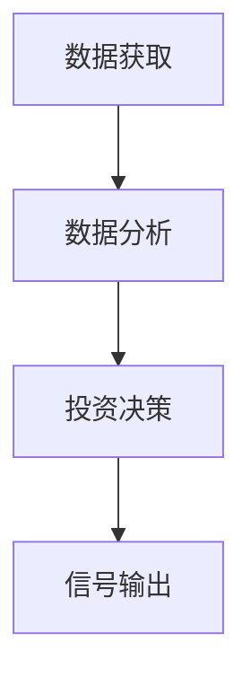

                 


# 沃尔特施洛斯的小盘股投资策略

> 关键词：小盘股投资，沃尔特·施洛斯，价值投资，安全边际，长期投资

> 摘要：本文详细探讨了沃尔特·施洛斯的小盘股投资策略，从其投资哲学、核心策略到实际应用案例，系统地分析了其成功的原因。结合技术分析，文章详细讲解了如何构建小盘股投资系统，包括数据获取、分析工具、风险控制等模块。通过实际案例分析和代码实现，为读者提供了一套可操作的投资策略。

---

## 第一部分：背景与核心理念

### 第1章：沃尔特·施洛斯的投资哲学

#### 1.1 施洛斯的生平简介
- 早期经历：从小对投资的兴趣，早期的职业发展。
- 投资生涯：与本杰明·格雷厄姆的合作，逐步形成自己的投资理念。

#### 1.2 小盘股市场的吸引力
- 小盘股市场的定义与特点：流动性、波动性、成长潜力。
- 小盘股与大盘股的对比：风险与收益的平衡。

#### 1.3 施洛斯投资哲学的核心思想
- 价值投资的核心：寻找被市场低估的股票。
- 安全边际的概念：买入价格与内在价值的差距。
- 长期投资的重要性：复利效应与时间的价值。

---

## 第二部分：核心投资策略

### 第2章：基本面分析与选股标准

#### 2.1 财务指标分析
- 资产负债表：关注资产结构、负债情况。
- 利润表：分析收入、成本、利润。
- 现金流量表：评估现金流健康状况。

#### 2.2 选股标准
- 低市盈率：低于市场平均水平的市盈率。
- 低市净率：资产价值被低估的市净率。
- 高股息率：稳定的股息收益。

### 第3章：安全边际与风险控制

#### 3.1 安全边际的计算
- 内在价值的估算方法：DCF模型、可比公司分析。
- 买入价格的确定：内在价值的一定折扣。

#### 3.2 风险控制策略
- 分散投资：避免过度集中。
- 仓位管理：动态调整持仓比例。
- 仓位止损：设定止损点以控制亏损。

### 第4章：长期投资与复利效应

#### 4.1 长期投资的优势
- 时间的优势：复利效应的积累。
- 企业成长的潜力：优质企业的长期增值。

#### 4.2 复利效应的数学模型
- 复利计算公式：$$A = P(1 + r/n)^{nt}$$
- 时间对复利的影响：$$r = \frac{A}{P}^{1/nt} - 1$$

---

## 第三部分：系统架构与技术实现

### 第5章：投资决策系统的设计

#### 5.1 系统架构概述
- 数据获取模块：从数据库获取实时数据。
- 数据分析模块：计算估值指标。
- 投资决策模块：根据策略生成买卖信号。

#### 5.2 系统流程图


### 第6章：项目实战与代码实现

#### 6.1 环境安装
- 数据库：安装MySQL或SQLite。
- 工具：安装Python和Pandas库。

#### 6.2 数据获取与清洗
```python
import pandas as pd

# 获取小盘股数据
def get_small_cap_stocks():
    # 假设数据库中有小盘股数据表
    df = pd.read_sql("SELECT * FROM small_cap_stocks", conn)
    return df

# 清洗数据
def clean_data(df):
    df.dropna(inplace=True)
    return df
```

#### 6.3 估值分析与策略实现
```python
def calculate_margin_of_safety(df):
    # 计算内在价值
    df['intrinsic_value'] = df[' earnings'] * 15
    # 计算安全边际
    df['margin_of_safety'] = df['intrinsic_value'] - df['price']
    return df
```

---

## 第四部分：案例分析与总结

### 第7章：实际案例分析

#### 7.1 成功案例：XYZ公司
- 买入价格：$10
- 内在价值：$20
- 安全边际：$10

#### 7.2 失败案例：ABC公司
- 买入价格：$5
- 内在价值：$10
- 实际表现：股价下跌至$3，未达到预期。

### 第8章：总结与展望

#### 8.1 总结
- 施洛斯策略的核心：价值投资、安全边际、长期持有。
- 技术实现的重要性：系统化投资决策。

#### 8.2 展望
- 未来市场环境的变化：技术进步与市场变化。
- 投资者如何适应变化：持续学习与优化策略。

---

## 作者信息

作者：AI天才研究院（AI Genius Institute） & 禅与计算机程序设计艺术（Zen And The Art of Computer Programming）

---

通过以上结构，文章系统地分析了沃尔特·施洛斯的小盘股投资策略，并结合技术实现，为读者提供了深入的分析和实际操作指导。

